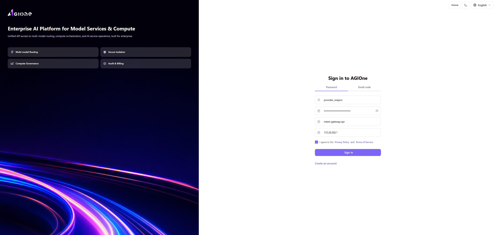
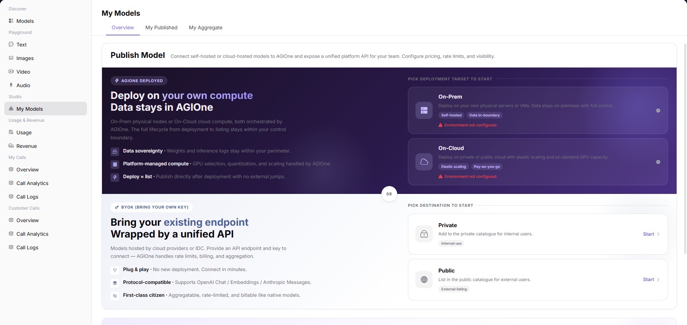
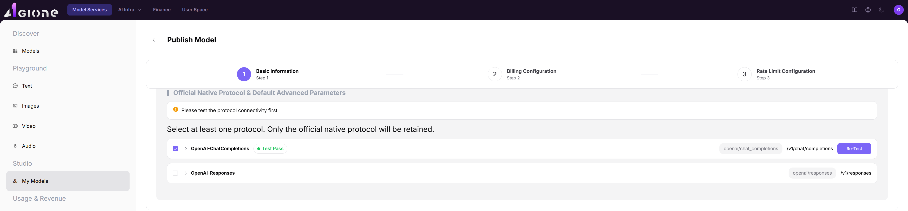
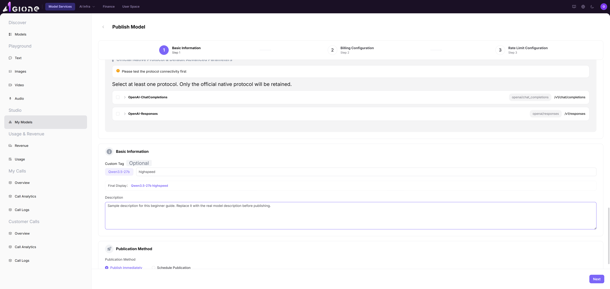
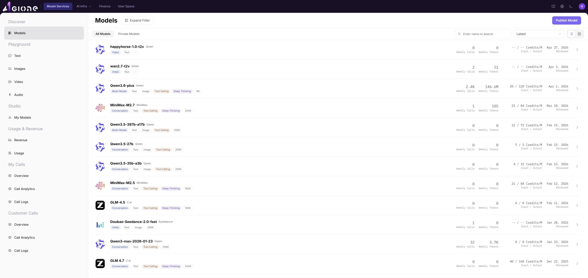

# AGIOne Beginner Guide: Publish a Model

This guide keeps only the practical steps: sign in, publish a model, and check the published model in the model marketplace.

## 1. Sign In To AGIOne

1. Open the AGIOne （http://agione.pro/user/login）sign-in page.
2. Select **"Password"** sign-in.
3. Enter your **"Username or email"** and **"Password"**.
4. Tick **"I agree to the Privacy Policy and Terms of Service"**.
5. Click **"Sign In"**.

## 2. Open The Model Publishing Page

1. After signing in, open **"Model Services"**.
2. In the left menu, go to **"Studio" > "My Models"**.
3. Find the **"BYOK (BRING YOUR OWN KEY)"** section.
4. If the model is only for internal use, click **"Private Start"**.
5. If the model should be listed in the public marketplace, click **"Public Start"**.

## 3. Fill In Basic Information

1. In **"Select Model Type"**, choose the model type.
2. For a chat/text model, choose **"Conversation"**.
3. Set **"Model Sub-Type"** to **"LLM"**.
4. In **"Model Source/Meta Model Information"**, fill in the connection information.
5. Select the real provider in **"Model Source"**, such as **"Huawei Cloud"**.
6. Select the real **"Region"**, such as **"South Africa"**.
7. Enter the model service URL in **"Request URL"** if empty.
8. Enter the provider key in **"API Key"**.
9. Select the target **"Meta Model"**, such as **"GLM-5.1"**.
10. Enter the provider-side model ID in **"Model Source ID"**, such as `GLM-5.1`.

## 4. Test The Protocol

1. Find **"Official Native Protocol & Default Advanced Parameters"**.
2. Select the protocol you want to use, such as **"OpenAI-ChatCompletions"**.
3. Click the arrow on the left side of the card to expand it.
4. After the card expands, find the **"Endpoint"** field.
5. Edit **"Endpoint"** to the required path, for example`/v2/chat/completions`
6. Click **"Start Testing"**.
7. Wait until the test shows **"Test Pass"**.
8. Enter an easy-to-recognize name in **"Custom Tag"**, such as `highspeed`.
9. Check that **"Final Display"** is correct, such as **"GLM-5.1 highspeed"**.
10. Click **"Next"**.

## 5. Configure Billing

1. Go to **"Billing Configuration"**.
2. If the model is free to use, select **"Free"**.
3. If the model should be paid, select **"Paid"** and fill in the price fields shown on the page.
4. Click **"Next"**.

## 6. Configure Rate Limits And Submit

1. Go to **"Rate Limit Configuration"**.
2. Choose whether to enable rate limiting.
3. If rate limiting is enabled, fill in:
   - **"RPM"**: maximum requests per minute.
   - **"TPM"**: maximum tokens per minute.
4. If you do not want to submit yet, click **"Save Only"**.
5. If everything is ready, click **"Submit for Audit"**.
6. Wait for approval. The model is not fully published until the audit is approved.

## 7. Check The Model In The Marketplace

1. In the left menu, go to **"Discover" > "Models"**.
2. If you published a public model, use **"All Models"**.
3. If you published a private model, use **"Private Models"**.
4. Search by the final display name, such as **"Qwen3.5-27b highspeed"**.
5. Find your model in the list.
6. Click **"View"** to open the detail page and confirm the model information.

## Remember These 2 Things

- **Do not share your API Key or put it in public documents.**
- **The protocol test must pass before you continue.**
