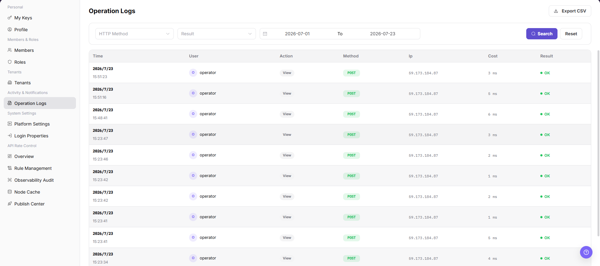

# Operation Logs

::: info Document Information
Version: v1.0
Updated: 2026-08-27
:::

## Feature Overview

`Operation Logs` lets you query platform administration records by time range. You can review the user, action, method, IP address, processing time, and result, and you can export the filtered records to CSV.

| Item | Content |
| --- | --- |
| Applicable Role | Operator Admin |
| Navigation path | Settings > Activity & Notifications > Operation Logs |
| Page route | `/user/user-space/operation-logs` |
| Managed objects | Platform operation records, users, actions, methods, IP addresses, processing times, and results |
| Typical use | Query platform operation logs, investigate abnormal operations, and audit critical actions |

#### Beginner Explanation

Operator operation logs are the audit trail for the platform console. Use them to trace changes that administrators made to accounts, tenants, permissions, rate-control rules, and system settings. They are not model-call or business-request logs.

#### Terms Quick Reference

| Term | Meaning | Handling tip |
| --- | --- | --- |
| Operator | The account that performed a platform administration action. | Confirm the identity first during an investigation. |
| Target object | The configuration, member, or tenant that was viewed or changed. | Compare it with the record on the affected page. |
| Operation result | The success, failure, or partial-success status of an action. | Review the error information for failed actions. |
| Audit scope | The log boundary visible to the current account. | Check permissions first when records are missing. |

## Prerequisites

1. The current account has permission to view operation logs.
2. You have opened `Activity & Notifications > Operation Logs`.
3. Before exporting logs, you have confirmed the export scope and recipient.

## Page Description

The following screenshot shows the Operation Logs page. User identities, IP addresses, and log details are desensitized.

| Area | Description |
| --- | --- |
| Start Time / End Time | Sets the query time range. |
| Search / Reset | Runs a query or clears the filters. |
| Export CSV | Exports logs in the current query scope. |
| Log table | Shows the time, user, action, method, IP address, processing time, and result. |

## Main Operations

### Query Operation Logs

1. Open Operation Logs, select a time range, and filter by operator, module, action type, result, or keyword.
2. Check the target time, operator, object, result, and source. If no record is returned, check the time zone and clear filters one at a time.
3. The target event should be uniquely identifiable. For duplicate names, narrow the range with a redacted object ID fragment and time.
4. Logs may contain account, IP, and business-object information and must be redacted before export, screenshots, or sharing.

### View Log Details and Diagnose Failures

1. Click **"Details"** for the target record and inspect the request action, object, result, duration, and error summary.
2. Compare preceding and following events to determine whether the action completed and whether a subsequent failure occurred.
3. If information is insufficient, escalate with a redacted time, module, and error category. Do not copy Tokens, keys, cookies, or complete request bodies.
4. Use log details only for audit and diagnosis. Do not replay high-risk operations from the page.

Use the following operations to work with operation logs records and related status. Complete view-only checks before opening dialogs that may create, save, submit, activate, transfer, settle, publish, or delete data.

### View Operation Logs

1. Go to `Settings > Activity & Notifications > Operation Logs`.
2. Select `HTTP Method`, `Result`, and the time range.
3. Click `Search` to query operation logs.
4. Review `Time`, `User`, `Action`, `Method`, `IP`, `Cost`, and `Result` in the log table.
5. Click `Reset` when you need to clear the filters.
6. Before exporting logs, confirm the time range and desensitization requirements, then click `Export CSV`.

## Parameter Reference

| Field Name | Required | Field Type | Example | Description |
| --- | --- | --- | --- | --- |
| HTTP Method | No | Enum | `GET` | Filters logs by HTTP request method. |
| Result | No | Enum | `Success` | Filters logs by operation result. |
| Start Time | No | Date time | `2026-07-13 09:00` | The start time of the query range. |
| End Time | No | Date time | `2026-07-13 10:00` | The end time of the query range. |
| Time | System generated | Date time | `2026-07-13 09:30` | The time when the operation occurred. |
| User | System generated | Text | `Example user` | The account or user that performed the operation. |
| Action | System generated | Text | `Update configuration` | The operation behavior or API meaning. |
| Method | System generated | Text | `POST` | The method used by this request. |
| IP | System generated | Text | `192.0.2.1` | The source IP of the operation. Desensitize it in documentation. |
| Cost | System generated | Number | `120 ms` | The request or operation processing duration. |
| Result | System generated | Enum | `Success` | The operation execution result. |

## Pitfalls

- Do not change roles, members, login policies, Keys, or API rate-control rules without confirming the affected users and systems.
- UI entries can differ by role and tenant scope; verify the current account context before troubleshooting.
- Never copy complete Keys, AK/SK, tokens, or secrets into documentation, tickets, or screenshots.
- Operation logs may contain sensitive audit information such as accounts, IP addresses, API paths, and operation results.
- `Export CSV` exports real log data and is a high-risk action.
- Before exporting, narrow the time range and confirm the recipient.
- Do not write real accounts, IP addresses, API paths, customer names, tenant IDs, or internal error details in documentation.

## Result Validation

| Check Item | Success Signal | If Abnormal |
| --- | --- | --- |
| Time filter | The log list refreshes for the selected time range. | Check whether the time range is too narrow. |
| Result field | The operation result is displayed. | Use the user and action fields to continue the investigation. |
| Export entry | The export button is visible when the account has permission. | Confirm whether the log data can be shared before exporting it. |
| Reset filters | Selecting `Reset` restores the default filters. | Refresh the page and set the query conditions again. |

## FAQ

#### Expected logs are missing

**Symptom:**

The target operation is not shown after you filter by time.

**Possible cause:**

The selected time range does not include the operation, or the current account cannot view that log scope.

**Resolution:**

Expand the time range and search again. If the record is still missing, verify the log-view permission.

#### Can logs be exported directly?

**Symptom:**

The page provides an `Export CSV` entry.

**Possible cause:**

The exported file may contain users, IP addresses, API paths, and operation results.

**Resolution:**

Confirm the purpose, scope, and recipient before export, and desensitize the file when required.

#### Why is a target record missing from operator logs?

**Symptom:**

The target administrator, tenant, or configuration change is not present in operator operation logs.

**Possible cause:**

The time range is incorrect, the action occurred in a user-side tenant, or the current account cannot view that type of audit record.

**Resolution:**

Expand the time range and confirm where the action occurred. Filter again by tenant, operator, and target object. If the record is still absent, check the audit collection and retention policies.

## Next Steps

1. To verify member changes, go to [Members](../../members-roles/members/).
2. To verify role changes, go to [Roles](../../members-roles/roles/).

## Notes

- Operation logs may contain user identities, IP addresses, and API paths. Do not distribute them without authorization.
- Narrow the time range before export to avoid including unrelated data.
- `Export CSV` exports real log data and is a high-risk action.
- Before exporting, confirm the time range, desensitization requirements, and recipient.
- Do not write real accounts, IP addresses, API paths, customer names, tenant IDs, or internal error details in documentation.
