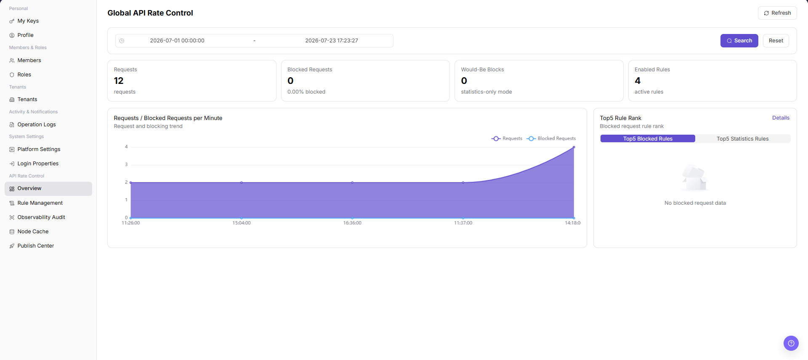

# Overview

::: info Document Information
Version: v1.0
Updated: 2026-07-10
:::

## Feature Overview

`Overview` shows the global API rate-control status, including request volume, blocked requests, over-limit statistics, enabled rules, per-minute request trends, and the top five rules by hits.

| Item | Content |
| --- | --- |
| Applicable Role | Operator Admin |
| Navigation path | Settings > API Rate Control > API Rate Control Overview |
| Page route | `/user/system/rate-control/overview` |
| Managed objects | Global request volume, blocked requests, over-limit statistics, enabled rules, and node status |
| Typical use | Review API rate-control metrics, request trends, and the top rules by hits |

#### Beginner Explanation

The Overview page is the traffic dashboard. Start here to determine whether requests or blocks have increased unexpectedly and which rules are hit most often. Then continue the investigation in Rule Management, Node Cache, or Observability & Audit.

#### Terms Quick Reference

| Term | Meaning | Handling tip |
| --- | --- | --- |
| Request volume | The number of API requests that entered the gateway or rate-control path during the selected period. | When it rises unexpectedly, confirm the business peak and time range first. |
| Blocked requests | The number of requests blocked by rate-control rules. | When it rises, use the top-rule ranking to identify the rules being hit. |
| Over-limit statistics | Statistics recorded after requests exceed a rule threshold. | Compare the rule threshold, tenant, and model scope. |
| Enabled rules | The number of rate-control rules currently in effect. | If the count is unexpected, verify publication status in Rule Management. |
| Top 5 rules | The five rules with the highest hit counts. | Investigate high-hit rules with the largest impact first. |

## Prerequisites

1. The current account has permission to view API rate-control data.
2. You have opened `API Rate Control > Overview`.
3. You have selected an appropriate time range for the query.

## Page Description

The following screenshot shows the API Rate Control Overview page. Statistical details are desensitized.

| Area | Description |
| --- | --- |
| Refresh | Refreshes the current statistics. |
| Start Time / End Time | Sets the statistical time range. |
| Search / Reset | Runs a query or clears the filters. |
| Request / Block metrics | Shows request volume, blocked requests, and over-limit statistics. |
| Enabled Rules | Shows the number of rules currently enabled. |
| Requests / Blocks per minute | Shows request and block trends. |
| Top 5 rules | Shows the rules with the highest hit counts. |
| Details | Opens details for a ranked rule. |

## Main Operations

Use the following operations to work with overview records and related status. Complete view-only checks before opening dialogs that may create, save, submit, activate, transfer, settle, publish, or delete data.

### View API Rate Control Overview

1. Go to `Settings > API Rate Control > API Rate Control Overview`.
2. Review request volume, blocked volume, matched rules, API distribution, or trend data on the overview page.
3. Select a time range, API, rule, or result status according to available filters.
4. Click `Search` or the actual query entry on the page to refresh overview data.
5. Click `Reset` when you need to restore default filters.
6. View trends and statistics only. Do not publish, disable, or delete rules from the overview workflow.

## Parameter Reference

| Field Name | Required | Field Type | Example | Description |
| --- | --- | --- | --- | --- |
| Time Range | No | Date time | `2026-07-13 09:00 to 10:00` | The time window for API request, blocked, and hit statistics. |
| API | No | Text | `/api/example` | Filters overview data by API or API path. Desensitize it in documentation. |
| Rule | No | Text | `Example rule` | Filters hit or blocked data by rate-control rule. |
| Request Volume | System generated | Number | `12,000` | The total request volume in the current time range. |
| Blocked Volume | System generated | Number | `320` | The number of requests blocked by rate-control rules. |
| Hit Count | System generated | Number | `800` | The number of rule hits. |
| Result Status | No | Enum | `Blocked` | Filters data by request result or processing status. |
| Trend Chart | System generated | Chart | `Requests per minute` | Shows request, blocked, or hit trends over time. |
| Search | Operation button | Button | `Search` | Refreshes overview data by current filters. |
| Reset | Operation button | Button | `Reset` | Restores default filters. |

## Pitfalls

- Do not change roles, members, login policies, Keys, or API rate-control rules without confirming the affected users and systems.
- UI entries can differ by role and tenant scope; verify the current account context before troubleshooting.
- Never copy complete Keys, AK/SK, tokens, or secrets into documentation, tickets, or screenshots.
- API rate-control overview may expose API paths, calling trends, abnormal requests, rule hits, and internal capacity information.
- The overview page is for observation and troubleshooting. It should not replace the rule configuration page for publish, disable, or delete decisions.
- Do not write real API paths, tokens, tenant IDs, accounts, customer names, internal error details, or load-test parameters in documentation.
- If the page provides export or rule-configuration jump entries, export, publish, disable, and delete are high-risk actions.

## Result Validation

| Check Item | Success Signal | If Abnormal |
| --- | --- | --- |
| Metrics | Request, block, and rule metrics are displayed. | Adjust the time range and query again. |
| Trends | Per-minute request and block trends are visible. | Refresh the page or check the data-source status. |
| Ranking | The top-rule ranking is visible. | Open Observability & Audit to review details. |
| Filter reset | Selecting `Reset` restores the default filters. | Refresh the page and select the query conditions again. |

## FAQ

#### Blocked requests increased suddenly

**Symptom:**

Blocked requests or over-limit statistics rise significantly on the Overview page.

**Possible cause:**

Traffic to one or more APIs increased, or a rate-control threshold is too low.

**Resolution:**

Review the top-rule ranking, then open Observability & Audit to compare the API, rule, and node information.

#### Why is no rate-control overview data displayed?

**Symptom:**

The page does not show rule counts, hit statistics, or node status.

**Possible cause:**

The rate-control component is disabled, no rule has been published, the selected time range contains no hits, or node cache data has not been reported.

**Resolution:**

Verify the component and rule publication status, change the time range, and then check Node Cache and Observability & Audit for reported data and rule hits.

#### Why are actions on the rate-control overview unavailable?

**Symptom:**

Statistics are visible, but entries for opening rules, refreshing data, or handling an exception are unavailable.

**Possible cause:**

The current account lacks API rate-control permissions, the component is disabled, or statistics are still refreshing.

**Resolution:**

Verify the module permission and component status. Wait for the refresh to finish, and make rule changes from Rule Management.

## Next Steps

1. To adjust rules, go to [Rule Management](../rule-management/).
2. To review block or audit details, go to [Observability & Audit](../observability-audit/).

## Notes

- Overview is for observing trends; it does not replace rule configuration or audit details.
- Do not disable a rule immediately after blocked requests increase. Confirm the business impact first.
- Do not write real API paths, tokens, tenant IDs, accounts, customer names, internal error details, or load-test parameters in documentation.
- If the page provides export or rule-configuration jump entries, export, publish, disable, and delete are high-risk actions.
