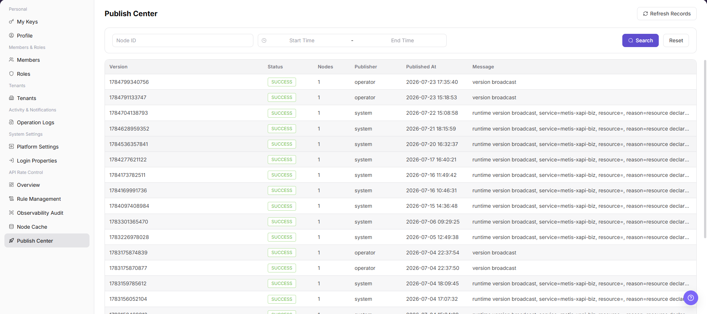

# Publish Center

::: info Document Information
Version: v1.0
Updated: 2026-08-27
:::

## Feature Overview

`Publish Center` is used to view API rate-control rule-version publish records, including version, status, node count, publisher, publish time, and messages.

| Item | Content |
| --- | --- |
| Applicable Role | Operator Admin |
| Navigation path | Settings > API Rate Control > Publish Center |
| Page route | `/user/system/rate-control/publish` |
| Managed objects | API rate-control rule versions, publish records, node counts, publishers, and publish times |
| Typical use | View rule-version publish status, publish records, and node publish results |

#### Beginner Explanation

Publish Center works like a result dashboard for API rate-control publishing. Use it to confirm whether rules were successfully published to nodes, and to locate failed nodes and failure reasons.

#### Terms Quick Reference

| Term | Meaning | Handling tip |
| --- | --- | --- |
| Publish record | Execution record of a rule publish task. | Check it when troubleshooting rule effectiveness. |
| Publish status | Status such as successful, failed, or in progress. | Check messages when failed. |
| Target node | Node scope affected by the publish task. | Confirm whether the expected scope is covered. |
| Failure reason | Error message for an unsuccessful publish task. | Troubleshoot together with Node Cache. |

## Prerequisites

1. The current account has permission to view API rate-control publish records.
2. You have opened `API Rate Control > Publish Center`.
3. When troubleshooting publish issues, the approximate rule publish time and target nodes have been recorded.

## Page Description

The following screenshot shows the Publish Center page. Versions, nodes, and message details are desensitized.

| Area | Description |
| --- | --- |
| Refresh Records | Refresh publish records. |
| Node ID | Filter publish records by node. |
| Start Time / End Time | Filter publish records by time range. |
| Publish record table | Displays version, status, node count, publisher, publish time, and message. |

## Main Operations

### View Publish Records

1. Go to `Settings > API Rate Control > Publish Center` and filter by version, status, publisher, or time.
2. Check the version, rule count, target nodes, publish time, and status.
3. If no record is returned, reset filters. For a long-running status, refresh once and inspect Node Cache.
4. Publish records affect online traffic governance. Hide internal nodes and rule information before screenshots or sharing.

### View Version Differences and Synchronization Status

1. Click **"Details"** or the difference entry for the target version.
2. Compare added, modified, and deleted rules and target nodes.
3. Compare Publish Center status with node cache versions. If they differ, record the difference without republishing.
4. Do not publish, roll back, or force synchronization during read-only validation.

Use this operation to query publish records. Do not add publish, rollback, or cancel operations here because they are high-risk final actions.

### View Publish Center

1. Go to `Settings > API Rate Control > Publish Center`.
2. Select node ID, start time, end time, publish status, or version information according to page fields.
3. Click `Search` to query publish records.
4. Review version, status, node count, publisher, publish time, and message in the publish record table.
5. Click `Refresh Records` when you need to fetch the latest records again.
6. If the publish status is abnormal, go to `Node Cache` to verify node rule versions, then return to `Rule Management` to check the rule version.
7. For learning or screenshots, only view publish records. Do not publish, roll back, cancel, or delete anything.

## Parameter Reference

| Field Name | Required | Field Type | Example | Description |
| --- | --- | --- | --- | --- |
| Node ID | No | Text | `<node_id>` | Filters publish records by node. |
| Start Time | No | Time | `Start Time` | Sets the start time for publish record queries. |
| End Time | No | Time | `End Time` | Sets the end time for publish record queries. |
| Publish Batch | No | Text | `<publish_batch>` | Locates a specific publish task. |
| Rule Version | No | Version | `<rule_version>` | Rule version included in the publish task. |
| Publish Status | No | Enum | `Succeeded` | Shows the publish result. |
| Node Count | System generated | Number | `10` | Number of nodes involved in the publish task. |
| Publisher | System generated | Text | `<publisher>` | Account or role that initiated the publish task. |
| Publish Time | System generated | Time | `Publish Time` | Creation or completion time of the publish task. |
| Message | System generated | Text | `Published` | Publish result, failure reason, or internal hint. |
| Refresh Records | No | Button | `Refresh Records` | Fetches the latest publish records again. |

## Pitfalls

- Publish Center records may contain rule versions, nodes, publishers, publish times, failure reasons, and internal runtime information.
- `Publish`, `Publish All`, `Rollback`, `Cancel`, and `Delete` are high-risk actions.
- When publishing fails, do not publish repeatedly. Check failed nodes, the message field, Node Cache, and rule versions first.
- Do not write real node IDs, internal IP addresses, API paths, tokens, tenant IDs, customer names, publish batches, internal error details, or load-test parameters in the manual.

## Result Validation

| Check Item | Success Signal | If Abnormal |
| --- | --- | --- |
| Publish records | Publish records in the target time range are visible. | Expand the time range and query again. |
| Normal status | Publish status shows success or the expected state. | Check the message field and verify in Node Cache. |
| Correct node count | Node count matches the expected node scope. | Check target nodes in the publish task. |
| Version consistency | The rule version in publish records matches the Rule Management page. | Return to Rule Management and verify the version. |

## FAQ

#### Publish record status is abnormal

The target version status in Publish Center is not as expected.

**Possible cause:**

The rule did not synchronize to every node, or a node response is abnormal.

**Resolution:**

Check the message field, then open Node Cache and compare node status and rule version.

#### Why is the target policy missing from Publish Center?

Publish Center does not show the rate-control policy that is pending, published, or rolling back.

**Possible cause:**

The rule was not submitted for publishing, the policy belongs to another environment, or filters show only one publish status.

**Resolution:**

Clear status and environment filters. Return to Rule Management and confirm that the rule was submitted. If it is still absent, check the publish task and approval status.

#### Why are publish, rollback, or cancel buttons unavailable?

The publish task is visible, but publish, rollback, cancel, or diff buttons cannot be clicked.

**Possible cause:**

The current account lacks publish permission, the task status does not allow the action, or approval is incomplete.

**Resolution:**

Confirm the task and approval status. Verify the impact scope before publishing or rollback, and let an administrator with publish permission perform the action.

## Next Steps

1. To view node synchronization, go to [Node Cache](../node-cache/).
2. To view rule configuration, go to [Rule Management](../rule-management/).

## Notes

- Publish records are trace records for rule-effectiveness issues.
- Publish Center records may contain rule versions, nodes, publishers, publish times, failure reasons, and internal runtime information.
- `发布 / Publish`, `发布全部 / Publish All`, `回滚 / Rollback`, `取消 / Cancel`, and `删除 / Delete` are high-risk actions.
- When publishing fails, do not publish repeatedly. Check failed nodes, the message field, Node Cache, and rule versions first.
- Do not write real node IDs, internal IP addresses, API paths, tokens, tenant IDs, customer names, publish batches, internal error details, or load-test parameters in the manual.
