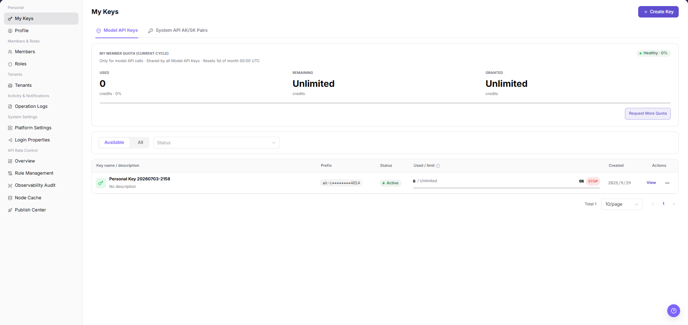
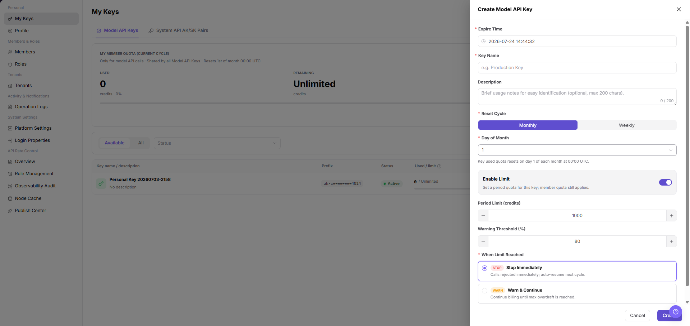

# My Keys

::: info Document Information
Version: v1.0
Updated: 2026-07-10
:::

## Feature Overview

`My Keys` is used to view and manage Model API Keys and System API AK/SK Pairs for the current account, including quota summaries, credential status, creation time, and row-level actions.

| Item | Content |
| --- | --- |
| Applicable Role | Operator Account |
| Navigation path | Settings > Personal > My Keys |
| Page route | `/user/user-space/my-keys` |
| Managed objects | Model API Keys, System API AK/SK Pairs, quotas, and credential status |
| Typical use | Review Key quotas, create or disable credentials, and open row-level actions |

#### Beginner Explanation

Operator credentials are access passes for administrators and backend jobs. They are more sensitive than ordinary user credentials. Manage their scope, expiration, audit trail, rotation, and deactivation carefully.

#### Terms Quick Reference

| Term | Meaning | Handling tip |
| --- | --- | --- |
| Operator credential | A Key or AK/SK pair used by operator APIs or backend jobs. | Create it with the minimum required permission. |
| Permission scope | The management objects and APIs that a credential can access. | Confirm the intended use before creation. |
| Expiration | The time after which a credential becomes invalid automatically. | Rotate it before a long-running job reaches this time. |
| Call audit | Request and operation records produced when a credential is used. | Review audit logs when use is abnormal. |

## Prerequisites

1. The current account has permission to view personal credentials.
2. You have opened `Personal > My Keys`.
3. Before changing a credential, you have confirmed its caller, purpose, and replacement plan.

## Page Description

The following screenshot shows the My Keys page. Key prefixes and quota values are desensitized.

After switching to `System API AK/SK Pairs`, use the following list to review system API credential pairs and their status.

| Area | Description |
| --- | --- |
| Available / View All | Switches between available credentials and the full list. |
| Model API Keys | Shows model-call Keys. |
| System API AK/SK Pairs | Shows system API credential pairs. |
| My Member Quota | Shows used, remaining, and authorized quota for the current cycle. |
| Status | Filters the list by credential status. |
| Credential list | Shows name, prefix, status, usage, creation time, and actions. |

## Main Operations

Use the following operations to work with my keys records and related status. Complete view-only checks before opening dialogs that may create, save, submit, activate, transfer, settle, publish, or delete data.

### Create Model API Key

1. Go to `Settings > Personal > My Keys`.
2. Click `Create Key` in the upper-right corner of the page.
3. In the `Create Model API Key` dialog, fill in `Expire Time`, `Key Name`, and `Description`.
4. In `Reset Cycle`, select `Monthly` or `Weekly`. When `Monthly` is selected, verify `Day of Month`.
5. To limit this key separately, enable `Enable Limit`, then fill in `Period Limit (credits)` and `Warning Threshold (%)`.
6. In `When Limit Reached`, select the handling policy: `Stop Immediately` rejects calls after the quota is reached; `Warn & Continue` keeps calls running and records warnings.
7. Before clicking the final `Create`, verify the purpose, quota, reset cycle, and limit-reached policy again.
8. For learning or screenshots only, view the fields and click `Cancel`. Do not create a real key.

### Create System API AK/SK Pair

1. Go to `Settings > Personal > My Keys`.
2. Switch to the `System API AK/SK Pairs` tab.
3. Click `Create System API AK/SK Pair` or the actual create entry on the page.
4. In the creation dialog, review the fields.

5. Fill in name, description, expiration time, permissions, or quota-related settings according to the page fields.
6. Before clicking the final `Create` or `Confirm`, verify the AK/SK purpose, permission scope, validity period, and credential handoff method.
7. For learning or screenshots only, view the fields and click `Cancel` to close the dialog without submitting real configuration.

## Parameter Reference

| Field Name | Required | Field Type | Example | Description |
| --- | --- | --- | --- | --- |
| Expire Time | No | Date time | `2026-12-31 23:59` | Defines when the Model API Key or System API AK/SK Pair expires. |
| Key Name | Yes | Text | `Production Key` | Identifies the purpose of the key. |
| Name | Yes | Text | `Backend job credential` | Identifies the purpose of the System API AK/SK Pair. |
| Description | No | Text | `Model service calls` | Describes the key usage for later identification. |
| Reset Cycle | Yes | Enum | `Monthly` | Defines when key usage is reset. |
| Day of Month | Conditionally required | Number | `1` | Required when `Reset Cycle` is `Monthly`. |
| Enable Limit | No | Switch | `Enabled` | Enables a period quota for this key. |
| Period Limit (credits) | Conditionally required | Number | `1000` | The quota value used after `Enable Limit` is enabled. |
| Warning Threshold (%) | No | Number | `80` | Triggers warning when usage reaches the threshold. |
| When Limit Reached | Yes | Enum | `Stop Immediately` | Defines how calls are handled after the quota is reached. |
| AK | System generated | Text | `AK example prefix` | The System API access identifier. Save it only through the platform security process. |
| SK | System generated | Secret | `Only displayed after creation` | The System API secret key. Do not write it into documentation, screenshots, or tickets. |
| Permission Scope | Yes | Enum / Multi-select | `Read-only APIs` | Controls which system APIs the AK/SK can call. |
| Status | System generated | Enum | `Enabled` | Indicates whether the key can continue to call services. |
| Actions | System generated | Button | `View` | Opens details or follow-up operations. |

## Pitfalls

- Creating a Model API Key generates a real credential that can call model services.
- A System API AK/SK Pair generates credentials for system API calls, and its permission scope is usually more sensitive than a normal calling key.
- `Create` and `Confirm` are final high-risk actions. Do not click them during learning, screenshots, or page validation.
- `Stop Immediately` rejects calls after the quota is reached; `Warn & Continue` keeps calls running and records warnings.
- Complete Keys and AK/SK pairs may only be saved once through controlled channels. Do not write them into documentation, screenshots, tickets, or examples.
- Do not write real Keys, AK/SK, tokens, accounts, endpoints, customer names, or internal test parameters.

## Result Validation

| Check Item | Success Signal | If Abnormal |
| --- | --- | --- |
| Credential list | Credential names, status, and actions are visible. | Check the filters and account permission. |
| Tab switch | Model API Keys and System API AK/SK Pairs can be selected. | Refresh the page and open it again. |
| Quota summary | Used, remaining, and authorized quota are displayed. | Ask an administrator to verify quota authorization. |
| Create dialog | Clicking `Create Key` opens the `Create Model API Key` dialog. | Check whether the current account has key creation permission. |
| AK/SK creation dialog | After switching to `System API AK/SK Pairs`, the creation dialog can be opened. | Check whether the current account has System API credential creation permission. |

## FAQ

#### A credential no longer works

**Symptom:**

The caller receives an authentication error.

**Possible cause:**

The credential is disabled, the caller still uses an old value after rotation, or its quota is limited.

**Resolution:**

Review the credential status and quota. If it was rotated, ensure that the caller switches to the new value.

#### What should be checked before creation or rotation?

**Symptom:**

The page provides `Create Key` or rotation actions.

**Possible cause:**

Credentials are sensitive, and changing them affects callers.

**Resolution:**

Confirm the purpose, caller, and replacement window. Never record a complete credential in documentation or screenshots.

#### Why is the target credential missing from operator My Keys?

**Symptom:**

The credential used by a management API or backend job is not shown.

**Possible cause:**

It was created from a user-side entry, is disabled or expired, or the current account lacks operator credential-management permission.

**Resolution:**

Confirm the current entry and credential type, then check its status, expiration, and creation record. If it is still missing, ask a platform administrator to generate a replacement and record its purpose.

## Next Steps

1. To review account details, go to [Profile](../profile/).
2. To adjust member permissions, go to [Members](../../members-roles/members/).

## Notes

- Never copy, paste, or capture a complete Key, AK/SK pair, token, or secret.
- Do not include real Keys, AK/SK, tokens, accounts, endpoints, customer names, or internal test parameters in documentation, screenshots, tickets, or examples.
- A System API AK/SK Pair generates credentials for system API calls. AK/SK values may only be saved once through controlled channels.
- `Create` and `Confirm` are final high-risk actions.
- Before rotating or disabling a credential, confirm that its callers have completed the switch.
- A credential prefix is only an identifier; it is not the complete credential.
