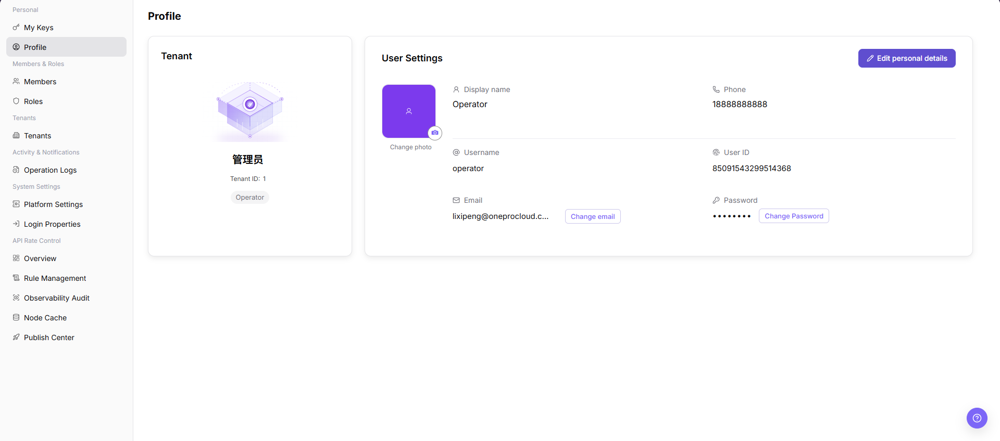
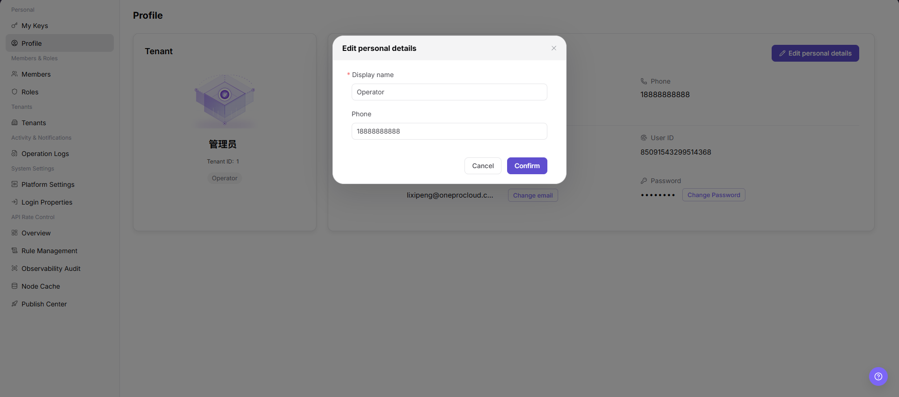

# Profile

::: info Document Information
Version: v1.0
Updated: 2026-07-10
:::

## Feature Overview

`Profile` shows the current account's user information, password status, security information, phone number, email address, and other basic details.

| Item | Content |
| --- | --- |
| Applicable Role | Operator Account |
| Navigation path | Settings > Personal > Profile |
| Page route | `/user/user-space/profile` |
| Managed objects | User information, password status, security information, phone number, and email address |
| Typical use | Review account details, security status, and contact information |

#### Beginner Explanation

Profile is the identity card for a platform administrator. Use it to confirm the administrator's identity source, sign-in method, security status, and auditable information. It is not a user-side tenant profile.

#### Terms Quick Reference

| Term | Meaning | Handling tip |
| --- | --- | --- |
| Operator account | An administrator identity that can access the operator console. | Confirm its management scope before a change. |
| Identity source | Indicates whether an account was created locally or synchronized from an identity provider. | Check the source first when a field cannot be edited. |
| Sign-in method | Password, single sign-on, or another authentication method. | Compare it with Login Properties during troubleshooting. |
| Security information | MFA, password status, recent sign-in, and other security indicators. | Do not expose complete account information during troubleshooting. |

## Prerequisites

1. The current account is signed in.
2. You have opened `Personal > Profile`.
3. Before sharing page information, you have checked whether it contains contact details or account identifiers.

## Page Description

The following screenshot shows the Profile page. Account identifiers, phone numbers, email addresses, and other sensitive information are desensitized.

| Area | Description |
| --- | --- |
| User Information | Shows the account name, account identifier, and other basic information. |
| Account Password | Shows password status and related information. |
| Security | Shows the phone number, email address, and other security contact information. |

## Main Operations

### Edit Personal Details

1. Go to `Settings > Personal > Profile`.
2. Click `Edit personal details` in the upper-right corner of the profile page.
3. In the `Edit personal details` dialog, review the editable fields.

4. Fill in or verify `Display name` and `Phone`.
5. Confirm that `Display name` is required, and enter `Phone` according to page validation rules.
6. Before clicking the final `Confirm`, verify that the display name and contact information changes do not affect account identification, notifications, or later audits.
7. For learning or screenshots only, view the fields and click `Cancel` to close the dialog without submitting real changes.

## Parameter Reference

| Field Name | Required | Field Type | Example | Description |
| --- | --- | --- | --- | --- |
| Display name | Yes | Text | `Example Admin` | The account display name shown on the page. |
| Phone | No | Text | `188****8888` | Used for contact, notifications, or security verification. |
| Email | System displayed | Text | `user@example.com` | The email address bound to the current account. |
| User ID | System displayed | Text | `Example user ID` | The system identifier of the current account. |
| Password | System displayed | Password | `******` | Shows password status or password change entry. |
| Actions | System generated | Button | `Edit personal details` | Opens the editable personal details dialog. |

## Pitfalls

- `Confirm` is the final submit action. For learning or screenshots, only view fields and use `Cancel` to exit.
- Editing personal details can affect account display name, contact information, notification delivery, and later audit identification.
- Do not write real phone numbers, emails, user IDs, account names, customer names, or internal test data in documentation.

## Result Validation

| Check Item | Success Signal | If Abnormal |
| --- | --- | --- |
| Page access | The `Personal > Profile` page opens and data loads normally. | Check role permissions and refresh the page. |
| Profile details | Display name, phone, email, user ID, and password area are visible. | Refresh the page or confirm account permissions. |
| Edit dialog | Clicking `Edit personal details` opens the same-name dialog. | Check whether profile editing is allowed for the current account. |
| Cancel exit | Clicking `Cancel` closes the dialog without submitting changes. | Refresh the page and verify the displayed values again. |

## FAQ

#### Security contact information is incorrect

**Symptom:**

The phone number or email address differs from the expected value.

**Possible cause:**

The account profile was not updated, or the signed-in account is not the intended account.

**Resolution:**

Confirm the signed-in account, then update security contact information through the approved account-management process.

#### Why is some operator account information missing?

**Symptom:**

Security information, the sign-in method, or contact details are absent.

**Possible cause:**

The account is synchronized from an identity provider, sensitive fields are hidden by permission, or account initialization is incomplete.

**Resolution:**

Confirm the account source and synchronization status. Complete editable fields through the platform account process. Ask a platform administrator to investigate missing sensitive fields.

#### Why cannot the operator profile be edited?

**Symptom:**

The profile is visible, but contact information, security information, or the sign-in method cannot be changed.

**Possible cause:**

The account is managed by an identity provider, sensitive changes require administrator approval, or the sign-in method does not support self-service changes.

**Resolution:**

Request the change through the platform account process. Maintain identity-provider fields in the identity platform, then sign in again to confirm synchronization.

## Next Steps

1. To manage personal credentials, go to [My Keys](../my-keys/).
2. To manage operator members, go to [Members](../../members-roles/members/).

## Notes

- Profile may contain phone numbers, email addresses, and account identifiers.
- Do not send screenshots containing complete account information through external communication channels.
- `Confirm` is the final submit action. For learning or screenshots, only open the dialog to view fields and use `Cancel` to exit.
- Do not write real phone numbers, emails, user IDs, account names, customer names, or internal test data in documentation, screenshots, tickets, or examples.
