# Platform Settings

## Feature Overview

| Item | Content |
| --- | --- |
| Applicable Role | Operator |
| Navigation path | Settings > System Settings > Platform Settings |
| Page route | `/user/system/platform-settings/config` |
| Managed objects | General configuration, provider relationships, currency settings, payment channels, accounts and settlement, email, and UI configuration |

#### Beginner Explanation

Platform Settings is the global parameter panel. It controls basic platform behavior, provider relationships, currencies, payments, settlement, email, and UI presentation. A change can affect multiple modules.

#### Terms Quick Reference

| Term | Description |
| --- | --- |
| Platform configuration | A system parameter that affects global behavior.; Confirm the scope before changing it. |
| Provider relationship | Configuration that defines a relationship between the platform and a provider.; Confirm business ownership before changing it. |
| Currency settings | Currency rules used for amount display and settlement.; Verify them before a billing change. |
| Email settings | Configuration for notifications and verification-code delivery.; Compare it with Login Properties during troubleshooting. |

## Prerequisites

1. The current account has permission to manage system configuration.
2. You have opened `System Settings > Platform Settings`.
3. Before editing configuration, you have confirmed the impact scope, change window, and approval requirements.

## Page Description

The Platform Settings page groups global configuration by business impact.

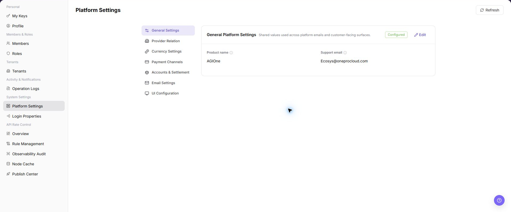

| Configuration Area | Main Responsibility | Typical Impact to Verify |
| --- | --- | --- |
| General Settings | Maintains shared platform parameters and default display settings. | Platform-wide defaults and common presentation. |
| Provider Relationship | Maintains provider relationships, enabled status, and settlement ownership. | Provider visibility, business ownership, and settlement relationships. |
| Currency Settings | Maintains available currencies, display rules, precision, and conversion-related settings. | Amount display, recharge, billing, and settlement. |
| Payment Channels | Maintains payment providers, credentials, callbacks, and connectivity. | Recharge, payment callbacks, and settlement. |
| Account & Settlement | Maintains account, settlement cycle, recharge, and Credits-related parameters. | Account balance, Credits calculation, billing, and settlement. |
| Email Settings | Maintains mail service, sender, notification, and verification-email settings. | Login verification and notification delivery. |
| UI Configuration | Maintains login-page, platform identity, theme, and display settings. | User-visible interface and branding. |
| Refresh / Edit | Reloads the page or opens the selected configuration for maintenance. | Whether the displayed value is current and whether the account has write permission. |

Use the configuration-area name and its **"Edit"** entry to locate the intended setting before making a change.

## Main Operations

### Common Operation Sequence

Use the same control sequence for each configuration area, then follow the area-specific notes below:

1. Open the target configuration area and confirm the current value, enabled status, and affected modules.
2. For an approved change, open **"Edit"** and change only the intended fields.
3. Before **"Save"**, **"Enable"**, **"Disable"**, **"Reset"**, or **"Test Connection"**, confirm approval, external-system impact, and the rollback method.
4. Follow the page message, then reopen the configuration area and verify the displayed value or enabled status.
5. Validate the affected business module, such as sign-in, recharge, settlement, email delivery, or UI display.

If the task is only to learn the page or capture screenshots, stop after viewing the configuration and do not submit changes.

### Edit General Settings

1. Go to `Settings > System Settings > Platform Settings`.
2. Click **"General Configuration"**.
3. Review general platform display and shared settings.

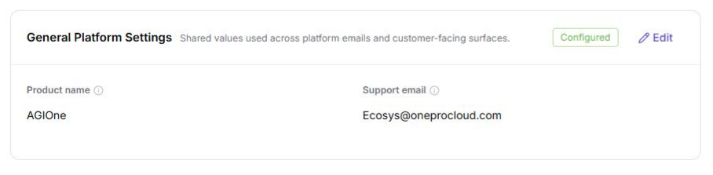

### Edit Provider Relationship

1. Go to `Settings > System Settings > Platform Settings`.
2. Click **"Provider Relationship"**.
3. Review provider relationships, enabled status, and settlement ownership settings.

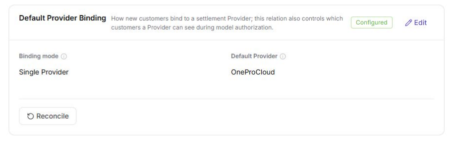

::: details Additional screenshot file

:::

### Edit Currency Settings

1. Go to `Settings > System Settings > Platform Settings`.
2. Click **"Currency Settings"**.
3. Review default currency, display rules, precision, or conversion-related settings.

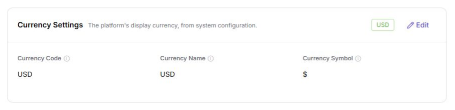

### Edit Payment Channels

1. Go to `Settings > System Settings > Platform Settings`.
2. Click **"Payment Channel"**.
3. Review payment channel list, enabled status, and available maintenance entries.

::: details Additional screenshot file
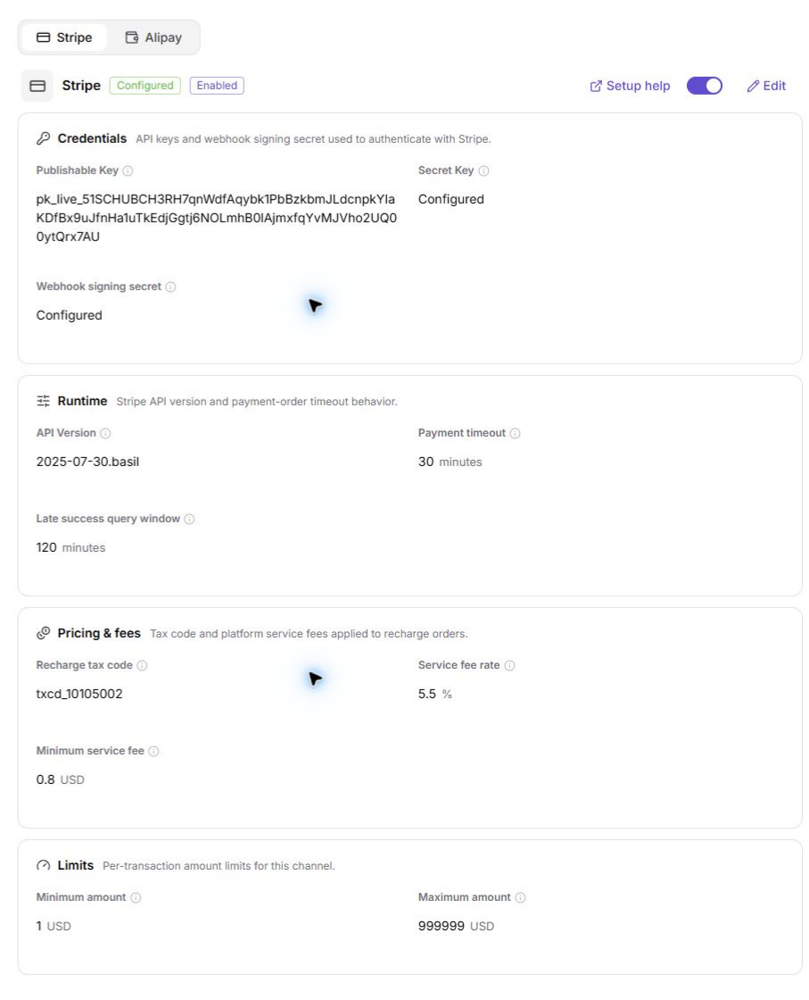
:::

4. In the Stripe area, click **"Setup Help"** to review required fields and integration guidance.

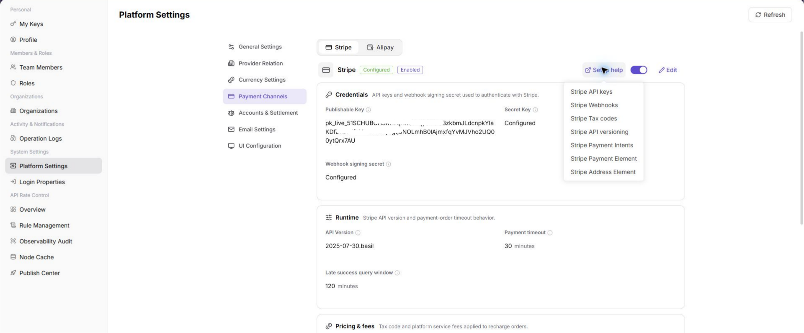

5. Click Stripe `Edit`, and use placeholders to fill in or verify `<API_KEY>`, `<API_KEY>`, `<API_KEY>`, and related fields.

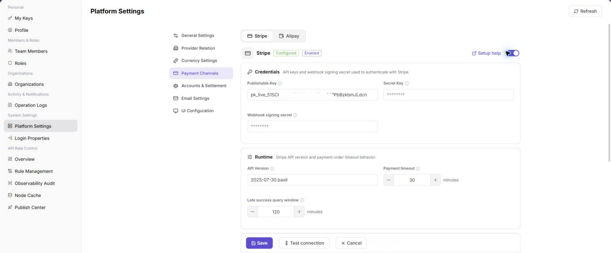

6. Before clicking `Test Connection` for Stripe, confirm that no real transaction or production callback will be triggered.

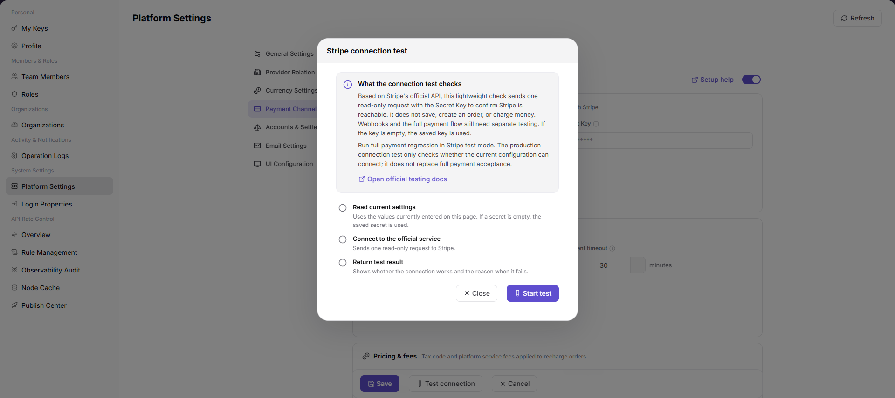

7. In the Alipay area, click **"Setup Help"** to review application, private key, and public key requirements.

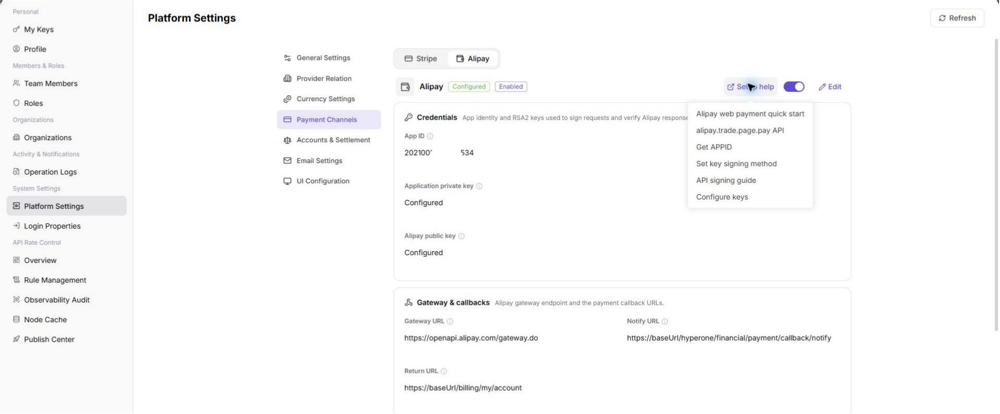

8. Click Alipay `Edit`, and use placeholders to fill in or verify `<ACCESS_KEY_ID>`, `<ACCESS_KEY_SECRET>`, `<API_KEY>`, and related fields.

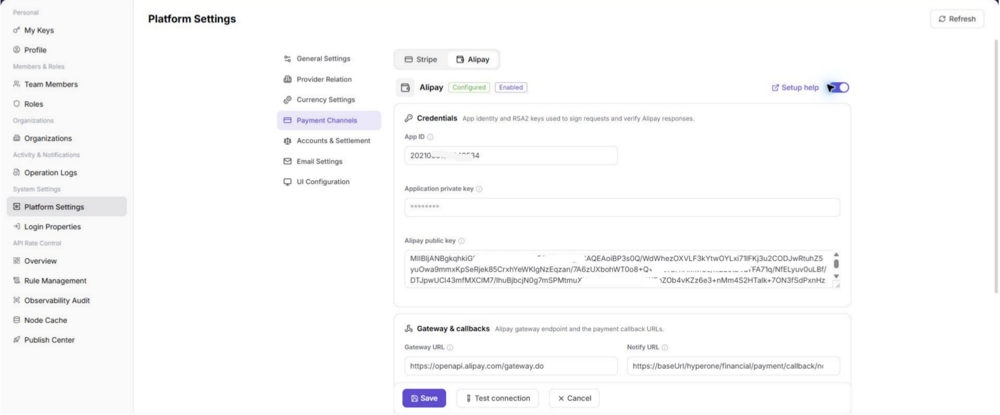

9. Before clicking `Test Connection` for Alipay, confirm that no real payment or production callback will be triggered.

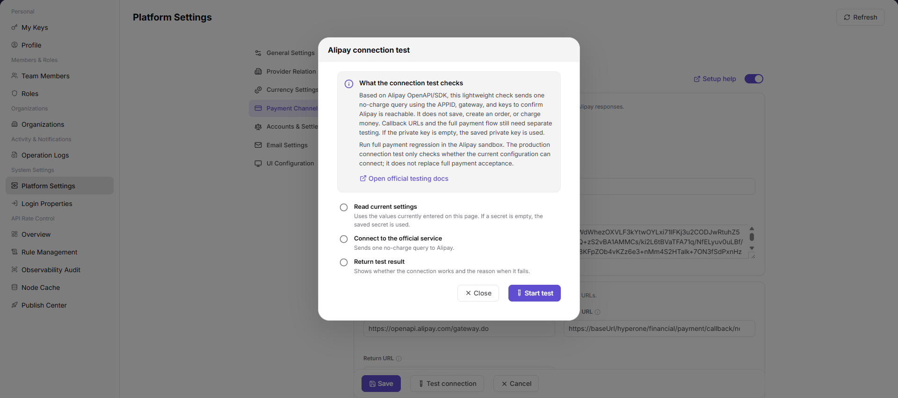

10. Before clicking `Save`, verify credential source, permission scope, callback address, settlement impact, and rollback plan.
11. For learning or screenshots only, view setup help, edit pages, and test connection entries without submitting real payment channel configuration.

### Edit Account and Settlement Settings

1. Go to `Settings > System Settings > Platform Settings`.
2. Click **"Account and Settlement"**.
3. Review account, settlement cycle, recharge, or credits-related parameters.

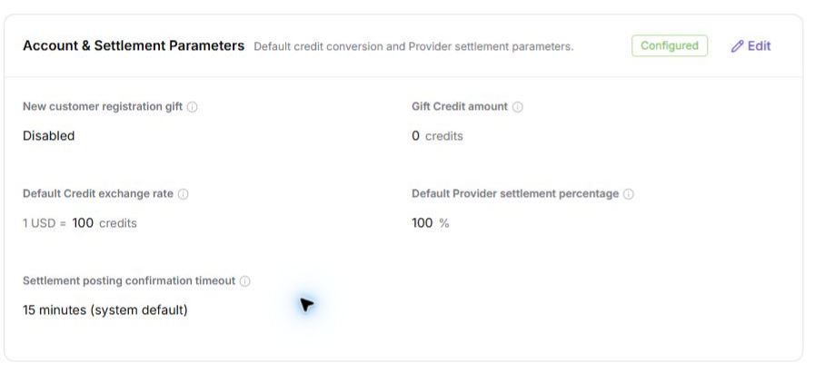

### Edit Email Settings

1. Go to `Settings > System Settings > Platform Settings`.
2. Click **"Email Settings"**.
3. Review mail service, sender configuration, notification templates, or verification email settings.

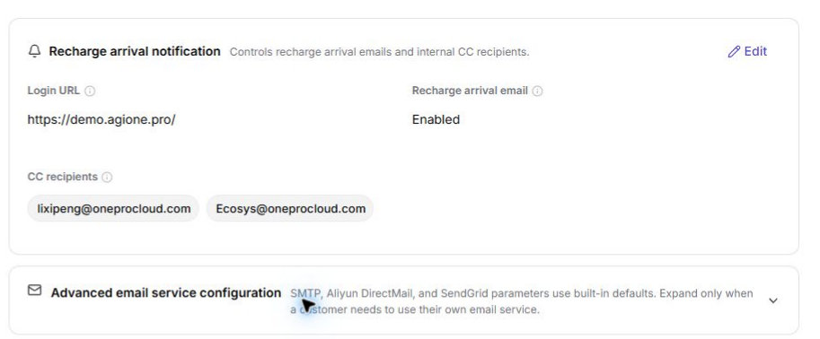

### Edit UI Settings

1. Go to `Settings > System Settings > Platform Settings`.
2. Click **"UI Configuration"**.
3. Review login page, platform identity, theme, or display-related settings.

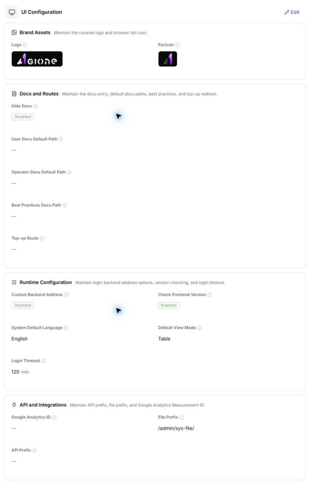

## Parameter Quick Reference

| Field Name | Required | Field Type | Example | Description |
| --- | --- | --- | --- | --- |
| Configuration Category | System displayed | Text | `General Configuration` | The configuration group in platform settings. |
| Configuration Item | System displayed | Text | `Default Currency` | The system parameter to view or maintain. |
| Default Value | System displayed | Text | `USD` | The default or system-provided value of the configuration item. |
| Current Value | System displayed / Editable | Text | `USD` | The currently effective configuration value. |
| Enabled Status | System displayed / Editable | Enum | `Enabled` | Indicates whether the configuration item or capability is enabled. |
| Test Connection | Operation button | Button | `Test Connection` | Verifies connectivity for email, payment, or external service configuration. |
| Save | Operation button | Button | `Save` | Saves the current configuration change. |
| Reset | Operation button | Button | `Reset` | Restores the configuration to the default value or last saved state. |
| Actions | System generated | Button / link | `Edit / Enable / Disable` | Provides configuration view or maintenance entries. |

## Pitfalls

- Do not change roles, members, login policies, Keys, or API rate-control rules without confirming the affected users and systems.
- UI entries can differ by role and tenant scope; verify the current account context before troubleshooting.
- Never copy complete Keys, AK/SK, tokens, or secrets into documentation, tickets, or screenshots.
- Platform settings affect sign-in, display, provider relationships, currencies, payment, billing, settlement, email notifications, and user-visible UI.
- `Save`, `Reset`, `Enable`, `Disable`, and `Test Connection` are high-risk actions.
- For learning or screenshots, only view configuration items and do not submit real configuration changes.
- Stripe / Alipay keys, private keys, Webhook secrets, SMTP passwords, internal addresses, accounts, tokens, customer names, and settlement parameters must not be written into documentation, screenshots, tickets, or chats.

## Result Validation

| Check Item | Success Signal | If Abnormal |
| --- | --- | --- |
| Categories | Configuration categories are displayed. | Refresh the page and open it again. |
| Configuration values | Configuration items and values are readable. | Check system-configuration permission. |
| Edit entry | Edit is displayed according to permission. | Ask an administrator to make the change when you lack permission. |
| Saved value | After an approved change, reopening the area shows the intended value or enabled status. | Check the page message, permission, approval status, and whether the page needs to be refreshed. |
| Business impact | The affected sign-in, recharge, settlement, email, or UI flow behaves as expected. | Roll back according to the change plan and inspect Operation Logs and the related business module. |
| Screenshots | General configuration, provider relationship, currency settings, payment channel, account and settlement, email settings, and UI configuration screenshots render normally. | Check whether image paths exist. |

## FAQ

#### Which modules does a configuration change affect?

**Symptom:**

Platform Settings contains multiple configuration categories.

**Possible cause:**

Different settings can affect sign-in, billing, email, page presentation, or provider relationships.

**Resolution:**

Identify the configuration category and business impact before choosing a change window.

#### Why is a platform setting missing?

**Symptom:**

The target setting is absent or its area is empty.

**Possible cause:**

The current account lacks system-settings permission, the setting is limited by deployment version or tenant scope, or configuration synchronization is abnormal.

**Resolution:**

Verify operator-admin permission and the current tenant scope. Confirm that the setting applies to the current version. If it is still missing, ask a platform administrator to check the configuration center.

#### Why is Save unavailable for platform configuration?

**Symptom:**

The setting is visible, but Save, Enable, or Reset cannot be selected.

**Possible cause:**

The current account lacks write permission, the setting is version-locked, or approval is required before the change.

**Resolution:**

Verify system-administrator permission and the setting description. Complete the required approval, then ask an authorized administrator to save the change.

#### How should the Platform Settings page be exported or captured safely?

**Symptom:**

Page information is needed for troubleshooting, audit, or delivery.

**Possible causes:**

The page may contain accounts, email addresses, IP addresses, internal paths, tenant identifiers, Keys, or amounts.

**Resolution:**

Keep only the necessary fields and action context. Use opaque light-gray pixel mosaics for sensitive text and never share complete credentials or internal addresses.

#### What should I do when the Platform Settings page shows unexpected data?

**Symptom:**

A field, status, metric, or related object differs from the expectation.

**Possible causes:**

The page scope, time condition, role permission, or upstream setting does not match.

**Resolution:**

Record the redacted object, time, and result. Verify the entry and filters first, then check related pages and Operation Logs.

## Notes

- Platform configuration can affect global behavior. Do not change it casually during peak business hours.
- Review payment, settlement, and email configuration before saving.
- `Save`, `Reset`, `Enable`, `Disable`, and `Test Connection` are high-risk actions.
- For learning or screenshots, only view configuration items and do not submit real configuration changes.
- Stripe / Alipay keys, private keys, Webhook secrets, SMTP passwords, internal addresses, accounts, tokens, customer names, and settlement parameters must not be written into documentation, screenshots, tickets, or chats.

## Next Steps

1. To maintain sign-in security, go to [Login Properties](../login-properties/).
2. To maintain API rate control, go to [Overview](../../api-rate-control/overview/).
