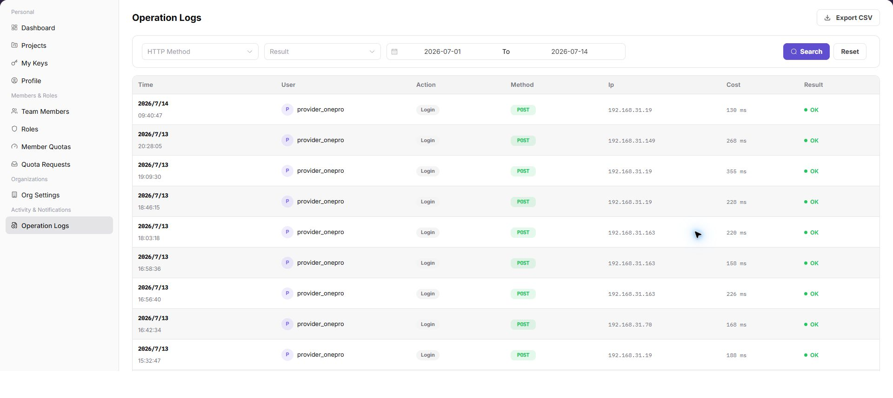

# Operation Logs

::: info Document Information
Version: v1.0
Updated: 2026-08-27
:::

## Feature Overview

`Operation Logs` is used to query user-operation records in the current tenant. You can filter by HTTP method, result, and time range, and review the time, user, action, method, IP address, processing time, and result.

| Item | Content |
| --- | --- |
| Applicable Role | Provider Admin |
| Navigation path | Settings > Activity & Notifications > Operation Logs |
| Page route | `/user/user-space/operation-logs` |
| Managed objects | Tenant user-operation records, HTTP methods, results, time ranges, and operation details |
| Typical use | Query tenant operation records, investigate abnormal operations, and audit critical actions |

#### Beginner Explanation

Operation Logs is the audit trail for Settings. It shows who performed an action, when the action occurred, and whether it succeeded. When investigating a configuration or permission problem, filter by time, operator, and target object first.

#### Terms Quick Reference

| Term | Meaning | Handling tip |
| --- | --- | --- |
| Operation log | Audit information that records a user action and its processing result. | Keep only desensitized clues during troubleshooting. |
| Operator | The account that performed the action. | Confirm that the person was expected to perform it. |
| Target object | The configuration, member, or rule that was viewed or changed. | Use it to identify the impact scope. |
| Operation result | Success, failure, processing, or another action result. | Investigate the cause when it is not successful. |

## Prerequisites

1. The current account has permission to view operation logs.
2. Before the query, you have identified the time range, HTTP method, or result filter.
3. Before exporting logs, you have confirmed the tenant's data-management requirements.

## Page Description

| Area | Description |
| --- | --- |
| Top action | Export CSV |
| Filters | HTTP method, result, start time, and end time |
| Table columns | Time, user, action, method, IP address, processing time, and result |
| Actions | Search and Reset |
| High-risk action | Export CSV |

## Main Operations

### Query Operation Logs

1. Open Operation Logs, select a time range, and filter by operator, module, action type, result, or keyword.
2. Check the target time, operator, object, result, and source. If no record is returned, check the time zone and clear filters one at a time.
3. The target event should be uniquely identifiable. For duplicate names, narrow the range with a redacted object ID fragment and time.
4. Logs may contain account, IP, and business-object information and must be redacted before export, screenshots, or sharing.

### View Log Details and Diagnose Failures

1. Click **"Details"** for the target record and inspect the request action, object, result, duration, and error summary.
2. Compare preceding and following events to determine whether the action completed and whether a subsequent failure occurred.
3. If information is insufficient, escalate with a redacted time, module, and error category. Do not copy Tokens, keys, cookies, or complete request bodies.
4. Use log details only for audit and diagnosis. Do not replay high-risk operations from the page.

### View Operation Logs

1. Go to `Settings > Activity & Notifications > Operation Logs`.
2. Select an HTTP method, result, or time range.
3. Select `Search` to display matching logs.
4. To clear the conditions, select `Reset`.

The following screenshot shows the Operation Logs list. User identities and IP addresses are hidden.

## Parameter Reference

| Field Name | Required | Field Type | Example | Description |
| --- | --- | --- | --- | --- |
| Keyword or name | No | Text | `Example name` | Used to locate a specific record. |
| Status | No | Enum | `Enabled` | Used to determine the current processing or availability state. |
| Time range or billing cycle | No | Date / Month | `2026-07` | Used to narrow statistics, logs, bills, or settlements. |
| Tenant / customer / member | No | Text | `Example tenant` | Used to identify the business ownership scope. |
| Operation | System generated | Button / link | `View Details` | Provides row-level entry points for follow-up checks. |

## Pitfalls

- Do not change roles, members, login policies, Keys, or API rate-control rules without confirming the affected users and systems.
- UI entries can differ by role and tenant scope; verify the current account context before troubleshooting.
- Never copy complete Keys, AK/SK, tokens, or secrets into documentation, tickets, or screenshots.

## Result Validation

| Check Item | Success Signal | If Abnormal |
| --- | --- | --- |
| Search | The list shows only logs that match the conditions. | Check the operator, time range, and operation type. |
| Reset | The filters return to their defaults. | Clear the filters manually and query again. |
| Status | The success or failure state matches the Result column. | Open log details and verify the error or operation result. |

## FAQ

#### A target operation record cannot be found

**Symptom:**

The list is empty after filtering by time or user.

**Possible cause:**

- The time range does not include the target action.
- The HTTP method or result filter is too restrictive.
- The record has not refreshed into the list.

**Resolution:**

1. Expand the time range and search again.
2. Clear the HTTP method and result filters.
3. Wait for the log to refresh, then query again.

#### Why is a target operation log missing?

**Symptom:**

The target record is absent after searching by operator, time, or object.

**Possible cause:**

The time range does not include the action, the retention period has passed, or the current account cannot view logs for that tenant, project, or member.

**Resolution:**

Expand the time range and clear the operation-type filter. Confirm the tenant and object where the action occurred. If the record is still missing, ask an administrator to check log collection and retention.

#### Why are log export or detail actions unavailable?

**Symptom:**

Logs can be queried, but Export or View Details cannot be selected.

**Possible cause:**

The current account lacks audit-export permission, the record is outside the viewable retention range, or the tenant security policy disables export.

**Resolution:**

Verify audit permission and the log retention range. Before sending logs outside the tenant, request export permission and follow desensitization requirements.

## Next Steps

1. Retain audit records for critical operations.
2. Compare member, role, and quota pages to identify the source of a change.

## Notes

- Exported CSV files may contain users, IP addresses, and audit information. Handle them according to tenant data-security requirements.
- Do not distribute exported log files without authorization.
