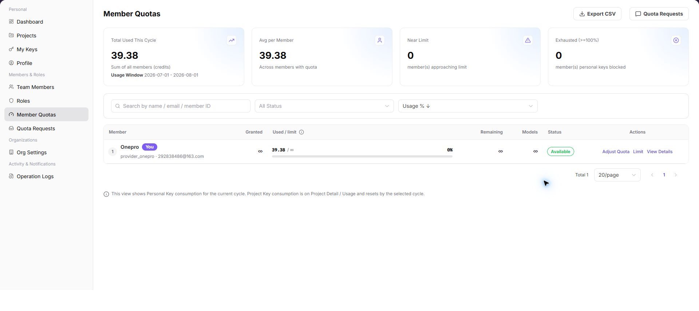
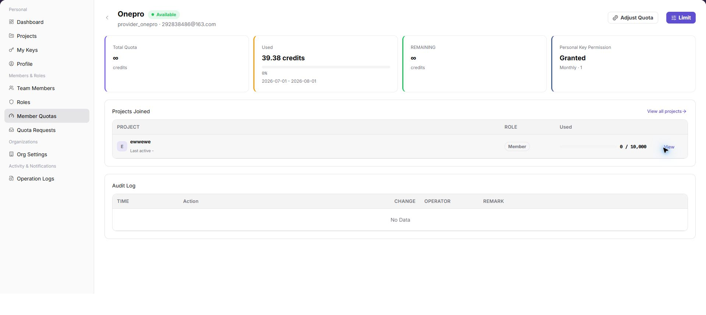
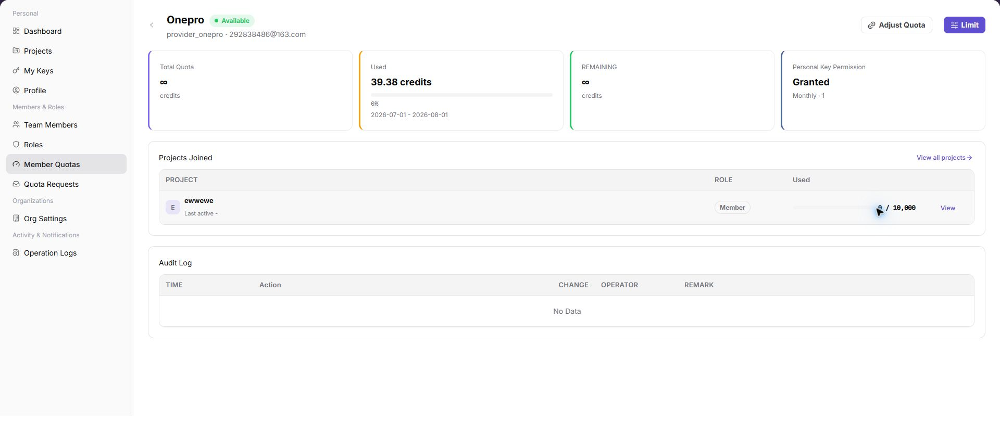

# Member Quotas

::: info Document Information
Version: v1.0
Updated: 2026-07-13
:::

## Feature Overview

`Member Quotas` shows Personal Key usage and authorized quota for tenant members. You can search by member, review status, adjust quota, configure member limits, and open member quota details.

| Item | Content |
| --- | --- |
| Applicable Role | Provider Admin |
| Navigation path | Settings > Members & Roles > Member Quotas |
| Page route | `/user/user-space/member-quotas` |
| Managed objects | Member Personal Key usage, authorized quota, and quota details |
| Typical use | Review member quota, adjust quota, and verify usage |

#### Beginner Explanation

Member Quotas is the team's quota allocation table. It shows each member's available and used quota and limit policy, and helps determine whether a call failed because of personal quota.

#### Terms Quick Reference

| Term | Meaning | Handling tip |
| --- | --- | --- |
| Member quota | Quota allocated to a member. | Check it when a call fails. |
| Used quota | Quota already consumed by the member. | Adjust the limit when usage approaches it. |
| Quota limit | The maximum quota that the member can consume. | Confirm the impact before changing it. |
| Quota request | A member's request for additional quota. | Direct the member to submit one when quota is insufficient. |

## Prerequisites

1. The current account has permission to view member quotas.
2. Before adjusting quota, you have confirmed the member, amount, and reason.
3. Before setting a limit, you have confirmed the reset cycle, limit-reached policy, and model allowlist scope.

## Page Description

| Area | Description |
| --- | --- |
| Top actions | Export CSV and Quota Requests |
| Filters | Search by name, email, or member ID; status; and Usage sort |
| Table columns | Member, authorized quota, used / limit, remaining, models, status, and actions |
| Row actions | Adjust Quota, Limit, and View Details |
| Detail page | Member quota, Personal Key permissions, joined projects, and audit logs |
| High-risk actions | Adjusting quota, saving member limits, and exporting CSV |

The following screenshot shows member quotas screenshot.

## Main Operations

### View Member Quotas

1. Go to `Settings > Members & Roles > Member Quotas`.
2. Use the search box to locate the member.
3. Review authorized quota, used / limit, remaining quota, models, and status.

The following screenshot shows the Member Quotas list. Member identifiers are hidden.

4. Select `View Details` to open member quota details.
5. Review total quota, used quota, remaining quota, Personal Key permissions, joined projects, and audit logs.

The following screenshot shows member quota details.

6. Select `Adjust Quota` to open the adjustment dialog.
7. Select Increase or Deduct, and enter the amount and reason.
8. Confirm the impact before selecting `Confirm`.

The following screenshot shows the member quota adjustment dialog.

9. Select `Limit` to open the member limit dialog.
10. Configure the reset cycle, quota limit, and model allowlist.
11. Confirm the configuration before saving it.

The following screenshot shows the member quota limit dialog.

## Parameter Reference

| Field Name | Required | Field Type | Example | Description |
| --- | --- | --- | --- | --- |
| Keyword or name | No | Text | `Example name` | Used to locate a specific record. |
| Status | No | Enum | `Enabled` | Used to determine the current processing or availability state. |
| Time range or billing cycle | No | Date / Month | `2026-07` | Used to narrow statistics, logs, bills, or settlements. |
| Tenant / customer / member | No | Text | `Example tenant` | Used to identify the business ownership scope. |
| Operation | System generated | Button / link | `View Details` | Provides row-level entry points for follow-up checks. |

## Pitfalls

- Do not change roles, members, login policies, Keys, or API rate-control rules without confirming the affected users and systems.
- UI entries can differ by role and tenant scope; verify the current account context before troubleshooting.
- Never copy complete Keys, AK/SK, tokens, or secrets into documentation, tickets, or screenshots.

## Result Validation

| Check Item | Success Signal | If Abnormal |
| --- | --- | --- |
| Quota updated | Authorized or remaining quota changes after adjustment. | Verify the member, quota type, and approval state. |
| Audit record | The member detail audit log records the quota adjustment. | Search Operation Logs by member and time. |
| Limit correct | Used / limit matches the configured member limit. | Open member quota details and verify the configuration. |

## FAQ

#### Calls fail even though member quota is sufficient

**Symptom:**

The member has remaining quota, but calls are rejected.

**Possible cause:**

- The Key's own limit was reached.
- The project budget was reached.
- The target model is not in the allowlist.

**Resolution:**

1. Check My Keys or the project Key limit.
2. Review the project budget and model allowlist.
3. Confirm the model scope in the member limit.

#### Why is a member missing from Member Quotas?

**Symptom:**

A member or the member's quota information is absent.

**Possible cause:**

The member has not joined the current tenant, the account is disabled, or the current account cannot view the member's quota.

**Resolution:**

Verify the member status on Members, then check member quota authorization. Ask a tenant administrator to allocate quota or restore the member when required.

#### Why is Adjust Quota unavailable?

**Symptom:**

Quota is visible, but Adjust Quota, Limit, or the adjustment entry cannot be selected.

**Possible cause:**

The current account lacks quota-administrator permission, the member status does not allow changes, or approval is required for that quota type.

**Resolution:**

Confirm the member status and quota-management permission. Submit the required quota request first, then return to Member Quotas after approval.

## Next Steps

1. Review member requests on Quota Requests.
2. Adjust default quota for new members in Tenant Settings.
3. Verify quota adjustments in Operation Logs.

## Notes

- Adjusting quota affects a member's calling ability. Confirm the member and amount first.
- Exported CSV files may contain member usage data. Handle them according to tenant data-management requirements.
