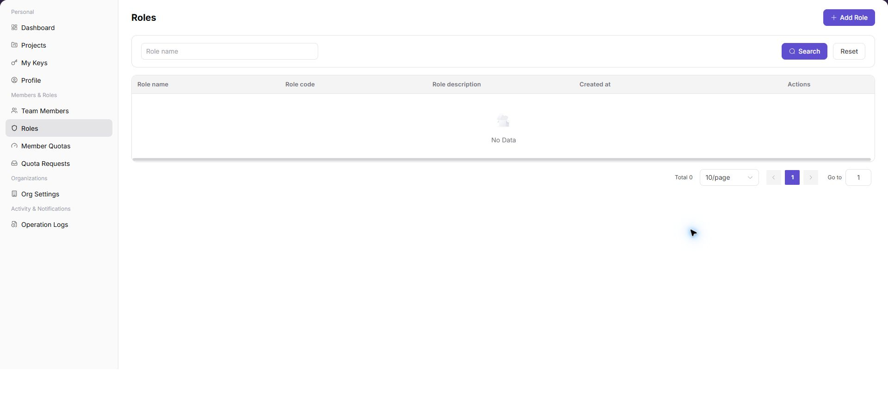
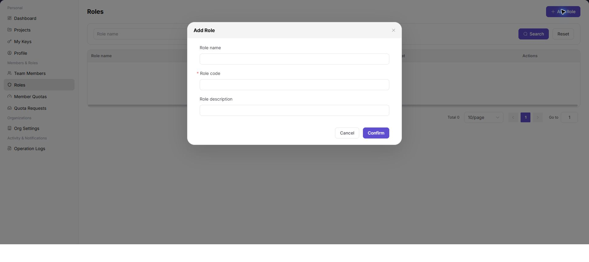

# Roles

::: info Document Information
Version: v1.0
Updated: 2026-07-13
:::

## Feature Overview

`Roles` is used to manage tenant roles. You can search by role name, review the role name, identifier, description, and creation time, and create a role through the Add Role form.

| Item | Content |
| --- | --- |
| Applicable Role | Provider Admin |
| Navigation path | Settings > Members & Roles > Roles |
| Page route | `/user/user-space/roles` |
| Managed objects | Tenant roles, role identifiers, role descriptions, and permission scopes |
| Typical use | Query roles, view role permissions, and maintain tenant roles |

#### Beginner Explanation

Roles is the permission-template library. Combine menu and action permissions into a role first, then assign that role to members instead of authorizing each member separately.

#### Terms Quick Reference

| Term | Meaning | Handling tip |
| --- | --- | --- |
| Role | A set of menu and action permissions. | Define the role before assigning members. |
| Authorization scope | The menus and actions that a role can access. | Check it when a member cannot see a menu. |
| System role | A platform-provided or protected role. | Do not delete it casually. |
| Member assignment | The members currently using the role. | Check assignments before deletion. |

## Prerequisites

1. The current account has permission to view roles.
2. Before adding a role, you have defined its name, identifier, and description.
3. Keep the role identifier stable; do not change it without a clear need.

## Page Description

| Area | Description |
| --- | --- |
| Top action | `Add Role` |
| Filter | Role Name |
| Table columns | Role Name, Role Identifier, Role Description, Created At, and Actions |
| Form fields | Role Name, Role Identifier, and Role Description |
| High-risk action | Creating or changing a high-permission role |

## Main Operations

### Manage Roles

1. Go to `Settings > Members & Roles > Roles`.
2. Filter by role name.
3. Review the role identifier, description, and creation time.

The following screenshot shows the Roles list.

4. Select `Add Role` to open the form.
5. Enter the role name, identifier, and description.
6. Confirm the role's purpose before selecting `Confirm`.

The following screenshot shows the Add Role form.

## Parameter Reference

| Field Name | Required | Field Type | Example | Description |
| --- | --- | --- | --- | --- |
| Keyword or name | No | Text | `Example name` | Used to locate a specific record. |
| Status | No | Enum | `Enabled` | Used to determine the current processing or availability state. |
| Time range or billing cycle | No | Date / Month | `2026-07` | Used to narrow statistics, logs, bills, or settlements. |
| Tenant / customer / member | No | Text | `Example tenant` | Used to identify the business ownership scope. |
| Operation | System generated | Button / link | `View Details` | Provides row-level entry points for follow-up checks. |

## Pitfalls

- Do not change roles, members, login policies, Keys, or API rate-control rules without confirming the affected users and systems.
- UI entries can differ by role and tenant scope; verify the current account context before troubleshooting.
- Never copy complete Keys, AK/SK, tokens, or secrets into documentation, tickets, or screenshots.

## Result Validation

| Check Item | Success Signal | If Abnormal |
| --- | --- | --- |
| Role created | The new role appears in the role list. | Refresh the list and check for a duplicate role identifier. |
| Information | Role name, identifier, and description match the intended values. | Open role details and review the fields. |
| Assignable | The role is available for selection on Members. | Check role status and member-management permission. |

## FAQ

#### A member still lacks permission after a role is assigned

**Symptom:**

The member cannot access the target function after receiving the role.

**Possible cause:**

- The role does not contain the required permission.
- The member is not assigned to the role.
- The page cache has not refreshed.

**Resolution:**

1. Check the role configuration and member assignment.
2. Sign in again or refresh the page.
3. Ask the tenant administrator to verify the permission scope.

#### Why is a target role missing from the role list?

**Symptom:**

The expected role is absent, or it cannot be selected during member assignment.

**Possible cause:**

The role belongs to another tenant, is disabled, or the current account can view members but cannot manage roles.

**Resolution:**

Confirm the tenant scope and role status. Verify that the current account can view roles. Ask a role administrator to perform the assignment when required.

#### Why are Add Role or Edit unavailable?

**Symptom:**

The role list is visible, but Add Role, Edit Permissions, or Delete cannot be selected.

**Possible cause:**

The current account is not a role administrator, the target is a built-in role, or the role is still assigned to members and cannot be deleted.

**Resolution:**

Verify role-management permission. View built-in roles without changing them. Before deletion, remove member assignments and complete required approval.

## Next Steps

1. Assign the role to members on Members.
2. Use Member Quotas to control members' resource usage.

## Notes

- Restrict assignment of high-permission roles.
- Do not include accounts, passwords, or customer-sensitive information in role names or descriptions.
