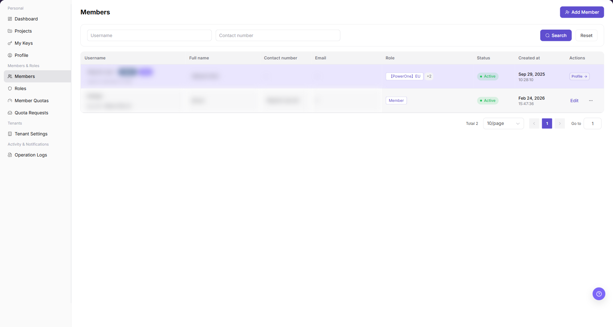
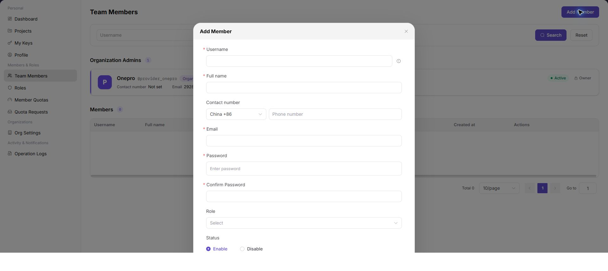

# Members

::: info Document Information
Version: v1.0
Updated: 2026-07-29
:::

## Feature Overview

`Members` shows tenant administrators and members. You can filter by username or phone number and add a tenant member through the Add Member form.

| Item | Content |
| --- | --- |
| Applicable Role | Provider Admin |
| Navigation path | Settings > Members & Roles > Members |
| Page route | `/user/user-space/team-members` |
| Managed objects | Tenant administrators, members, roles, and contact information |
| Typical use | View the member list, add members, and manage member status |

#### Beginner Explanation

Members is the tenant contact directory and permission entry. Use it to confirm whether a member has joined, can sign in, is enabled, and has the expected role. When a member cannot access the platform, check member status and role assignment first.

#### Terms Quick Reference

| Term | Meaning | Handling tip |
| --- | --- | --- |
| Member | An account that can sign in to or collaborate in a tenant. | Confirm its status and tenant ownership first. |
| Member status | Indicates whether a member is enabled, disabled, or pending. | Check it first when sign-in fails. |
| Role assignment | The permission set assigned to a member. | Check it when a menu is missing. |
| Reset Password | A management action that restores member access. | Confirm the person's identity before using it. |

## Prerequisites

1. The current account has permission to view members.
2. Before adding a member, you have confirmed the identity, contact information, email address, role, and initial status.
3. Do not retain complete phone numbers, email addresses, or passwords in documentation or screenshots.

## Page Description

The page shows member usernames, names, contact information, role labels, status, creation time, and actions. Use the identity badge and username together before you open an action. An identity badge is display information. It does not replace the assigned role or permission check.

| Area | Description |
| --- | --- |
| Top action | `Add Member` |
| Filters | Username and Phone Number |
| Table columns | Username, name, phone number, email, role, status, creation time, and actions |
| Form fields | Username, name, phone number, email, password, confirm password, role, and status |
| High-risk action | Adding and enabling a member |

## Main Operations

### Manage Members

1. Go to `Settings > Members & Roles > Members`.
2. Use `Username` or `Contact number` to locate the member.
3. Use the identity badge and username together to confirm the member.
4. Check the assigned role and status separately from the identity badge.
5. Copyable member values use the same copy icon and success feedback as `Profile`.

The following screenshot shows Members. Accounts and contact information are hidden.

6. Select `Add Member` to open the form.
7. Enter username, name, phone number, email, password, and confirm password.
8. Select a role and status.
9. Confirm the member's identity and permissions before selecting `Confirm`.

The following screenshot shows the Add Member form.

## Parameter Reference

| Field Name | Required | Field Type | Example | Description |
| --- | --- | --- | --- | --- |
| Member Name | No | Text | Example Member A | Identifies the member. |
| Identity Badge | System generated | Badge | Displayed on page | Shows identity information. It does not grant permissions. |
| Email | No | Text | `member@example.com` | Provides the member's contact and sign-in information. |
| Role | System generated | Tag | `Member` | Shows the member's assigned permission role. |
| Status | System generated | Tag | `Active` | Shows whether the member account is active. |
| Copy icon | No | Icon | `Copy` | Copies a supported member value and shows success feedback. |
| Actions | System generated | Button / link | `Profile` / `Edit` | Opens actions that are available to the current account. |

## Pitfalls

- Do not change roles, members, login policies, Keys, or API rate-control rules without confirming the affected users and systems.
- UI entries can differ by role and tenant scope; verify the current account context before troubleshooting.
- Never copy complete Keys, AK/SK, tokens, or secrets into documentation, tickets, or screenshots.

## Result Validation

| Check Item | Success Signal | If Abnormal |
| --- | --- | --- |
| Member added | The new member appears in the list. | Check the email address, tenant scope, and invitation status. |
| Status | The member status matches the form selection. | Open member details and verify the status. |
| Role | The expected role is displayed for the member. | Verify that the role is still valid on Roles. |

## FAQ

#### A member cannot sign in

**Symptom:**

The member cannot access the platform after receiving the account.

**Possible cause:**

- The member is disabled.
- The initial password or account information is incorrect.
- The assigned role lacks permission.

**Resolution:**

1. Check the member status on Members.
2. Verify the role configuration.
3. Reset or reissue sign-in information through the tenant account process.

#### Why is a target member missing from the list?

**Symptom:**

The member is absent, or an invited member has not appeared.

**Possible cause:**

The member joined another tenant, has not accepted the invitation, is disabled, or the current account cannot view all members.

**Resolution:**

Confirm the tenant scope and member email address. Check invitation status, member status, and role permission. Ask a tenant administrator to invite or restore the member when required.

#### Why are member invitation or edit actions unavailable?

**Symptom:**

Members are visible, but Add, Disable, or Change Role cannot be selected.

**Possible cause:**

The current account is not a member administrator, the target member is the tenant owner, or the current member state does not allow the action.

**Resolution:**

Verify member-management permission and the target member's role. Owner or administrator changes must follow the tenant process and be performed by an account with higher permission.

## Next Steps

1. Verify member role permissions on Roles.
2. Set member quota on Member Quotas.
3. Review the add-member record in Operation Logs.

## Notes

- Adding a member grants tenant access. Confirm the person's identity first.
- Do not record member passwords in documentation, screenshots, or communication records.
