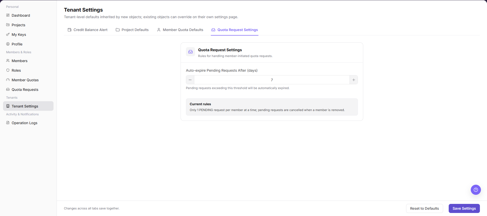
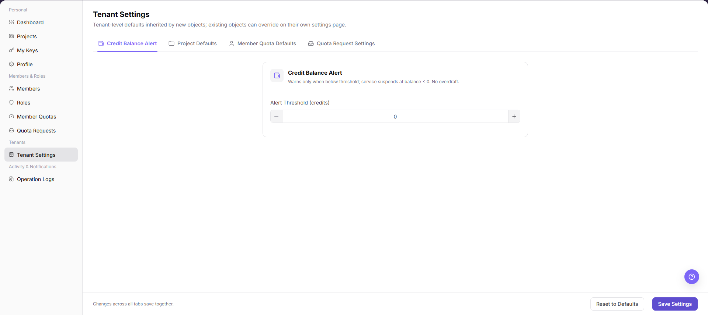
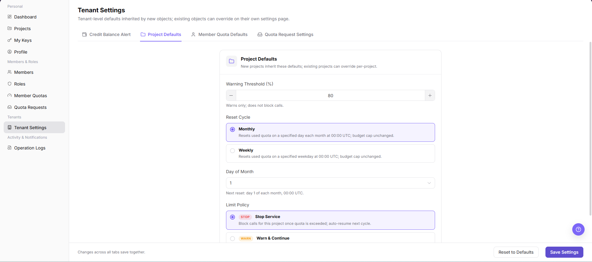
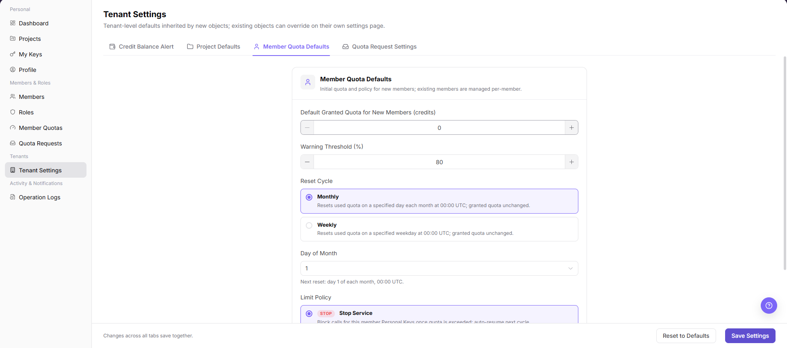

# Tenant Settings

::: info Document Information
Version: v1.0
Updated: 2026-08-27
:::

## Feature Overview

`Tenant Settings` maintains global defaults for a provider tenant, including credit-balance alerts, project defaults, member quota defaults, and quota request settings.

| Item | Content |
| --- | --- |
| Applicable Role | Provider Role or Provider Account |
| Navigation path | Settings > Tenants & Settings > Tenant Settings |
| Page route | `/user/user-space/settings` |
| Managed objects | Credit-balance alerts, project defaults, member quota policy, and tenant-level defaults |
| Typical use | Maintain tenant defaults and quota-alert configuration |

#### Beginner Explanation

Tenant Settings is the tenant default-rule panel. It defines the initial policy for new projects, new members, and quota requests. A change usually affects objects created later; verify existing objects on their own pages.

#### Terms Quick Reference

| Term | Meaning | Handling tip |
| --- | --- | --- |
| Tenant Settings | The entry for tenant-level default configuration. | Confirm the applicable scope before changing it. |
| Default rule | A rule inherited when a new object is created. | It does not necessarily update existing objects. |
| Tenant context | The tenant that owns the current settings. | Confirm it before switching tenant scope. |
| Member default policy | The initial rule applied when a new member joins. | Verify it with a new member after a change. |

## Prerequisites

1. The current account can view and maintain Tenant Settings.
2. Before saving, you have confirmed the impact on projects, member quotas, and the quota-request flow.
3. Before resetting defaults, you have confirmed that the current configuration can be overwritten.

## Page Description

| Tab | Description |
| --- | --- |
| Credit Balance Alert | Configures an alert when tenant balance falls below a threshold. |
| Project Defaults | Configures the reset cycle, alert threshold, and limit policy for new projects. |
| Member Quota Defaults | Configures initial quota, reset cycle, and limit policy for new members. |
| Quota Request Settings | Configures automatic expiration and request rules for pending requests. |
| Bottom actions | Reset to Defaults and Save Settings |

The following screenshot shows quota request settings.

## Main Operations

### View Current Tenant Defaults

1. Go to `Settings > Tenants and Settings > Tenant Settings`.
2. Review organization information, quota-request settings, project defaults, and member-quota defaults.
3. Record the current state and confirm that each setting applies to the current tenant.
4. If information is missing, refresh and check administrative permission. Hide organization identifiers and quota before screenshots or sharing.

### Verify Setting Changes

1. After an approved change, reopen Tenant Settings.
2. Compare switches, defaults, and update time with the change record.
3. Before creating a project or member, confirm that the new defaults take effect as expected.
4. If not applied, check the save message, permission, and cache. Do not submit repeatedly.

### Manage Tenant Settings

1. Go to `Tenants & Settings > Tenant Settings`.
2. On `Credit Balance Alert`, configure the alert threshold.

The following screenshot shows the balance-alert tab.

3. Open `Project Defaults` and configure the reset cycle, alert threshold, and limit policy for new projects.

The following screenshot shows Project Defaults.

4. Open `Member Quota Defaults` and configure initial quota, reset cycle, and limit policy for new members.

The following screenshot shows Member Quota Defaults.

5. Open `Quota Request Settings` and configure automatic expiration for pending requests.

The following screenshot shows Quota Request Settings.

6. After reviewing all tabs, select `Save Settings`.

## Parameter Reference

| Field Name | Required | Field Type | Example | Description |
| --- | --- | --- | --- | --- |
| Keyword or name | No | Text | `Example name` | Used to locate a specific record. |
| Status | No | Enum | `Enabled` | Used to determine the current processing or availability state. |
| Time range or billing cycle | No | Date / Month | `2026-07` | Used to narrow statistics, logs, bills, or settlements. |
| Tenant / customer / member | No | Text | `Example tenant` | Used to identify the business ownership scope. |
| Operation | System generated | Button / link | `View Details` | Provides row-level entry points for follow-up checks. |

## Pitfalls

- Do not change roles, members, login policies, Keys, or API rate-control rules without confirming the affected users and systems.
- UI entries can differ by role and tenant scope; verify the current account context before troubleshooting.
- Never copy complete Keys, AK/SK, tokens, or secrets into documentation, tickets, or screenshots.

## Result Validation

| Check Item | Success Signal | If Abnormal |
| --- | --- | --- |
| Saved | The new values remain after saving and reopening the page. | Check whether the page reports a save failure. |
| Defaults effective | A new project or member inherits the tenant defaults. | Check the tenant scope and defaults selected during creation. |
| Request flow | Quota requests follow the configured expiration time. | Check request status and time on Quota Requests. |

## FAQ

#### Existing projects do not change after settings are saved

**Symptom:**

Existing projects or members still show the old configuration.

**Possible cause:**

- Tenant Settings provides defaults mainly for objects created later.
- Existing projects or members have independent configuration on their detail pages.

**Resolution:**

1. Change the existing object on Project Details or Member Quotas.
2. When creating a new object, confirm that it inherits the latest defaults.

#### Why is no configuration loaded?

**Symptom:**

Default quota, request expiration, or project defaults are absent.

**Possible cause:**

The current account lacks Tenant Settings permission, defaults are not initialized, or the page still shows another tenant's data.

**Resolution:**

Confirm the current tenant and Tenant Settings permission. If the configuration is empty, ask the tenant owner to complete and save the defaults.

#### Why is Save Settings unavailable?

**Symptom:**

Settings are visible, but Save, Reset, or a default-rule field cannot be selected.

**Possible cause:**

The current account lacks Tenant Settings permission, an upstream platform manages the policy, or the configuration is in approval.

**Resolution:**

Verify Tenant Settings permission and configuration source. Ask the platform operator to change managed configuration, or wait until approval finishes.

## Next Steps

1. Create a new project to verify Project Defaults.
2. Add a new member to verify Member Quota Defaults.
3. Review Quota Requests to verify request rules.

## Notes

- Saving settings affects later tenant-management flows. Confirm each value first.
- `Reset to Defaults` overwrites the current page values. Confirm whether they must be retained before resetting.
