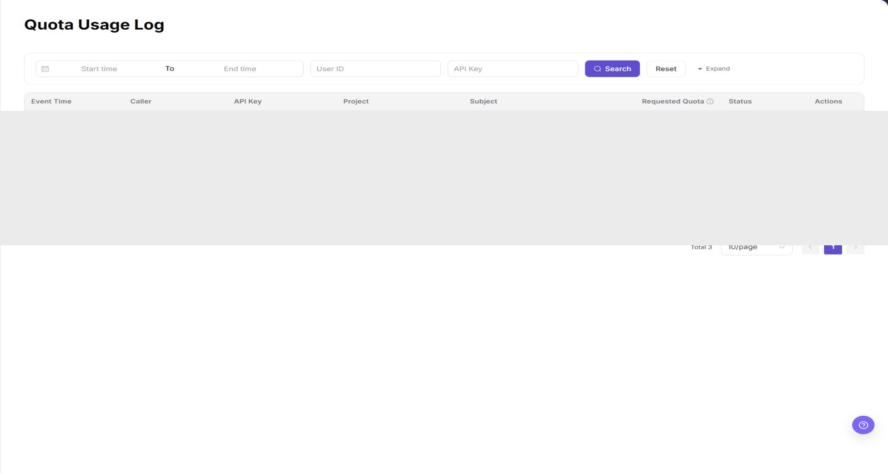

# Usage Log

::: info Document Information
Version: v1.0
Updated: 2026-08-27
:::

## Feature Overview

`Usage Log` records quota-related model call events visible to the current End User account. Use it to locate a usage event, inspect its caller and project context, and open read-only details without exposing credentials or raw request data.

| Item | Content |
| --- | --- |
| Applicable Role | End User |
| Navigation path | Settings > Tenants > Usage Log |
| Page route | `/user/user-space/usage-log` |
| Managed objects | Quota usage events and their read-only details |
| Typical use | Filter usage events and verify quota deduction status |

## Prerequisites

1. The current End User account can access the `Usage Log` entry under Settings.
2. The account has at least one visible quota usage event, or the page is available for an empty-state check.
3. Do not copy or record real API Keys, caller identifiers, project names, subjects, or request details.

## Page Description

The filter bar provides `Start time`, `End time`, `User ID`, and `API Key` fields, together with `Search`, `Reset`, and `Expand` controls.

The table contains:

| Field | Description |
| --- | --- |
| Event Time | Time when the usage event occurred. |
| Caller | Caller identity shown for the event. |
| API Key | The masked or abbreviated Key associated with the event. |
| Project | Project context, when applicable. |
| Subject | Model or request subject associated with the event. |
| Requested Quota | Requested and deducted quota information. |
| Status | Processing result, such as `SUCCESS`. |
| Actions | `Detail` opens read-only event information. |

## Main Operations

### View Quota Usage Events

1. Go to `Settings > Tenants and Settings > Quota Usage Log`.
2. Select a time range and filter by member, project, resource type, action, or result.
3. Check the target event time, quota change, object, and reason.
4. If no record is returned, check the time zone and clear combined filters. Redact quota and member data before sharing.

### View Event Details and Reconcile the Quota Change

1. Click **"Details"** for the target event.
2. Compare quota before, change amount, quota after, and the related object.
3. Check for a reversal or subsequent adjustment near the same time.
4. If the change cannot be explained, escalate with a redacted event ID and time range. Do not modify quota directly.

### View Usage Events

1. Go to `Settings > Tenants > Usage Log`.
2. Enter a time range, `User ID`, or `API Key` only when a read-only check requires it.
3. Click `Search` and review the event time, caller, Key, project, subject, requested quota, status, and action entry.
4. Click `Detail` to inspect one event, then close the detail view without copying sensitive values.
5. Use `Reset` to clear the filters. `Expand` reveals additional filter controls when they are available to the account.

## Result Validation

| Check Item | Success Signal | If Abnormal |
| --- | --- | --- |
| Page is accessible | `Usage Log` opens from the visible Settings menu. | Check account permission and menu visibility. |
| Filters work | `Search` refreshes the list and `Reset` clears the criteria. | Clear criteria and retry. |
| Event fields display | Event time, caller, API Key, project, subject, requested quota, status, and actions are visible. | Check whether the account has visible usage events. |
| Detail is read-only | `Detail` opens event information without a save or submit action. | Close the view and report the restriction. |

## Pitfalls

- Usage Log is an audit view; opening `Detail` does not change quota or billing state.
- A masked or abbreviated API Key is still sensitive. Do not copy it into documentation or tickets.
- Empty results may reflect the selected time range, account scope, or a lack of usage events.

## Notes

- This page was added to the End User Settings menu in the Demo verification.
- The documentation screenshot masks all event records and identity values while retaining filter and column labels.
