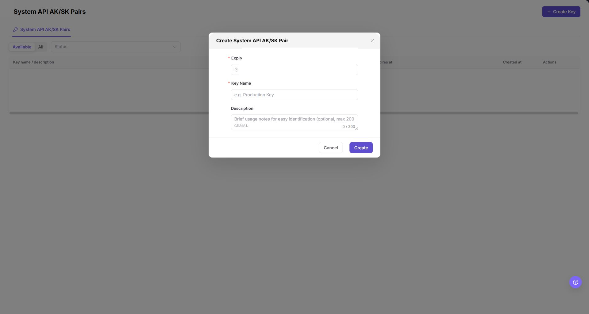

# My Keys

::: info Document Information
Version: v1.1
Updated: 2026-08-26
:::

## Feature Overview

`My Keys` is the personal credential page for Provider and End User accounts. Both roles currently expose the `Model API Keys` and `System API AK/SK Pairs` tabs. The Model API tab also shows the current member quota and per-Key usage or limit information.

| Item | Content |
| --- | --- |
| Applicable Role | Provider Account, End User |
| Navigation path | Settings > Personal > My Keys |
| Page route | Enter through the visible menu; do not paste a hidden route. |
| Managed objects | Model API Keys, System API AK/SK Pairs, status, expiration, and applicable quota settings |
| Typical use | Review personal credentials, open a creation or quota dialog, and stop before the final save or create action |

#### Beginner Explanation

Use a separate credential for each application or workload. Give it a clear name, an expiration plan, and—when the Model API page offers it—a limit that matches the member or project policy. Treat the complete Key or AK/SK pair as a secret.

#### Terms Quick Reference

| Term | Meaning | Handling tip |
| --- | --- | --- |
| Model API Key | A credential used to call model APIs. | Use separate Keys for separate workloads. |
| System API AK/SK Pair | A credential pair used to call system APIs. | Never place the complete pair in documentation or frontend code. |
| Member quota | The current-cycle allowance shared by the account's Model API Keys. | Check it before diagnosing a quota failure. |
| Key limit | A per-Key cycle limit, when the page enables it. | Keep it consistent with the project or member policy. |

## Prerequisites

1. The current Provider or End User account can see `Settings > Personal > My Keys`.
2. Before opening a creation or quota dialog, you have defined the caller, purpose, expiration, and limit policy.
3. Before rotating or disabling a Key, you have confirmed which callers depend on it.

## Page Description

On the visible personal page, the Model API tab provides the member-quota summary, `Available` / `All` scope buttons, a `Status` filter, and the credential table. The table shows Key name / description, prefix, status, expiration, used / limit, created time, and row actions. The `System API AK/SK Pairs` tab uses the same filters but omits the member-quota summary and the `Used / limit` column.

| Area | Description |
| --- | --- |
| Top button | `Create Key` opens the credential creation dialog. |
| Tabs | `Model API Keys` and `System API AK/SK Pairs`, when exposed for the current role. |
| Member quota | The Model API tab shows current-cycle health, used, remaining, total allowance, and the next reset time. `Request More Quota` opens the Quota Requests page. |
| Filters | `Available` / `All` and `Status`. |
| Table columns | Key name / description, prefix, status, expiration, used / limit, created time, and actions. |
| Row actions | `View key` is displayed directly. The overflow menu currently contains `View details`, `Edit details`, `Extend validity`, `Limit`, `Rotate`, and `Disable`. |

## Main Operations

### Review My Keys

1. Open `Settings > Personal > My Keys` from the visible menu.
2. Select `Model API Keys` or `System API AK/SK Pairs` when the tab is available.
3. Review the Key name / description, prefix, status, expiration, used / limit, created time, and available row actions.
4. For a Model API Key, open the overflow menu to review `View details`, `Edit details`, `Extend validity`, `Limit`, `Rotate`, and `Disable`. Do not execute a write action during a read-only review.

### Open the Model API Key Creation Dialog

1. Click `Create Key`.
2. Review the required `Expire Time` and `Key Name` fields and the optional `Description` field (maximum 200 characters).
3. Select the required `Reset Cycle`. If `Monthly` is selected, review `Day of Month`.
4. If the page exposes `Enable Limit`, decide whether to set a `Period Limit (credits)` and `Warning Threshold (%)`.
5. Review the limit-reached policy shown by the dialog, then confirm the caller, purpose, expiration, and quota policy.
6. For documentation review or screenshot capture, click `Cancel`. Do not click the final `Create` button.

### Open the System API AK/SK Pair Creation Dialog

1. Select `System API AK/SK Pairs`.
2. Click `Create Key`.
3. Review the required `Expire Time` and `Key Name` fields and the optional `Description` field (maximum 200 characters).
4. Confirm that this dialog does not contain Model API quota, reset-cycle, warning-threshold, or limit-reached fields.
5. Click `Cancel`. Do not click the final `Create` button during documentation review.

### Open Quota Requests

1. On the `Model API Keys` tab, click `Request More Quota`.
2. Confirm that the page opens `Settings > Members & Roles > Quota Requests`.
3. Review existing request and adjustment records. Stop before the final quota-request submission unless a change is explicitly approved.

### Review or Adjust a Key Limit

1. Open the target Model API Key's overflow menu and select `Limit`.
2. Review `Reset Cycle`, `Day of Month`, and whether `Enable Limit` is on.
3. When `Enable Limit` is on, check the displayed period limit and warning threshold against the project or member policy.
4. Stop before `Save Limit` unless an authorized change has been explicitly approved.

## Parameter Reference

| Field Name | Required | Field Type | Example | Description |
| --- | --- | --- | --- | --- |
| Expire Time | Yes | Date time | `2026-12-31 23:59` | Sets the expiration time for either credential type. |
| Key Name | Yes | Text | `Production inference` | Identifies the workload or caller for either credential type. |
| Description | No | Text area | `Backend inference job` | Optional usage notes for either credential type; the page shows a maximum of 200 characters. |
| Reset Cycle | Yes | Enum | `Monthly` | Model API Key only. Controls the Key's usage reset cycle. |
| Day of Month | Conditional | Enum / number | `1` | Appears when `Monthly` is selected. |
| Enable Limit | No | Switch | On | Enables a per-Key cycle limit while the member quota still applies. |
| Period Limit (credits) | Conditional | Number | `1000` | The per-Key cycle allowance when the limit is enabled. |
| Warning Threshold (%) | Conditional | Number | `80` | The warning threshold shown by the creation form. |
| Limit-reached policy | Conditional | Enum | `Stop` | Defines the action shown when a configured limit is reached. |
| Prefix | System generated | Text | `Masked prefix` | A non-secret identifier shown in the list. |
| Status | System generated | Enum | `Active` | Shows whether the credential is currently available. |
| Used / limit | System generated | Usage | `Masked / limit` | Shows current Key usage against the applicable limit. |
| Created | System generated | Date | `Masked date` | Records when the Key was created. |
| Actions | System generated | Buttons / menu | `View details` | Provides `View key` and the current overflow actions for the selected credential and state. |

## Pitfalls

- Tabs and row actions are role- and tenant-dependent. Use only the controls visible after entering from the current account's menu.
- Opening a dialog is not the same as creating or saving a credential. Stop at `Cancel` during documentation review.
- Do not add permission-scope, quota, reset-cycle, or warning fields to a credential type that does not display them in the current Demo page.
- Never copy complete Keys, AK/SK, tokens, names, identifiers, usage values, or dates into documentation, tickets, or screenshots.

## Result Validation

| Check Item | Success Signal | If Abnormal |
| --- | --- | --- |
| Page entry | `Settings > Personal > My Keys` opens from the visible menu. | Check the current role, tenant, and menu permission. |
| Tab visibility | The expected credential tab is visible for the current account. | Do not infer a hidden route; record the tab as unavailable. |
| List state | The list shows the documented columns and available row actions. | Check filters and credential state. |
| Creation dialog | The visible required and optional fields match the current tab. | Stop and re-audit the Demo page before editing this manual. |
| Quota request | `Request More Quota` opens `Settings > Members & Roles > Quota Requests`. | Re-enter from the visible menu and record the navigation mismatch. |
| Quota dialog | The overflow-menu `Limit` action opens the documented reset and limit controls. | Record the action as credential- or state-dependent. |

## FAQ

#### A Key call fails

**Symptom:** The API returns an authentication or quota error.

**Resolution:** Check the Key status, expiration, member quota, project policy, and any per-Key limit. Notify dependent callers before rotation or disable actions.

#### Why is a target Key missing?

**Symptom:** A Key is not visible in the list.

**Resolution:** Confirm the selected credential tab, switch between `Available` and `All`, clear the status filter, and check the current account and project scope.

#### Why is Create, Limit, Rotate, or Disable unavailable?

**Symptom:** The page is visible, but an action is missing or disabled.

**Resolution:** The action may depend on role, tenant policy, Key state, or the selected credential type. Use the visible menu and current row state as the source of truth.

## Notes

- Never expose a complete Key, AK/SK pair, token, or private key in documentation, screenshots, or chat.
- `Create`, `Save Limit`, `Rotate`, and `Disable` can affect existing callers. Confirm the business impact before any approved change.
