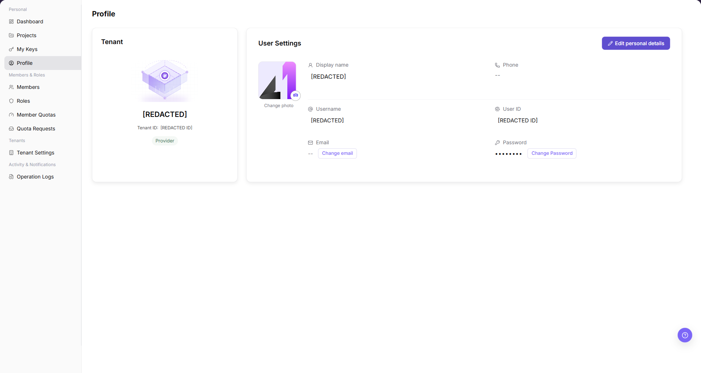

# Profile

::: info Document Information
Version: v1.0
Updated: 2026-07-29
:::

## Feature Overview

`Profile` shows the current tenant identity and user settings. It includes the display name, username, user ID, phone, email, and password entries.

| Item | Content |
| --- | --- |
| Applicable Role | Model Provider, End User |
| Navigation path | Settings > Personal > Profile |
| Page route | `/user/user-space/profile` |
| Managed objects | Tenant identity, display name, username, user ID, phone, email, and password settings |
| Typical use | Confirm the current account identity and copy an account value when required |

#### Beginner Explanation

Profile is part of the settings and access-control workspace. Treat it as a place to confirm identities, permissions, tenant rules, audit records, or rate-control status before changing configuration.

#### Terms Quick Reference

| Term | Meaning | Handling tip |
| --- | --- | --- |
| Member | A user account that belongs to an tenant or team. | Check role and status before troubleshooting access. |
| Role | A permission set assigned to members. | Use least privilege and review scope before changes. |
| Operation log | An audit record of user or platform actions. | Use it to trace risky or abnormal operations. |
| API rate control rule | A policy that limits API request patterns. | Publish and verify rules carefully. |

## Prerequisites

1. The current account can access `Personal > Profile`.
2. The target tenant, member, customer, billing cycle, rule, or record scope has been confirmed.
3. Required upstream data is already available and the page has finished loading.
4. For high-risk changes, confirm the impact scope and rollback path before continuing.

## Page Description

The page separates tenant information from user settings. Copyable account fields show a copy icon next to the value.

| Area | Description |
| --- | --- |
| Tenant | Shows the tenant name, tenant ID, and business identity. |
| User Settings | Shows the display name, username, user ID, phone, email, and password entries. |
| Copy icon | Copies a supported account value and shows success feedback. |
| Edit entries | Open personal-details, email, or password maintenance when permitted. |

The following screenshot shows profile.

## Main Operations

Use the following operations to work with profile records and related status. Complete view-only checks before opening dialogs that may create, save, submit, activate, transfer, settle, publish, or delete data.

### View Profile

1. Go to `Settings > Personal > Profile`.
2. Confirm the tenant name, tenant ID, and business identity.
3. Review the display name, username, user ID, phone, email, and password status.
4. To copy a supported value, select its copy icon once.
5. Confirm the success feedback before you paste the value.
6. Treat copied account IDs and email addresses as sensitive data. Do not paste them into public channels.

## Parameter Reference

| Field Name | Required | Field Type | Example | Description |
| --- | --- | --- | --- | --- |
| Tenant Name | System generated | Text | Sanitized value | Identifies the current tenant. |
| Tenant ID | System generated / Copyable | Text | Sanitized value | Identifies the tenant. Treat the copied value as sensitive data. |
| Business Identity | System generated | Tag | `Provider` | Shows the current tenant business identity. |
| Display Name | System generated / Editable | Text | Sanitized value | Shows the user display name. |
| Username | System generated / Copyable | Text | Sanitized value | Identifies the current user account. |
| User ID | System generated / Copyable | Text | Sanitized value | Identifies the current user. Treat the copied value as sensitive data. |
| Phone | System generated / Editable | Text | Sanitized value | Shows the configured phone number. |
| Email | System generated / Editable / Copyable | Text | Sanitized value | Shows the configured email address. |

## Pitfalls

- Do not change roles, members, login policies, Keys, or API rate-control rules without confirming the affected users and systems.
- UI entries can differ by role and tenant scope; verify the current account context before troubleshooting.
- Never copy complete Keys, AK/SK, tokens, or secrets into documentation, tickets, or screenshots.

## Result Validation

| Check Item | Success Signal | If Abnormal |
| --- | --- | --- |
| Page access | The `Personal > Profile` page opens and data loads normally. | Check role permissions and refresh the page. |
| Account information | Tenant and user-setting areas show the current account information. | Check account permissions and page loading status. |
| Copy feedback | Selecting a copy icon shows success feedback. | Select the icon once again and check browser clipboard permission. |

## FAQ

#### Target settings entry is not visible in Profile

The expected account, project, member, role, tenant, key, operation log, system configuration, or API rate-control entry does not appear on this page.

**How to check:**

1. Confirm the current tenant, tenant, project, role, and account permission scope.
2. Check page filters such as keyword, status, project, member, role, tenant, time range, and configuration type.
3. Verify that prerequisite objects, such as projects, members, roles, keys, or system configurations, have been created and enabled.
4. If the entry was just changed, refresh the page and compare it with operation logs or related settings pages.

#### Configuration change does not take effect in Profile

A permission, project, role, key, notification, system setting, or rate-control change was submitted, but the page or downstream behavior still shows the old result.

**How to check:**

1. Confirm that the save operation completed and the target object status is enabled or active.
2. Check whether the change applies to the correct tenant, project, member, role, API key, or policy scope.
3. Compare downstream behavior with operation logs and related settings pages to rule out cache, permission, or synchronization delay.
4. For security-sensitive settings, verify impact scope before repeating the operation or escalating with desensitized page paths and timestamps.

#### Why cannot account information be edited?

Check the current tenant, tenant, project, role permissions, object status, feature switch, and operation logs. Do not repeat save, submit, publish, rollback, disable, or delete actions until the scope and impact are confirmed.

## Next Steps

1. Recheck the affected users, tenants, projects, roles, keys, policies, or configuration objects.
2. Verify operation logs and downstream behavior after the configuration is saved or refreshed.
3. Keep only desensitized page paths, timestamps, object names, and status values when escalating.

## Notes

- Permission, Key, login, tenant, and rate-control changes can affect real users. Confirm scope before changes.
- Keep page routes, API fields, Key, AK/SK, License, and other product terms in their UI form.
- Keep credentials, private operational details, and sensitive customer data out of the manual.
