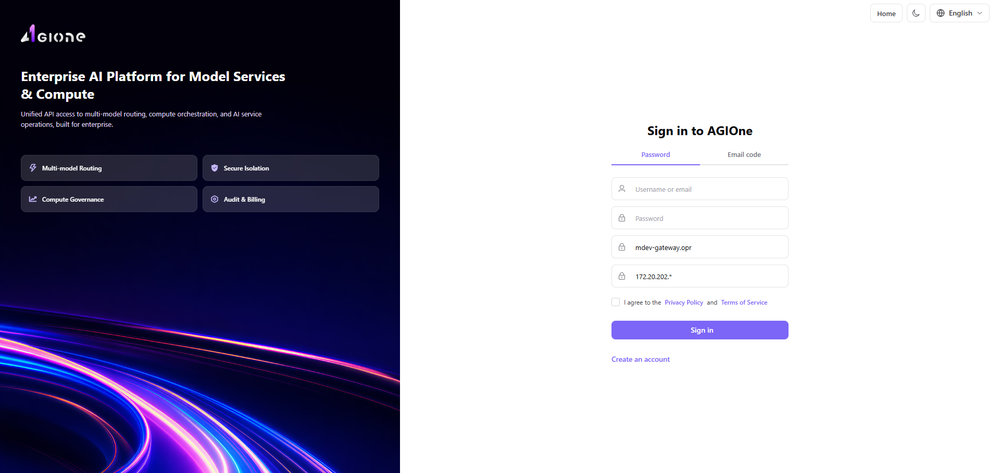
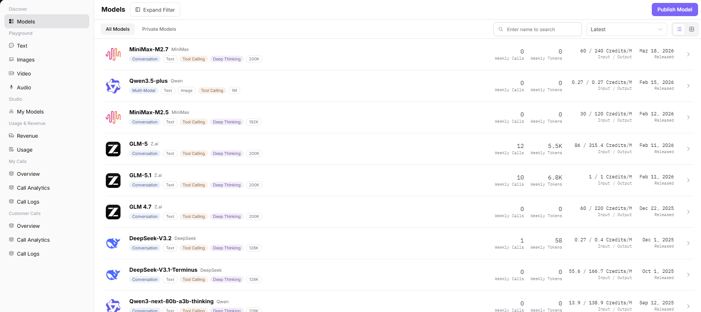
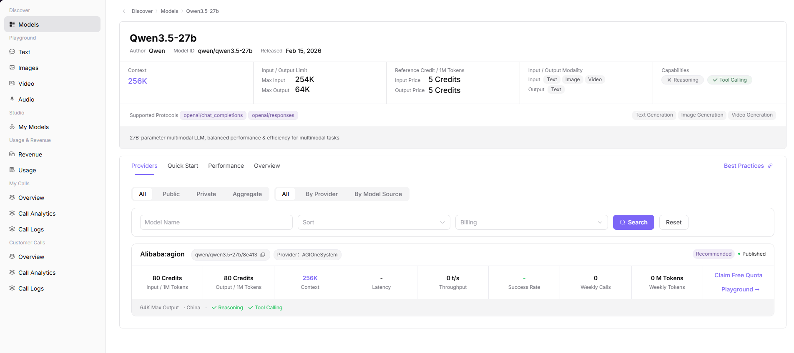
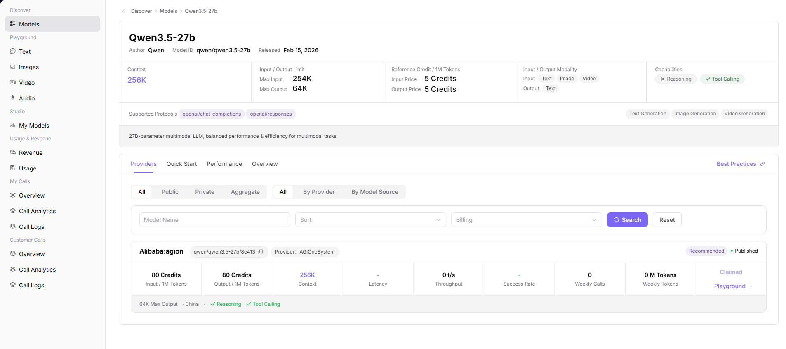
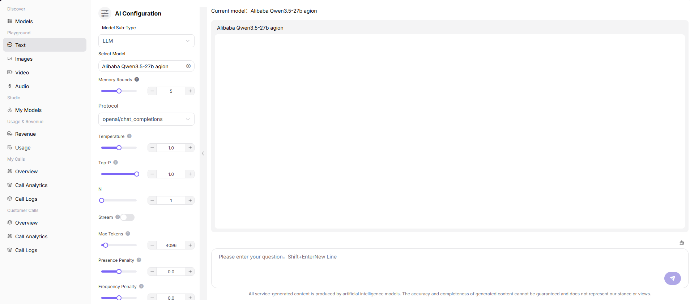
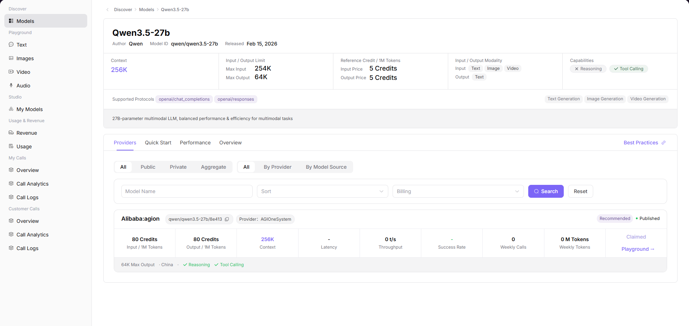

# AGIOne User Guide for Regular Users

This guide is written for first-time AGIOne users. It walks you through the full basic workflow: signing in, claiming free quota, trying a model in the web playground, and calling the model with curl. Usernames, passwords, and API keys are shown as placeholders only.


## 1. Before You Start

Prepare the following information before using AGIOne.

| Item         | Example or Description                        |
| ------------ | --------------------------------------------- |
| Platform URL | `https://agione.pro/`                    |
| Username     | `{USERNAME}`                                  |
| Password     | `{PASSWORD}`                                  |
| API Key      | `{API_KEY}`, copied from the Quick Start page |

This guide uses the following model.

| Item             | Value                                                          |
| ---------------- | -------------------------------------------------------------- |
| Model Name       | Qwen3.5-27b                                                    |
| Model Identifier | `qwen/qwen3.5-27b/8e413`                                       |
| Protocol         | `openai/chat_completions`                                      |
| API Endpoint     | `http://agione.pro/hyperone/xapi/api/v1/chat/completions` |

## 2. Sign In to AGIOne

### 2.1 Open the Sign-In Page

Enter the following address in your browser:

```text
http://agione.pro/user/login
```

You will see the AGIOne sign-in page.



### 2.2 Fill In the Sign-In Form

Fill in the form in the following order.

| Step | Action                                     | Value                         |
| ---- | ------------------------------------------ | ----------------------------- |
| 1    | Enter your username in `Username or email` | `{USERNAME}`                  |
| 2    | Enter your password in `Password`          | `{PASSWORD}`                  |
| 3    | Select the agreement checkbox              | Check it                      |
| 4    | Click `Sign In`                            | Wait for the platform to open |

If a privacy policy or service terms dialog appears, click `Agree`.

### 2.3 Confirm That Sign-In Succeeded

After signing in successfully, you should see a user avatar or initial in the upper-right corner. The left-side menu should show entries such as `Discover`, `Playground`, `Usage & Revenue`, and `My Calls`.

## 3. Open the Model List

### 3.1 Open Model Services

After signing in, open:

```text
http://agione.pro/modelone/store/model
```

You can also navigate through the page menu:

```text
Model Services > Discover > Models
```

### 3.2 Find Qwen3.5-27b

Find `Qwen3.5-27b` in the model list. It is usually near the lower part of the current list. After you find it, click `View` on the right side of the model row.



## 4. Claim Free Quota

The free quota entry is on the provider card in the model detail page, next to the `Playground` button.

### 4.1 Open the Model Detail Page

After opening the `Qwen3.5-27b` detail page, confirm that you can see the following information.

| Check Item | Expected Value |
| --- | --- |
| Model Name | `Qwen3.5-27b` |
| Model ID | `qwen/qwen3.5-27b` |
| Provider Card Call Identifier | `qwen/qwen3.5-27b/8e413` |
| Quota Button | `Claim Free Quota` |
| Trial Entry | `Playground` |



### 4.2 Click to Claim

On the provider card, click:

```text
Claim Free Quota
```

After the quota is claimed successfully, the page shows a success message and the button changes to:

```text
Claimed
```



### 4.3 Confirm That the Quota Was Claimed

Any of the following signs means the quota has been claimed successfully.

| Success Sign | Description |
| --- | --- |
| The page shows `Successfully claimed` | The platform has completed the claim |
| The button changes to `Claimed` | The current account has already claimed the free quota for this model |
| The model detail page still shows `Claimed` after reopening it | The claim status has been saved |

## 5. Try the Model in the Web Playground

The web playground is the easiest way to try a model. You do not need to write code.

### 5.1 Open Playground from the Detail Page

On the `Qwen3.5-27b` model detail page, click the following button on the provider card:

```text
Playground
```

You can also open it from the left-side menu:

```text
Playground > Text
```

If you open it from the left-side menu, select the target model manually. If you open it from the model detail page, the current model is usually preselected.



### 5.2 Send a Test Message

After entering the text playground page, follow these steps.

| Step | Action | Recommended Value |
| --- | --- | --- |
| 1 | Confirm `Model Sub-Type` | `LLM` |
| 2 | Confirm or select the model | The provider model for Qwen3.5-27b |
| 3 | Confirm `Protocol` | `openai/chat_completions` |
| 4 | Adjust parameters if needed | Beginners can keep the default values |
| 5 | Enter a question in the input box at the bottom | `Introduce AGIOne in one sentence.` |
| 6 | Click the send button | Wait for the model response |

If the generated response appears in the chat area, the playground call has succeeded.

## 6. Call the Model with curl

Use curl when you want to call the model from a command line, script, or backend service.

### 6.1 Open the Quick Start Page

Go back to the model detail page and click:

```text
Quick Start
```

On the Quick Start page, you can find the following information.

| Information | Purpose |
| --- | --- |
| Call Identifier | The value used in the `model` field |
| Full URL | The curl request URL |
| API Key | The authentication key |
| Curl Example | A ready-to-use reference command |

The API key in the screenshot is redacted. In actual use, copy your own API key from the page.



### 6.2 Copy the API Key

Find `API Key` in the `AUTHENTICATION` section, then click `Copy`.

Please note:

| Note | Description |
| --- | --- |
| Do not share your API key with others | The API key can be used to call models under your account |
| Do not commit it to public documents or code repositories | Store it as an environment variable when possible |
| This guide uses `{API_KEY}` | Replace it with your real key when calling the API |

### 6.3 curl Example

Replace `{API_KEY}` with the API key you copied, then run the command in your terminal.

```bash
curl -X POST "http://agione.pro/hyperone/xapi/api/v1/chat/completions" \
  -H "Content-Type: application/json" \
  -H "Authorization: Bearer {API_KEY}" \
  -d '{
    "stream": true,
    "model": "qwen/qwen3.5-27b/8e413",
    "messages": [
      {
        "role": "user",
        "content": "Hello"
      }
    ]
  }'
```

### 6.4 Confirm That the API Call Succeeded

When the call succeeds, your terminal returns generated model output. Common signs of success include:

| Check Item | Success Sign |
| --- | --- |
| Response content | The response includes generated text |
| Model field | The response includes `qwen/qwen3.5-27b/8e413` |
| No authentication error | No `Unauthorized` or `Invalid API key` error appears |
| No quota error | No insufficient quota message appears |

## 6.5 Quick Practice

Go to [AGIOne Best Practices](https://agione.pro/docs/best-practice/integration/OpenCode.html).

## 7. View Your Call Records

To confirm whether the model was actually called, check the call logs.

### 7.1 Open Call Logs

Open the following menu from the left side:

```text
My Calls > Call Logs
```

### 7.2 Filter Call Records

| Step | Action |
| --- | --- |
| 1 | Select the call time range |
| 2 | Enter the model name or model ID |
| 3 | Select the call status, such as success or failure |
| 4 | Click `Search` |
| 5 | Check the call time, model, status, token usage, and latency in the list |
| 6 | To view more information, click `Details` on the target row |

## 8. FAQ

### 8.1 What Should I Do If Sign-In Fails?

| Possible Cause                  | What to Do                            |
| ------------------------------- | ------------------------------------- |
| Incorrect username or password  | Confirm `{USERNAME}` and `{PASSWORD}` |
| Agreement checkbox not selected | Select the checkbox and sign in again |
| Agreement dialog not confirmed  | Click `Agree`                         |

### 8.2 What Should I Do If I Cannot Find Qwen3.5-27b?

| What to Do | Description |
| --- | --- |
| Search for `Qwen3.5-27b` in the model list | Use the search box to locate it quickly |
| Make sure you are viewing `All Models` | Avoid filtering to private models only |
| Change sorting or page through the list | The model may not be visible in the first screen |

### 8.3 What Should I Do If the Claim Button Cannot Be Clicked?

| Page Status | Description |
| --- | --- |
| The button shows `Claimed` | The current account has already claimed it |
| `Claim Free Quota` is missing | The model may not support free quota, or your account may not have permission |
| Nothing happens after clicking | Refresh the page and try again, or confirm that you are still signed in |

### 8.4 What Should I Do If the curl Call Fails?

| Error Symptom          | What to Check                                                                                     |
| ---------------------- | -------------------------------------------------------------------------------------------------- |
| Authentication failure | Check whether the API key is complete and whether the header is `Authorization: Bearer {API_KEY}` |
| Model not found        | Check whether `model` is `qwen/qwen3.5-27b/8e413`                                                 |
| Incorrect request URL  | Check whether the URL is `http://agione.pro/hyperone/xapi/api/v1/chat/completions`           |
| Invalid JSON           | Check quotation marks, commas, and braces                                                         |
| Insufficient quota     | Confirm that free quota has been claimed, or check your account quota                             |

## 9. Quick Reference

| Feature                 | Entry                                                      |
| ----------------------- | ---------------------------------------------------------- |
| Sign in                 | `http://agione.pro/user/login`                        |
| Model list              | `http://agione.pro/modelone/store/model`              |
| Qwen3.5-27b detail page | `Model Services > Discover > Models > Qwen3.5-27b > View`  |
| Claim free quota        | Qwen3.5-27b detail page provider card > `Claim Free Quota` |
| Web playground          | Qwen3.5-27b detail page provider card > `Playground`       |
| API instructions        | Qwen3.5-27b detail page > `Quick Start`                    |
| Call logs               | `My Calls > Call Logs`                                     |
