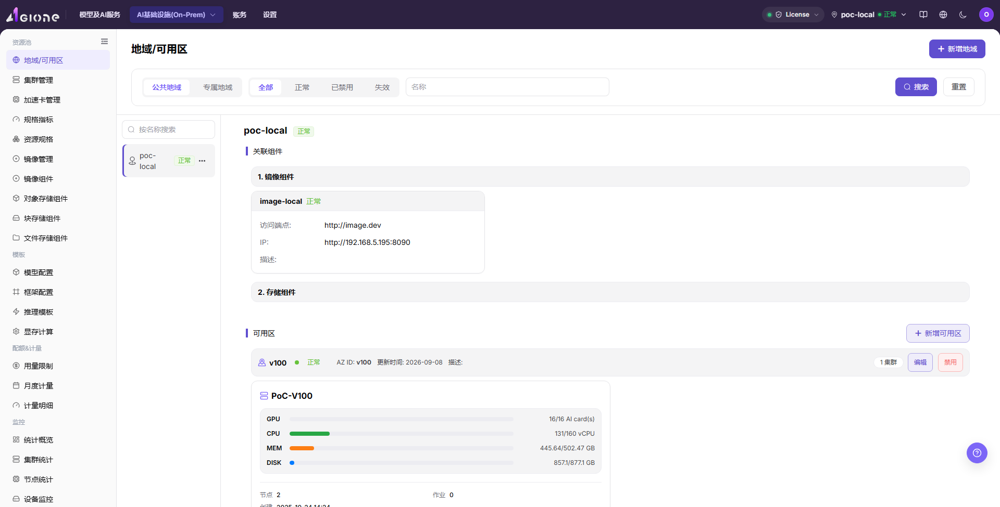
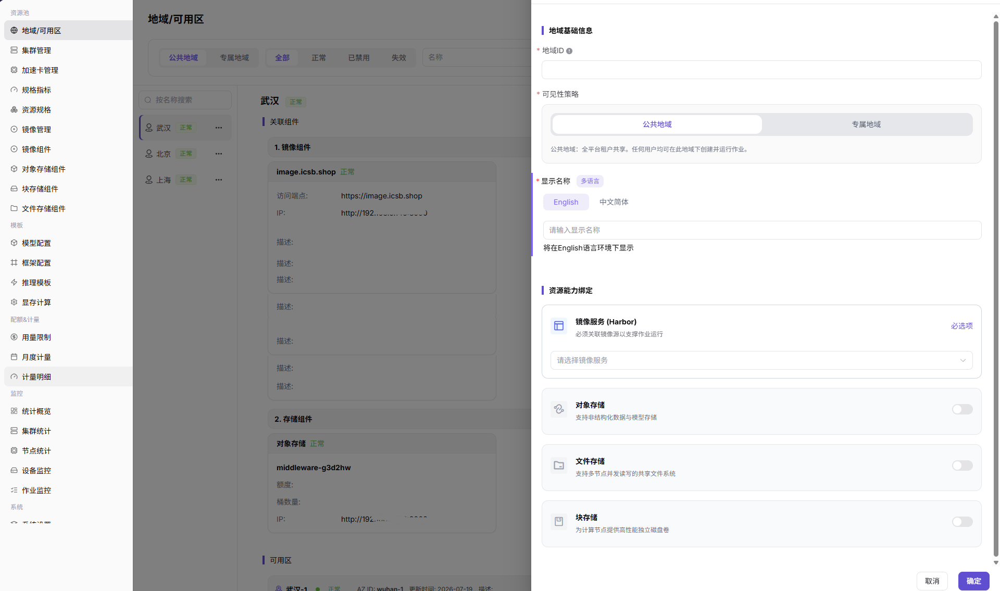
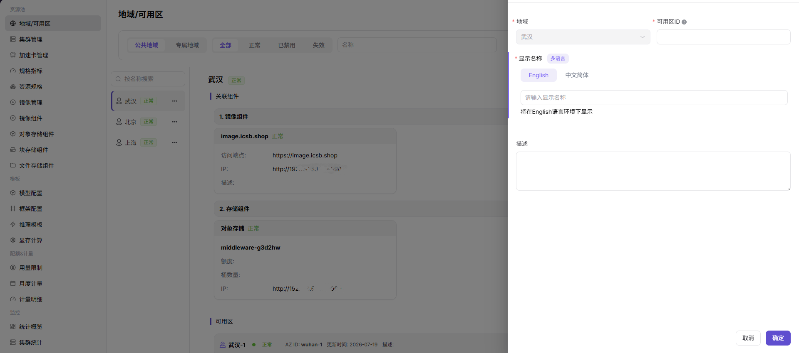

# 创建地域与可用区

## 场景目标

为待接入的本地集群建立地域和可用区，使集群、规格、镜像、存储及后续作业使用一致的资源边界。

## 适用角色

- 平台运营方

## 开始前准备

- 明确机房、园区或资源组与地域、可用区的对应关系。
- 准备不会与现有记录重复的中英文名称和唯一标识。
- 确认目标集群应归属的可用区，以及网络和存储边界。

## 功能入口

- **角色**：运营管理员
- **菜单**：AI基础设施 > On-Prem > 资源池 > 地域 / 可用区
- **页面路由**：`/powerone/resourcepool/region`

## 操作步骤

1. 进入地域 / 可用区页面，先核对现有地域、可用区及启用状态，避免重复创建。

2. 点击新增地域，填写地域名称、唯一标识和展示名称，确认状态为可用于后续资源接入。

3. 在目标地域下新增可用区，填写可用区名称和唯一标识，并确认地域归属正确。

4. 返回列表，确认地域和可用区均可见、状态正常，并记录后续集群注册时应选择的可用区。

5. 如果需要暂时停止地域接收新的资源使用，打开地域行的 `...` 菜单并选择 **Disable**。如果列表中看不到目标地域，先按 `Disabled` 状态筛选。
6. 需要恢复使用时，在已禁用地域的 `...` 菜单中选择 **Enable**。如果只需要恢复单个可用区，在可用区区域执行相同操作。
7. 刷新列表并确认状态已经变化，再继续注册集群或调度作业。禁用不会删除已有资源，但可能限制新的注册、创建或调度。

## 完成检查

> **用途：** 以下检查用于确认资源边界已经可供集群接入使用。任一项不满足时，不应继续注册集群。

| 检查项 | 通过标准 |
| --- | --- |
| 地域 | 目标地域名称、唯一标识和状态正确。 |
| 可用区 | 可用区位于正确地域下，名称和唯一标识不重复。 |
| 下游选择 | 注册集群时能够选择目标地域和可用区。 |

## 常见失败分支

| 现象 | 优先检查 |
| --- | --- |
| 无法新增地域或可用区 | 账号权限、必填字段、唯一标识和重复记录 |
| 集群注册时选不到可用区 | 地域和可用区状态、归属关系及当前租户范围 |
| 资源出现在错误区域 | 集群、规格、镜像和存储选择的地域边界是否一致 |
| 看不到 Enable 入口 | 按 `Disabled` 状态筛选，核对当前对象状态、运营管理员权限、父级地域状态并刷新页面 |
| 禁用后的地域或可用区无法启用 | 检查父级地域状态、下游集群或作业依赖，以及当前账号是否具备对应资源范围的操作权限 |

## 操作手册

[查看地域与可用区的完整字段和维护说明](/zh-CN/usermanual/ai-infra-on-prem/operator/resource-pools/regions-zones/)
