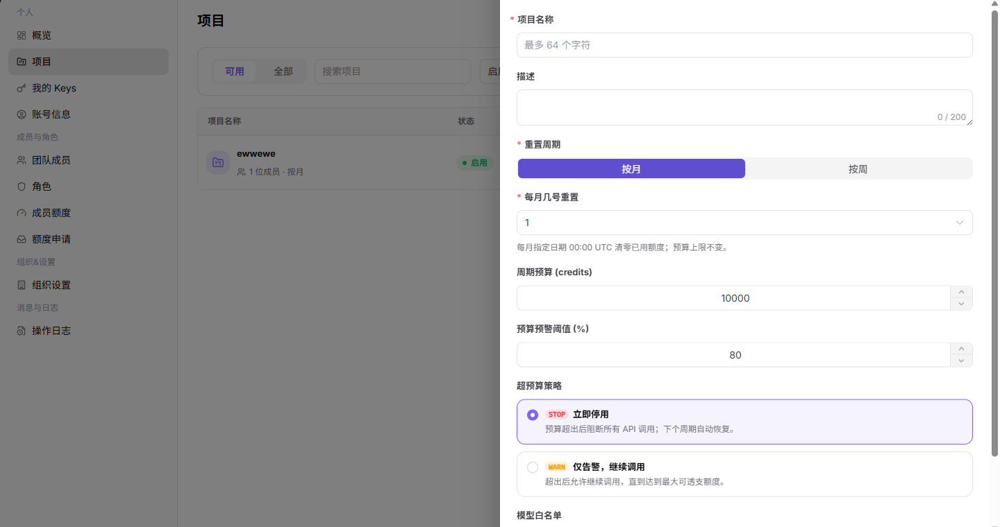
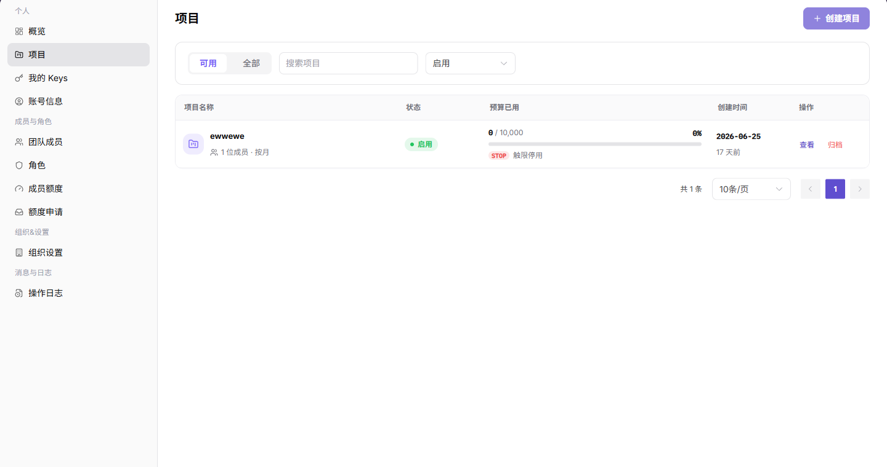
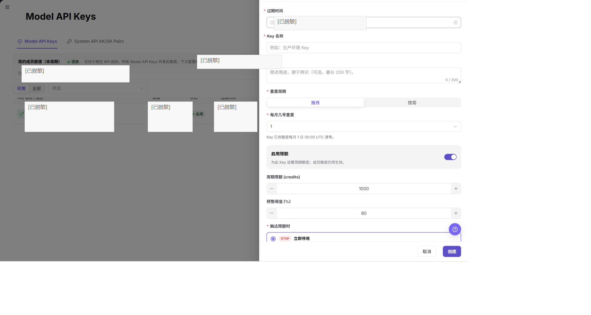

# 项目、Key 与预算配置

本任务用于建立一个具备预算、模型范围和独立调用凭据的项目。

## 适用角色

- 模型提供方、平台用户、服务商管理员

## 开始前准备

- 确认在目标租户内具备项目和 Key 创建权限。
- 明确项目负责人、成员、预算周期、模型范围和超预算策略。
- 确认使用 Model API Key 还是 System API AK/SK。

## 操作流程

### 1. 创建项目

进入[项目](../../../usermanual/settings/user/personal/projects/)，点击创建项目，填写名称、描述、重置周期、周期预算、预警阈值、超预算策略和模型白名单。

### 2. 核对项目详情

在项目列表中进入详情，检查概览、成员、用量、API Keys、活动和设置页签，确认项目状态和预算规则已保存。

### 3. 创建独立用途的 Key

从可见菜单进入[我的 Keys](../../../usermanual/settings/user/personal/my-keys/)，选择 `Model API Keys` 或 `System API AK/SK Pairs`。两种创建窗口都有 `Key 名称`、可选的 `描述` 和 `过期时间`；只有 Model API 创建窗口包含重置周期和限额配置。用途写入描述，不把“用途”当成独立字段。生产、测试和临时用途应使用不同 Key。

### 4. 设置 Key 限额并验证

对 Model API Key，打开行内更多菜单并选择 `限额`，查看 `重置周期`、条件显示的重置日期和 `启用限额`；启用时，再按项目预算核对 `周期限额 (credits)` 和 `预警阈值 (%)`。未获得明确修改授权时停在 `取消`，不要单击 `保存限额`。完成获准的保存后，再使用受控请求验证模型白名单、项目预算和 Key 限额是否共同生效。

## 完成检查

> **用途：** 以下检查用于确认项目和凭据已经可以受控使用。任一项不满足时，不应把 Key 分发给业务调用方。

| 检查项 | 通过标准 |
| --- | --- |
| 项目规则 | 预算、预警、超预算策略和模型白名单已保存。 |
| Key 边界 | Key 名称、描述、有效期和适用限额清晰；责任人在项目或成员范围中核对。 |
| 调用验证 | 允许模型可调用，禁止模型或超限请求按规则受限。 |
| 审计记录 | 项目和 Key 变更能够在活动或操作日志中定位。 |

## 常见失败分支

| 现象 | 优先检查 |
| --- | --- |
| 项目达到预算后不能调用 | 预算已用、超预算策略和重置周期 |
| Key 调用失败 | Key 状态、过期时间、项目预算、成员额度和模型白名单 |
| 看不到项目或 Key | 账号角色、租户归属和菜单权限 |
| 轮换 Key 后业务失败 | 调用方配置是否已替换、旧 Key 是否过早停用 |
