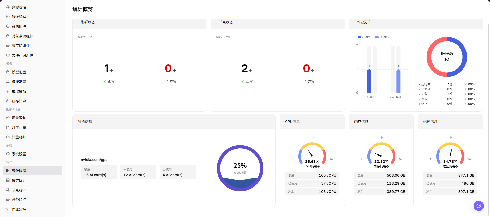

# 统计概览

## 功能概述

| 项目 | 内容 |
| --- | --- |
| 适用角色 | 运营管理员 |
| 导航路径 | AI基础设施 > On-Prem > 监控 > 统计概览 |
| 页面路由 | `/powerone/monitor/overview` |
| 管理对象 | 资源池总览、集群数量、节点状态、作业分布和资源容量 |

#### 新手理解

统计概览像资源池驾驶舱，先看整体水位、异常数量和更新时间，再决定下钻到集群、节点、设备或作业页面继续排查。

#### 术语表

| 术语 | 英文 | 说明 |
| --- | --- | --- |
| 全局水位 | Global Watermark | Global Watermark |
| 异常聚合 | Exception Aggregation | Exception Aggregation |
| 趋势入口 | Trend Entrypoint | Trend Entrypoint |

#### 推荐操作顺序

先确定监控范围并确认数据新鲜度，再读取整体状态和资源水位；发现异常后，保持相同范围进入对应对象页面下钻。

#### 小白先看

这是监控判读与导航页面，不是资源配置页面。页面用于判断问题方向，最终原因需要到集群、节点、设备或作业页面核实。

## 前提条件

1. 当前账号具备运营管理员监控查看权限。
2. 目标地域、可用区和集群已完成资源接入。
3. 监控采集组件正常上报集群、节点、设备和作业数据。
4. 需要排障时，已明确时间范围和受影响资源类型。

## 页面说明

页面用于了解当前 On-Prem 资源状态，并判断下一步应进入哪个对象页面继续排查。

统计概览集中展示全局资源水位、异常聚合和趋势入口。建议按以下顺序阅读页面：

| 页面区域 | 需要确认的内容 |
| --- | --- |
| 范围与筛选 | 统计使用的时间范围、地域、资源池、集群或资源类型。 |
| 汇总卡片 | 当前范围内的总量、已使用量、剩余量、在线数量和异常数量。 |
| 趋势与分布 | 利用率或作业状态是持续变化，还是仅出现瞬时波动。 |
| 更新时间 | 当前数据是否仍在预期采集周期内。 |
| 下钻入口 | 保持相同范围后，应进入集群、节点、设备还是作业页面。 |

## 主要操作

### 确认范围与数据新鲜度

1. 进入 `AI基础设施 > On-Prem > 监控 > 统计概览`。
2. 选择页面提供的时间范围、地域、资源池、集群或资源类型。
3. 在比较指标前，核对更新时间和对象数量。
4. 页面无数据时，扩大时间范围并逐项清除筛选条件。

### 阅读总览并识别异常

1. 查看资源总量、已使用量、剩余量，以及集群、节点、设备和作业的在线或异常状态。
2. 在相同统计范围内对照汇总卡片、分布和趋势。
3. 重点关注高水位、异常状态、长时间未更新，以及失败、排队或长时间运行作业是否增多。
4. 判断异常是瞬时峰值、单个对象、单个集群，还是全局趋势。

### 保持相同范围下钻

1. 页面提供入口时，点击异常指标、趋势点或目标对象的 **"详情"**。
2. 保持相同时间范围、地域和目标对象，进入集群统计、节点统计、设备监控或作业监控。
3. 交叉核对利用率、状态、告警和关联对象后，再判断异常原因。
4. 不要仅为复现监控异常而启动、停止、迁移或删除资源。
5. 对外分享证据前，遮挡内部资源名称和指标。

## 参数速查表

| 字段名称 | 是否必填 | 字段类型 | 示例 | 说明 |
| --- | --- | --- | --- | --- |
| 资源池 | 系统生成 | 汇总对象 | `资源池` | 展示当前运营范围内资源池整体运行和容量情况。 |
| 集群 | 系统生成 | 汇总对象 | `集群` | 展示纳入监控统计的集群数量、状态和异常情况。 |
| 节点 | 系统生成 | 汇总对象 | `节点` | 展示节点在线状态、异常状态和资源水位。 |
| 设备 | 系统生成 | 汇总对象 | `设备` | 展示 GPU 等设备资源的运行状态和可用情况。 |
| 作业 | 系统生成 | 汇总对象 | `作业` | 展示作业数量、运行状态和异常分布。 |
| 资源总量 | 系统生成 | 数字 | `总量` | 展示当前筛选范围内资源的总体容量。 |
| 已使用量 | 系统生成 | 数字 | `已使用` | 展示当前筛选范围内已被占用的资源量。 |
| 剩余量 | 系统生成 | 数字 | `剩余` | 展示当前筛选范围内仍可调度或使用的资源量。 |
| 异常状态 | 系统生成 | 状态 | `异常` | 展示集群、节点、设备或作业的异常聚合状态。 |
| 时间范围 | 必填 | 日期范围 | `近 1 小时` | 控制总览卡片、趋势图和异常统计的查询窗口。 |
| 地域 | 条件必填 | 下拉选择 | `华中一区` | 限定统计概览覆盖的资源范围。 |
| 集群数量 | 系统生成 | 数字 | `12` | 展示当前地域纳入监控统计的集群总数。 |
| 异常数量 | 系统生成 | 数字 | `3` | 汇总集群、节点、设备或作业中的异常对象数量。 |
| 更新时间 | 系统生成 | 日期时间 | `2026-07-06 10:00` | 判断总览数据是否存在采集延迟。 |

## 踩坑提示

- 总览只能帮助定位方向，不能替代具体对象详情。
- 水位升高要结合新增作业、扩容和排队情况判断。
- 统计概览用于观察全局水位，不应单独作为扩容、迁移或故障判断的唯一依据。
- 指标可能存在采集延迟，异常排查需结合集群、节点、设备和作业详情。
- 截图前遮挡租户、节点名和业务标识。
- 不在文档中写真实集群 ID、节点名、资源池 ID、租户信息、内部指标 key 或测试数据。

### 判读规则与影响

- **总览用于先判方向**：先确认异常是否集中在某个地域、集群或资源类型，再进入下钻页面。
- **异常数量要结合时间范围**：时间窗口越长，历史异常越容易被纳入统计，排障时应固定时间范围。
- **更新时间决定可信度**：更新时间明显滞后时，先核对采集链路，再判断资源有无真实异常。
- **水位变化要看趋势**：瞬时高水位不一定是故障，应结合新增作业、扩容、维护窗口和历史趋势判断。

## 结果校验

| 检查项 | 成功表现 | 异常时处理 |
| --- | --- | --- |
| 页面加载 | 统计概览图表或列表正常显示 | 检查当前角色的监控权限和所选地域是否开放采集能力 |
| 统计范围 | 时间范围、地域和对象数量与排查目标一致 | 清除筛选后逐项恢复条件，确认没有混用不同统计口径 |
| 数据新鲜度 | 更新时间落在预期采集周期内 | 到系统设置或监控采集组件核对采集周期、连接和告警 |
| 异常关联 | 异常指标能关联到集群、节点、设备或作业 | 保持相同时间范围，到相邻监控页和对象详情交叉核对 |

## 常见问题

#### 统计概览没有数据

**问题现象：**

页面可进入，但图表或列表为空。

**可能原因：**

- 所选时间没有任务。
- 地域未开放采集。
- 当前角色无指标权限。

**处理方式：**

1. 扩大时间范围并重置筛选
2. 核对地域监控能力
3. 到相邻监控页确认是否同样无数据。

#### 统计概览更新不及时

**问题现象：**

页面数据长时间没有变化。

**可能原因：**

- 采集周期尚未到。
- 采集组件异常。
- 页面缓存未刷新。

**处理方式：**

1. 核对更新时间
2. 检查采集组件和告警
3. 刷新后用同一时间范围复查。

#### 统计概览与相邻页面数值不一致

**问题现象：**

同一对象在两个监控页面显示不同数值。

**可能原因：**

- 聚合粒度不同。
- 时间范围或时区不同。
- 筛选对象不同。

**处理方式：**

1. 统一时间范围和时区
2. 核对聚合口径
3. 清除筛选后逐项恢复。

#### 无法下钻到目标对象

**问题现象：**

点击指标或详情入口后找不到对应对象。

**可能原因：**

- 对象已结束或被移除。
- 角色不可见。
- 关联标识不一致。

**处理方式：**

1. 记录对象名称和时间
2. 到对应列表核对状态
3. 联系运营管理员检查可见范围。

#### 异常峰值无法复现

**问题现象：**

监控中出现峰值，但当前详情已恢复正常。

**可能原因：**

- 峰值持续时间短。
- 采样粒度较粗。
- 任务已经结束。

**处理方式：**

1. 锁定峰值时间段
2. 对照作业和节点事件
3. 保留脱敏截图和对象标识。

## 注意事项

- 总览用于发现方向，不作为事故定责唯一依据。
- 截图前遮挡租户、节点、IP 和业务标识。
- 水位异常需要结合历史趋势、业务窗口和作业变化判断。
- 扩容、迁移或故障处理前，需要结合集群统计、节点统计、设备监控和作业监控交叉确认。
- 文档示例不得包含真实集群 ID、节点名、资源池 ID、租户信息、内部指标 key 或测试数据。

## 后续操作

1. 异常集中在集群时进入集群统计。
2. 异常集中在节点或设备时进入对应监控页。
3. 作业失败或排队升高时进入作业监控并结合配额排查。
