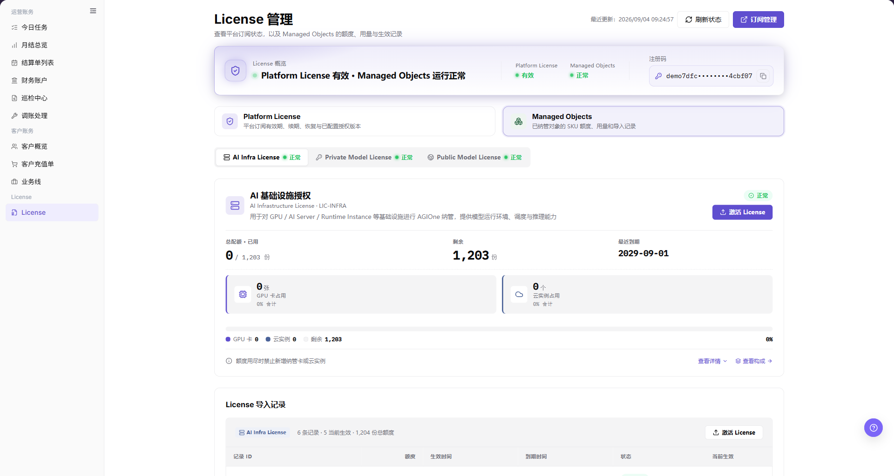
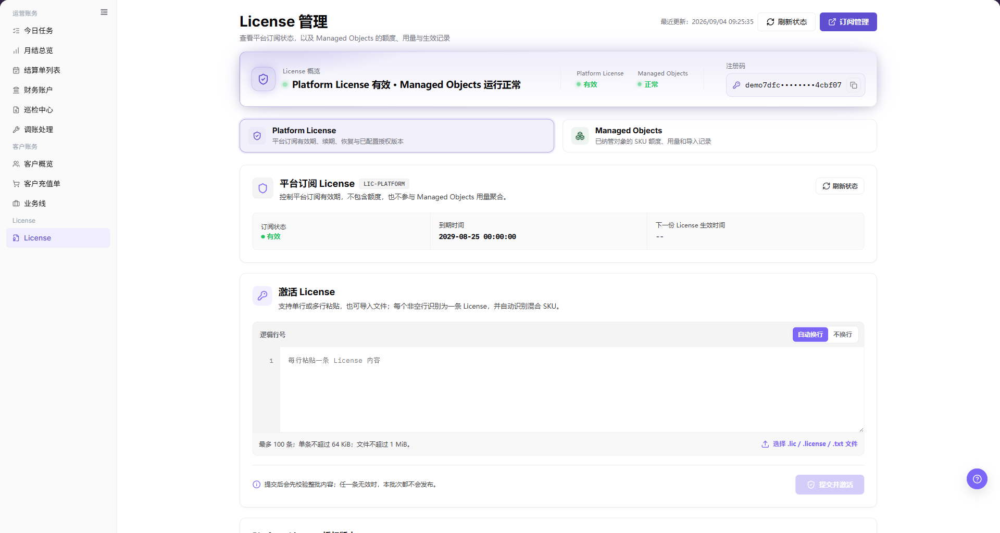
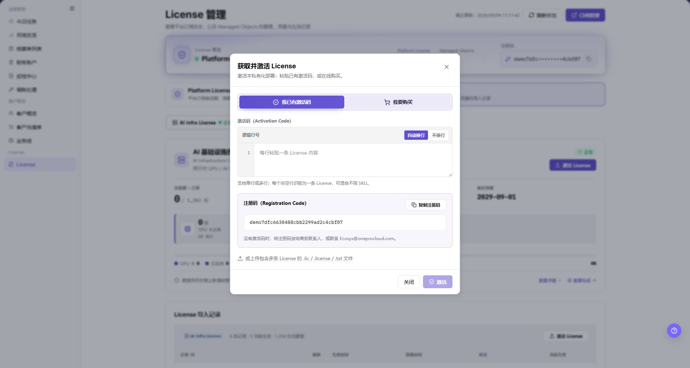

# License

::: info 文档信息
版本：v1.1
更新日期：2026-09-03
:::

## 功能概述

| 项目 | 内容 |
| --- | --- |
| 适用角色 | 运营管理员 |
| 导航路径 | 账务 > License > License |
| Managed Objects 路由 | `/user/usercenter/license/managed-objects` |
| Platform License 路由 | `/user/usercenter/license/platform-license` |
| 管理范围 | 平台订阅状态与授权版本；Managed Objects 额度、用量、有效期、激活和导入记录 |

`License 管理` 分为 `Platform License` 和 `Managed Objects` 两个独立区域。Platform License 管理平台订阅期限和授权版本；Managed Objects 管理 AI 基础设施、私有模型和公共模型的 License 授权，包括额度、有效期、注册码、激活和导入记录。

#### 新手理解

可以把 Platform License 理解为平台级订阅，把 Managed Objects 理解为 AGIOne 纳管对象的授权。先看顶部总览状态，再进入对应区域。粘贴或提交 License 前，必须确认目标环境、注册码、License 来源和授权范围。

#### 术语速查

| 术语 | 含义 |
| --- | --- |
| Platform License | 平台订阅期限、续期、恢复和已配置授权版本。 |
| Managed Objects | AGIOne 纳管对象按 SKU 计算的额度、用量、有效期和导入记录。 |
| 注册码 | 当前部署生成的识别码，用于获取与该部署匹配的 License。 |
| 激活码 / License 内容 | 每个非空逻辑行粘贴一条，或从支持的文件中导入的授权内容。 |
| 逻辑行 | 编辑器按非空行识别 License，每个非空行视为一条 License。 |
| 整批校验 | 系统预校验整批内容；任意一条无效时，整批均不发布。 |

## 前提条件

1. 当前账号可以进入 `账务 > License > License`。
2. 当前页面属于目标环境和目标部署。
3. 激活前已获得内部审批，并确认 License 来源可信。
4. 浏览器会话有效。

::: warning 安全与操作边界
完整注册码、激活码和 License 内容属于敏感凭据。截图只对凭据值本身应用像素马赛克，字段名称、控件、状态、额度、日期、记录 ID 和其他 Demo 业务数据保持可读。系统已经用圆点缩略显示的注册码不需要再次打码。打开页面、页签和激活弹窗属于只读核查；**“提交并激活”** 和 **“激活”** 会改变当前部署状态，必须另行确认后执行。
:::

## 页面说明

页面顶部同时显示 Platform License、Managed Objects 的总览状态和当前部署注册码。总览下方的两个大卡片用于切换 Platform License 与 Managed Objects 区域。

上图展示 Managed Objects 区域。重点核对当前选中卡片、License 分类、额度状态、有效期和导入记录区域。

## 主要操作

### 核对总览状态并选择区域

1. 进入 `账务 > License > License`。
2. 在顶部总览中核对 Platform License 和 Managed Objects 状态。
3. 确认注册码属于目标部署，不要将其复制到公开材料。
4. 点击 `Platform License` 查看平台订阅，或点击 `Managed Objects` 查看 SKU 授权。
5. 状态可能过期时先点击 **“刷新状态”**，不要通过重复提交 License 强制刷新。

### 查看 Platform License

1. 点击 `Platform License` 卡片。
2. 核对订阅状态、到期信息和已配置授权版本。
3. 在 `激活 License` 编辑器中，每个非空逻辑行粘贴一条 License，或选择 `.lic`、`.license`、`.txt` 文件。
4. 普通阅读使用 `自动换行`，核对原始行结构时使用 `不换行`。
5. 遵守编辑器限制：最多 100 条、单条最多 64 KiB、导入文件最多 1 MiB。
6. 同一批次可混合不同 SKU。页面会预校验整批内容；任意一条无效时，整批均不发布。
7. 只读核查应停在 **“提交并激活”** 前。

上图展示 Platform License 状态、批量编辑器、换行控制、文件导入入口、数量与大小限制，以及整批校验提示。

### 查看 Managed Objects

1. 点击 `Managed Objects` 卡片。
2. 选择 `AI Infra License`、`Private Model License` 或 `Public Model License`。
3. 核对状态、总额度与已用额度、剩余额度、最近到期时间和容量条。
4. 页面提供入口时，通过 `查看详情` 核对授权范围，通过 `查看构成` 核对额度来源。
5. 在 `License 导入记录` 中核对记录 ID、额度、生效时间、到期时间、状态和当前生效标记。
6. 记录 ID、额度、日期和状态用于说明页面时应保持可读；只保护完整 License、注册码、激活码、Key、Secret 或 Token 值。

### 打开 Managed Objects 激活窗口

1. 在目标 Managed Objects 分类中点击 **“激活 License”**。
2. 在 `获取并激活 License` 中选择 `我已有激活码`；`我要购买` 属于购买入口，不在只读核查范围内。
3. 在逻辑行编辑器中粘贴一条或多条 License。每个非空行识别为一条 License，可混合不同 SKU。
4. 也可以导入包含多条 License 的 `.lic`、`.license` 或 `.txt` 文件。
5. 核对页面显示的注册码属于目标部署。
6. 使用 `自动换行` 或 `不换行` 检查输入，并停在最终 **“激活”** 动作前。

上图展示 Managed Objects 激活窗口。完整注册码值已使用值级像素马赛克保护；字段名称、输入框边界、操作控件、说明文字和普通 Demo 数据保持可见。只读核查过程中没有输入 License 内容。

## 参数速查表

| 字段或控件 | 是否必填 | 类型 | 说明 |
| --- | --- | --- | --- |
| Platform License | 否 | 区域选择 | 进入平台订阅状态、授权版本和批量激活区域。 |
| Managed Objects | 否 | 区域选择 | 进入 SKU 额度、用量、有效期、激活和导入记录区域。 |
| 注册码 | 系统生成 | 敏感文本 | 标识当前部署，必须与 License 来源匹配。 |
| 逻辑行 | 粘贴时必填 | 多行编辑器 | 每个非空行按一条 License 内容处理。 |
| 自动换行 / 不换行 | 否 | 显示控制 | 仅改变编辑器显示，不改变 License 内容。 |
| License 文件 | 否 | 文件导入 | 支持 `.lic`、`.license`、`.txt`，单文件最大 1 MiB。 |
| 批次限制 | 系统限制 | 数量与大小 | 最多 100 条，每条最大 64 KiB。 |
| 提交并激活 | 最终动作 | 按钮 | 发布通过校验的 Platform License 批次并改变部署状态。 |
| 激活 | 最终动作 | 按钮 | 激活 Managed Objects License 并改变部署状态。 |

## 踩坑提示

- Platform License 与 Managed Objects 是不同授权维度，一个区域正常不能证明另一个区域正常。
- 注册码和 License 内容属于部署级敏感凭据。未经 License 支持人员明确确认，不要跨环境复用。
- `自动换行` 和 `不换行` 只改变显示，不会合并或拆分 License。
- 空行会被忽略，但每个非空逻辑行都按一条 License 处理。不要给原始内容增加空格或错误换行。
- 批量激活采用整批预校验：一条无效会阻止整批发布。
- 授权额度不等于账务余额；余额或结算问题需要到对应账务页面核对。
- `订阅管理`、`我要购买`、`提交并激活` 和 `激活` 可能进入购买或改变状态，不在只读核查中执行。

## 结果校验

| 检查项 | 成功表现 | 异常时处理 |
| --- | --- | --- |
| 页面可进入 | `License 管理` 正常打开，左侧 `License > License` 菜单高亮。 | 确认角色权限和页面加载状态。 |
| 两个区域可见 | 页面可见 `Platform License` 和 `Managed Objects` 卡片。 | 刷新页面并确认当前部署已加载。 |
| Platform License 状态可见 | 订阅状态、到期信息和授权版本正常显示。 | 点击 **“刷新状态”**，记录可见状态和错误信息；仅移除其中包含的凭据值。 |
| Managed Objects 状态可见 | License 分类、额度、有效期和导入记录正常显示。 | 切换分类并核对 License 状态和到期时间。 |
| 批量规则可见 | 编辑器、换行控件、支持的文件类型、大小限制和整批校验提示均可见。 | 确认已选择 Platform License 区域并重新加载页面。 |
| 激活窗口可打开 | 注册码、逻辑行编辑器、文件导入和最终动作可见。 | 确认 Managed Objects 权限和目标分类状态。 |

## 常见问题

#### Platform License 有效但 Managed Objects 不可用

平台订阅与 Managed Objects 授权相互独立。进入 `Managed Objects`，核对目标 License 分类、额度、有效期和导入记录，并向管理员提供不包含完整凭据值的可见状态信息。

#### License 批次无法提交

确认批次不超过 100 个非空条目、每条不超过 64 KiB、导入文件不超过 1 MiB，并且所有条目均有效。整批校验采用原子规则，一条无效会阻止整批发布。

#### 激活状态没有刷新

先点击 **“刷新状态”**，再检查对应导入记录。在确认当前部署、注册码和上次结果前，不要重复提交同一 License。

## 注意事项

- Demo 核查已打开 Platform License 区域和 Managed Objects 激活窗口，但未执行 `提交并激活` 或 `激活`。
- 当前页面没有已确认的删除流程，不要在文档中编造删除操作。
- 提交 License 问题时，可以提供页面路由、状态和错误信息，但必须移除完整注册码、激活码、License、Key、Secret 或 Token 值。

## 后续操作

1. Platform License 异常时，联系平台管理员核对订阅期限和授权版本。
2. Managed Objects 异常时，核对目标 SKU、额度、有效期和导入记录。
3. 只有在环境、部署、注册码、License 来源和审批全部确认后才能执行激活。
