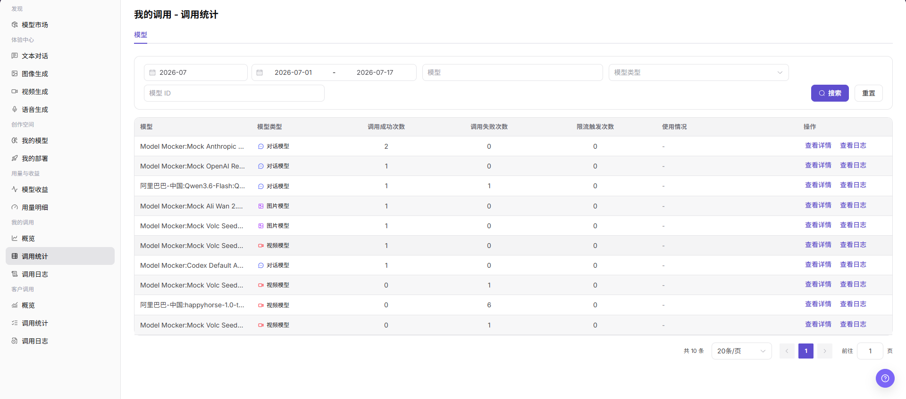
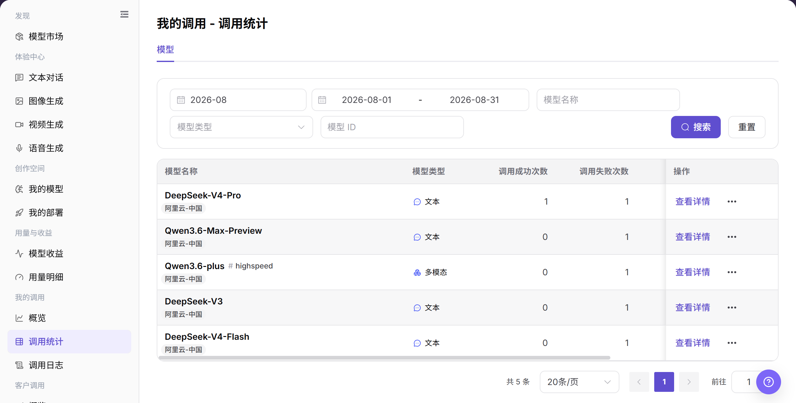
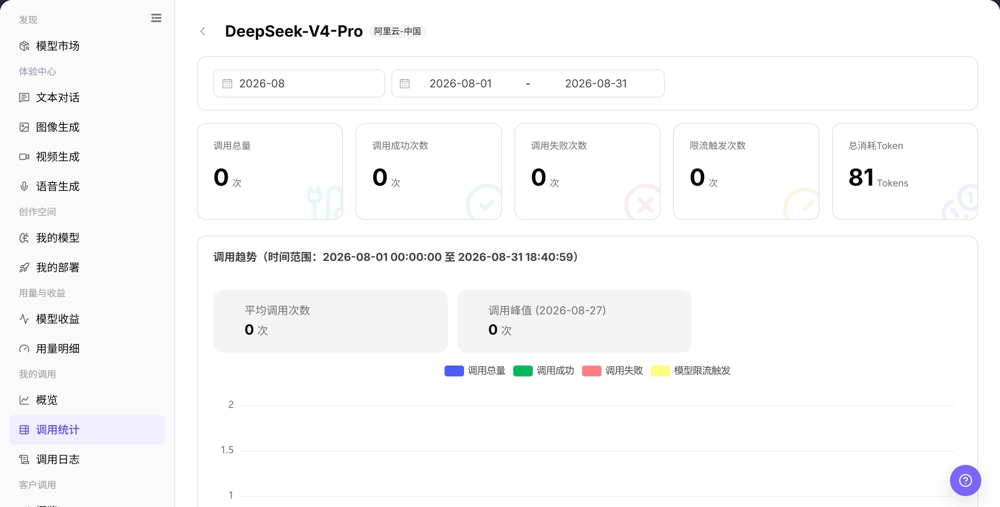

# 调用统计

## 功能概述

| 项目 | 内容 |
| --- | --- |
| 适用角色 | 模型提供方、模型调用方 |
| 导航路径 | 模型及AI服务 > 我的调用 > 调用统计 |
| 页面路由 | `/modelone/monitoring/calls/list/model` |
| 管理对象 | 模型调用成功次数、失败次数、限流次数、用量和统计详情 |

#### 新手理解

调用统计像按模型汇总的成绩单。列表先告诉你每个模型成功、失败、限流和用量情况，详情再帮助判断异常发生在哪个时间段。

#### 术语表

| 术语 | 英文 | 说明 |
| --- | --- | --- |
| 调用成功次数 | Successful Calls | 当前范围内成功完成的调用次数。 |
| 调用失败次数 | Failed Calls | 当前范围内未成功完成的调用次数。 |
| 限流触发次数 | Rate Limit Triggers | 调用命中限流策略的次数。 |
| 使用情况 | Usage | 页面汇总的 Token、次数或其他消耗信息。 |

#### 推荐操作顺序

先按模型名称、模型 ID 或类型查询，再比较成功、失败、限流和用量，最后打开异常模型的统计详情。

#### 小白先看

| 场景 | 先做 | 不要直接做 |
| --- | --- | --- |
| 不知道查哪个模型 | 先按名称或 ID 查询 | 同时填写冲突条件 |
| 失败次数升高 | 打开统计详情 | 只看列表总数 |
| 限流次数升高 | 核对时间范围和限流策略 | 直接扩大调用量 |
| 列表无数据 | 重置条件并扩大周期 | 连续重复搜索 |

## 前提条件

1. 当前账号具备 `调用统计` 页面访问权限。
2. 当前账号在统计周期内存在调用记录，或已确认需要查看的账期和日期范围。
3. 查看或截图前确认模型名、Key 名称、费用、业务应用和调用量是否需要脱敏。

::: warning 敏感信息边界
调用统计可能包含费用、调用量、Key 名称、业务应用、模型名称和异常调用。查看或共享数据时，应按权限脱敏账号、Key、请求内容、费用和业务标识。
:::

## 页面说明

页面以模型列表展示成功次数、失败次数、限流触发次数和使用情况。通过详情入口可以继续查看目标模型的统计信息。

页面截图：

关注查询条件、模型统计列和详情入口。

## 主要操作

### 查看模型调用统计

1. 进入 `模型及AI服务 > 我的调用 > 调用统计`。
2. 输入模型名称或模型 ID，按需选择模型类型。
3. 点击 **"搜索"**，核对成功、失败、限流和使用情况；条件错误时点击 **"重置"**。

上图展示模型调用统计列表。重点比较成功、失败、限流和用量。

### 查看模型统计详情

1. 在目标模型的操作列点击详情入口。
2. 核对模型名称、时间范围和汇总指标。
3. 比较趋势与列表结果；需要单次请求信息时进入调用日志。

上图展示统计详情。重点核对模型、时间范围和指标口径。

## 参数速查表

| 字段名称 | 是否必填 | 字段类型 | 示例 | 说明 |
| --- | --- | --- | --- | --- |
| 时间范围 | 是 | 月份 / 日期范围 | `2026-07` | 控制调用统计的统计周期。 |
| 模型 | 否 | 输入框 / 选择项 | 按页面输入 | 按模型名称筛选统计结果。 |
| 应用 | 否 | 选择项 | 按页面展示 | 如页面提供应用维度，可按业务应用筛选调用统计。 |
| Key | 否 | 选择项 | 按页面展示 | 如页面提供 Key 维度，可按 Key 查看调用来源。 |
| 调用次数 | 系统生成 | 数值 | `2` | 当前筛选范围内的模型调用次数，可由成功、失败等统计项组成。 |
| Token 消耗 | 系统生成 | 数值 | 按页面展示 | 如页面展示 Token 维度，用于查看模型消耗情况。 |
| 费用 | 系统生成 | 数值 | 按页面单位展示 | 如页面展示费用维度，分享前需要脱敏。 |
| 成功率 | 系统生成 | 百分比 / 统计值 | 按页面计算 | 可由调用成功次数与总调用次数计算。 |
| 失败率 | 系统生成 | 百分比 / 统计值 | 按页面计算 | 可由调用失败次数与总调用次数计算。 |
| 平均延迟 | 系统生成 | 数值 | 按页面展示 | 如页面展示延迟维度，用于衡量调用响应速度。 |
| 状态 | 系统生成 | 标签 / 统计项 | `成功` / `失败` / `限流` | 用于区分调用成功、失败或限流触发情况。 |

## 踩坑提示

- 调用统计按时间聚合，短时间内和实时日志可能不完全一致。
- 对比不同模型时，需要统一时间范围、调用方式和模型版本。
- 延迟升高不一定是模型异常，也可能来自网络、队列、输入长度或限流策略。

## 结果校验

| 检查项 | 成功表现 | 异常时处理 |
| --- | --- | --- |
| 页面可进入 | `我的调用 - 调用统计` 页面正常打开，左侧 `我的调用 > 调用统计` 菜单高亮。 | 确认账号权限、导航路径和页面加载状态。 |
| 统计指标正常展示 | 模型、模型类型、调用成功次数、调用失败次数、限流触发次数和操作入口正常显示。 | 扩大时间范围或确认当前账号是否有调用记录。 |
| 图表或统计表正常加载 | 调用统计表正常加载并展示模型维度数据。 | 刷新页面，或切换账期、日期范围后重试。 |
| 筛选项可用 | 账期、日期范围、模型、模型类型、模型 ID 等筛选项可输入或选择。 | 点击 `重置` 后重新输入筛选条件。 |
| 搜索 / 重置可用 | 点击 `搜索` 后列表刷新，点击 `重置` 后筛选条件清空。 | 检查筛选条件格式和网络状态。 |
| 统计数据与筛选一致 | 表格中的模型、模型类型和调用次数随筛选条件同步变化。 | 对比调用日志，确认统计延迟和筛选范围。 |

## 常见问题

#### 统计列表为空

**问题现象：**

调用统计页面出现与“统计列表为空”对应的异常。

**可能原因：**

- 时间范围或筛选条件不匹配。
- 页面数据仍在同步。

**处理方式：**

1. 重置筛选并统一时间范围。
2. 打开详情或日志交叉确认。

#### 失败次数异常

**问题现象：**

调用统计页面出现与“失败次数异常”对应的异常。

**可能原因：**

- 调用数据或状态发生变化。
- 页面数据仍在同步。

**处理方式：**

1. 重置筛选并统一时间范围。
2. 打开详情或日志交叉确认。

#### 限流次数异常

**问题现象：**

调用统计页面出现与“限流次数异常”对应的异常。

**可能原因：**

- 调用数据或状态发生变化。
- 页面数据仍在同步。

**处理方式：**

1. 重置筛选并统一时间范围。
2. 打开详情或日志交叉确认。

#### 使用情况不一致

**问题现象：**

调用统计页面出现与“使用情况不一致”对应的异常。

**可能原因：**

- 调用数据或状态发生变化。
- 页面数据仍在同步。

**处理方式：**

1. 重置筛选并统一时间范围。
2. 打开详情或日志交叉确认。

#### 统计详情无法打开

**问题现象：**

调用统计页面出现与“统计详情无法打开”对应的异常。

**可能原因：**

- 调用数据或状态发生变化。
- 当前账号权限不足或记录已失效。

**处理方式：**

1. 重置筛选并统一时间范围。
2. 核对权限和记录状态后重试。

## 注意事项

- 不在文档中写入真实账号、Key、请求内容、费用明细或内部测试参数。
- 调用统计是聚合数据，排查单次请求时以调用日志为准。
- 对外沟通时只使用脱敏后的统计信息。

## 后续操作

1. 点击 `查看详情` 查看模型维度统计信息。
2. 点击 `查看日志` 或进入 `调用日志` 排查单次请求。
3. 根据失败次数、限流触发次数和模型类型调整调用策略。
