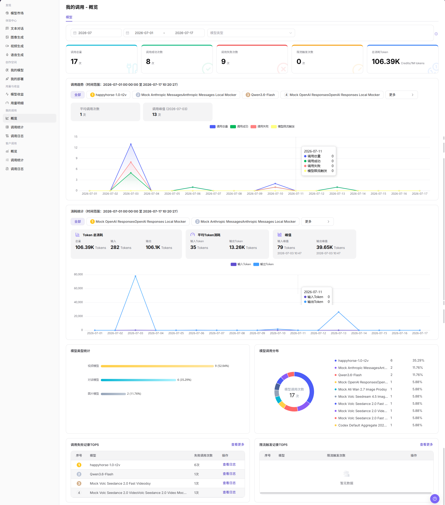
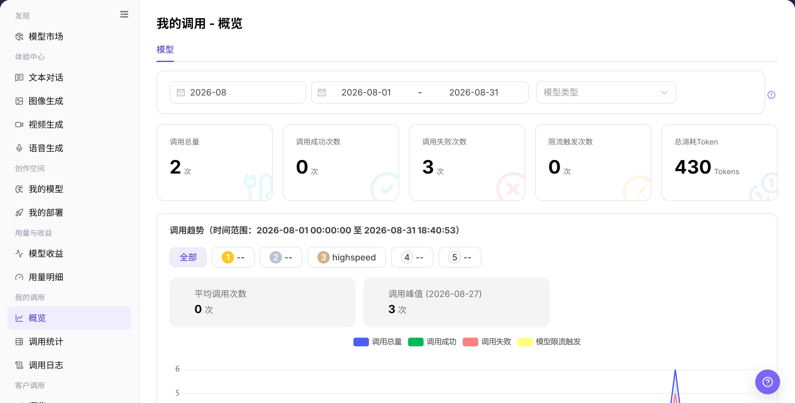

# 概览

## 功能概述

| 项目 | 内容 |
| --- | --- |
| 适用角色 | 模型提供方、模型调用方 |
| 导航路径 | 模型及AI服务 > 我的调用 > 概览 |
| 页面路由 | `/modelone/monitoring/calls/overview/model` |
| 管理对象 | 个人调用指标、调用趋势、模型排行和日志入口 |

#### 新手理解

概览像个人调用仪表盘。先看调用总量、成功与失败次数和用量趋势，再从异常模型进入日志定位单次请求。

#### 术语表

| 术语 | 英文 | 说明 |
| --- | --- | --- |
| 调用总量 | Total Calls | 当前时间范围内发起的调用总次数。 |
| 失败调用 | Failed Calls | 未正常完成并返回成功结果的调用。 |
| 限流触发 | Rate Limit Trigger | 调用超过限流策略后被限制的次数。 |
| 调用趋势 | Call Trend | 按时间展示调用量、成功、失败或用量的变化。 |

#### 推荐操作顺序

先选择时间范围并查看汇总指标，再比较趋势和模型排行，发现异常后通过日志入口继续排查。

#### 小白先看

| 场景 | 先做 | 不要直接做 |
| --- | --- | --- |
| 概览无数据 | 扩大时间范围 | 立即判断调用未记录 |
| 成功率下降 | 先比较失败与限流趋势 | 只看总调用量 |
| 某模型异常 | 进入日志核对单次请求 | 仅凭图表判断原因 |
| 准备共享截图 | 遮挡业务标识和敏感信息 | 直接外发原图 |

## 前提条件

1. 当前账号具备 `概览` 页面访问权限。
2. 当前账号在统计周期内存在调用记录，或已确认需要查看的时间范围。
3. 查看或截图前确认模型名、Key 名称、费用和业务标识是否需要脱敏。

::: warning 敏感信息边界
调用概览可能展示费用、调用量、模型名称、Key 名称、Token 消耗和异常趋势。查看或共享数据时，应按权限脱敏账号、Key、请求内容、费用和业务标识。
:::

## 页面说明

页面展示当前账号的调用汇总、趋势和模型排行，并提供进入调用日志的入口。筛选时间范围会同步改变统计指标和图表。

页面截图：

关注时间范围、汇总指标、趋势图和模型列表。

## 主要操作

### 查看调用趋势并进入日志

1. 进入 `模型及AI服务 > 我的调用 > 概览`。
2. 选择时间范围和模型类型，核对调用总量、成功次数、失败次数、限流次数和用量。
3. 比较趋势与模型列表，定位异常模型。
4. 点击目标模型的 **"查看日志"**，进入对应调用日志继续排查。

上图展示调用汇总、趋势和模型列表。异常时从目标模型进入日志。

## 参数速查表

| 字段名称 | 是否必填 | 字段类型 | 示例 | 说明 |
| --- | --- | --- | --- | --- |
| 时间范围 | 是 | 月份 / 日期范围 | `2026-07` | 控制概览统计周期。 |
| 模型 | 否 | 标签 / 选择项 | `全部` | 在趋势或统计区按模型查看数据。 |
| 应用 | 否 | 选择项 | 按页面展示 | 如页面提供应用维度，可按应用筛选调用概览。 |
| Key | 否 | 选择项 | 按页面展示 | 如页面提供 Key 维度，可按 Key 查看调用来源。 |
| 调用次数 | 系统生成 | 数值 | `17` | 当前筛选范围内的调用总量。 |
| Token 消耗 | 系统生成 | 数值 | `106.39K` | 输入和输出 Token 的汇总消耗。 |
| 费用 | 系统生成 | 数值 | 按页面单位展示 | 调用消耗或费用统计，展示时需注意脱敏。 |
| 成功率 | 系统生成 | 百分比 / 统计值 | 按页面计算 | 可由调用成功次数与调用总量计算。 |
| 失败率 | 系统生成 | 百分比 / 统计值 | 按页面计算 | 可由调用失败次数与调用总量计算。 |
| 状态 | 系统生成 | 标签 / 统计项 | `成功` / `失败` / `限流` | 用于区分调用成功、失败或限流触发情况。 |

## 踩坑提示

- 我的调用概览只展示当前账号可见范围，不代表租户或客户全量调用。
- 余额、Credits 或调用次数异常时，应同时查看调用日志、用量明细和账务页面。
- 切换模型或时间范围后再比较数据，避免把不同模型版本的数据混在一起。

## 结果校验

| 检查项 | 成功表现 | 异常时处理 |
| --- | --- | --- |
| 页面可进入 | `我的调用 - 概览` 页面正常打开，左侧 `我的调用 > 概览` 菜单高亮。 | 确认账号权限、导航路径和页面加载状态。 |
| 概览指标正常展示 | 调用总量、调用成功次数、调用失败次数、限流触发次数和总消耗 Token 正常显示。 | 扩大时间范围或确认当前账号是否有调用记录。 |
| 趋势图正常加载 | 调用趋势、消耗统计、模型类型统计和模型调用分布正常显示。 | 刷新页面，或切换账期、日期范围后重试。 |
| 筛选项可用 | 账期、日期范围、模型类型等筛选项可选择。 | 清空筛选条件后重新查看。 |
| 搜索 / 重置可用 | 如页面提供 `搜索`、`查询` 或 `重置`，筛选结果可刷新或清空。 | 检查筛选条件格式和网络状态。 |
| 数据与筛选一致 | 指标、趋势图和 TOP5 记录随筛选条件同步变化。 | 对比调用统计或调用日志，确认统计延迟和筛选范围。 |

## 常见问题

#### 概览无数据

**问题现象：**

概览页面出现与“概览无数据”对应的异常。

**可能原因：**

- 时间范围或筛选条件不匹配。
- 页面数据仍在同步。

**处理方式：**

1. 重置筛选并统一时间范围。
2. 打开详情或日志交叉确认。

#### 成功率突然下降

**问题现象：**

概览页面出现与“成功率突然下降”对应的异常。

**可能原因：**

- 调用数据或状态发生变化。
- 页面数据仍在同步。

**处理方式：**

1. 重置筛选并统一时间范围。
2. 打开详情或日志交叉确认。

#### 限流次数升高

**问题现象：**

概览页面出现与“限流次数升高”对应的异常。

**可能原因：**

- 调用数据或状态发生变化。
- 页面数据仍在同步。

**处理方式：**

1. 重置筛选并统一时间范围。
2. 打开详情或日志交叉确认。

#### 趋势与列表不一致

**问题现象：**

概览页面出现与“趋势与列表不一致”对应的异常。

**可能原因：**

- 调用数据或状态发生变化。
- 页面数据仍在同步。

**处理方式：**

1. 重置筛选并统一时间范围。
2. 打开详情或日志交叉确认。

#### 无法进入调用日志

**问题现象：**

概览页面出现与“无法进入调用日志”对应的异常。

**可能原因：**

- 调用数据或状态发生变化。
- 当前账号权限不足或记录已失效。

**处理方式：**

1. 重置筛选并统一时间范围。
2. 核对权限和记录状态后重试。

## 注意事项

- 不在文档中写入真实账号、Key、请求内容、费用明细或内部测试参数。
- 概览统计可能存在延迟，排查单次请求时以调用日志为准。
- 对外沟通时只使用脱敏后的聚合信息。

## 后续操作

1. 进入 `调用统计` 查看更细的趋势和维度分析。
2. 进入 `调用日志` 查看单次请求、错误码和请求状态。
3. 根据失败记录、限流触发和 Token 峰值调整调用策略。
