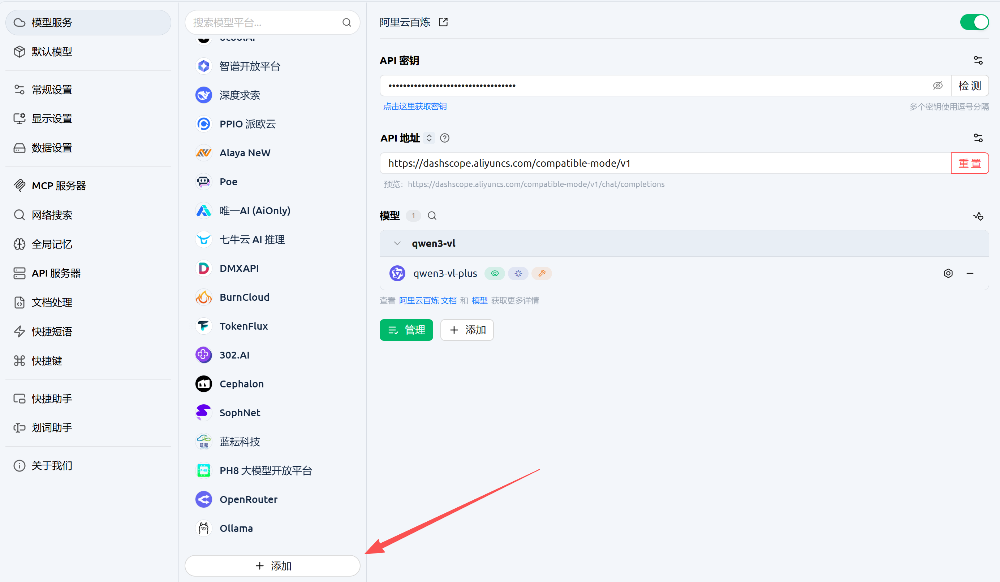
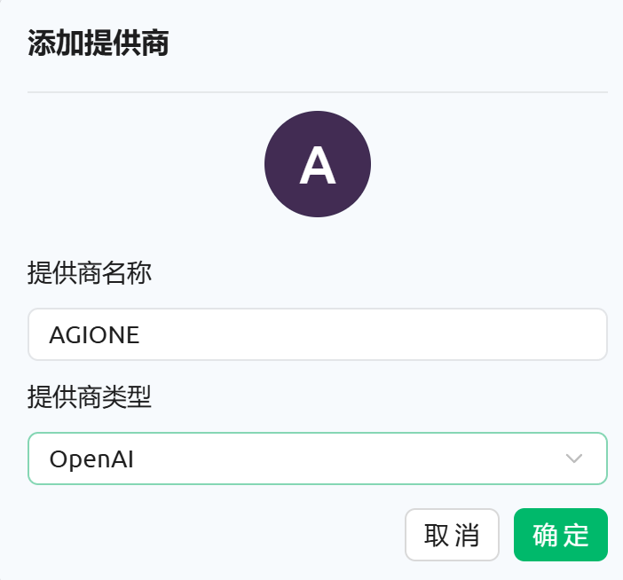
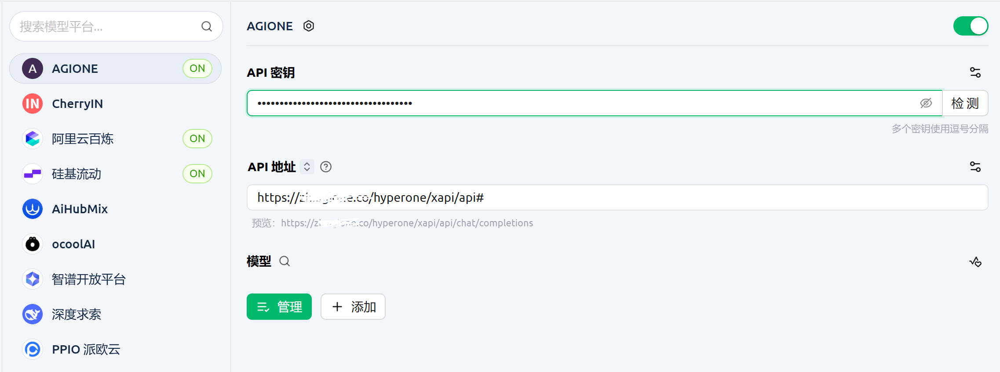
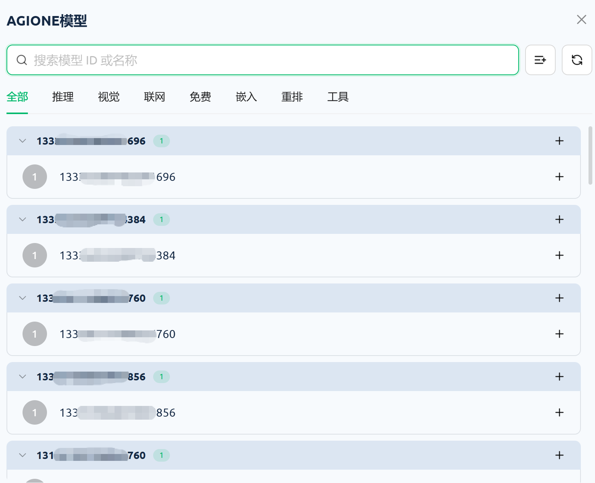
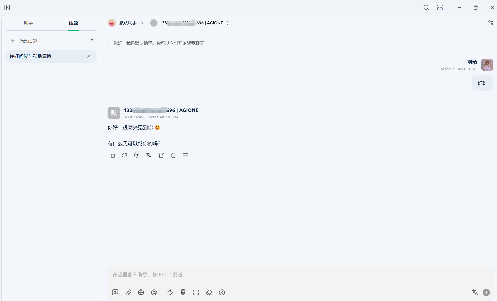

# 在Cherry studio中添加AGIOne作为模型提供商

## 安装 Cherry Studio   

访问 [Cherry Studio](https://www.cherry-ai.com/) 官网下载并安装适合您操作系统的版本。

## 配置模型提供商（AGIOne）

1. 打开客户端，右下角点击**设置**，找到**模型服务**，页面下滑点击**添加**按钮。

2. 添加提供商
	- *提供商名称*：自定义填写
	- *提供商类型*：选择 OpenAI

3. 配置API密钥及地址    
	- *API 密钥*：从AGIOne平台模型API调用页面 `认证 TOKEN` 中获取
	- *API 地址*：`https://zh.agione.co/hyperone/xapi/api`
	- *说明：CherryStudio默认会在URL结尾拼接`/v1/chat/completions`格式，但AGIONE请求路由在CherryStudio平台不兼容该格式，所以用户需要在URL结尾输入`#`，表示不执行拼接操作。*

4. 获取模型列表    
	配置完成后，在**模型 → 管理**中获取模型列表（大多数模型提供商会预设可用的模型列表），选择自己想用的模型即可。

## 使用模型

选择您刚配置的模型，在对话框中输入测试文本，若正常响应，说明配置成功。

