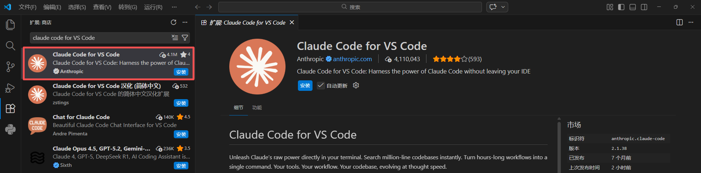
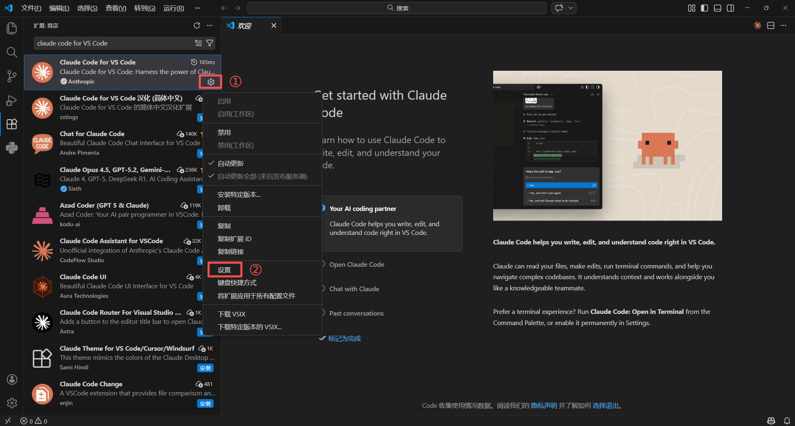
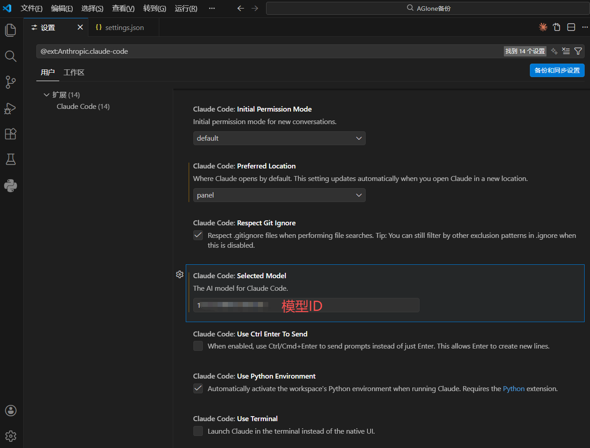
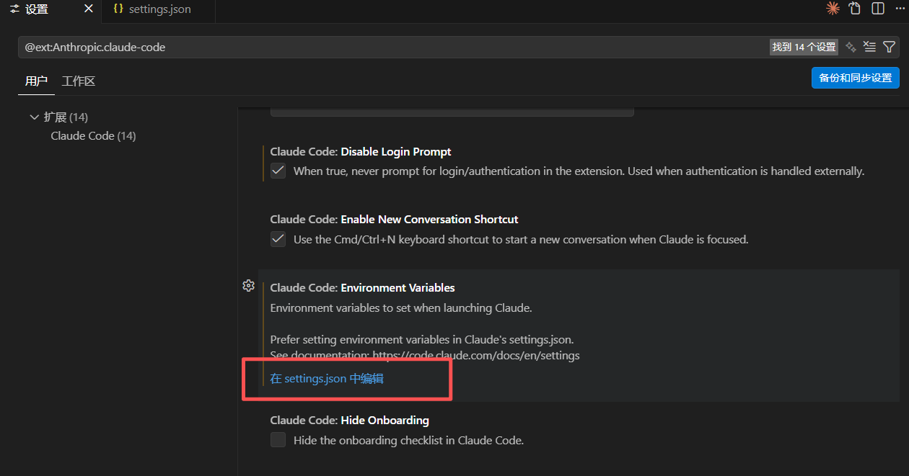
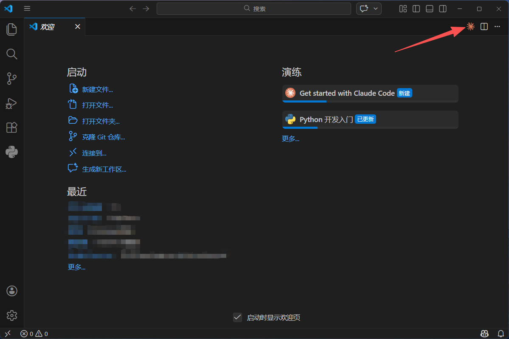
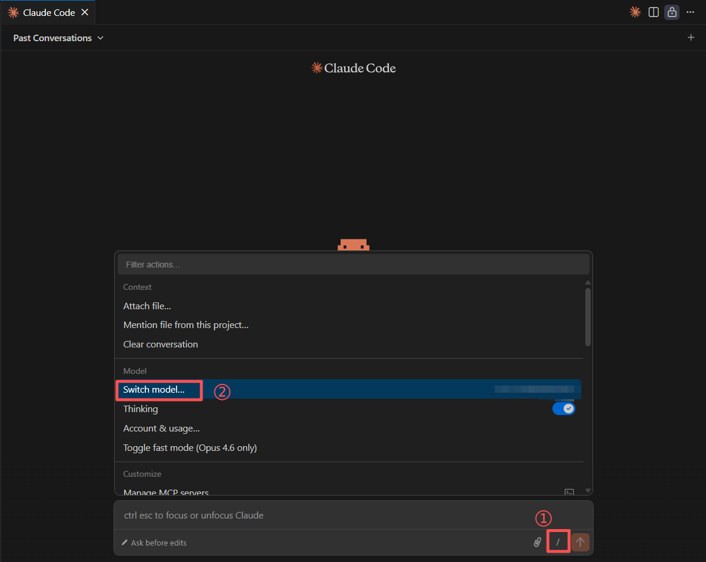
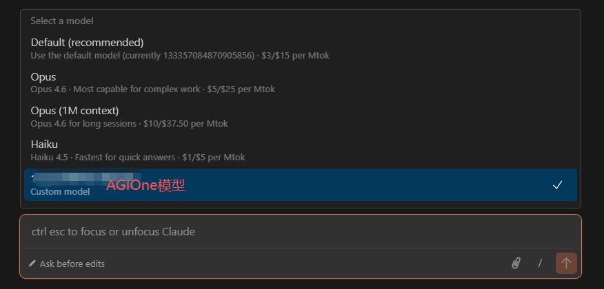
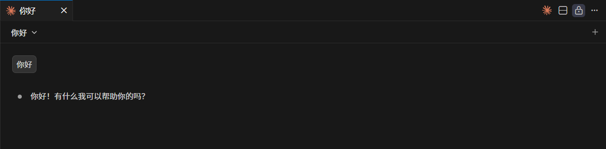

# 在VSCode中使用Claude Code for VS Code接入AGIOne模型

## 安装Claude Code for VS Code

1. 安装并打开VS Code。
2. 在VS Code中进入扩展商店并搜索**Claude Code for VS Code**，点击**安装**。


## 模型配置

1. 访问 [AGIOne](https://zh.agione.co/)，并注册一个账号。
2. 前往模型广场，选择一个模型，进入 api 调用页面，获取*Api key*和*model id*。

### 配置说明（使用AGIOne作为模型提供商）

1. 安装完成后，点击扩展右下角齿轮图标选择**设置**。
	
2. 在Select Model中填入**模型ID**。
	
3. 在设置界面，找到Environment Variables，点击编辑`settings.json`文件。
	
4. 打开`settings.json`文件后，配置提供商信息。
	- *ANTHROPIC_BASE_URL*：`https://zh.agione.co`
	- *ANTHROPIC_AUTH_TOKEN*：从AGIOne平台模型API调用页面 `认证 TOKEN` 中获取
	- *claudeCode.selectedModel*、*ANTHROPIC_DEFAULT_HAIKU_MODEL*、*ANTHROPIC_DEFAULT_SONNET_MODEL*、*ANTHROPIC_DEFAULT_OPUS_MODEL*：从AGIOne平台模型API调用页面请求参数中获取`Model Id`
```json
{
    "workbench.colorTheme": "Default Dark Modern",
    "window.zoomLevel": 1,
    "claudeCode.selectedModel": "<agione-model-id>",
    "claudeCode.environmentVariables": [
        {
            "name": "ANTHROPIC_BASE_URL",
            "value": "https://zh.agione.co"
        },
        {
            "name": "ANTHROPIC_AUTH_TOKEN",
            "value": "<agione-api-key>"
        },
        {
            "name": "ANTHROPIC_DEFAULT_HAIKU_MODEL",
            "value": "<agione-model-id>"
        },
        {
            "name": "ANTHROPIC_DEFAULT_SONNET_MODEL",
            "value": "<agione-model-id>"
        },
        {
            "name": "ANTHROPIC_DEFAULT_OPUS_MODEL",
            "value": "<agione-model-id>"
        },
    ],
    "claudeCode.disableLoginPrompt": true,
    "claudeCode.preferredLocation": "panel",
}
```

### 使用Claude Code

1. 保存配置信息后重启VS Code，点击右上角Claude Code图标。
	
2. 打开Claude Code对话框，点击输入框下方 “**/**” -> “**Switch Model**” 按钮，选择我们添加的模型ID。
	
	
3. 测试响应：发送测试信息如“你好”，若返回正常响应，说明配置成功。

