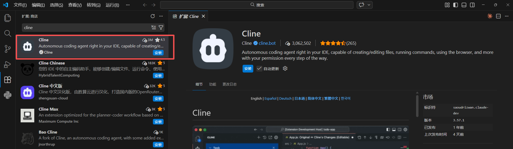
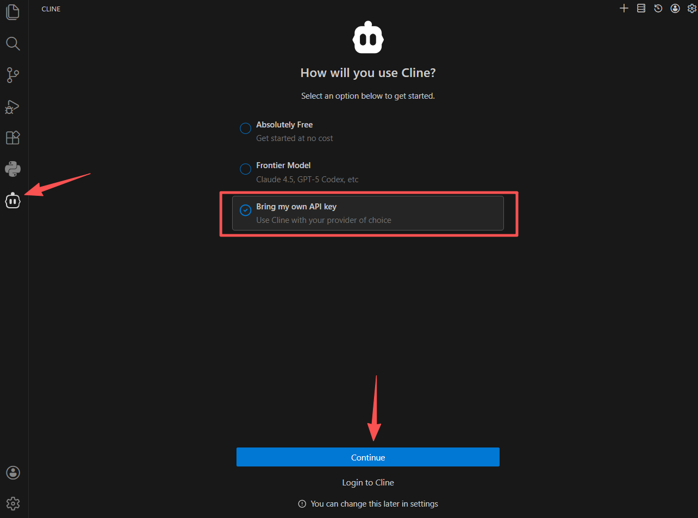
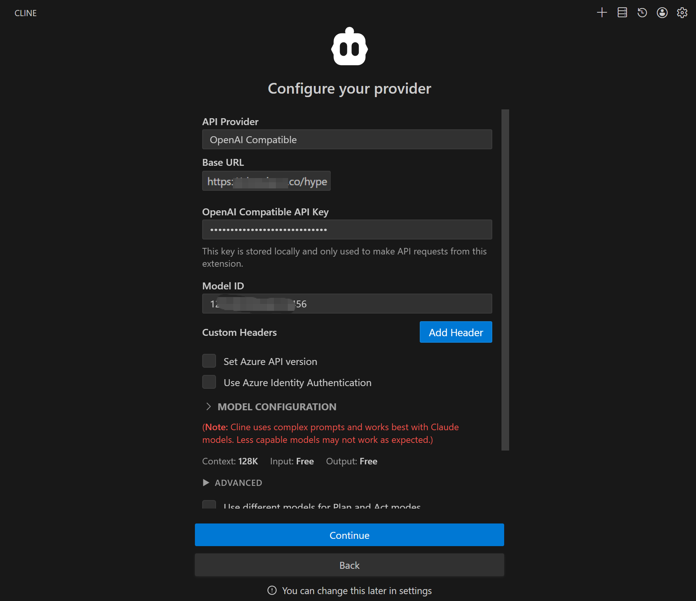
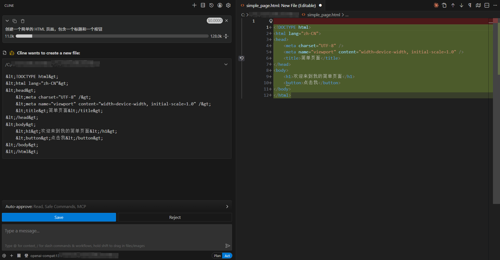

# 在VSCode中使用Cline接入AGIOne模型

## 安装Cline

1. 安装并打开VS Code。
2. 在VS Code中进入扩展商店并搜索**Cline**，点击**安装**。

## 模型配置

1. 访问 [AGIOne](https://zh.agione.co/)，并注册一个账号。
2. 前往模型广场，选择一个模型，进入 api 调用页面，获取*Api key*和*model id*。

### 配置说明（使用AGIOne作为模型提供商）

1. 安装完成后，可以在VS Code左侧边栏看到Cline图标，点击图标，打开设置界面。
2. 选择*Bring my own API key*，再点击*Continue*。
	
3. 配置提供商信息，填写完毕后，点击*Continue*。
	- *API Provider*：选择 `OpenAI Compatible`
	- *Base URL*：`https://zh.agione.co/hyperone/xapi/api`
	- *API Key*：从AGIOne平台模型API调用页面 `认证 TOKEN` 中获取
	- *Model ID*：从AGIOne平台模型API调用页面请求参数中获取`Model Id`
	

### 测试响应

在输入框中简单描述你的任务，例如："创建一个简单的 HTML 页面，包含一个标题和一个按钮"，按下回车或点击发送按钮，Cline正常响应。

