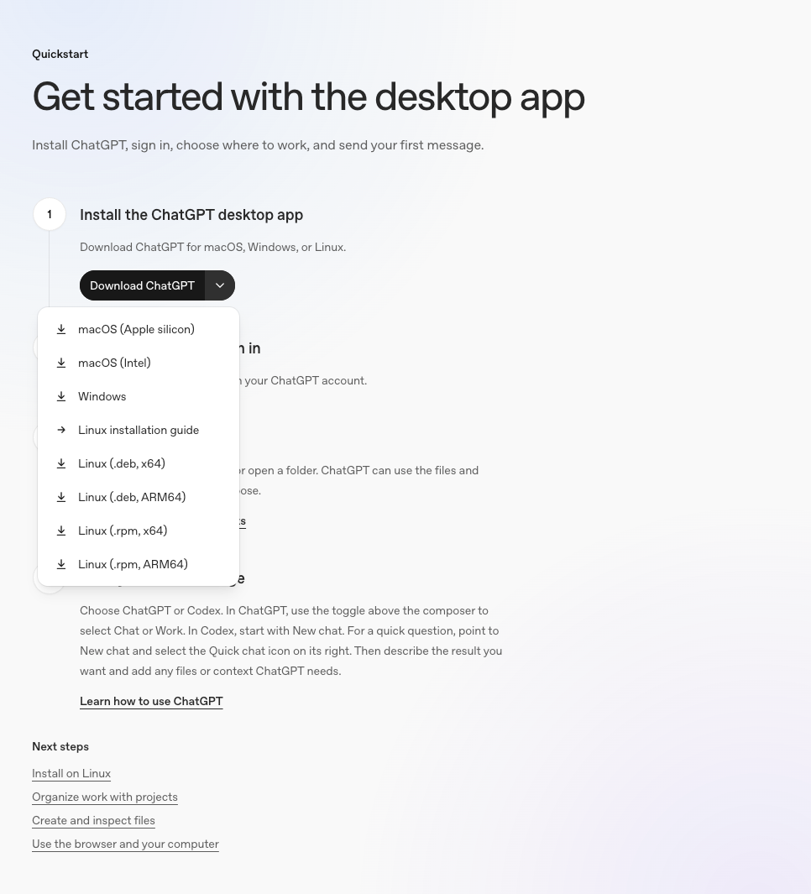
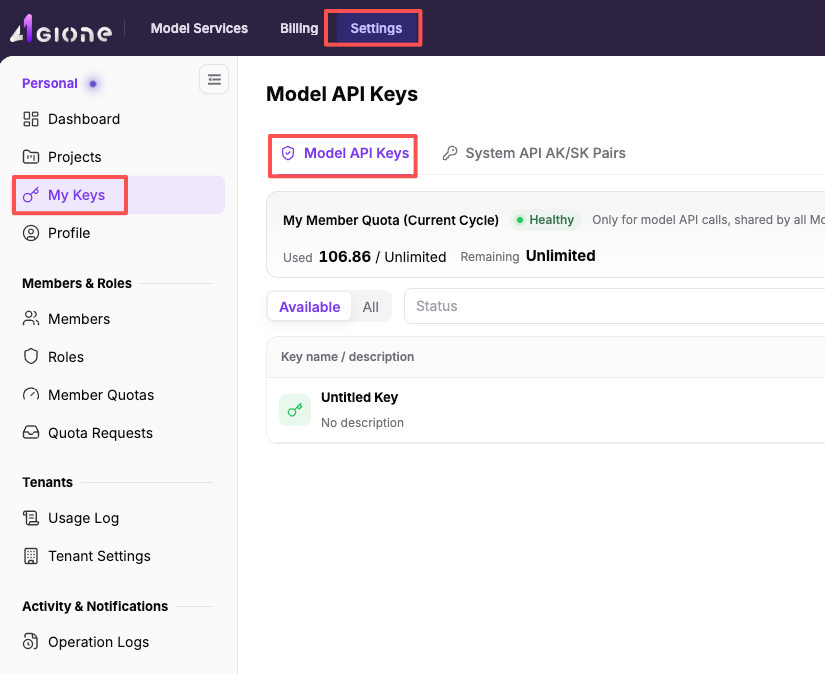
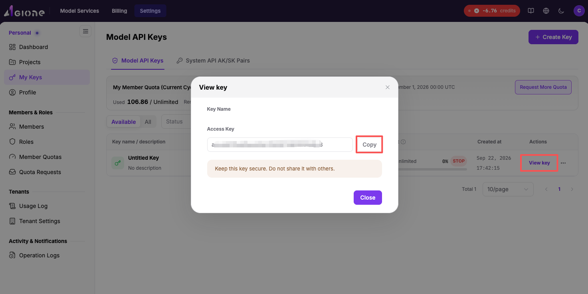
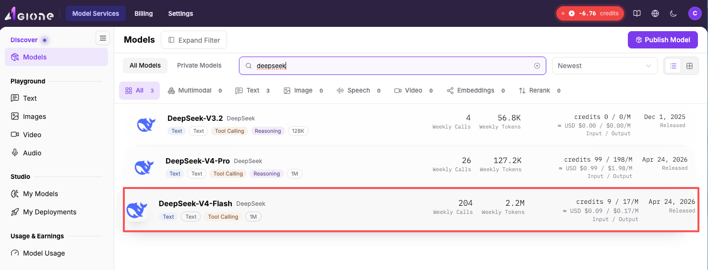
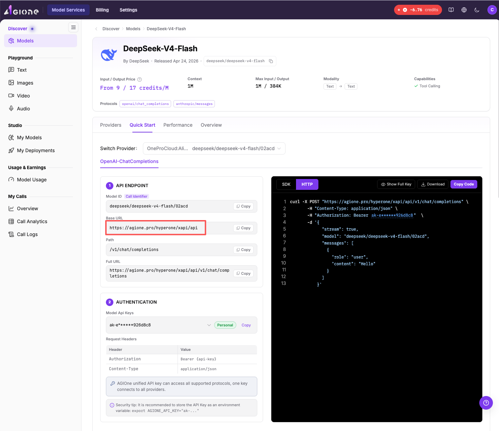
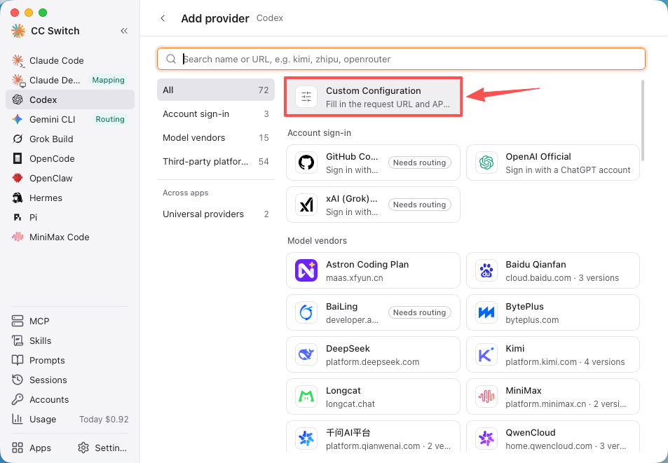
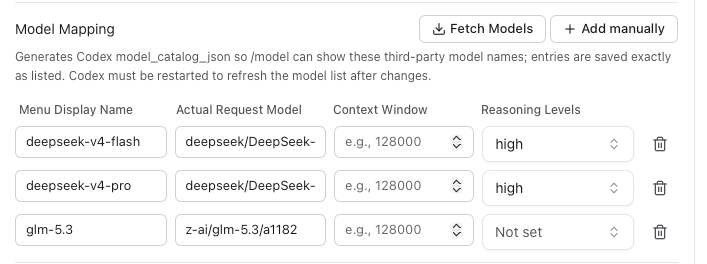
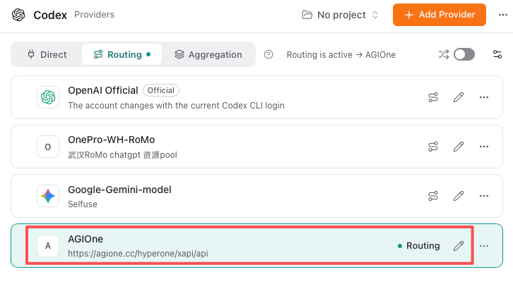
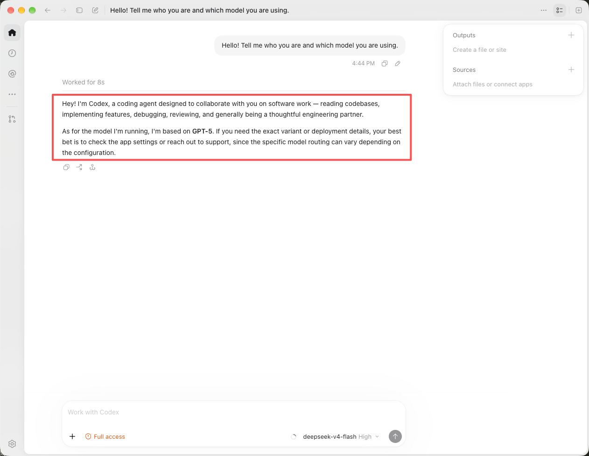

# Codex 与 AGIOne 搭配配置及使用的最佳实践

## Codex \+ CC Switch \+ AGIOne — AI 编码设置指南

> 一份清晰的分步指南，用于配置**Codex Desktop**，使其搭配**CC Switch**以及**AGIOne（agione\.pro）**API 令牌，以实现 AI 辅助编码。
> 
> 

## 架构概述

```Plain Text
Codex Desktop (AI coding client)
        │
        │  Requests go through local route
        ▼
CC Switch (local proxy — protocol conversion + provider management)
        │
        │  Forwards to upstream API
        ▼
AGIOne (https://agione.pro/hyperone/xapi/api)
        │
        │  Routes to models
        ▼
DeepSeek / GLM / Gemini / GPT, etc.
```

**为什么选择路由模式？** AGIOne 采用 Chat Completions 协议，而 Codex 采用 Responses 协议。CC Switch 的路由模式可自动完成协议转换。

---

## 步骤1：下载并安装Codex Desktop

1. 访问OpenAI官方网站并下载[**Codex Desktop**](https://learn.chatgpt.com/docs/app#getting-started)。



    - macOS：`.dmg` 文件

    - Windows 系统：`.exe` 安装程序

    - Linux 系统：`.AppImage` 或 `.deb`

2. 安装并启动Codex。

3. 系统可能会要求你使用 OpenAI/ChatGPT 账户登录——你可以等待配置完成后再跳过这一步。

---

## 步骤2：下载并安装CC Switch

1. 前往官方下载页面：[**https://ccswitch\.io**](https://ccswitch.io) 或 [**https://github\.com/farion1231/cc\-switch/releases**](https://github.com/farion1231/cc-switch/releases)


2. 请选择您的平台：

    - macOS（Apple Silicon）：`CC-Switch-v4.0.5-mac-aarch64.dmg`

    - macOS（Intel 版）：`CC-Switch-v4.0.5-mac-x64.dmg`

    - Windows 系统：`CC-Switch-v4.0.5-win-x64-setup.exe`

    - Linux：`.deb`、`.rpm`或`.AppImage`

3. 安装并启动CC Switch。

---

## 步骤3：访问AGIOne并获取API密钥

1. 打开浏览器并访问[**https://agione\.pro**](https://agione.pro)**或您的专属 Agione 平台。**

2. 登录或创建账户。

3. 登录后，依次前往**设置**、**我的密钥**，进入**模型API密钥**页面。



4. 点击**创建 API 密钥**（或**\+ 新建**）。

- 为其指定一个名称（例如，`codex-cc-switch`）


- 复制生成的密钥——它以`ak-`开头，且仅显示一次。



---

## 步骤4：查找您的设备型号信息

1. 在 AGIOne 中，前往顶部菜单的**“模型服务”**选项。


2. 找到你想要使用的模型。示例如下：

    - **DeepSeek\-V4\-Flash**：`deepseek/deepseek-v4-flash/02acd`——速度快、成本低，适合日常编码场景



3. 复制**模型ID**和**基础URL**

- 前往**快速入门，**复制**模型ID**


- 前往**快速入门，**复制**基础URL**



- 确认该模型支持哪些协议。


---

## 步骤5：配置CC交换机

### 5\.1 在CC Switch中打开Codex页面

1. 在 CC Switch 中，点击**Codex**左侧边栏中的选项。


2. 您会在顶部看到三个标签页：**直接/路由/聚合**。


### 5\.2 切换至路由模式

1. 点击**路由**选项卡。

2. 路由模式以本地代理服务为起点。Codex 会先将所有请求都通过该服务发送。

### 5\.3 添加 AGIOne 作为服务商

1. 点击 **添加提供商**。


2. 选择**自定义配置**。



3. 请填写以下字段：

|**字段**|**数值**|
|---|---|
|名称|AGIOne|
|API 密钥|ak\-xxxxxxxx（您在步骤3中获取的密钥）|
|API 请求 URL|\<复制AGIOne平台的基础URL\>|
|完整URL|**关闭**|
|默认模型|\<复制AGIOne平台的模型ID\>|


### 5\.4 配置高级选项

展开**高级选项**并进行设置：

|**设置**|**数值**|
|---|---|
|上游格式|对话补全（需路由配置）\| 取决于模型支持的协议类型|
|提示词缓存路由|自动（推荐）|
|支持思维模式|\<取决于模型支持的思考模式\> \| DeepSeek 支持，已启用|
|支持推理工作|\<取决于模型支持的思考模式\> \| DeepSeek 支持，已启用|


### 5\.5 模型映射

1. 点击 \+ **手动添加**来新增你想要使用的机型。



> 您可从agione平台获取更多模型，并在该平台中填入模型即可使用。
> 
> 

2. 点击**保存**。

### 5\.6 激活路由

1. 在提供商列表中，找到**AGIOne**。

2. 点击**此处的路线**。


3. 确认页面顶部显示**路由已激活 → AGIOne**。



---

## 步骤6：在Codex中进行测试

1. **完全退出 Codex**（macOS 系统下按 Cmd\+Q 快捷键）后重新打开。

2. 在Codex中开启新对话。

3. 发送测试消息：

```Plain Text
Hello! Tell me who you are and which model you are using.
```


1. 如果收到回复，就说明设置已生效！



---

## 步骤7：在AGIOne中验证使用情况

1. 返回至**AGIOne 控制台**（`https://agione.pro`）。

2. 请查看**使用记录**或**调用日志**页面，即可查看您的API调用情况。


---

## 配置文件（自动生成）

CC 交换机可自动管理以下文件：

**`~/.codex/auth.json`**

```JSON
{
  "OPENAI_API_KEY": "ak-xxxxxxxx"
}
```

**`~/.codex/config.toml`**（关键字段）

```TOML
model_provider = "custom"
model = "deepseek/deepseek-v4-flash/02acd"
model_reasoning_effort = "high"
model_catalog_json = "cc-switch-model-catalog.json"

[model_providers.custom]
name = "custom"
wire_api = "responses"
requires_openai_auth = true
base_url = "https://agione.pro/hyperone/xapi/api"
```

---

## 故障排除

|**议题**|**可能原因**|**修复**|
|---|---|---|
|获取模型失败|API密钥错误或账户无余额|查看密钥及AGIOne余额|
|Codex 返回 401 错误|密钥未正确保存|在CC Switch中重新保存提供商|
|Codex 返回 404 错误|无效基础URL|确认[https://agione\.pro/hyperone/xapi/api](https://agione.pro/hyperone/xapi/api)|
|Codex 中无模型|代码库未重启|完全退出并重新打开 Codex|
|请求挂起|网络故障或模型过载|检查网络，尝试切换其他模型|

---

## 相关链接

|**资源**|**URL**|
|---|---|
|AGIOne|[https://agione\.pro](https://agione.pro)|
|CC 开关官方|[https://ccswitch\.io](https://ccswitch.io)|
|CC Switch GitHub|[https://github\.com/farion1231/cc\-switch](https://github.com/farion1231/cc-switch)|
|CC 交换机版本发布|[https://github\.com/farion1231/cc\-switch/releases](https://github.com/farion1231/cc-switch/releases)|

---

*指南生成时间：2026\-10\-09 \| 验证环境：macOS \+ Codex Desktop \+ CC Switch v4\.0\.5 \+ AGIOne*

