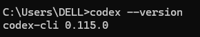

# 安装Codex并使用AGIOne作为模型提供商

## 安装Codex

1. 确保已安装Node.js（v20.x.x及以上版本）。
2. 打开cmd，执行命令：
```
npm install -g @openai/codex@latest
```
3. 验证安装结果
```
codex --version
```


## 模型配置

1. 访问 [Agione 国内版](https://agione.cc/)，并注册一个账号。
2. 前往模型广场，选择一个模型，进入 api 调用页面，获取*Api key*和*model id*。

### 配置说明（使用AGIOne作为模型提供商）

在`~/.codex`文件夹下，创建`config.toml` 文件，配置提供商及模型信息：
- `model_provider`：自定义提供商名称（示例为agione）
- `model`：从AGIOne平台，模型快速开始界面的API端点中获取`Model Id`
- `base_url`：`https://agione.cc/hyperone/xapi/api/v1`
- `wire_api`：支持response协议
- `env_key`：从AGIOne平台，模型快速开始界面的身份认证中获取`API Key`，设置API key对应的环境变量名
```Python
model_provider = "agione" # 自定义提供商名称  
model_reasoning_effort = "medium" # 推理强度（high/medium/low）  
model = "openai/gpt-5-mini/61db2"  
  
# 自定义提供商详情
[model_providers.agione]  
name = "agione"  
base_url = "https://agione.cc/hyperone/xapi/api/v1"  
wire_api = "responses"  
env_key = "AGIONE_API_KEY" # 对应环境变量名
```

### 设置环境变量

- 可以在系统环境变量中设置：AGIONE_API_KEY "your_agione_key"
- 或执行代码：
````PowerShell
setx AGIONE_API_KEY "your_agione_key"
````

> 请注意：API Key环境变量名要与 `config.toml` 中的 `env_key` 一致。

### 开始使用

在项目目录下打开`cmd`，运行`codex`，可以查看到已自动选择我们添加的模型，输入测试文本“hi”，若正常响应，说明配置成功。

