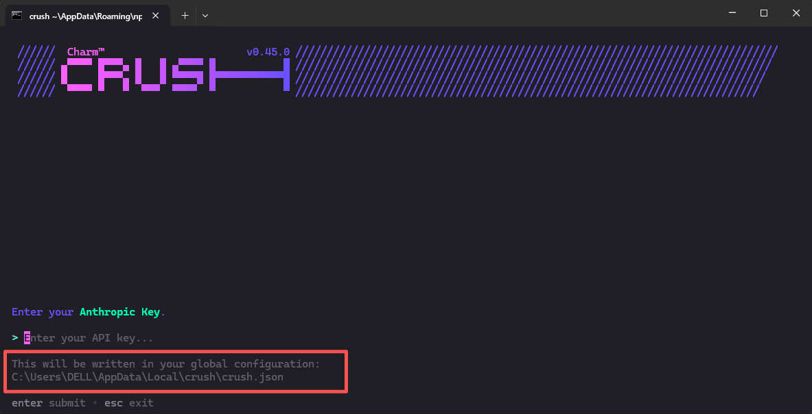
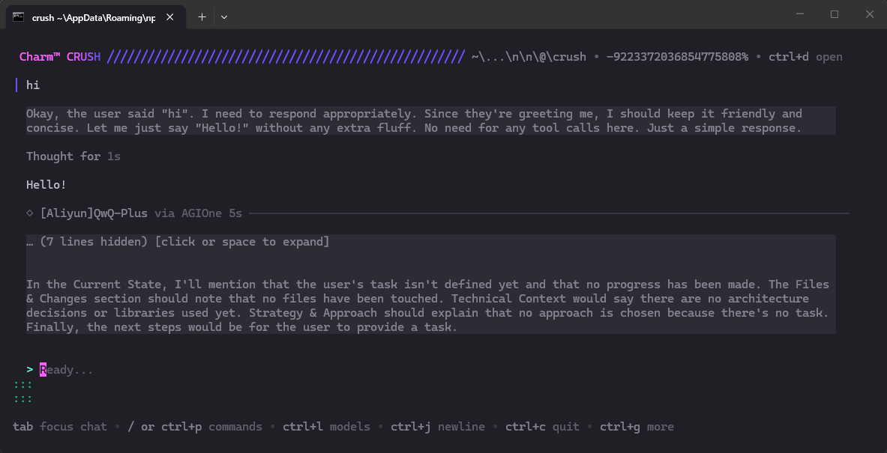

# 安装Crush并使用AGIOne作为模型提供商

## 安装Crush

1. 确保已安装Node.js（v20.x.x及以上版本）。
2. 打开cmd，执行命令：
```
npm install -g @charmland/crush
```
3. 验证安装结果
```
crush --version
```


## 模型配置

1. 访问 [AGIOne](https://zh.agione.co/)，并注册一个账号。
2. 前往模型广场，选择一个模型，进入 api 调用页面，获取*Api key*和*model id*。

### 配置说明（使用AGIOne作为模型提供商）

安装成功后，运行`crush`命令启动交互界面，随意选择一个模型点击回车，在输入API Key界面下方可以查看到配置文件路径。

根据路径找到`crush.json`文件（如果没有就手动创建），配置提供商及模型信息，保存文件后返回cmd界面，重新运行`crush`命令，即可选择并使用自定义的模型。
- *提供商名称*：用户自定义（示例名称为AGIOne）
- *base_url*：`https://zh.agione.co/hyperone/xapi/api`
- *api_key*：从AGIOne平台模型API调用页面 `认证 TOKEN` 中获取
- *id*：从AGIOne平台模型API调用页面请求参数中获取`Model Id`
- *name*：模型名称
```json
{
  "$schema": "https://charm.land/crush.json",
  "providers": {
    "AGIOne": {
      "type": "openai-compat",
      "base_url": "https://zh.agione.co/hyperone/xapi/api",
      "api_key": "your_api_key",
      "models": [
        {
        "id": "model_id",
        "name": "model_name",
        "display_name": "display_name"
        }
      ]
    }
  }
}
```

### 测试响应

运行启动命令`crush`，界面显示已选择我们添加的模型，在对话框输入测试文本“hi”，若正常响应，说明配置成功。

