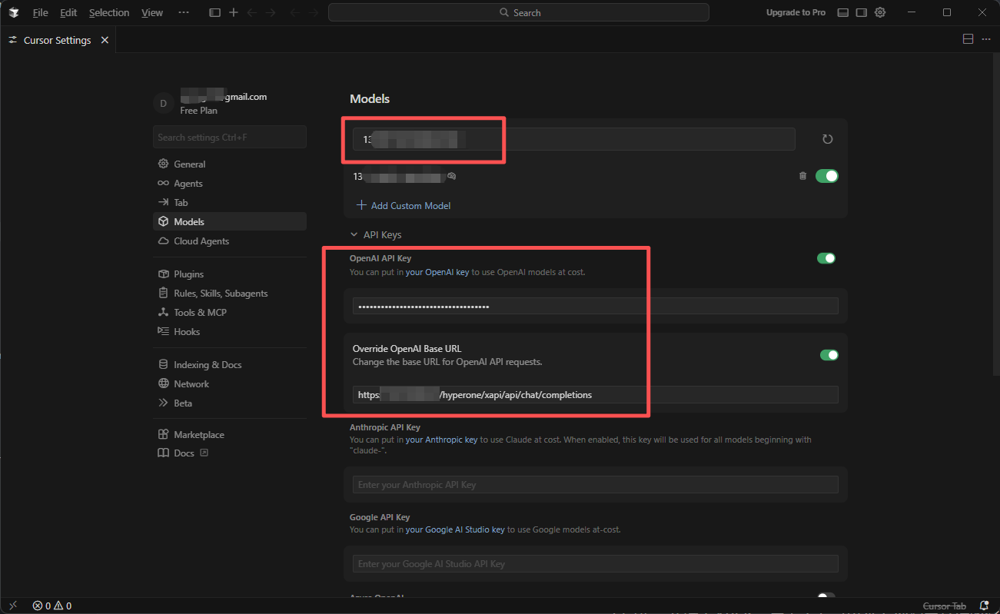

# 安装Cursor并使用AGIOne作为模型提供商

## 安装Cursor

访问 Cursor 官网 https://cursor.com/ 下载并安装适合您操作系统的版本。

## 模型配置

1. 访问 [AGIOne](https://zh.agione.co/)，并注册一个账号。
2. 前往模型广场，选择一个模型，进入 api 调用页面，获取*Api key*和*model id*。

### 配置说明（使用AGIOne作为模型提供商）

1. 注册并登录Cursor。
2. 在设置界面打开“**Models**” 部分，填写*ID*、*Base URL*和*API Key*，然后点击 “**Add Custom Model**” 按钮。
    - *OpenAI Base URL*: `https://tai.agione.co/hyperone/xapi/api`
    - *Model ID*: 需要使用到的模型ID，可从AGIOne平台模型API调用详情中获取

3. 打开项目并选择添加的模型即可开始使用。

*注：由于 Cursor 的限制，只有订阅了 Cursor 高级会员及以上的用户才支持自定义配置模型。*