# 使用 Dify 搭建定时获取天气信息工作流

## Dify介绍

Dify 是一款开源的大语言模型（LLM）应用开发平台，旨在帮助开发者快速构建生产级的生成式AI应用。‌‌它融合了后端即服务（Backend as Service）和LLMOps的理念，提供了从提示词编排、知识检索（RAG）、Agent框架到工作流编排的一站式解决方案。

平台支持多种应用类型，包括聊天助手、Agent（具备推理和工具调用能力的智能体）、对话流（Chatflow，用于多轮复杂对话）以及工作流（Workflow，用于单轮自动化任务）。用户可以通过直观的界面或API进行操作，即使非技术人员也能参与AI应用的定义和数据运营。

Dify的核心优势在于其工程化设计，内置了对数百个模型的支持、高质量的RAG引擎、灵活的流程编排工具，并强调数据安全和模型中立性。它适用于To B场景，帮助企业用户以较低成本构建定制化AI应用，同时支持自部署以保障数据控制权。

## 添加模型供应商（AGIOne）

注册并登录Dify平台，在页面右上角点击“**插件**”按钮，
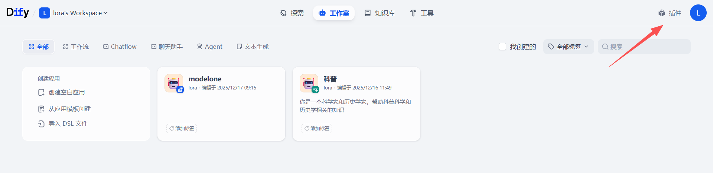
在插件页面，同样在右上角有一个“**安装插件**”按钮，点击并选择“**Marketplace**”，
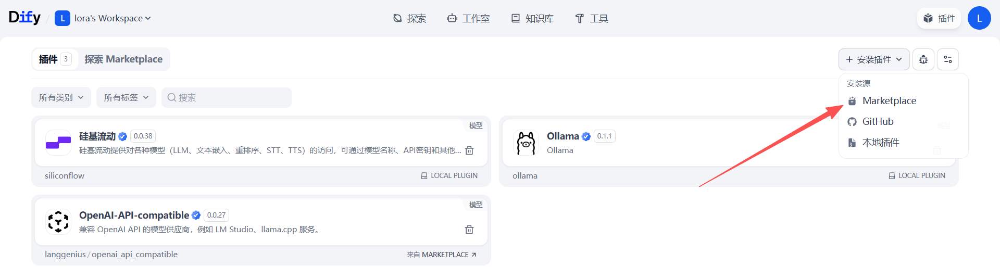
切换至探索Marketplace页面，使用搜索框筛选“openAI"，选择插件“**OpenAI-API-compatible**”，鼠标悬浮在卡片上，点击“**安装**”按钮，页面提示“*安装成功*”后即表示插件安装成功。
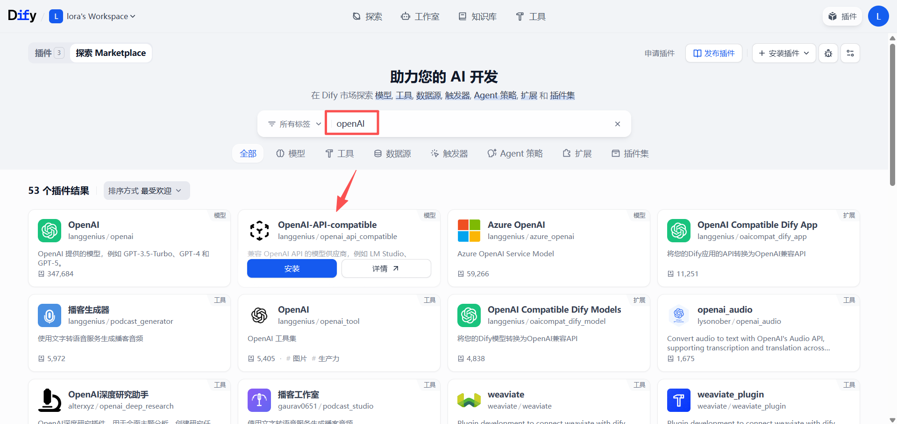
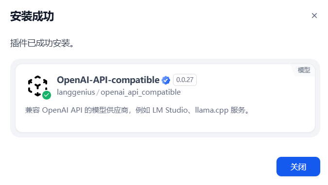
## 添加模型

模型供应商添加成功后，我们需要将AGIOne平台的模型添加至Dify。
点击右上角账户“**头像**”，选择**设置**并点击，
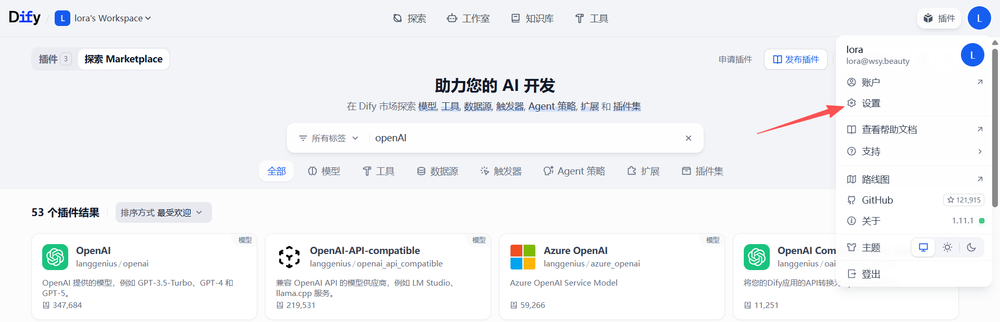
在设置页面，切换工作空间到模型供应商，选择我们刚刚添加的模型供应商，点击卡片右下角“**+ 添加模型**”按钮，
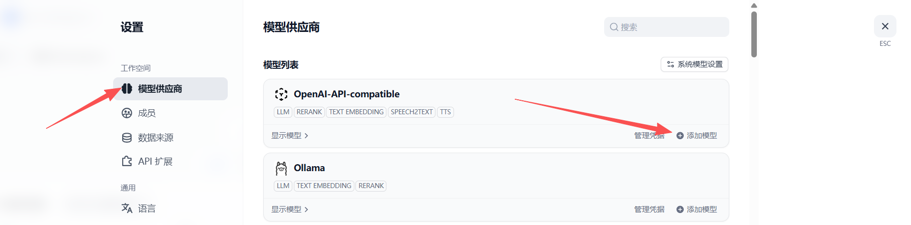
打开添加模型弹框后，保持页面不动。
新开浏览器标签页，打开AGIOne平台，在模型广场中选择要添加的模型，点击**API调用**进入详情页面，
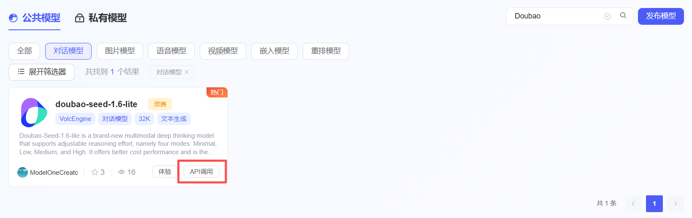
核心参数如下：
- 模型名称：模型的名称
- 模型类型：模型的子类型，例如：LLM
	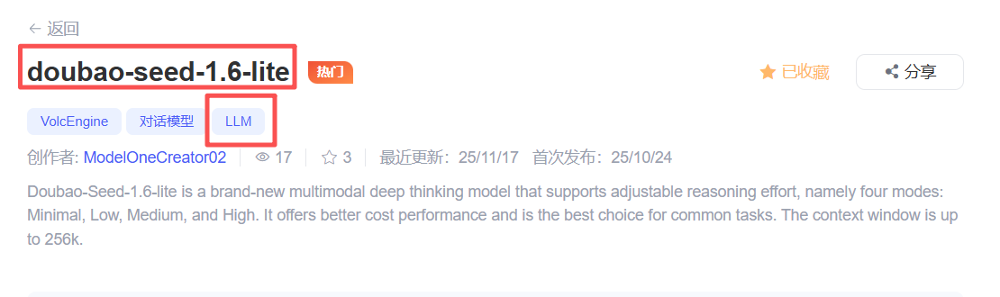
- API endpoint URL：``https://zh.agione.co/hyperone/xapi/api``
- API Key：在 `认证 TOKEN` 中获取 API 密钥
- API endpoint：在请求参数处获取`Model Id`
	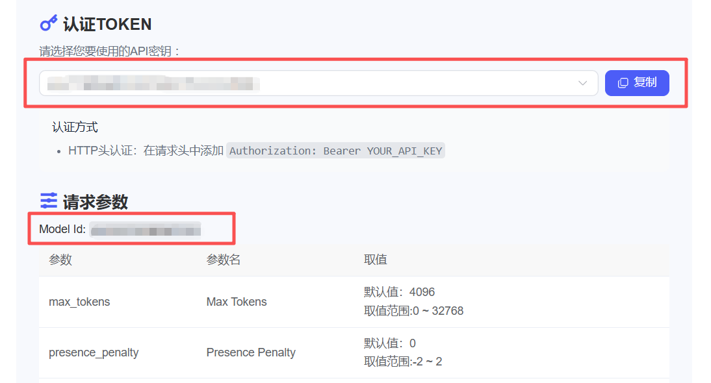
返回Dify平台添加模型页面，将上述参数复制到对应的字段输入框中，检查信息填写无误，点击“**添加**”按钮，等待几秒钟，模型成功显示在列表中。
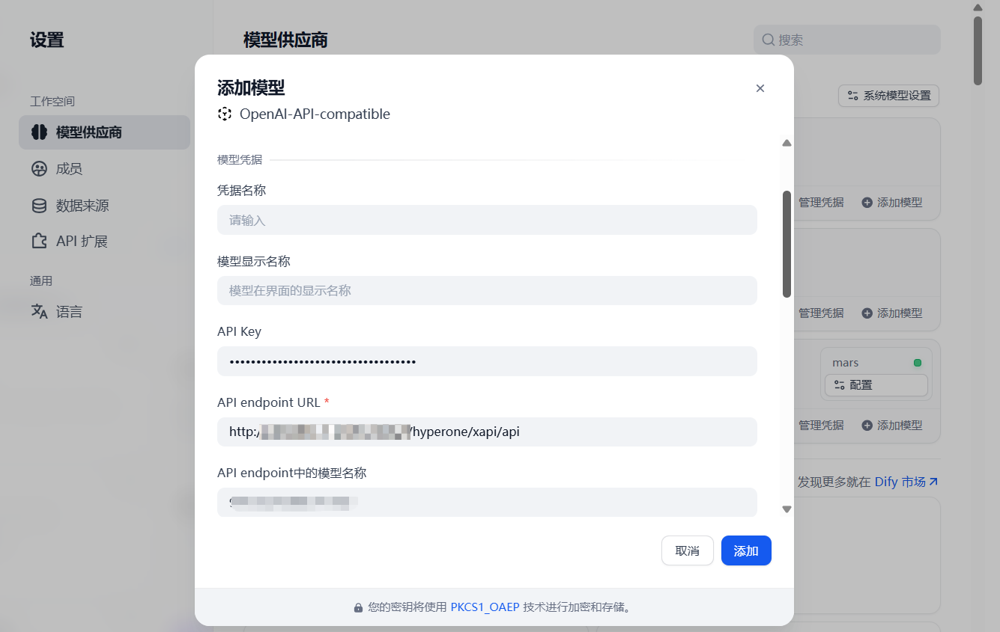
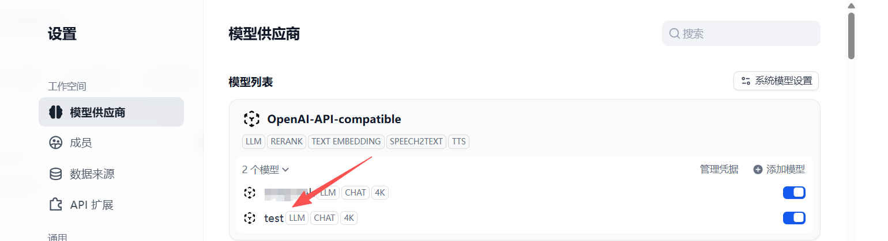

## 搭建查询天气信息工作流

模型已添加成功，现在创建一个查询并使用模型总结输出天气预报的工作流。
退出设置页面，通过顶部导航栏切换到“**工作室**”页面，在标签页中选择工作流，点击“**创建空白应用**”按钮，
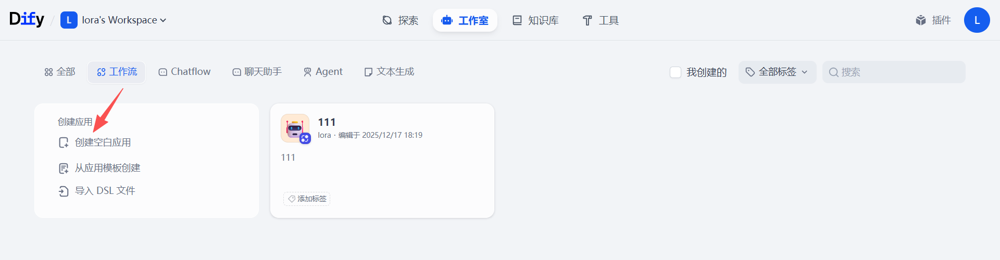
输入应用名称、图标和描述信息，点击“**创建**”按钮，
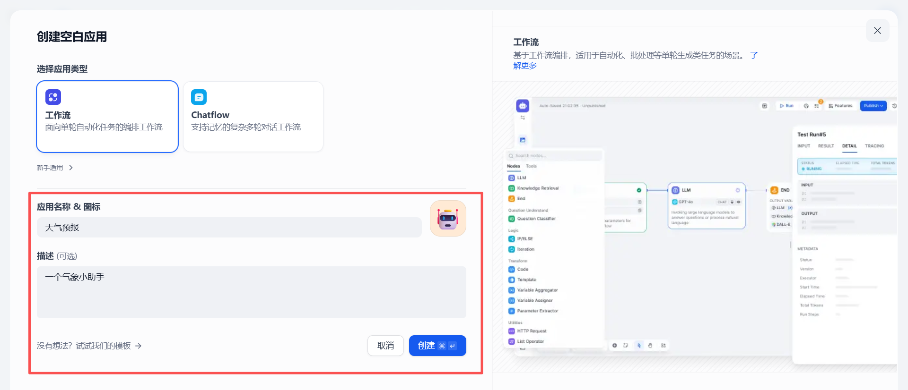
### 添加触发器

自动跳转至画布添加第一个节点，我们选择**触发器 -> 定时触发器**，
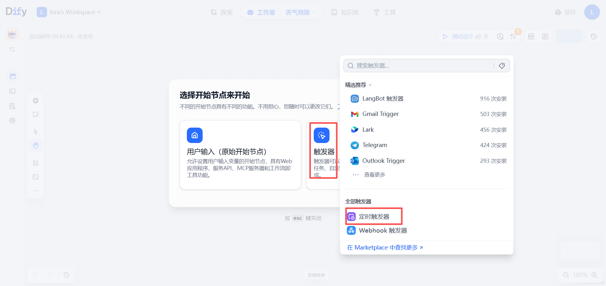
在画布中点击触发器，右侧设置页面调整触发**频率**和**时间**，此处我设置为*每日->8:30am*，设置完成后可点击“**▷**”按钮确认节点运行成功。
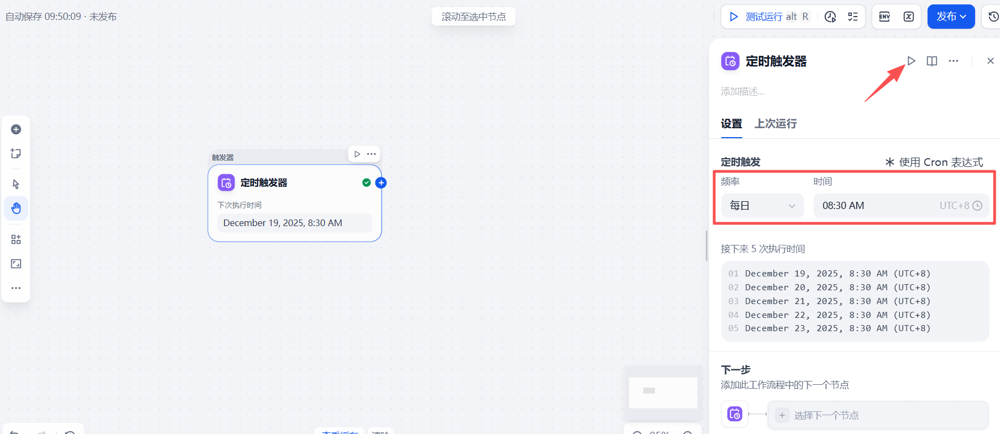
### 添加HTTP请求

添加HTTP请求组件获取天气信息，点击第一个节点后“**+**”按钮，选择**HTTP请求**，
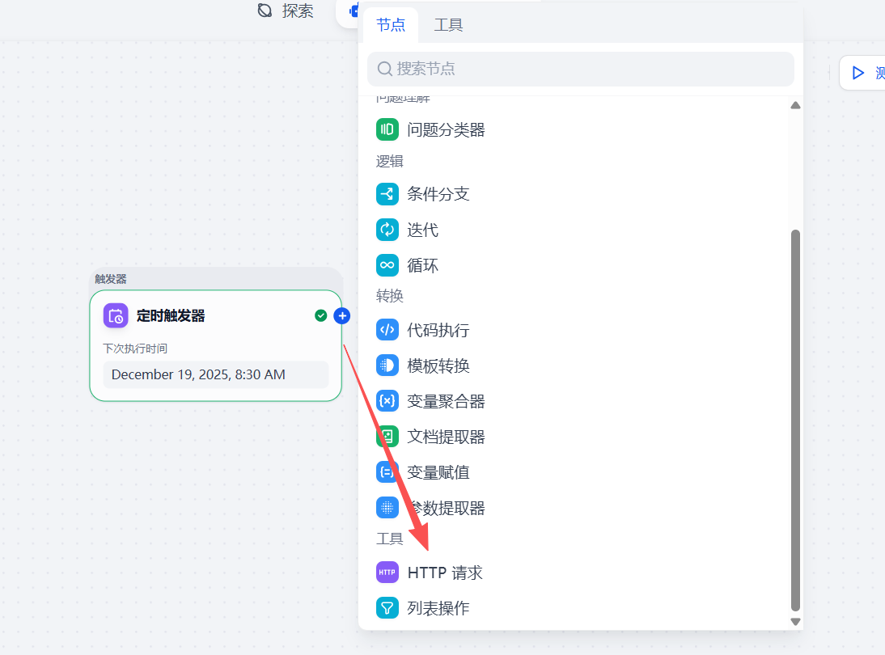
在右侧设置页面开始配置参数，选择HTTP请求方法为 **GET**，并输入**URL**。（需要用户去注册接口盒子平台获取个人ID和KEY）
```
https://cn.apihz.cn/api/tianqi/tqyb.php?id=10011034&key=b4138a4432bf6ac940702dc1d9368969&sheng=湖北&place=武汉&day=1&hourtype=1
```
填入数据后，点击**▷**按钮，查看输出结果。
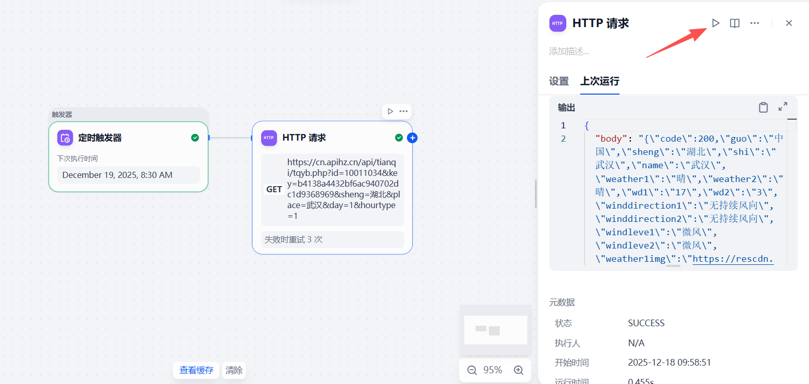
### 添加LLM模型

查询到的天气信息数据过多且查找不到重点，让模型帮我们分析结果，并给出专业的天气提示。
点击上一个节点后“**+**”按钮，选择**LLM**，
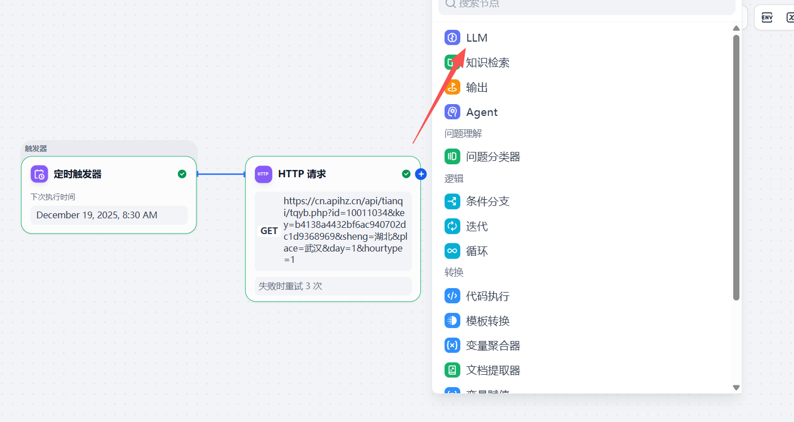
在右侧设置页面，选择我们添加的模型，在上下文中选择HTTP请求的`body参数`，并在SYSTEM中填写包含上下文变量的提示词，填入数据后，点击**▷**按钮，查看输出结果。
```
你是一个专业的气象学家，并且很有生活经验。根据输入的信息，生成一个简短的邮件，邮件内容是对于出行和生活的提示，要求语气更生动一些，但也要带上数据，体现气象科学的严谨，只输出结果，不要思考过程:[变量]
```
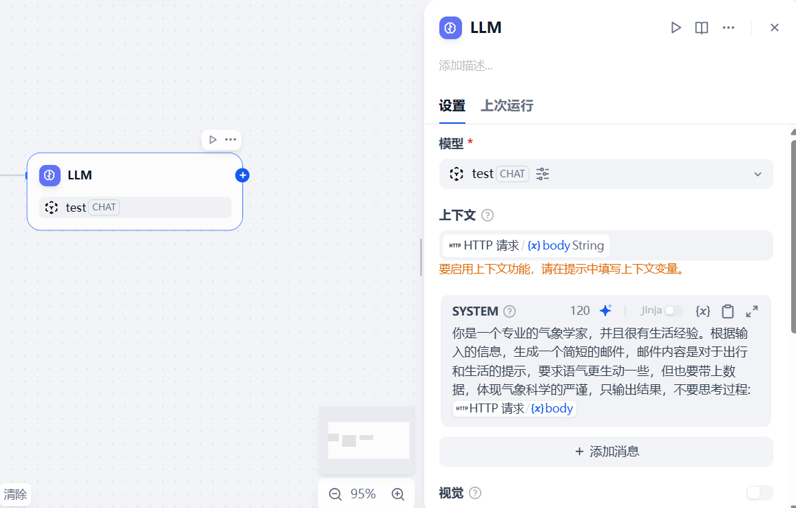
### 添加输出节点

最后添加输出节点，将模型生成的数据输出，整个工作流就完成了。
点击上一个节点后“**+**”按钮，选择**输出**，
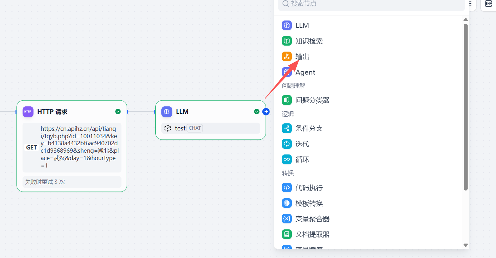
在右侧设置页面，添加一个**输出变量**，变量值选择LLM输出的`text参数`，设置完成后点击“**▷ 测试运行**”按钮，验证工作流是否成功运行，测试完成后，点击“**发布**”按钮。
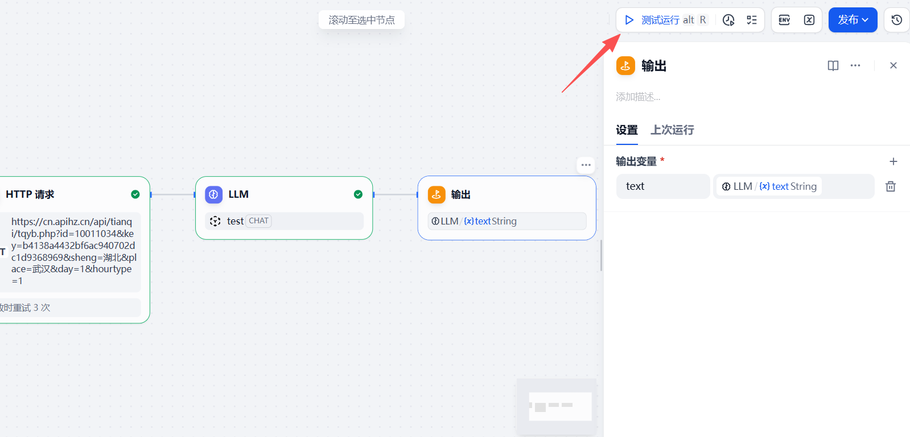
## 探索应用

应用发布成功后，通过顶部导航栏切换到“**探索**”页面，在工作区选择刚刚发布的应用，点击“**▷ 运行**”按钮，等待工作流运行，查看结果。
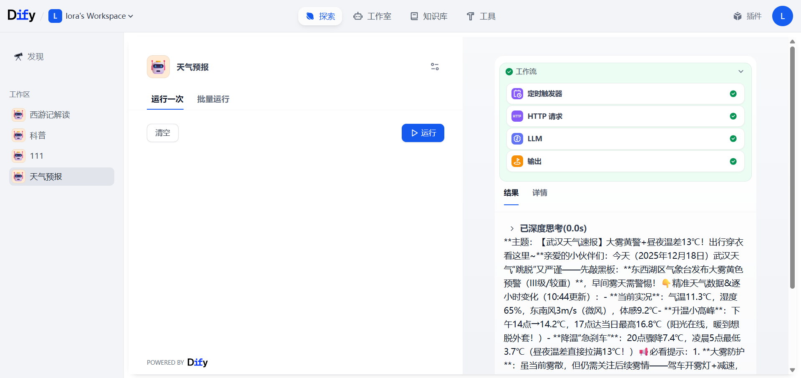

[^1]: 
