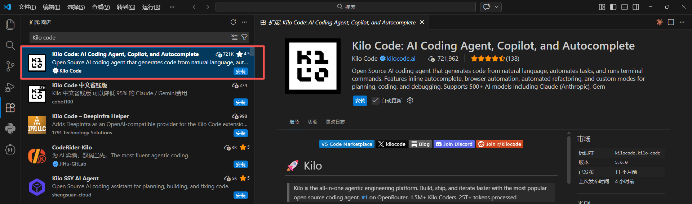
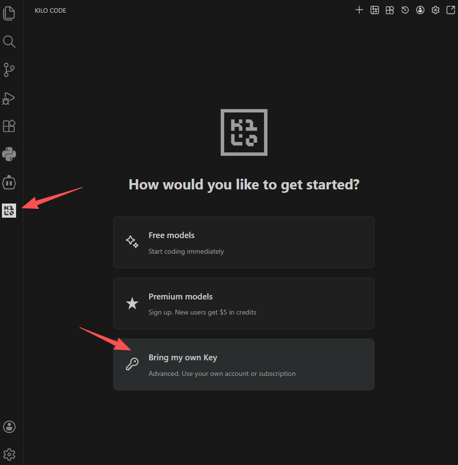
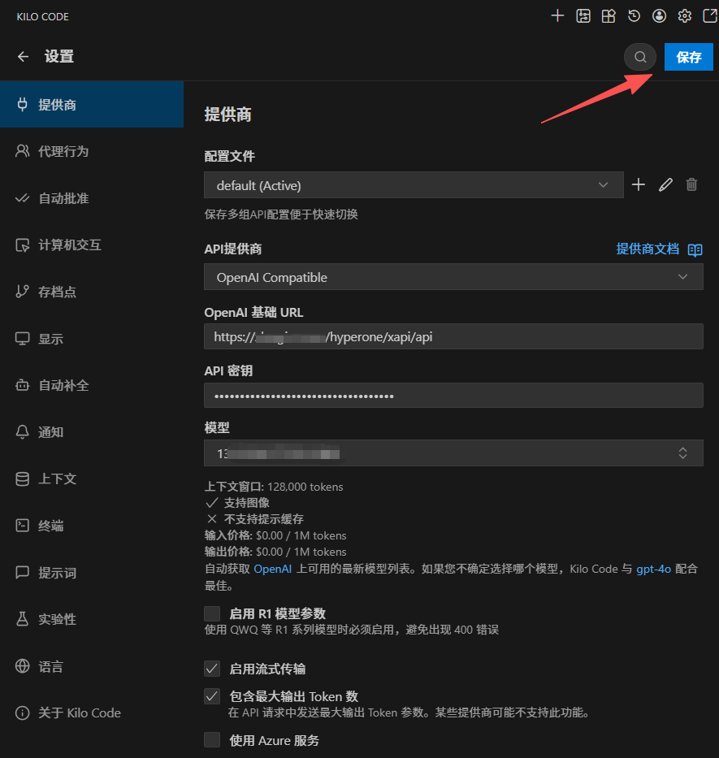
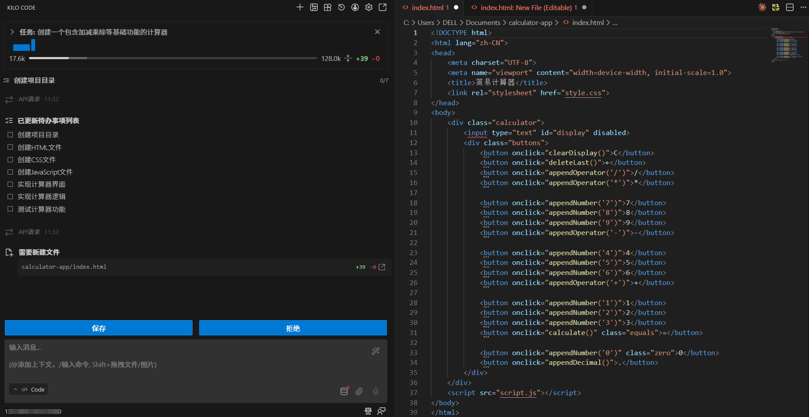

# 在VSCode中使用Kilo Code接入AGIOne模型

## 安装Kilo Code

1. 安装并打开VS Code。
2. 在VS Code中进入扩展商店并搜索**Kilo Code**，点击**安装**。

## 模型配置

1. 访问 [AGIOne](https://zh.agione.co/)，并注册一个账号。
2. 前往模型广场，选择一个模型，进入 api 调用页面，获取*Api key*和*model id*。

### 配置说明

1. 安装完成后，可以在VS Code左侧边栏看到Kilo Code图标，点击图标，打开设置界面。
2. 点击*Bring my own key*。
	
3. 配置提供商信息，填写完毕后，点击*保存*按钮。
	- *API提供商*：选择 `OpenAI Compatible`
	- *基础URL*：`https://zh.agione.co/hyperone/xapi/api`
	- *API密钥*：从AGIOne平台模型API调用页面 `认证 TOKEN` 中获取
	- *模型*：从AGIOne平台模型API调用页面请求参数中获取`Model Id`
	

### 测试响应

点击右上角“**+**”按钮，打开新的对话框，输入您的需求，例如“创建一个包含加减乘除等基础功能的计算器”，Kilo Code正常响应。

