# 使用 N8N 搭建定时发送天气邮件的工作流

## N8N介绍

n8n 是一款开源的工作流自动化工具，它允许用户通过可视化界面创建、编辑和运行自动化任务。与传统编程方式不同，n8n采用节点连接的方式，将各种应用程序和数据源链接起来，实现自动化操作，设计理念是“连接一切”。

该工具的核心特点包括：
- **丰富的节点生态**：n8n拥有超过400个节点，覆盖主流应用和服务，如GitHub、Slack、Google Drive、数据库（MySQL、MongoDB）以及各类API，支持数据传输、处理和同步。
- **可视化工作流设计**：用户可通过拖拽节点并连接形成工作流程，界面直观，即使非技术人员也能快速上手。
- **强大的脚本支持**：在节点配置中，用户可使用JavaScript编写自定义代码，实现灵活的数据清洗、转换或复杂逻辑处理。
- **可扩展性和自定义性**：支持开发自定义节点或调用外部API，满足特定业务需求，同时提供企业版以支持多用户管理、权限控制等高级功能。

## 创建工作流

注册并成功登录n8n平台，导航至“*概述*”页面，点击右上角“**创建工作流**”按钮，进入编辑器页面。
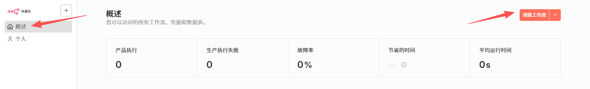
### 添加触发器

触发器是工作流的起点，决定了流程何时以及如何开始执行，比如手动触发，定时触发，应用事件触发等等。此处我们添加一个定时触发器，并设置每天早上 8:30 触发。
在编辑器页面，点击页面的“**+**”按钮，选择“**按计划**”触发。
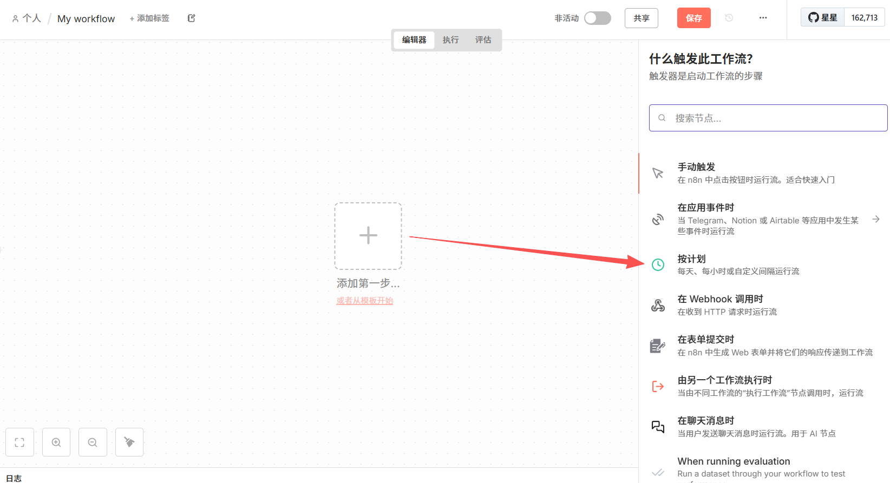
在弹出的定时触发器中，根据需求填写“**触发天数**”和“**时间**”，点击*Add Rule*按钮可添加多个触发规则，让工作流在不同时间运行。：
- Trigger Interval：工作流触发的间隔周期，例如：秒(Seconds)，分钟(Minutes)，小时(Hours)，天(Days)等等
- Days Between Triggers：工作流触发的间隔时间
- Trigger at Hour：工作流在一天中触发的具体时间，例如：8点
- Trigger at Minute：工作流在一天中触发的具体分钟，例如：30秒
此处我们选择，间隔周期为 **Days**，间隔时间为 **1**，具体时间为 **8am**，具体分钟为 **30**，点击**执行步骤**，右侧查看输出结果（选择JSON）。
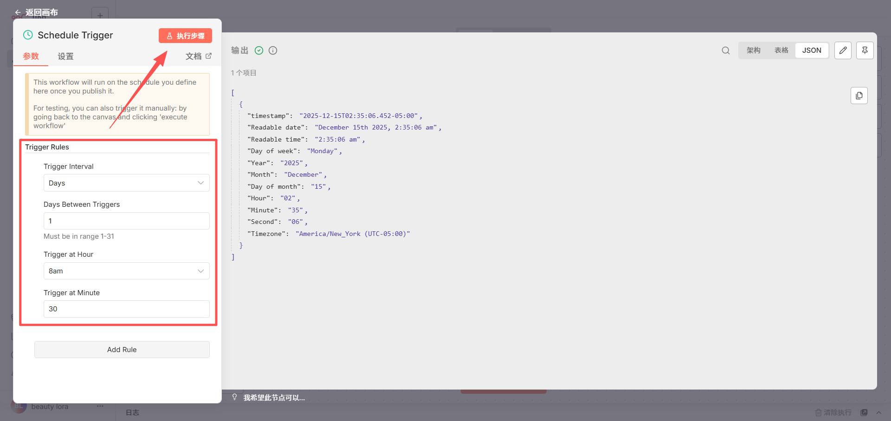
查看结果时，发现时区为America/New_York，所以我们需要修改时区为Asia/Shanghai。
返回画布，点击编辑器上方右边的“**···**”按钮，选择**设置**，在弹框中修改时区并保存。
保存时区后，在画布中双击组件，点击执行步骤，重新查看输出结果，时区展示正确。
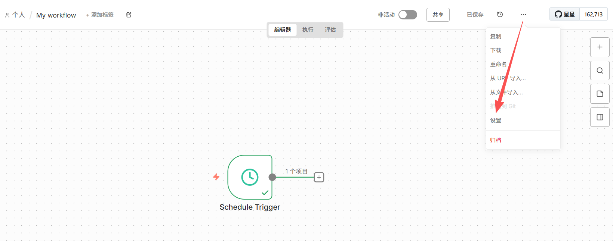
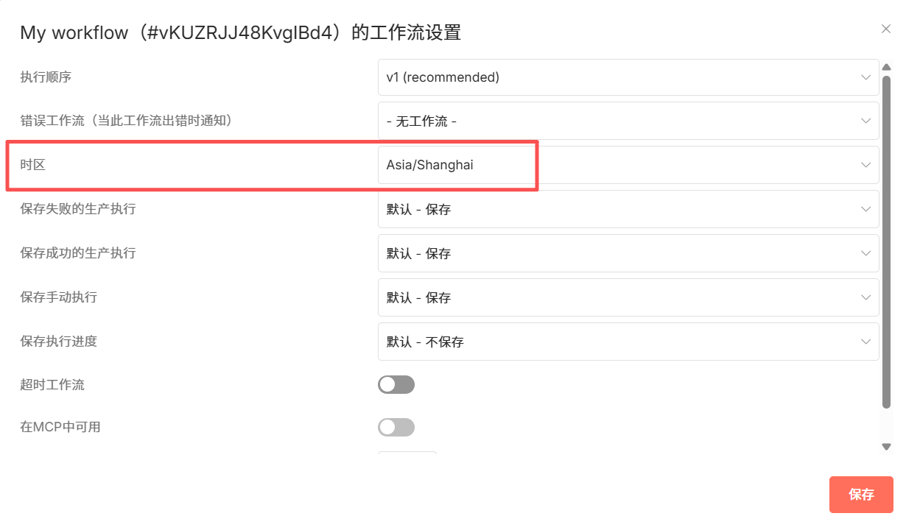
### 添加HTTP请求

使用HTTP请求组件获取天气信息。点击定时触发器后的“**+**”按钮，选择“**核心 -> HTTP Request**”组件。
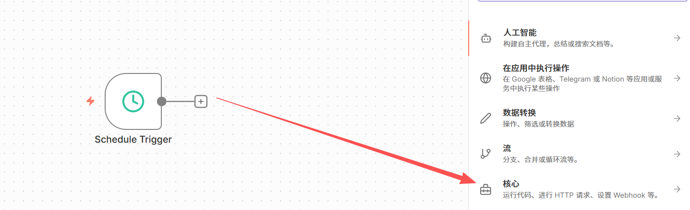
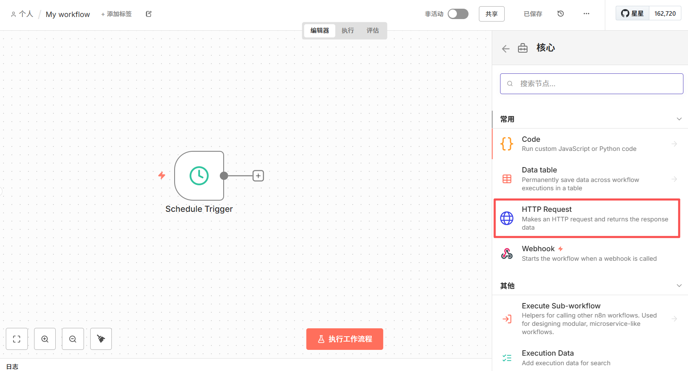
在弹出的HTTP请求界面展示三个部分：
- 左侧展示上一个组件的输出数据，此处作为输入数据
- 中间是HTTP Request的配置参数
- 右侧是当前组件的输出数据，且作为下一个组件的输入数据
开始配置参数，选择HTTP请求方法为 **GET**，并输入**URL**。（需要用户去注册接口盒子平台获取个人ID和KEY）
```
https://cn.apihz.cn/api/tianqi/tqyb.php?id=10011034&key=b4138a4432bf6ac940702dc1d9368969&sheng=湖北&place=武汉&day=1&hourtype=1
```
填入数据后，点击**执行步骤**，右侧查看输出结果（选择JSON）。
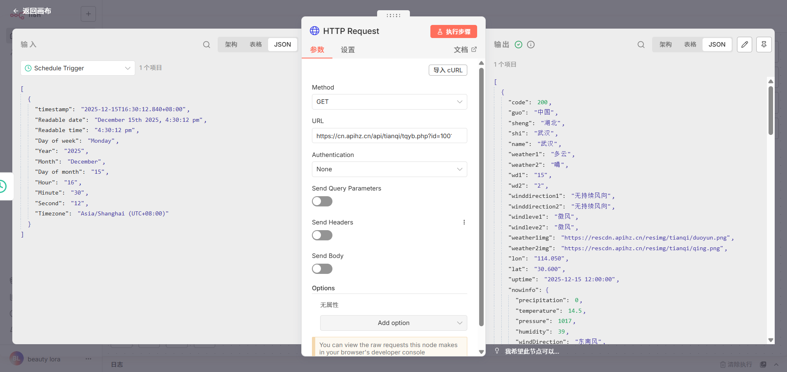
### 添加AI Agent组件

此时我们获取到的是全天的天气信息，所以我们要添加AI，将全部数据交给AI进行分析，并输出准确且简单易懂的结论。
点击上一个组件后的“**+**”按钮，选择“**人工智能 -> AI Agent**”组件。
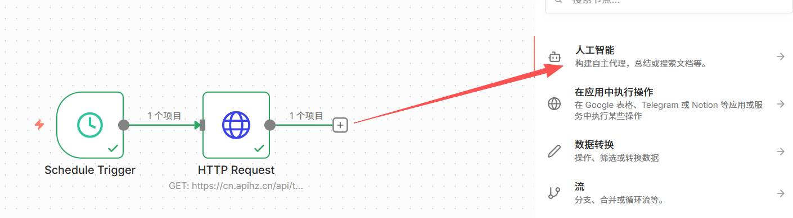
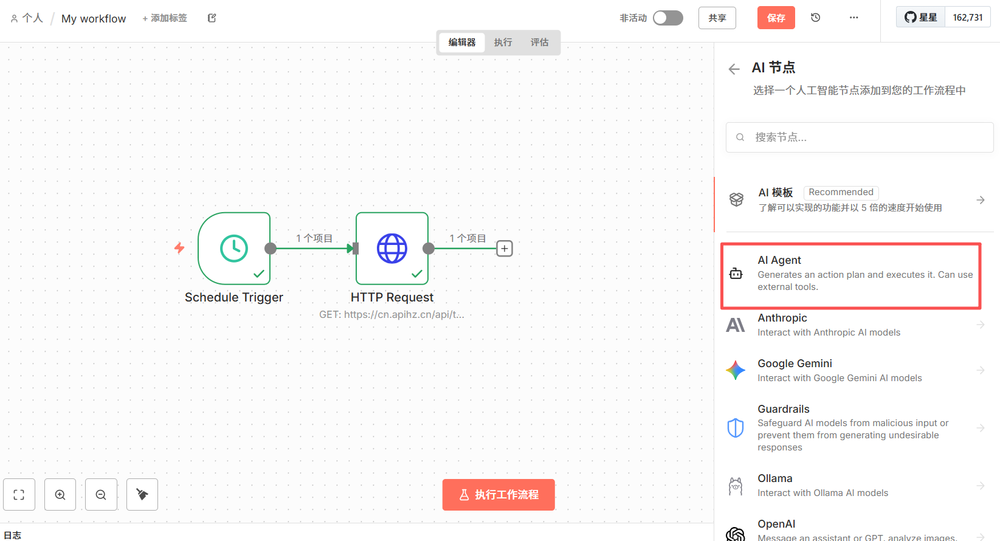
在弹出的AI Agent页面，选择**提示来源(Source for Promp)** 和**提示信息(Prompt)**。
- Source for Promp：选择Define below，自定义提示来源
- Prompt：鼠标悬浮Prompt输入框，右上角切换为*表达式*，输入<span v-pre>`{{ $json }}`</span>，意思是获取HTTP Request组件输出的全部json数据
点击**Add Option**按钮，选择System Message，输入要发给AI的消息。
```
你是一个专业的气象学家，并且很有生活经验。根据输入的信息，生成一个简短的邮件，邮件内容是对于出行和生活的提示，要求语气更生动一些，但也要带上数据，体现气象科学的严谨，只输出结果，不要思考过程:
```
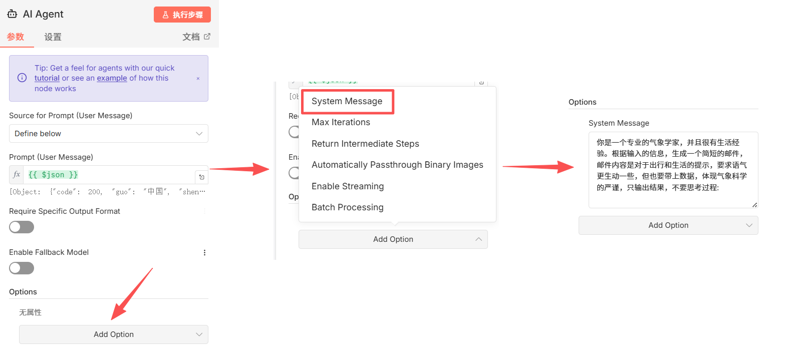
至此，添加AI Agent步骤完成，我们需要返回画布，在编辑器右上角点击“**保存**”按钮，并点击菜单“**个人**”切换页面，进行凭证和大语言模型的添加操作。
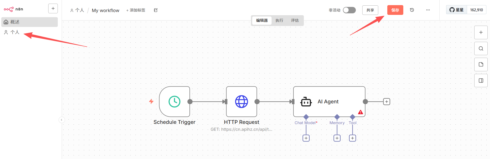
#### 添加凭证

在选择大语言模型前，我们需要添加模型的凭证信息。
浏览器新开一个页面，打开AGIOne平台，注册账号并登录，在模型广场中选择要添加的模型，点击**API调用**进入详情页面，获取**API Key**和**URL**信息。
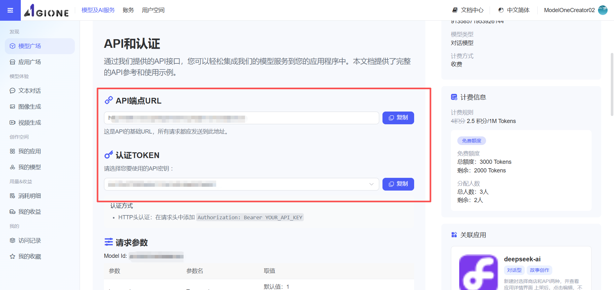
返回n8n个人页面，切换标签页到“**凭证**”，点击右上角“**创建凭证**”按钮，
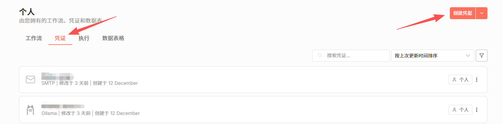
搜索要连接的应用或服务，此处搜索并选择**OpenAi**，点击“**继续**”，
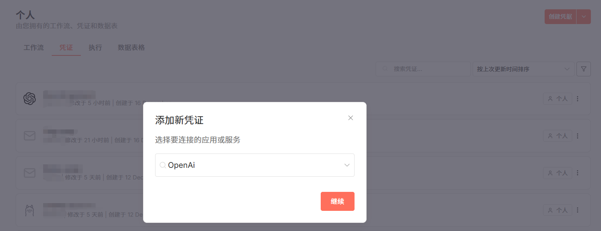
将获取到的**API Key**和**Base URL**填入面板并点击“**保存**”，页面提示连接测试成功，表示Key已生效，点击面板右上角“**×**”按钮，返回个人页面，凭证保存成功后我们要去选择并使用模型。
**Base URL**: ``https://zh.agione.co/hyperone/xapi/api``
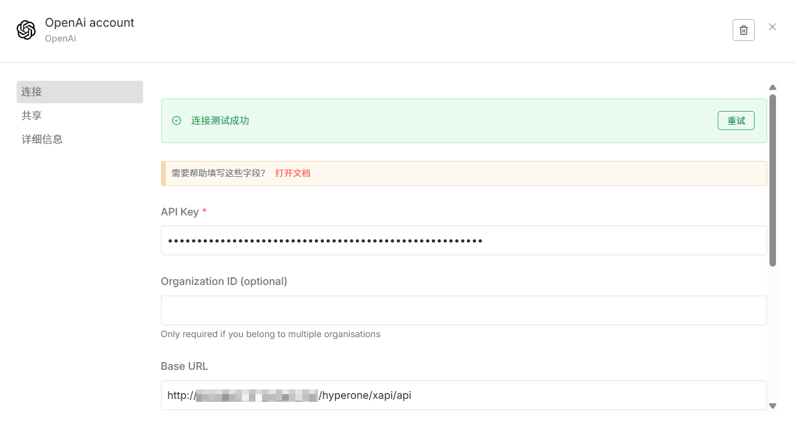

#### 添加大语言模型

切换到概览，点击刚刚保存的工作流“*My workflow*”，回到画布页面，
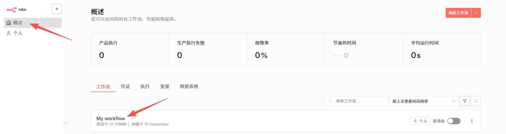
在画布页面，AI Agent组件下方有三个按钮，我们点击“**Chat Model +**”按钮，在Language Models页面选择一个模型，此处我选择“**OpenAI Chat Model**”。
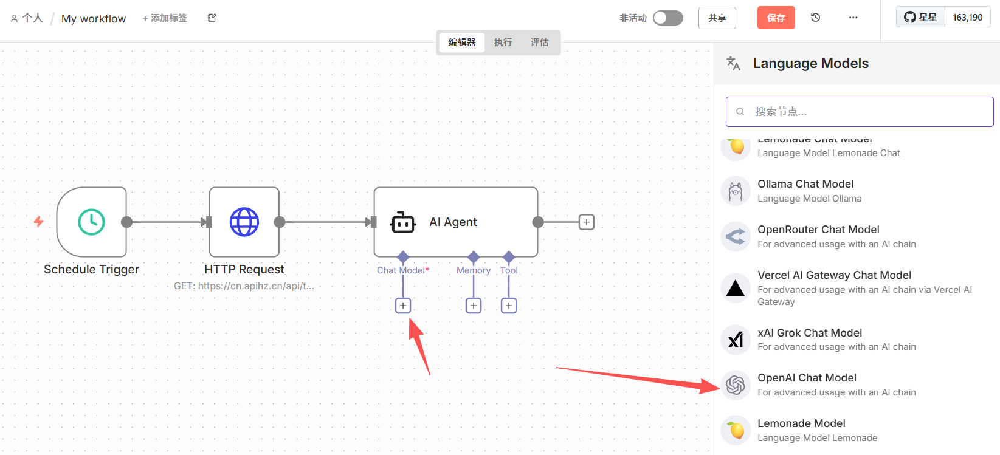
在弹出的OpenAI Chat Model页面，选择我们刚刚加入的**凭证**，Model筛选改为“*按ID*”，将在AGIOne平台中选择的模型ID复制到输入框，选择完成后返回画布，点击画布下方“**执行工作流程**”按钮。(暂不支持Responses API，请关闭`Use Responses API`开关)
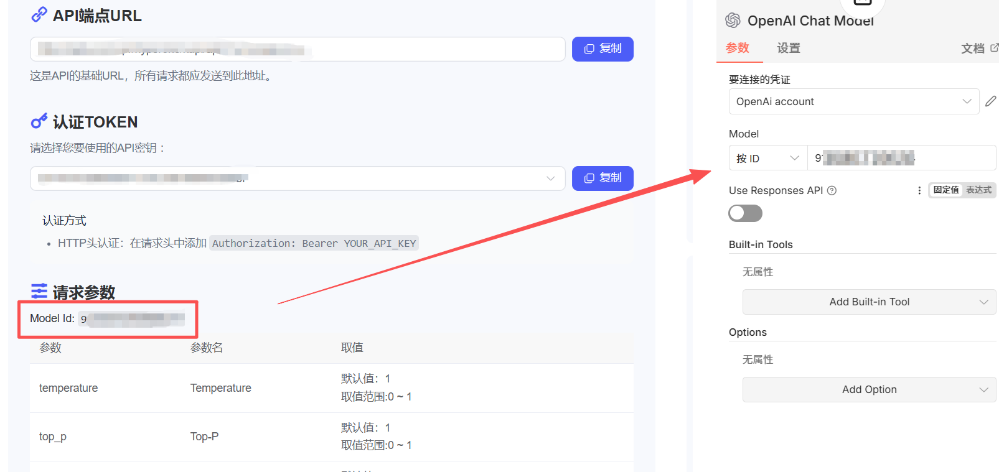
工作流执行完成后，双击AI Agent组件，观察配置页面左下角，模型添加成功，点击**执行步骤**，右侧查看输出结果（选择JSON）。
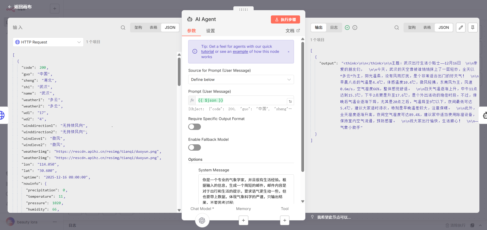
### 添加Markdown组件

AI输出的信息一般是Markdown格式，但邮件客户端不一定支持Markdown渲染，所以添加Markdown组件的目的是将Markdown转换成HTML。
点击上一个组件后的“**+**”按钮，选择“**数据转换 -> Markdown**”组件。
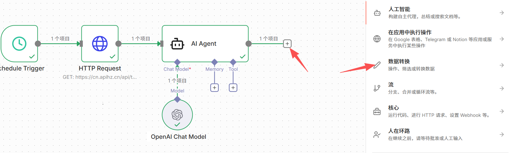
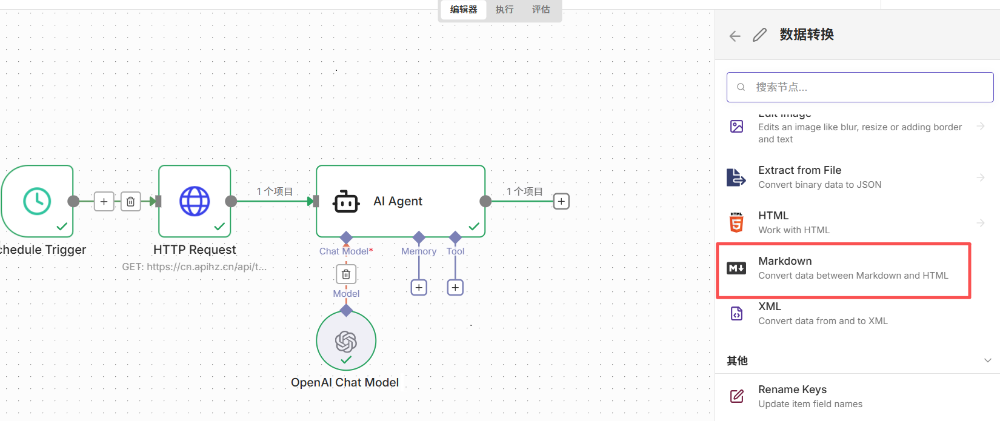
在弹出的Markdown页面：
- Mode选择**Markdown to HTML**
- 鼠标悬浮Markdown输入框，右上角切换为*表达式*，鼠标抓取输入数据中的output字段拖拽至Markdown输入框，自动生成表达式<span v-pre>`{{ $json.output }}`</span>，意思是获取AI Agent组件输出的json数据中output字段的值
- Destination Key默认使用data
配置参数后，点击**执行步骤**，右侧查看输出结果（选择JSON）。
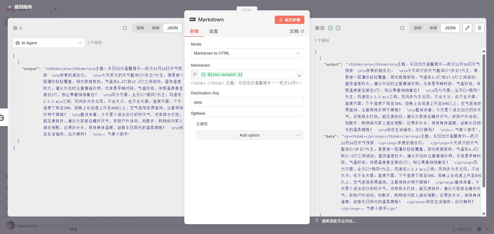
### 添加发送邮件组件

天气预报内容已生成，但我无法在每天的8点30打开n8n去执行工作流查看天气，所以要将信息每天自动发送至我的邮件，便于查看。
点击上一个组件后的“**+**”按钮，直接搜索email，选择“**Send Email -> Send an Email**”组件。
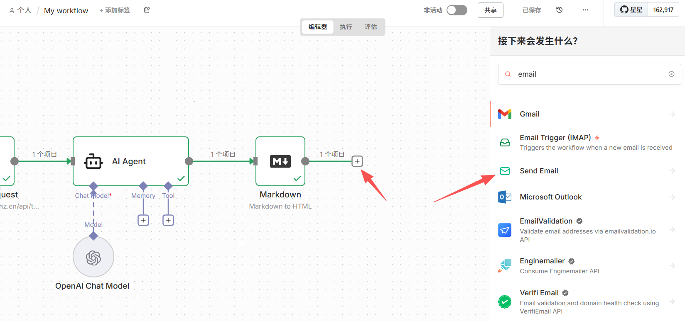
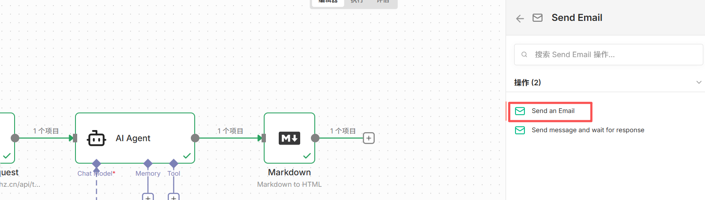
在弹出的Send Email页面，点击“要连接的凭证”下拉框，选择**创建新凭证**，在弹出的面板中，输入*User*、*Password*、*Host*和*Port*信息（这些信息可在所使用的邮件平台设置页面，*第三方客户端登录*中获取），点击**保存**按钮，页面提示连接测试成功，表示邮件信息已生效。
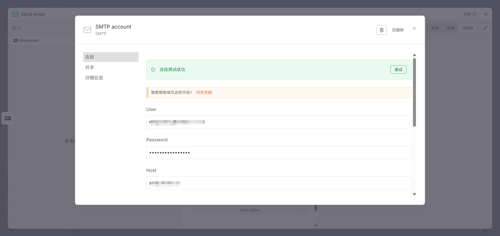
点击面板右上角“**×**”按钮，返回Send Email页面：
- 选择刚刚添加邮件凭证
- Operation：默认选择Send
- From Email：输入发件人的电子邮件地址
- To Email：输入收件人的电子邮件地址
- Subject：输入邮箱的主题，例如：武汉今日天气
- HTML：鼠标悬浮HTML输入框，右上角切换为*表达式*，使用鼠标将上一个组件输出的data数据拖拽至HTML框中
配置参数后，点击**执行步骤**，右侧查看输出结果（选择JSON）。
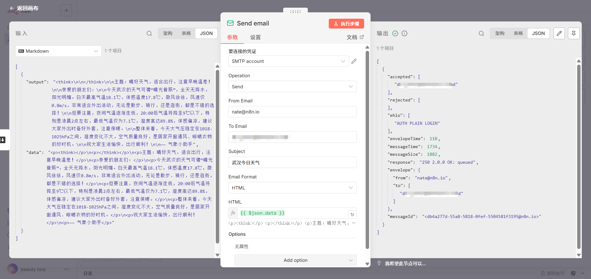
登录收件的邮箱地址，查看是否收到邮箱，若收到，表示发送成功。
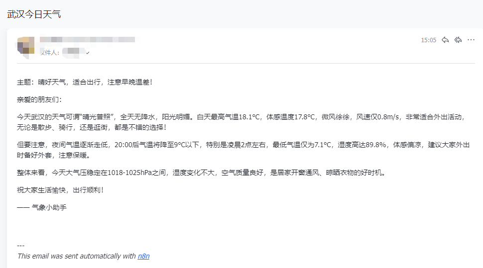
最后，返回画布，在编辑器左上角修改工作流名称为“*天气提示*”，在右上角**保存**和**激活**，这样工作流就会在每天早上8:30发送天气提示至邮件了！
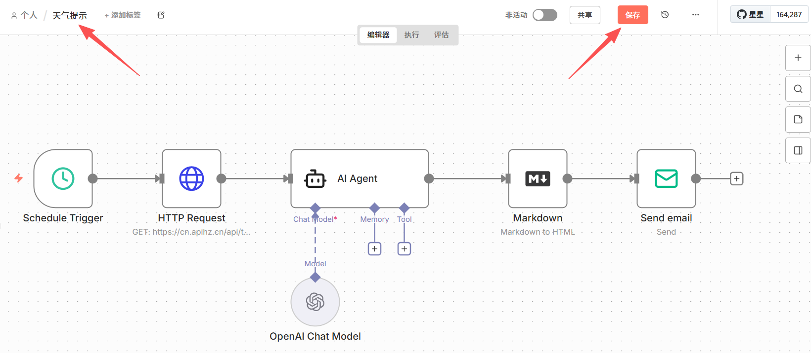
