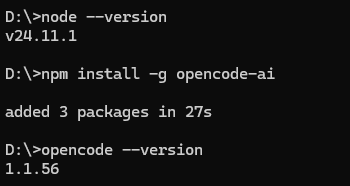
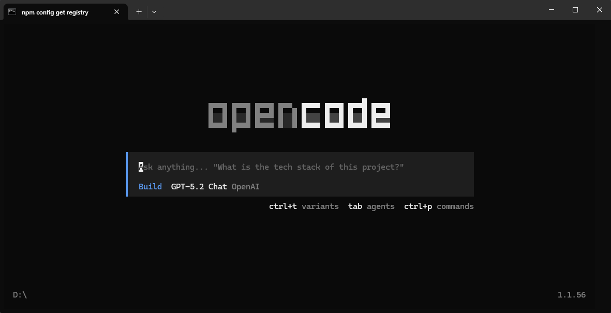
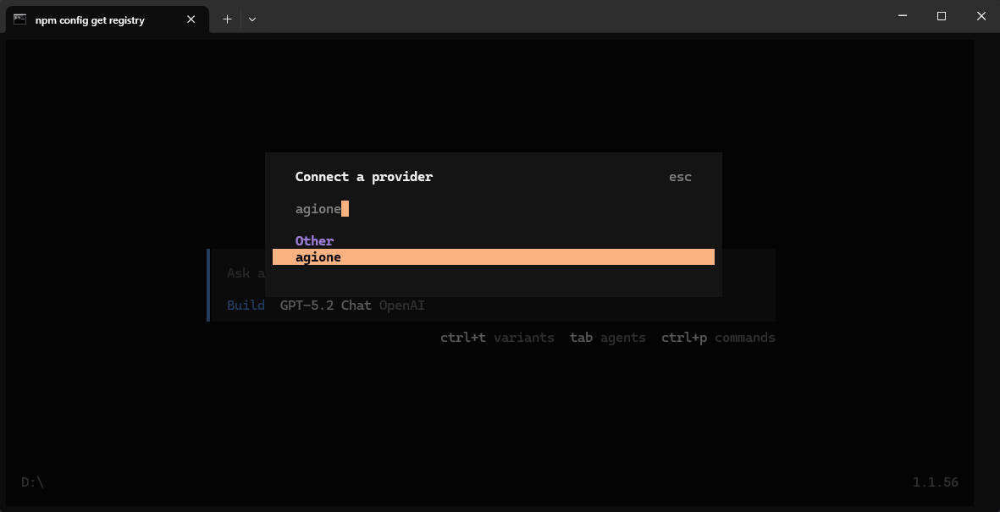
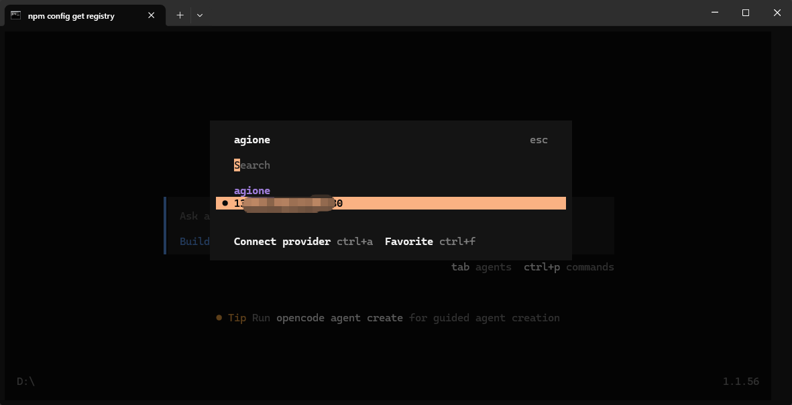
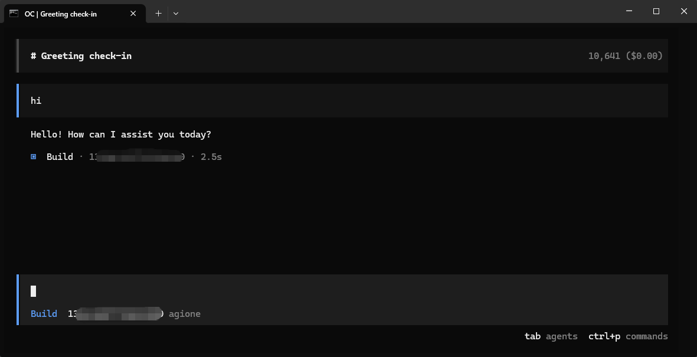

# 安装Open Code并使用AGIOne作为模型提供商

## 安装Open Code

1. 确保已安装Node.js（v20.x.x及以上版本）。
2. 安装OpenCode命令。
```
npm install -g opencode-ai
```
3. 验证安装结果
```
opencode --version
```


## 模型配置

1. 访问 [AGIOne](https://zh.agione.co/)，并注册一个账号。
2. 前往模型广场，选择一个模型，进入 api 调用页面，获取*Api key*和*model id*。

### 配置说明（使用AGIOne作为模型提供商）

在项目目录下创建opencode.json文件，配置提供商及模型信息。
- *name*：提供商名称（用户自定义，示例为agione）
- *baseURL*：`https://zh.agione.co/hyperone/xapi/api`
- *Authorization*：从AGIOne平台模型API调用页面 `认证 TOKEN` 中获取API Key
- `provider.models`：从AGIOne平台模型API调用页面请求参数中获取`Model Id`
- `model-id.name`：自定义模型名称
```json
{
  "$schema": "https://opencode.ai/config.json",
  "provider": {
    "myprovider": {
      "npm": "@ai-sdk/openai-compatible",
      "name": "agione",
      "options": {
        "baseURL": "https://zh.agione.co/hyperone/xapi/api",
            "headers": {
                "Authorization": "Bearer your_agione_key"
            }
      },
      "models": {
        "model-id": {
          "name": "model-name"
        }
      }
    }
  }
}
```
返回cmd，输入`opencode`打开文本用户界面。

使用 `/connect` 命令连接提供商，输入在JSON文件中设置的提供商名称。

再输入模型的API Key，按 Enter 键，即可选择我们加入的模型。


### 测试响应

在对话框中输入测试文本“hi”，若正常响应，说明配置成功。

