# 使用 Open WebUI 创建解读西游记的模型对话

## Open WebUI介绍

Open WebUI是一个可扩展、功能丰富且用户友好的‌**自托管AI平台**‌，专为完全离线操作而设计。以下是关于Open WebUI的详细介绍：
- ‌**多模型支持**‌：Open WebUI支持多种LLM（大语言模型）运行器，如Ollama和OpenAI兼容API，用户可以快速切换、加载和管理本地及远程的不同AI模型。
- ‌**RAG管道**‌：内置RAG（检索增强生成）推理引擎，支持从视频、文档或嵌入数据中提取内容进行处理。
- ‌**多模态支持**‌：支持文本、图片等多种数据类型输入，能够丰富交互体验。
- ‌**可定制性**‌：用户可以通过模型管理工具自定义模型的参数，如温度、上下文长度等，以满足个性化需求。
- ‌**内置记忆功能**‌：支持用户为模型添加记忆，以便在对话中持续使用，提升对话的连贯性和准确性。
- ‌**协作与分享**‌：支持本地聊天分享和会话克隆，方便团队协作或个人记录。
 
## 添加模型接口连接

点击右上角账户“**头像**”，选择**管理员面板**并点击，
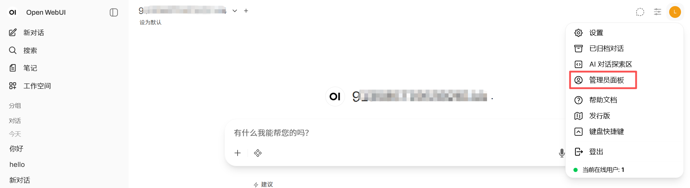
切换到*设置*页面，在`设置页面`的`外部连接`页面添加一项OpenAI API连接，点击尾部“**+**”按钮，
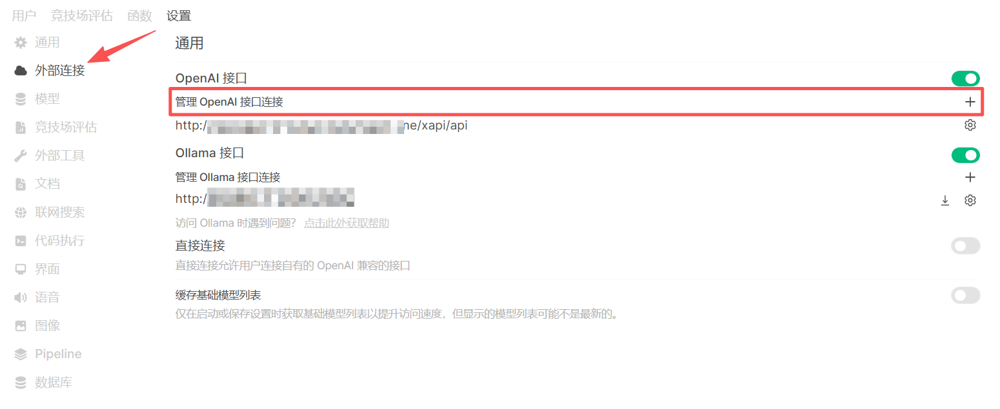
打开添加连接弹框后，保持页面不动。
新开浏览器标签页，打开AGIOne平台，在模型广场中选择要添加的模型，点击**API调用**进入详情页面，
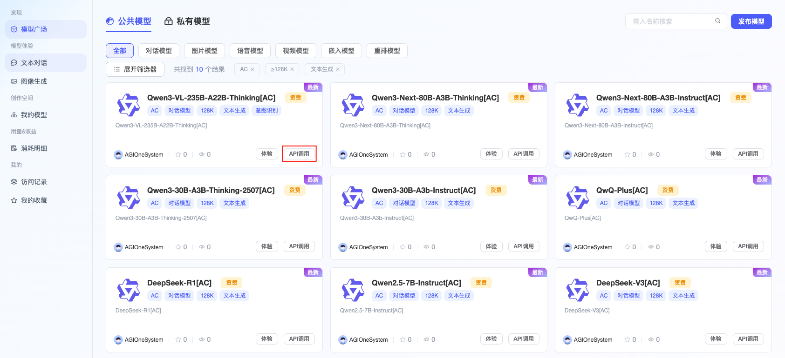
核心参数如下：
- URL 地址：``https://zh.agione.co/hyperone/xapi/api``
- API 密钥：在 `认证 TOKEN` 中获取 API 密钥
- 模型ID：在 `请求参数` 中获取
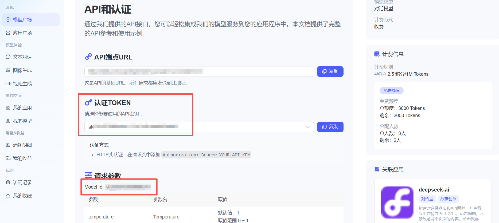
返回Open WebUI平台添加连接页面，将上述参数复制到对应的字段输入框中，检查信息填写无误，点击“**保存**”按钮，模型成功显示在列表中。
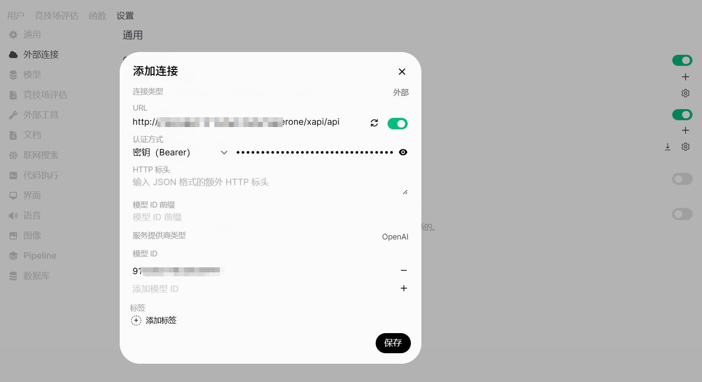
## 创建知识库

切换菜单到“**工作空间 -> 知识库**”，点击“**创建知识库**”按钮，
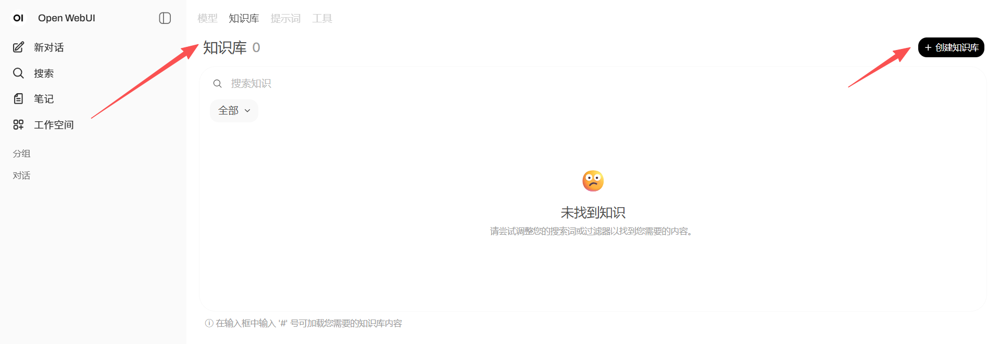
输入知识库名称和描述，点击右下角“**创建知识**”按钮，
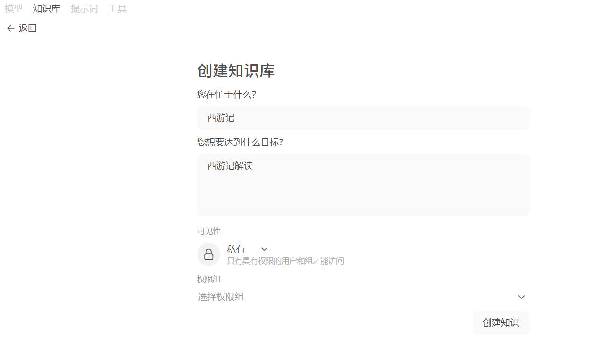
在西游记知识库中点击右侧“**+**”按钮，选择上传文件，将西游记TXT文件上传，若上传文件不成功，请打开管理员设置面板，在文档页面添加嵌入模型及其他配置。
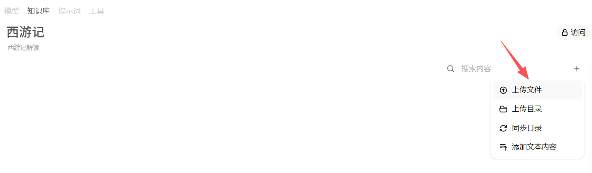
## 创建模型

切换至**模型**页面，点击“**创建模型**”按钮，
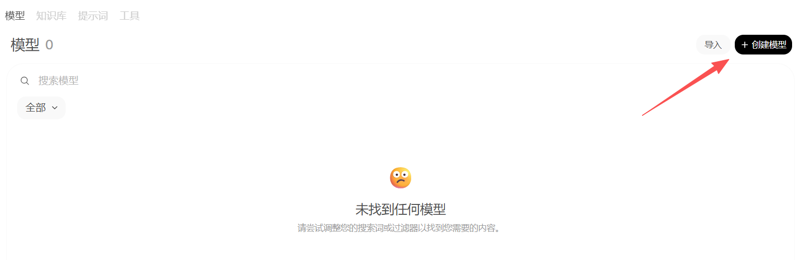
输入*模型名称*，并选择*基础模型*（第一步`添加模型接口连接步骤`中的模型），点击“*选择知识*”按钮，将知识库关联到模型，在右上角将访问改为*公共*，其他信息根据具体情况选择填写，模型配置完成后点击**保存并创建**按钮。
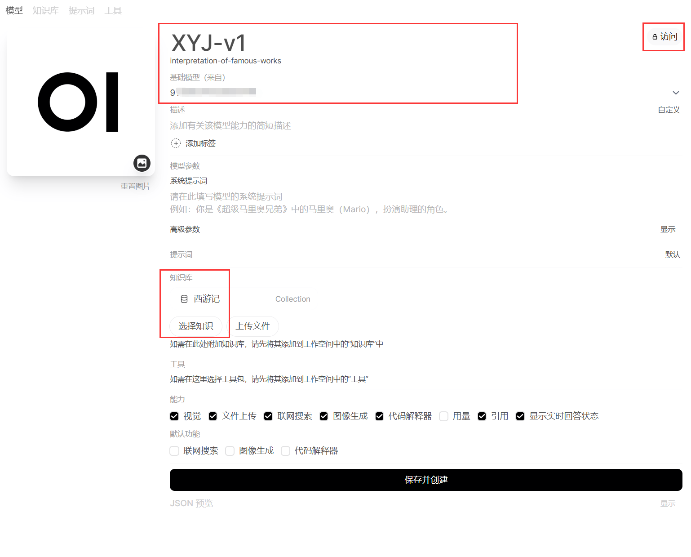
## 使用模型

切换菜单到**新对话**页面，选择刚刚添加的模型`XYJ-v1`，在对话框中输入有关西游记的提示词并发送，等待模型回答。
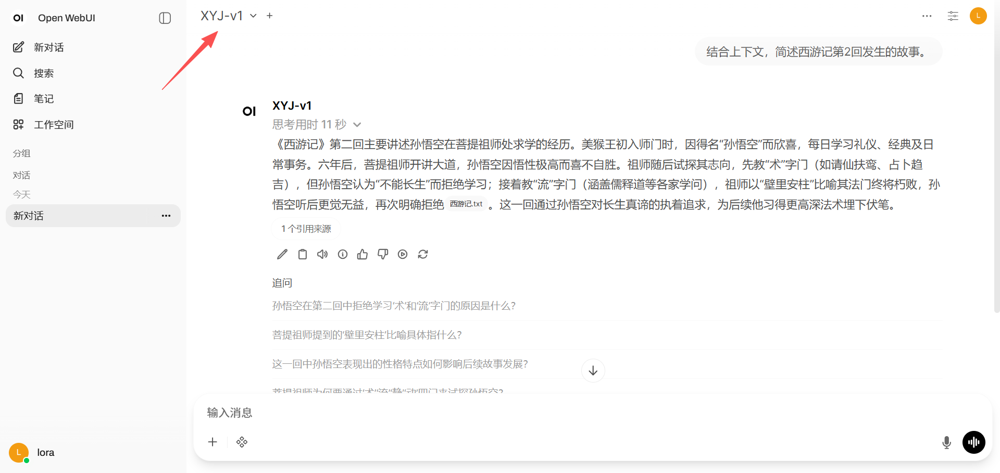
