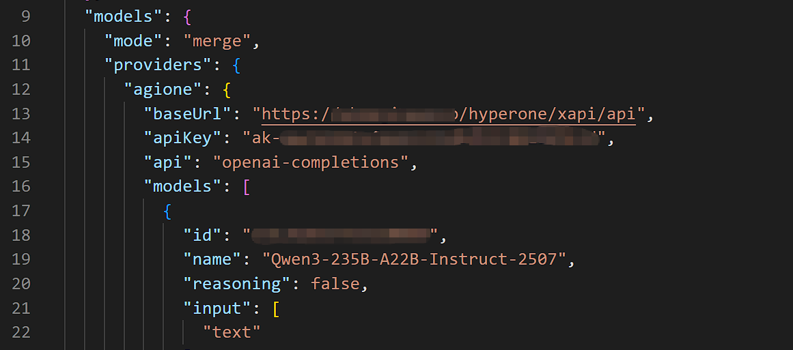
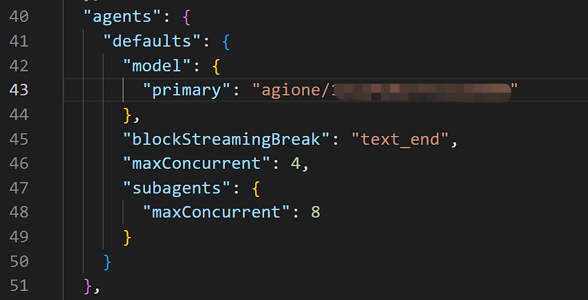
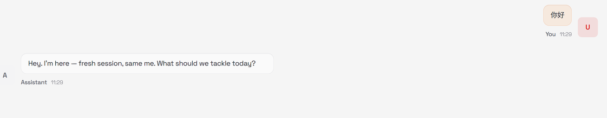

# 在Openclaw中添加AGIOne作为模型提供商

## 安装Openclaw

安装过程（略）

## 配置模型（使用AGIOne作为模型提供商）

### 手动修改配置文件
```
提示信息：目前不支持在不先修改配置文件的情况下通过 openclwa 命令修改 AGIOne 模型。
```

1. 编辑`~/.openclaw/openclaw.json`，在`models.providers`中添加AGIOne模型提供商
    - *provider*：agione（用户自定义）
    - *baseUrl*：`https://zh.agione.co/hyperone/xpai/api`
    - *api*：openai-completions
    - *id*："AGIOne上的模型id"
    - *name*："AGIOne上的模型名称"
    
2. 在`models.agents`中修改要使用的AGIOne模型
	- *primary*: "agione/AGIOne上的模型id"    `# 格式：agione/模型id，agione与providers里一致即可`
	
3. 重启Gateway服务
```Plain
openclaw gateway restart

# 如使用其他版本或方式部署，重启服务即可
```
4. 测试响应：在chat中，发送测试信息如“你好”，若返回正常响应，说明配置成功。

