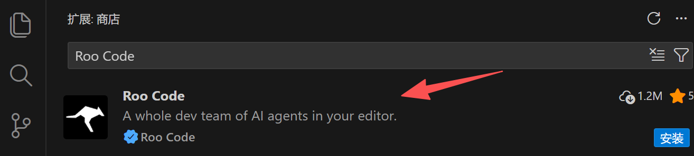
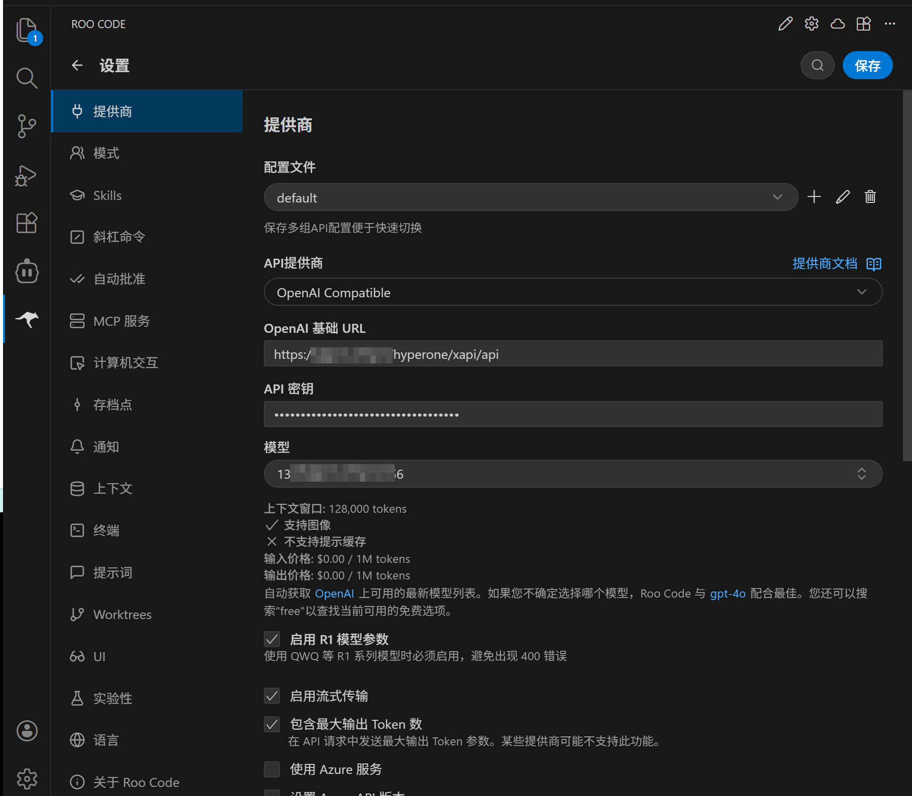
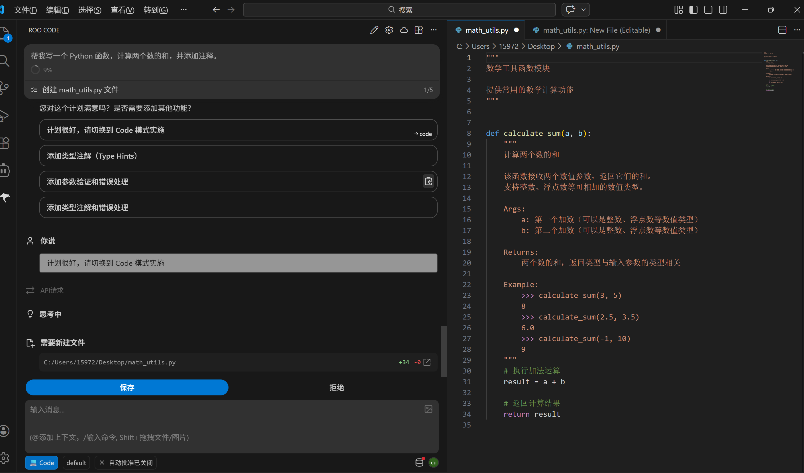

# 在VSCode中使用Roo Code接入AGIOne模型

## 安装Roo Code插件    

1. 安装并打开VS Code。
2. 在VS Code中进入扩展商店并搜索**Roo Code**，点击**安装**。

## 模型配置

1. 访问 [AGIOne](https://zh.agione.co/)，并注册一个账号。
2. 前往模型广场，选择一个模型，进入 api 调用页面，获取*Api key*和*model id*。

### 配置说明（使用AGIOne作为模型提供商）

安装完成后，进入设置界面填写相关信息：
- *API供应商*：选择 `OpenAl Compatible`
- *OpenAI 基础 URL* ：`https://zh.agione.co/hyperone/xapi/api`
- *API密钥*：从AGIOne平台模型API调用页面 `认证 TOKEN` 中获取
- *模型*：从AGIOne平台模型API调用页面请求参数中获取`Model Id`

### 开始使用

模型添加成功后返回对话框界面，输入简单的任务描述，例如：帮我写一个 Python 函数，计算两个数的和，并添加注释。

