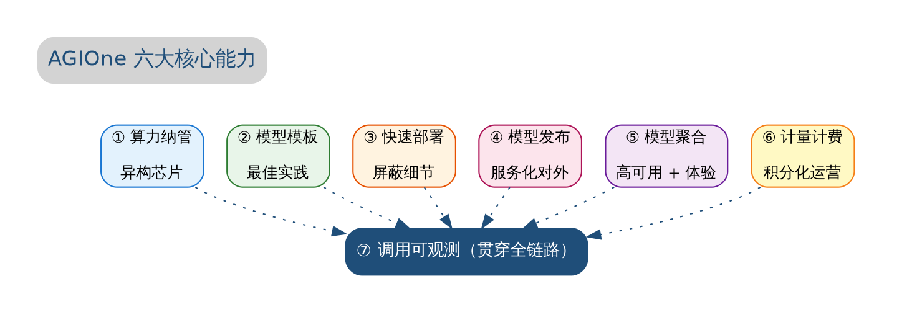
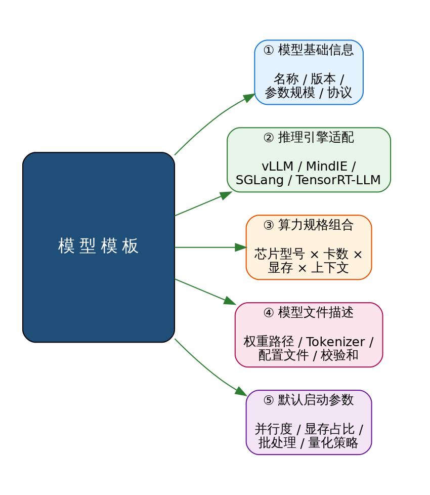
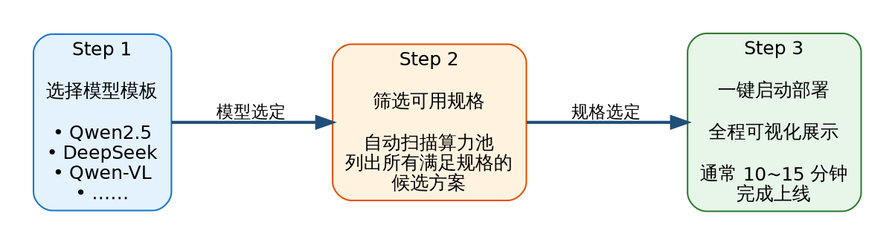
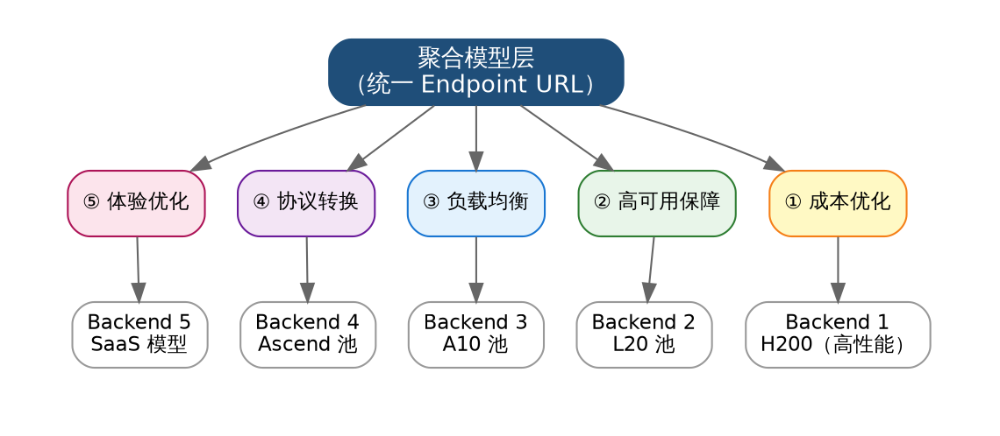
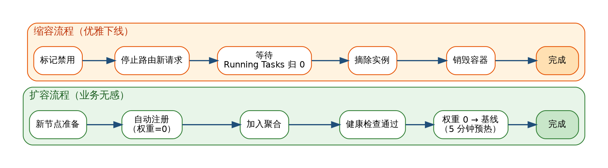
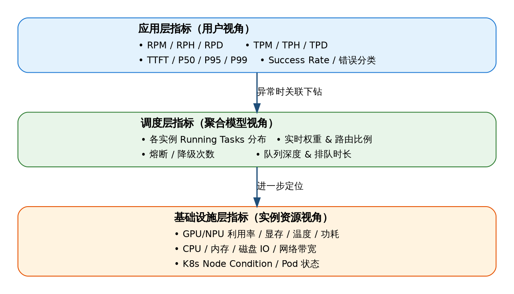
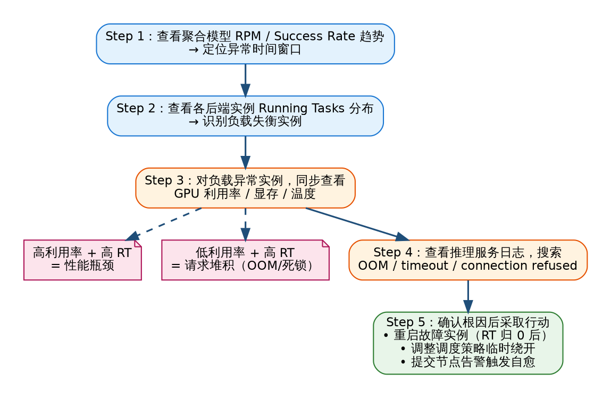
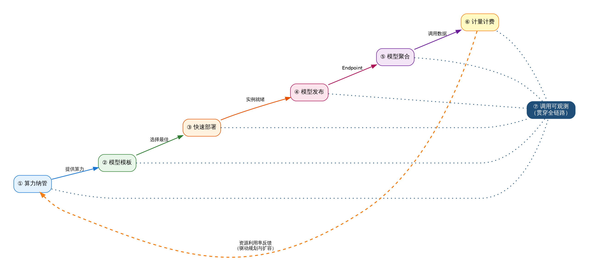

# 核心能力与功能

## 概览

AGIOne 是面向企业级大模型生产化运营的 **一站式智能算力与模型管理平台**，围绕「**算力 → 模型 → 服务 → 运营**」的端到端闭环，提供六大核心能力：



<p align="center"><i>图 1   AGIOne 六大核心能力总览（含贯穿全链路的调用可观测）</i></p>

> 第七项「**调用可观测**」横向贯穿前六项能力，提供从硬件资源到业务调用的全链路可视化与分析。

---

## 一、算力纳管 — 异构芯片统一池化

### 1.1 能力概述

AGIOne 通过统一的算力纳管层，将客户分布在 **不同机房、不同厂商、不同代际** 的加速卡（GPU / NPU）整合为一个 **逻辑上统一、物理上异构** 的算力资源池，并依据业务规格需求 **自动调度分配**，从根本上解决企业算力资源碎片化、利用率低、扩容困难等痛点。

### 1.2 支持的异构芯片清单

| 厂商 | 架构 / 系列 | 典型型号 | 推理引擎适配 |
|---|---|---|---|
| **NVIDIA** | Hopper       | H200 / H20 / H100 / H800                                 | vLLM / TensorRT-LLM / SGLang |
| **NVIDIA** | Ada          | L40 / L40S / L20 / L20S / L4 / L2 / RTX 4090 等           | vLLM / TensorRT-LLM |
| **NVIDIA** | Ampere       | A100 / A800 / A40 / A30 / A10 / RTX A 系列 / RTX 30 系列 | vLLM |
| **华为昇腾** | Ascend 910 | 910B / 910C                                              | MindIE |
| **燧原**   | Enflame      | 106                                                      | 厂商推理框架 |
| **壁仞**   | Biren        | S60                                                      | 厂商推理框架 |

### 1.3 核心子能力

#### 1.3.1 节点纳管与生命周期管理

- **多集群纳管**：支持跨机房、跨网络域（公有云 HCS、私有云、IDC 物理机）以「中心管控 + 边缘执行」架构纳入同一管控视图；
- **节点初始化**：提供标准化节点初始化脚本，自动安装容器运行时、K8s kubelet、加速卡驱动、AGIOne Agent 等组件；
- **基础镜像规范**：制作含 OS / 驱动 / K8s 组件 / Agent 的基础镜像，**故障节点 OS 重装后可在 15 分钟内自动恢复**；
- **故障自愈**：心跳探测失败自动摘除流量 → OS 重装 → 自动注册 → 健康检查通过 → 自动接入流量，全流程自动化。

#### 1.3.2 资源调度与分配策略

| 调度维度 | 策略                                                           | 适用场景 |
|---|--------------------------------------------------------------|---|
| **按硬件标签调度** | 通过 `xpu_type=ascend-910b64g` / `nvidia-h2096g` 等标签精准路由       | 不同推理引擎绑定不同芯片 |
| **按显存规格调度** | 根据模型显存需求自动选择满足条件的卡（如 72B 模型需 ≥ 80G HBM）                      | 大模型推理 |
| **按业务优先级调度** | 核心业务优先占用高性能卡，次级业务使用剩余资源                                      | 多业务线共用 |
| **多卡并行调度** | 自动配置 `tensor_parallel_size` / `world_size`，支持 HCCL / NCCL 通信 | 单机多卡、多机多卡 |
| **弹性自动扩缩** | 基于负载趋势自动横向扩展实例数，实例从 4 → 36 不影响在线业务                           | 高并发推理 |

#### 1.3.3 硬件监控指标

通过 DCGM（NVIDIA） / npu-exporter（Ascend）实时采集，**15~30 秒粒度** 推送至监控大盘：

- **GPU/NPU 计算利用率** & SM 占用率
- **显存使用量** & 显存带宽
- **核心温度** & 显存温度
- **实时功耗** & TDP 使用率
- **NVLink / InfiniBand 带宽** & 健康状态


## 二、模型模板 — 沉淀最佳实践

### 2.1 能力概述

AGIOne 基于 **海量历史部署经验**，将每一个主流大模型的部署知识沉淀为 **可复用的模型模板**，把"部署一个模型需要多少卡、用什么引擎、用什么参数"这种 **依赖专家经验** 的工作转化为 **开箱即用的标准产品**。

### 2.2 模型模板包含内容

每个模型模板封装以下五类信息，构成完整的部署知识资产：



<p align="center"><i>图 2   模型模板的五大组成</i></p>

### 2.3 内置模型模板示例

#### 2.3.1 主流大模型预置模板示例

| 模型系列 | 典型版本 | 参数规模 | 推荐算力规格 | 推理引擎 | 上下文支持 |
|---|---|:---:|---|:---:|:---:|
| **DeepSeek**       | V3.1 / R1                | 671B MoE / 7B-70B | H200×8 / H20×4 + RDMA  | vLLM         | 32K/64K/128K |
| **Qwen**           | QwQ-32B                  | 32B               | H20×2 / L20×4           | vLLM         | 32K/64K       |
| **Qwen-VL**        | 2 / 3                    | 7B / 14B / 72B     | H20×2 / H200×2          | vLLM         | 多模态        |
| **InternLM**       | 2-20B                    | 20B               | H200×2 / Ascend 910B×4  | vLLM/MindIE  | 32K           |
| **GLM**            | 4.6                      | —                 | H20×4                   | vLLM         | 32K           |
| **嵌入/重排**      | bge-m3 / bge-reranker / qwen3-embedding | — | L20×1 / L4×2     | vLLM         | —             |

#### 2.3.2 单模板的多规格变体

同一个模型可在模板内提供 **多种规格变体**，对应不同的业务场景：

| 模型 | 规格变体 | 推荐硬件 | 上下文 | 并发 | 适用场景 |
|---|---|---|:---:|:---:|---|
| **Qwen2.5-7B**   | 标准型 | L20 × 1 | 32K  | ≥ 50 QPS | 高并发问答 |
| **Qwen2.5-32B**  | 平衡型 | L20 × 2 | 64K  | 20-50 QPS | 文档分析 |
| **Qwen2.5-72B**  | 长上下文 | H20 × 4 | 128K | 5-20 QPS | 工程报告分析 |
| **DeepSeek-V3** | 旗舰推理 | H200 × 8 + RDMA | 128K | 10-30 QPS | 复杂推理任务 |

### 2.4 模板版本管理

- **官方模板**：AGIOne 团队持续维护，跟随主流模型版本更新；
- **企业自定义模板**：客户可基于实际业务场景沉淀专属模板（如「微调后的 Qwen3-VL-7B 在 4×L20 上的最佳配置」），形成企业内部最佳实践库；
- **模板共享市场**：在企业内部跨团队共享模板，避免重复探索；
- **模板版本追溯**：每次更新保留历史版本，支持回滚。

## 三、快速部署 — 屏蔽技术细节的"一键化"体验

### 3.1 能力概述

基于模型模板能力，AGIOne 把模型部署这件原本需要多名工程师协同、耗时数天的复杂工作，转化为 **「选模型 → 选规格 → 一键部署」** 的产品化流程，彻底屏蔽推理框架配置、显存计算、并行参数、容器编排等复杂的技术细节，**让普通运维 / 业务人员也能完成专业级的模型部署**。

### 3.2 三步快速部署流程



<p align="center"><i>图 3   快速部署三步流程</i></p>

### 3.3 智能规格筛选

用户选定模型后，AGIOne **自动扫描当前算力池**，依据下列条件即时计算并展示所有 **可立即部署的规格组合**：

| 筛选条件 | 自动判断逻辑 |
|---|---|
| **显存够不够**       | 计算模型权重 × 量化系数 + KV Cache 预留 + 系统开销 |
| **卡数够不够**       | 检查目标算力池中空闲卡数 ≥ `tensor_parallel_size` |
| **网络满不满足**     | 多机部署时验证 RDMA 带宽与延迟 |
| **驱动版本兼容**     | CUDA / CANN 版本与镜像要求匹配 |
| **存储空间够不够**   | 校验数据盘剩余空间 ≥ 模型权重大小 × 1.2 |
| **当前优先级冲突**   | 检查是否会抢占核心业务正在使用的资源 |

### 3.4 部署过程可视化

部署启动后，UI 上 **逐阶段实时显示** 全过程，让用户对部署状态心中有数：

| 阶段 | UI 展示内容 | 典型耗时 |
|:---:|---|:---:|
| **① 资源分配**         | 高亮显示选中的物理卡（机柜 / 节点 / 卡号），动画展示资源锁定 | < 30 秒 |
| **② 容器调度**         | K8s Pod 创建进度，调度策略、节点匹配、资源 quota 校验 | 30 秒 ~ 2 分钟 |
| **③ 镜像拉取**         | 推理引擎镜像下载进度条（近端镜像服务可秒级完成） | 1 ~ 5 分钟 |
| **④ 模型加载**         | 模型权重从共享存储加载至显存，分片加载进度 | 2 ~ 10 分钟 |
| **⑤ 引擎初始化**       | vLLM / MindIE 启动日志实时滚动，PagedAttention 初始化 | 30 秒 ~ 2 分钟 |
| **⑥ 健康检查**         | HTTP `/health` 探针、推理预热请求、TTFT 基准测试 | 30 秒 ~ 1 分钟 |
| **⑦ 接入聚合 / 路由**  | 实例注册到 API 网关 / 聚合模型，权重从 0 线性升至基线 | 30 秒 ~ 5 分钟 |

整个流程通常 **10-15 分钟内完成**，全程无须命令行、无须手动配置 yaml、无须了解推理框架细节。

### 3.5 失败回滚与诊断

- **任一阶段失败**自动回滚已分配资源，避免资源泄漏；
- **失败原因** 通过规则引擎定位：「显存不足 / 镜像拉取超时 / 模型文件校验失败 / 端口冲突」等典型错误均有明确提示；
- **历史部署记录**完整保留，支持复盘与归因。

---

## 四、模型发布 — 服务化对外暴露

### 4.1 能力概述

AGIOne 将部署完成的模型实例 **服务化封装为标准 Endpoint**，通过统一的认证机制、定价策略与限流配置，将模型能力安全、可控地对外提供给业务方调用，实现 **从「能用」到「能商用」** 的关键跨越。

### 4.2 Endpoint 标准化封装

| 封装维度 | 内容 |
|---|---|
| **协议兼容**       | OpenAI 兼容（`/v1/chat/completions`、`/v1/embeddings`、`/v1/models`）<br>Anthropic 兼容（`/v1/messages`），现有客户端零改造迁移 |
| **Endpoint URL**   | 标准 URL 形式，如 `https://agione.example.com/v1/chat/completions`，配合自定义 `model` 字段路由 |
| **请求 / 响应规范** | 完全符合社区标准，工具调用（Function Calling）、流式输出（SSE）、多模态输入全支持 |
| **错误码规范**     | 标准 HTTP 状态码 + 业务错误码，便于客户端统一处理 |

### 4.3 认证与权限

- **API Key 认证**：每个租户 / 业务线下发独立 API Key，支持多 Key 并存与 Key 轮换；
- **OAuth 2.0 / SSO**：与企业身份系统对接（LDAP / 钉钉 / 企业微信 / SAML），实现统一身份；
- **RBAC 权限模型**：按租户 → 项目 → 模型 → 操作 四级粒度授权，控制谁可以调用、谁可以查看账单、谁可以管理实例；
- **IP 白名单**：单 Key 可绑定来源 IP 段，进一步收紧访问控制。

### 4.4 定价配置

发布时即可为每个 Endpoint 配置 **差异化定价策略**：

| 计价模式 | 适用场景 | 配置示例 |
|---|---|---|
| **按 Token 计价（输入 / 输出分价）** | 通用对话、文档生成 | DeepSeek-V3：输入 ¥0.12/千 Token，输出 ¥0.48/千 Token |
| **按调用次数计价**     | 固定结构请求（OCR、向量化） | Embedding：¥0.001 / 次 |
| **按时长计价**         | 流式输出、长任务 | 语音合成：¥0.05 / 秒 |
| **按资源独占计价**     | 包卡 / 包实例 | H200×8：¥XXX / 月独占 |
| **混合计价**           | 复杂场景 | 基础包 + 超量按 Token |

支持 **不同租户 / 不同时段 / 不同模型规格** 配置差异化价格（如内部业务部门成本价、合作伙伴优惠价、外部客户标准价）。

### 4.5 多维限流配置

AGIOne 在 API 网关层提供 **细粒度多维限流**，防止单一调用方过载、保障核心业务质量：

| 限流维度 | 配置粒度 | 典型场景 |
|---|---|---|
| **按租户 RPM/TPM** | 每租户独立配额 | 智能制造事业部：RPM=500, TPM=2,000,000 |
| **按 API Key**     | 单 Key 独立限流 | 防止 Key 泄漏导致大量盗刷 |
| **按用户 RPM/TPM** | 租户内单用户限流 | 单用户：RPM=30, TPM=100,000 |
| **按模型限流**     | 按 Endpoint 限流 | 128K 长上下文：RPM=50（保护稳定性） |
| **按时间段差异**   | 工作时间 vs 夜间 | 工作时间高优先级，夜间放宽限制 |
| **按场景差异**     | 不同 API 路径 | `/chat/completions` RPM=1000，`/embeddings` RPM=5000 |

**超限策略** 可选「直接拒绝（HTTP 429）」或「排队等待」，核心业务推荐排队不丢请求。

### 4.6 灰度发布与版本管理

- **灰度发布**：新模型先以 1% 流量接入，逐步放量至 10% / 50% / 100%；
- **A/B 测试**：同一 Endpoint 下并行运行两个版本，按用户标签或随机分流，用于效果对比；
- **快速回滚**：发现异常一键切回上一版本，秒级生效；
- **版本归档**：保留历史发布记录，支持随时查询某次发布的配置详情。

---

## 五、模型聚合 — 多目标优化的智能编排

### 5.1 能力概述

聚合模型（Aggregated Model）是 AGIOne 的 **核心价值抽象**：在 **逻辑上**，对外是一个统一的模型 Endpoint；在 **物理上**，由多个后端推理实例（可跨硬件、跨集群、跨地域）组成。聚合层根据 **成本、高可用、负载均衡、协议转换、用户体验** 等多维需求，**实时动态决策** 每一次请求路由至最合适的后端，让上游应用无须感知后端的复杂性。

### 5.2 聚合模型五大优化目标



<p align="center"><i>图 4   聚合模型的五大优化目标</i></p>

### 5.3 五种聚合策略详解

#### 5.3.1 成本优化型聚合

- **诉求**：以最低成本满足 SLA
- **策略**：优先路由至单 Token 成本最低的后端实例（如优先用 L20 而非 H200，优先用 INT4 量化版本）
- **典型场景**：日常问答、内部办公助手、知识库检索

#### 5.3.2 高可用型聚合（HA）

- **诉求**：99.9%+ 服务可用性，单点故障不中断
- **策略**：多实例热备，心跳探测失败 2 次（60 秒）自动摘除流量；故障节点恢复后自动接入；跨机房 / 跨可用区部署
- **典型场景**：核心业务系统集成、对外商用 API

#### 5.3.3 负载均衡型聚合

- **诉求**：避免实例间负载失衡（推理任务耗时不均，简单轮询会导致部分实例过载）
- **策略**：基于 **实时 Running Tasks 数** 的动态加权分发，公式：

```
Weight(i) = BaseCapacity(i) × HealthScore(i) / (RunningTasks(i) + 1)
```
其中：
- `BaseCapacity` — 该实例压测 TPM 基线归一化值（体现硬件性能差异）
- `HealthScore` — 0.0~1.0（成功率），异常时降为 0
- `RunningTasks` — 当前正在处理的请求数（实时采集）

调度器 **每 1 分钟更新一次权重**，请求自动倾向于负载较低的健康实例。

#### 5.3.4 协议转换型聚合

- **诉求**：上游用 OpenAI 协议，但后端实例可能是不同推理框架、不同协议
- **策略**：聚合层在请求 / 响应路径上 **自动转换协议格式**，后端模型无感知
- **支持转换**：OpenAI ⇄ Anthropic、OpenAI ⇄ MindIE 原生协议、流式 ⇄ 非流式

#### 5.3.5 体验优化型聚合

- **诉求**：低 TTFT、高输出速率，提升用户感知
- **策略**：基于 **历史 P95 延迟与输出 TPS** 选择体验最佳的实例；可配置 SLA 阈值（如 TTFT < 2s），不达标实例降权
- **典型场景**：交互式 ChatBox、实时智能体对话

### 5.4 多场景聚合配置

| 聚合场景 | 后端实例数 | 负载策略 | 超时配置 | 适用时段 |
|---|:---:|---|:---:|---|
| **小部分负载（白天 API 支撑）** | 3 ~ 5  | 体验+轮询均衡 | 3000s | 工作日 08:00-20:00 |
| **大部分负载（白天批量报告）** | 10 ~ 30 | 体验+轮询均衡 | 3000s | 工作日 09:00-20:00 |
| **全量负载（夜间批处理）** | 全部实例 | 体验+轮询 + Batching | 3000s | 每日 20:00 - 次日 08:00 |

### 5.5 聚合模型的扩缩容（业务无感）



<p align="center"><i>图 5   聚合模型的扩缩容流程（业务无感）</i></p>

**全程聚合 Endpoint URL 不变，上游调用者完全无感知**。

---

## 六、计量计费 — 精细化运营管控

### 6.1 能力概述

AGIOne 提供 **企业级 SaaS 化计量计费体系**，将每一次模型调用精确转化为可量化、可分摊、可结算的业务数据，并通过 **积分制** 实现内部业务部门的灵活计价与统一对账，让 AI 成本从"黑盒"走向"完全透明"。

### 6.2 多维计量数据采集

每一次 API 调用，AGIOne 都会精准记录以下计量数据：

| 计量维度 | 采集内容 | 计量精度 |
|---|---|:---:|
| **输入 Token 数** | 实际计算后的输入 Token（含系统提示词、对话历史） | 精确至 1 Token |
| **输出 Token 数** | 模型实际生成的 Token 数（流式中断也精确记录） | 精确至 1 Token |
| **调用次数**       | API 调用次数（成功 / 失败分别统计） | 精确至 1 次 |
| **推理时长**       | 端到端处理时长（用于按时长计费场景） | 精确至 1 ms |
| **资源占用时长**   | 独占实例 / 包卡场景下的资源持有时长 | 精确至 1 秒 |
| **多模态计量**     | 图像数 / 音频时长 / 视频帧数（视模态而定） | 视类型 |

### 6.3 积分制定价体系

AGIOne 采用 **积分** 作为内部统一的计价单位，相比直接金额计价具有显著优势：

- **统一可比**：不同模型、不同业务、不同结算周期均以积分核算，避免汇率 / 价格波动；
- **灵活兑换**：积分可按可配置比例与实际金额互换（如 1 元 = 100 积分，比例可按业务需求调整）；
- **跨期延续**：积分可按月度 / 季度 / 年度滚动，剩余积分可结转或冻结；
- **灵活分配**：管理员可一次性为各部门下发积分包，部门内自由消耗。

#### 计费规则示例

| 模型规格 | 输入计费 | 输出计费 | 适用场景 |
|---|:---:|:---:|---|
| **DeepSeek-V3 / 128K** | 12 积分 / 千 Token | 48 积分 / 千 Token | 高价值复杂推理 |
| **Qwen2.5-72B / 64K**  | 8 积分 / 千 Token  | 32 积分 / 千 Token | 标准文档处理 |
| **DeepSeek-7B / 32K**  | 2 积分 / 千 Token  | 8 积分 / 千 Token  | 高并发轻量场景 |
| **Embedding 模型**     | 1 积分 / 千 Token  | —                  | 知识库索引、检索 |
| **OCR 服务**           | 5 积分 / 次        | —                  | 图像识别 |

> **💡 积分 ⇄ 金额示例**
>
> 假设兑换比例 `1 元 = 100 积分`：
> - 一次 1000 输入 + 500 输出 Token 的 DeepSeek-V3 调用 = 12 + 24 = **36 积分** = ¥0.36
> - 智能制造事业部月初下发 **10,000,000 积分**（折合 ¥10 万），可在月内自由消费。

### 6.4 计量清单与扣减清单

AGIOne 自动生成 **两类清单**，作为对账与审计的原始凭证：

#### 6.4.1 计量清单（按调用维度）

记录 **每一次 API 调用** 的完整计量数据：

| 字段 | 示例 |
|---|---|
| 调用 ID | `req_2026042701000123` |
| 时间戳 | `2026-04-27 10:23:45.123` |
| 租户 / 用户 | 智能制造事业部 / zhangsan |
| 模型 / Endpoint | `deepseek-v3-128k-aggregated` |
| 输入 Token | 1,243 |
| 输出 Token | 587 |
| 推理时长（ms） | 8,234 |
| 调用结果 | Success |
| 应扣积分 | 1243×0.012 + 587×0.048 = **42.7 积分** |

#### 6.4.2 扣减清单（按账户维度）

按租户 / 用户 / 时段汇总积分扣减情况：

| 维度 | 维度示例 | 周期 | 起始积分 | 累计扣减 | 余额 |
|---|---|:---:|---:|---:|---:|
| 智能制造事业部 | （部门级） | 2026-04 | 10,000,000 | 6,234,891 | 3,765,109 |
| 智能制造事业部 / 张三 | （用户级） | 2026-04 | — | 432,156 | — |
| 智能制造事业部 / RAG 系统 | （应用级） | 2026-04 | — | 1,892,344 | — |


## 七、调用可观测 — 全链路监控分析

### 7.1 能力概述

调用可观测性 **横向贯穿** 前述六大能力，从用户每一次请求、聚合层路由决策、推理实例处理、底层硬件资源 **完整链路追踪**，并基于多维统计 **驱动运营决策与持续优化**。

### 7.2 三层监控指标体系



<p align="center"><i>图 6   调用可观测三层监控指标体系</i></p>

### 7.3 多维度调用统计

#### 7.3.1 按模型维度

- 每个模型 / 每个聚合模型的 **调用量趋势**（小时/天/周）
- 每个模型的 **平均 TTFT、P95 延迟、Token/s 吞吐量**
- 每个模型的 **错误率分布、错误类型 Top N**
- 每个模型的 **成本效益**（积分 / Token、成本 / 实例）

#### 7.3.2 按客户 / 租户维度

- 各租户 / 各 API Key 的 **调用量、Token 消耗、积分扣减**
- 各租户的 **限流触发次数、超限请求分布**
- 各租户的 **使用时段热力图**（辅助资源调度）
- 各租户的 **TOP 调用接口、TOP 用户**

#### 7.3.3 按时段维度

- 业务高峰规律识别（周内 / 月内 / 季节性）
- 容量预测：基于历史趋势外推未来 30 天 RPM/TPM

### 7.4 异常联动排查流程

当用户反馈调用异常时，AGIOne 提供 **从应用 → 调度 → 基础设施** 的标准化分钟级排查路径：



<p align="center"><i>图 7   异常联动排查流程</i></p>


## 八、能力联动闭环

AGIOne 六大核心能力并非独立存在，而是 **彼此联动、相互赋能** 的有机整体：



<p align="center"><i>图 8   AGIOne 六大能力联动闭环</i></p>

**典型业务闭环**：

1. ① **算力纳管** 提供资源底座 →
2. ② **模型模板** 沉淀部署经验 →
3. ③ **快速部署** 将模型上线 →
4. ④ **模型发布** 转为商业服务 →
5. ⑤ **模型聚合** 优化用户体验 →
6. ⑥ **计量计费** 驱动财务核算 →
7. ⑦ **调用可观测** 反哺资源规划与模板优化 → 回到 ①

