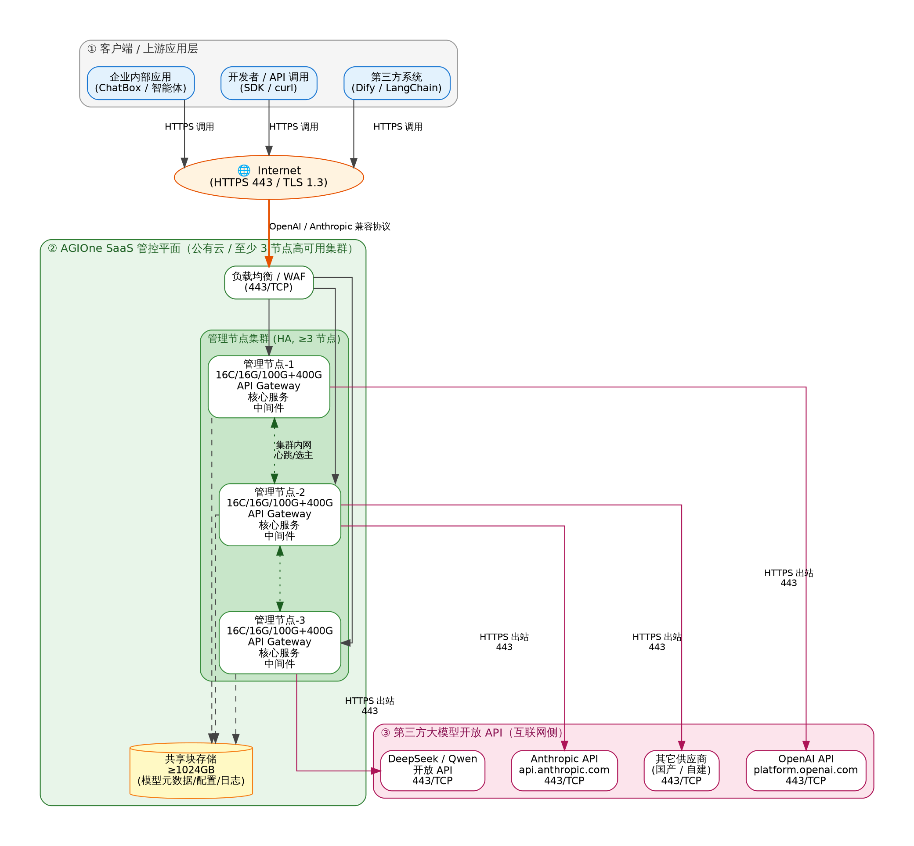
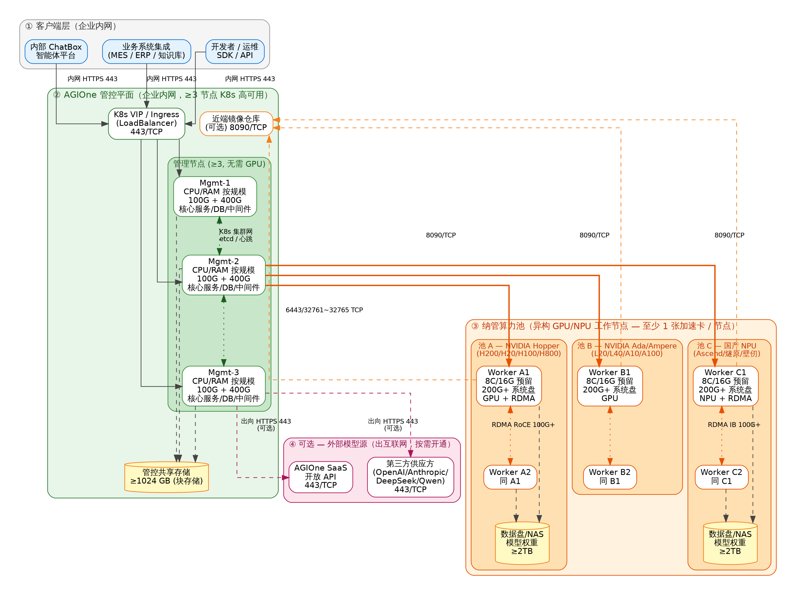

# 部署网络规划方案

## 一、概述

本文档面向 AGIOne 平台的两类典型部署场景 —— **SaaS 化部署** 与 **私有化部署** —— 给出端到端的网络规划方案，包括各类节点的资源配置明细、关键端口与协议、网络分区与连通性要求，并提供两套部署模式各自的网络拓扑图。

### 1.1 部署模式对比

| 对比维度 | SaaS 化部署 | 私有化部署 |
|---|---|---|
| **管控平面位置** | AGIOne 公有云 / SaaS 数据中心 | 客户企业内网（IDC / 私有云） |
| **核心服务节点数** | ≥ 3 节点（HA 高可用） | ≥ 3 节点（K8s HA，无 GPU 需求） |
| **模型来源** | 通过 **互联网** 调用第三方 / 自有 SaaS 模型 API | 本地纳管 GPU/NPU 节点；可选回连 AGIOne SaaS / 第三方 API |
| **客户端 ⇄ 管控平面** | 互联网 HTTPS（443） | 企业内网 HTTPS（443） |
| **管控 ⇄ 算力节点** | 无（所有推理外部完成） | 内网 / 专线，开放 6443、32761~32765、8090（可选）等端口 |
| **数据驻留** | 受 SaaS 提供方安全策略约束 | 完全私有化，数据不出企业边界 |
| **典型应用** | 中小客户 / 试点 / 无算力客户 / 突发负载补充 | 央国企 / 涉密 / 大算力客户 / 工程行业 / 多算力池 |

### 1.2 网络分区设计原则

- **管控平面与执行平面分离**：管理节点不承担推理算力任务，纳管节点不直接对外暴露端口，所有调用经管控网关代理。
- **最小开放原则**：仅开放必要端口（6443 K8s API、32761~32765 调度/监控、8090 镜像、443 上行 API），其它入站默认拒绝。
- **高可用优先**：管理服务至少 3 节点 + VIP / Ingress LoadBalancer，避免单点；共享存储独立网络通道。
- **异构兼容**：纳管节点支持 NVIDIA Hopper / Ada / Ampere 全系，及 Ascend 910B/910C、燧原、壁仞等国产 NPU；同一架构建议进同一 K8s 集群。
- **网络性能保障**：单节点 ≥ 1 Gbps 管理网；多卡训练 / 大模型推理推荐 100 Gbps RDMA（RoCE 或 IB）。

> **⚠️ 重要约束**
>
> 1. 管理节点：不需要任何 XPU（GPU / TPU / NPU），但纳管的工作节点 **至少需 1 张加速卡**。
> 2. 单 K8s 集群推荐管理工作节点 ≤ 1000 个，且建议 **同一 CPU 架构（x86 / ARM）进同一集群**。
> 3. 所有管理节点共享同一组共享存储；工作节点亦共享，模型增多时可水平扩容存储。

---

## 二、SaaS 化部署网络规划

### 2.1 部署场景与逻辑架构

SaaS 化部署面向 **自身不持有大规模 GPU 算力** 或 **希望以订阅方式快速接入大模型能力** 的客户。AGIOne 在公有云侧 **至少部署 3 个核心管理节点** 形成高可用集群，统一对外暴露 OpenAI / Anthropic 兼容 API；客户应用通过 **互联网（HTTPS / TLS 1.3）** 访问 AGIOne SaaS 入口；AGIOne SaaS 后端再 **通过开放 API 接口（HTTPS 443）出向连接** 一个或多个第三方模型供应方（如 OpenAI / Anthropic / DeepSeek / Qwen 等）或 AGIOne 自有的托管模型实例。

### 2.2 网络拓扑图

<i>图 2-1   AGIOne SaaS 化部署网络拓扑图</i>

### 2.3 SaaS 管理节点资源配置明细

| 节点类别 | 数量 | CPU | 内存 | 系统盘 | 数据盘 | 网络要求 |
|---|:---:|:---:|:---:|:---:|:---:|---|
| **AGIOne 核心管理节点** (API Gateway + 核心服务 + DB + 中间件 + 插件) | ≥ 3 | ≥ 16 核 | ≥ 16 GB | ≥ 100 GB | ≥ 400 GB | 公网入口：443/TCP 集群内网：万兆 LAN 出向：可访问第三方 API |
| **共享存储** (块存储 / 推荐) | ≥ 1 | — | — | ≥ 1024 GB | — | 存储专网 / 多副本 |

### 2.4 关键端口与流向

| 流向 | 源 | 目的 | 协议 / 端口 | 说明 |
|:---:|---|---|---|---|
| 入站 | 客户端（互联网） | SaaS 负载均衡 / WAF | TCP 443 (HTTPS) | OpenAI / Anthropic 兼容协议；强制 TLS 1.3 |
| 内部 | 负载均衡 | 管理节点 1/2/3 | TCP 80/443 / 业务端口 | L7 反向代理至各管理节点 |
| 内部 | 管理节点 ⇄ 管理节点 | — | TCP / UDP 内部端口 | 集群心跳、选主、缓存同步、消息队列 |
| 内部 | 管理节点 | 共享存储 | 存储协议 (iSCSI/NFS/对象存储) | 模型元数据、日志、配置持久化 |
| 出站 | 管理节点 | 第三方模型 API | TCP 443 (HTTPS) | OpenAI / Anthropic / DeepSeek / Qwen 等 |
| 出站 | 管理节点 | 镜像仓库 / 升级源 | TCP 443 (HTTPS) | 组件升级、安全补丁 |

### 2.5 安全与合规要点

- 入口启用 **WAF / DDoS 防护**，按调用方下发独立 API Key（或 OAuth 2.0），并支持按租户的 **RPM/TPM 限流**。
- 出向访问第三方 API 通过 **NAT 网关 / 出向白名单** 严格控制目的域名与端口，避免数据外泄至非授权域。
- 全链路 **审计日志**（请求时间、租户 ID、模型名、Token 数）落盘并集中检索；禁止在日志中留存 Prompt 与输出明文。
- 管理面板的运维通道与业务通道物理 / 逻辑隔离；运维操作启用 **MFA 与堡垒机审计**。

---

## 三、私有化部署网络规划

### 3.1 部署场景与逻辑架构

私有化部署面向 **央国企、涉密行业** 及 **大规模算力自有客户**。AGIOne 管控平面 **完全部署在客户企业内网**，至少 **3 节点核心服务及中间件** 节点构成 K8s HA 集群（管理节点不需要任何加速卡）；纳管的 GPU / NPU 工作节点按 **异构算力池** 划分（NVIDIA Hopper / Ada / Ampere、Ascend 910B/910C、燧原、壁仞 等），通过开放 API 接口与管控平面通信，关键端口包括 **6443、32761、32762、32763、32764、32765** 等。若集群近端部署镜像服务，则 **额外开放 8090 端口**。管控平面可选地通过出向 HTTPS 与 AGIOne SaaS / 第三方供应方 API 互联，用于补充模型能力或弹性卸载。

### 3.2 网络拓扑图

<i>图 3-1   AGIOne 私有化部署网络拓扑图（含管控平面、纳管异构算力池及关键端口）</i>

### 3.3 管理节点资源配置（按纳管规模分级）

管理节点资源由 **K8s 基础开销** 与 **AGIOne 服务开销** 两部分构成。下表依据《AGIOneRequirements》中「Mgt nodes requirements detail」对不同纳管规模给出 **推荐单节点配置**；所有规模均建议 **至少 3 节点** 部署以保证高可用。

| 纳管节点规模 | K8s 基础需求 (单节点) | AGIOne 额外需求 (单节点) | 推荐单节点合计 | 最小节点数 |
|---|:---:|:---:|:---:|:---:|
| 1 ~ 5 节点      | 1 核 / 4 GB     | 7 核 / 12 GB   | ≥ 8 核 / 16 GB    | 3 |
| 6 ~ 10 节点     | 2 核 / 8 GB     | 7 核 / 12 GB   | ≥ 9 核 / 20 GB    | 3 |
| 11 ~ 100 节点   | 4 核 / 16 GB    | 12 核 / 24 GB  | ≥ 16 核 / 40 GB   | 3 |
| 101 ~ 250 节点  | 8 核 / 32 GB    | 12 核 / 24 GB  | ≥ 20 核 / 56 GB   | 3 |
| 251 ~ 500 节点  | 16 核 / 64 GB   | 24 核 / 48 GB  | ≥ 40 核 / 112 GB  | 3 |
| 500+ 节点       | 32 核 / 128 GB  | 32 核 / 64 GB  | ≥ 64 核 / 192 GB  | 3 |

> **💡 管理节点磁盘与网络**
>
> - 系统盘 ≥ 100 GB；数据盘 ≥ 400 GB（AGIOne 核心服务 + DB + 中间件 + 插件）。
> - 推荐挂载 ≥ 1024 GB **共享块存储**，承载平台元数据 / 模型注册信息 / 日志归档。
> - 内部网络：与所有 CPU/管理节点本地 LAN 互通；至 Ascend 等专用算力池建议 **专线连接**。

### 3.4 纳管工作节点资源配置

工作节点（即纳管的算力节点）须 **至少持有 1 张加速卡**，CPU/RAM 为 K8s 与监控代理预留即可，主要资源由模型推理 / 微调任务消耗。下表给出 **单工作节点的预留底线**，加速卡型号与数量依据业务模型大小另行规划（参见《AGIOne 纳管芯片兼容性列表》）。

| 项目 | 推荐配置 | 说明 |
|---|---|---|
| **CPU（预留）**       | ≥ 8 核    | 为 K8s kubelet / kube-proxy / 监控代理 / 推理框架预留 |
| **内存（预留）**      | ≥ 16 GB   | 同上；不含模型权重所需显存 |
| **系统盘**            | ≥ 200 GB  | 操作系统 + 容器运行时 + 加速卡驱动 + AGIOne Agent |
| **数据盘 / 共享存储** | 推荐 NAS / 共享文件系统 ≥ 2048 GB | 模型权重、KV Cache、日志；多节点共享，便于热加载与扩容 |
| **加速卡（必选）**    | ≥ 1 张    | 支持 NVIDIA Hopper / Ada / Ampere（H200/H20/H100/H800/L20/L40/A100/A10 等）； 国产：Ascend 910B / 910C、燧原 106、壁仞 S60 |
| **RDMA 网络（推荐）** | 100 Gbps RoCE 或 InfiniBand | 多卡 / 多机张量并行、PD 分离场景必需；推荐配 MLNX_OFED 23.07 及以上 |
| **管理网络**          | ≥ 1 Gbps  | 与管理节点本地 LAN 互通；出互联网（推荐）用于补丁、镜像与可选 SaaS 回连 |
| **操作系统**          | CentOS 7 / Ubuntu 20.04 / 22.04 / EulerOS | 需预装加速卡驱动（NVIDIA ≥ 535、CANN 适配 Ascend）与 RDMA 驱动； 建议禁用 OS 自动更新以保障基础环境稳定 |

### 3.5 关键端口与流向（重点）

AGIOne 管控平面与纳管节点之间通过 **标准开放 API 通信**，下表为 **必须放行** 的端口与协议；其它入站连接默认全部拒绝，符合最小授权原则。

| 端口 | 协议 | 服务 | 源 → 目的 | 说明 |
|:---:|:---:|---|---|---|
| **443**   | TCP | AGIOne Web / API 入口          | 客户端 → 管控 VIP / Ingress | OpenAI / Anthropic 兼容 API 入口；强制 TLS 1.3 |
| **6443**  | TCP | Kubernetes API Server          | 管控 ↔ 纳管节点              | K8s 控制面通信；管控平面下发调度 / 状态查询 |
| **32761** | TCP | AGIOne 调度 / 注册             | 管控 ↔ 纳管节点              | 节点纳管与心跳（NodePort） |
| **32762** | TCP | AGIOne 任务构建 API            | 管控 ↔ 纳管节点              | 推理实例构建 / 销毁；模型加载下发 |
| **32763** | TCP | AGIOne 监控 / 指标采集         | 管控 ↔ 纳管节点              | GPU/NPU 利用率、显存、温度、Running Tasks 等 |
| **32764** | TCP | AGIOne 日志 / 事件             | 管控 ↔ 纳管节点              | 推理日志、异常事件聚合上送 |
| **32765** | TCP | AGIOne 文件 / 模型缓存代理     | 管控 ↔ 纳管节点              | 模型权重 / 配置文件分发 |
| **8090**  | TCP | 近端镜像服务（**可选**）         | 纳管节点 → 镜像仓库          | 若集群本地部署镜像服务，必须额外放行；否则可关闭 |
| **443**   | TCP | 出向 HTTPS（**可选**）          | 管控 / 纳管节点 → 互联网    | 可选回连 AGIOne SaaS / 第三方模型 API；按需配置出向白名单 |
| **RDMA**  | —   | RoCE / InfiniBand              | 纳管节点之间                 | 多机张量并行、KV Cache 分布；100 Gbps+；不出算力池 |

> **🔒 防火墙策略要点**
>
> 1. **管控 ↔ 纳管**：6443 / 32761 / 32762 / 32763 / 32764 / 32765 **必须放行**；
> 2. **镜像近端**：仅在采用近端镜像服务时放行 8090，且仅限纳管节点 → 镜像仓库 **单向**；
> 3. **出向 HTTPS**：默认拒绝，按 SaaS / 第三方 API 域名开通 **白名单**；
> 4. **RDMA**：仅限算力池内（同一 VLAN / 同一交换 fabric），**禁止跨区路由**。

### 3.6 异构算力池接入建议

依据《AGIOne 纳管芯片兼容性列表》及 IMMS / 中冶赛迪 既有实践，建议 **按硬件架构与网络环境划分独立算力池**，每池保持独立 K8s 集群或独立 namespace，并通过节点标签（如 `hardware-type=ascend-910b64g` / `nvidia-h20`）驱动调度。

| 算力池 | 典型芯片 | 网络接入方式 | 适用场景 |
|---|---|---|---|
| **池 A：NVIDIA Hopper** | H200 / H20 / H100 / H800 | 本地 LAN + RDMA (RoCE/IB) 100G+ | 旗舰大模型推理 / 训练；DeepSeek-V3、Qwen2.5-72B、128K 长上下文 |
| **池 B：NVIDIA Ada / Ampere** | L20 / L40(S) / L4 / A100 / A800 / A10 / RTX 4090 等 | 本地 LAN（RDMA 可选） | 中等规模高并发推理（7B~32B），代码辅助、知识问答 |
| **池 C：国产 NPU** | Ascend 910B / 910C、燧原 106、壁仞 S60 | 专线 / 本地 LAN + RDMA | 信创合规场景、批量推理；MindIE 引擎深度优化 |

---

## 四、实施建议与变更管理

### 4.1 实施前检查清单

- 完成《AGIOne 纳管节点环境调研表》填写，确认 **CPU 架构 / 加速卡型号 / 驱动版本 / RDMA 配置** 一致性。
- **管理节点**：核对是否满足规模分级表对应规格（CPU / RAM / 系统盘 / 数据盘 / 共享存储）。
- **网络**：完成 6443、32761~32765、8090（如适用）、443 防火墙策略评审与开通申请。
- **RDMA**：MLNX_OFED 驱动版本与网卡固件、交换机配置匹配；运行 `ibstat` / `rdma link` 验证。
- **DNS / NTP**：所有节点接入企业 DNS 与时间同步源，时差 ≤ 1 秒。
- **镜像**：若使用近端镜像，提前部署并将地址写入工作节点 `containerd` / `docker` 配置。

### 4.2 容量规划与扩容路径

- **管理节点**：当纳管节点数跨越下一档（如 100 → 101），须先 **垂直扩容** 至对应规格，再灰度切换；过程中保持 ≥ 3 节点可用。
- **工作节点**：扩容采用 **「先注册（权重 0）→ 健康检查 → 线性升权」** 流程，业务无感知。
- **存储**：模型权重持续增长场景，应将工作节点共享存储扩容至 4 TB+ 或采用 NAS / Ceph 横向扩展。
- **网络**：单池工作节点 ≥ 16 时建议升级到 200 Gbps RDMA 主干；跨池流量走管控平面网关，避免直连。

### 4.3 监控与可观测性接入

- **硬件层**：通过 DCGM（NVIDIA） / npu-exporter（Ascend）采集利用率 / 显存 / 温度 / 功耗，15~30 秒粒度。
- **调度层**：聚合模型 Running Tasks、权重分布、路由比例、熔断次数，1 分钟粒度。
- **应用层**：RPM / TPM / TTFT / P95 / P99、Success Rate、Token 计量，分租户 / 分模型展示。

---
