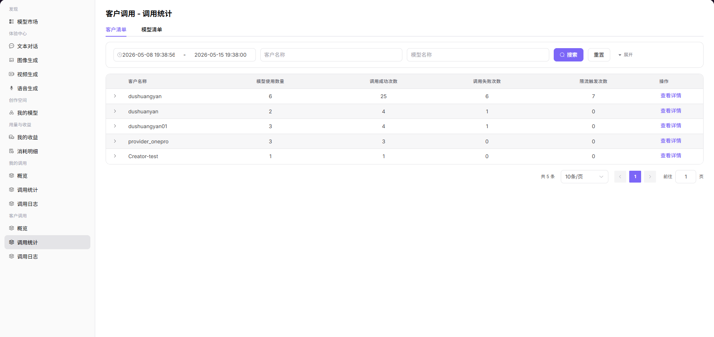

# 调用统计

## 前言

| 项目 | 内容 |
|------|------|
| 适用角色 | User（普通用户） |
| 导航路径 | 客户调用 > 调用统计 |
| 功能定位 | 按客户或模型维度查看调用统计，支持深入分析调用情况 |

## 页面结构

### 搜索区域

页面顶部支持选择时间范围、客户名称、模型名称、模型类型、模型 ID 进行筛选。

### 操作按钮区

页面包含「客户清单」和「模型清单」两个标签页，每个客户或模型提供「查看详情」和「查看日志」操作。

### 数据列表说明

页面以表格形式展示客户或模型的调用统计列表。

### 页面截图

## 操作步骤

### 进入页面

1. 点击左侧导航栏的 **"客户调用 > 调用统计"**，进入统计页面。
2. 页面包含 **「客户清单」** 和 **「模型清单」** 两个标签页。

### 客户清单标签页（按客户维度）

1. 设置筛选条件：
   - 时间范围：选择需要查询的起止日期；
   - 客户名称：输入客户名称进行模糊搜索；
   - 模型名称：输入模型名称进行筛选。
   - 设置完成后，点击 **「搜索」** 加载数据；点击 **「重置」** 可清空筛选条件。
2. 查看客户列表，表格按客户汇总展示调用情况：
   - 客户名称；
   - 模型使用数量（该客户调用过的模型总数）；
   - 调用成功 / 失败次数；
   - 限流触发次数；
   - 操作列：点击「查看详情」进入客户详情页。
3. 查看客户详情页：
   - 核心指标卡片：调用总量、成功次数、失败次数、限流触发次数、Token 总消耗；
   - 调用趋势图：按日期分布的成功 / 失败 / 限流调用量折线图；
   - Token 消耗趋势图：按日期分布的输入 / 输出 Token 消耗量；
   - 调用失败 / 限流触发 TOP5 记录：查看该客户的主要问题调用记录，可点击「查看日志」定位具体请求。

### 模型清单标签页（按模型维度）

1. 设置筛选条件：
   - 时间范围：选择需要查询的起止日期；
   - 模型名称：输入模型名称进行模糊搜索；
   - 模型类型：按类型筛选，如对话 / 多模态 / 视频模型等；
   - 模型 ID：输入模型唯一标识进行精确搜索。
   - 设置完成后，点击 **「搜索」** 加载数据；点击 **「重置」** 可清空筛选条件。
2. 查看模型列表，表格按模型汇总展示调用情况：
   - 模型名称、模型类型；
   - 客户名称（调用该模型的客户）；
   - 调用成功 / 失败次数；
   - 使用情况：消耗的输入 / 输出 Token 数（文本 / 多模态模型）或时长（视频模型）；
   - 操作列：点击「查看详情」进入模型详情页，点击「查看日志」跳转至调用日志页面。
3. 查看模型详情页：
   - 核心指标卡片：调用总量、成功次数、失败次数、限流触发次数、Token 总消耗；
   - 调用趋势图：按日期分布的成功 / 失败 / 限流调用量折线图；
   - Token 消耗趋势图：按日期分布的输入 / 输出 Token 消耗量；
   - 调用失败 / 限流触发 TOP5 记录：查看该模型的主要问题调用记录，可点击「查看日志」定位具体请求。

#### 参数说明（客户清单）

| 字段名称 | 字段类型 | 示例 | 说明 |
|----------|----------|------|------|
| 客户名称 | 文本 | `user_xxx` | 发起调用的客户名称 |
| 模型使用数量 | 数值 | `3` | 该客户调用过的模型总数 |
| 调用成功次数 | 数值 | `1.2K` | 统计周期内该客户的成功调用次数 |
| 调用失败次数 | 数值 | `15` | 统计周期内该客户的失败调用次数 |
| 限流触发次数 | 数值 | `3` | 统计周期内该客户触发限流的次数 |

#### 参数说明（模型清单）

| 字段名称 | 字段类型 | 示例 | 说明 |
|----------|----------|------|------|
| 模型名称 | 文本 | `Qwen3.6-plus` | 被调用的模型名称 |
| 模型类型 | 标签 | `对话模型 / 视频模型` | 模型的功能类型 |
| 客户名称 | 文本 | `user_xxx` | 调用该模型的客户名称 |
| 调用成功次数 | 数值 | `2.13K` | 统计周期内该模型的成功调用次数 |
| 调用失败次数 | 数值 | `15` | 统计周期内该模型的失败调用次数 |
| 使用情况 | 文本 | `输入: 122.5M Tokens / 输出: 619.4K Tokens` | 消耗的输入 / 输出 Token 数或视频生成时长 |

#### 关键操作说明

| 操作 | 说明 |
|------|------|
| 切换标签页 | 点击「客户清单」或「模型清单」，在不同分析维度间切换 |
| 查看详情 | 点击任意客户或模型后的 **「查看详情」**，进入专属详情页进行深入分析 |
| 查看日志 | 点击 **「查看日志」**，可直接跳转至对应客户 / 模型的调用日志列表，进行问题排查 |

## 注意事项

* 筛选条件支持多条件组合，可提高定位效率。
* 在详情页可查看详细的调用趋势和消耗数据。
