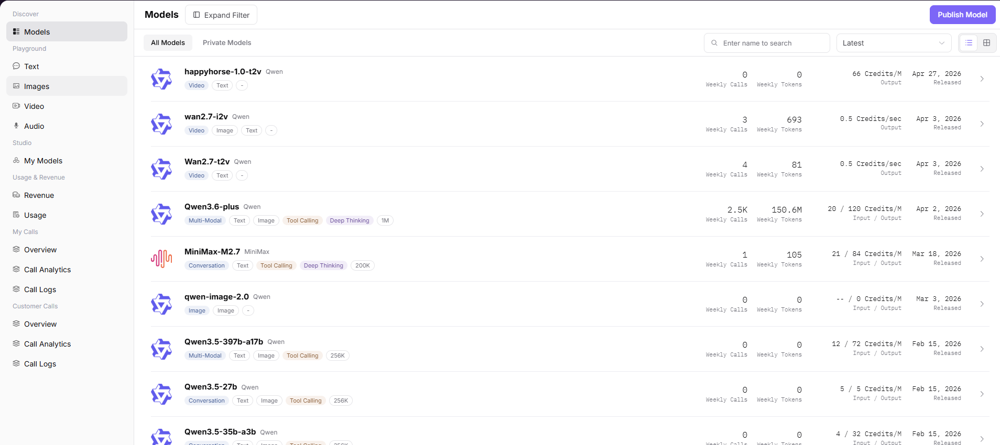

# 模型市场

## 前言

| 项目 | 内容 |
|------|------|
| 适用角色 | User（普通用户） |
| 导航路径 | 发现 > 模型市场 |
| 功能定位 | 浏览和搜索平台上的全部模型，了解模型能力并查看详细使用信息 |

## 页面结构

### 搜索区域

页面左侧提供模型类型筛选器（多模态、对话、图片、语音、视频等），支持按输入 / 输出能力筛选。页面顶部支持按模型名称直接搜索。

### 操作按钮区

* 页面右上角提供「发布模型」按钮，用于提交新模型的发布申请
* 每个模型卡片提供点击入口进入详情页

### 数据列表说明

页面展示全部 / 私有模型列表，每个模型卡片包含名称、类型标签、能力标签、周调用量、计费标准、发布日期等信息。

### 页面截图

## 操作步骤

### 查看模型列表

1. 进入平台首页，点击左侧导航栏的 **"发现 > 模型市场"** 菜单，进入模型广场页面。
2. 页面展示全部 / 私有模型列表，可通过左侧筛选器按模型类型（多模态、对话、图片、语音、视频等）、输入 / 输出能力筛选，或直接搜索模型名称。
3. 点击目标模型（如 Qwen3.6-plus）进入详情页，可查看模型完整信息与使用指引。

#### 参数说明（模型列表页）

| 字段名称 | 字段类型 | 示例 | 说明 |
|----------|----------|------|------|
| 模型名称 | 文本 | `Qwen3.6-plus / MiniMax-M2.7` | 模型的名称与作者 |
| 模型类型标签 | 标签 | `多模态 / 视频模型 / 对话模型` | 模型的功能类型 |
| 能力标签 | 标签 | `工具调用 / 深度思考` | 模型支持的扩展能力 |
| 周调用量 | 数值 | `2.4K / 1` | 模型本周被调用的次数 |
| 周 Token 量 | 数值 | `146.6M / 105` | 模型本周消耗的 Token 总量 |
| 计费标准 | 文本 | `20 / 120 Credit/M / 0.5 Credit/秒` | 模型的调用费用标准 |
| 发布日期 | 日期 | `2026-04-02` | 模型的发布时间 |

#### 参数说明（模型详情页）

| 字段名称 | 字段类型 | 示例 | 说明 |
|----------|----------|------|------|
| 上下文长度 | 数值 | `1M` | 模型支持的最大上下文窗口长度 |
| 输入 / 输出上限 | 数值 | `最大输入 991K / 最大输出 64K` | 单次调用的 Token 限制 |
| 参考 Credit 价格 | 数值 | `输入 20 Credit / 输出 120 Credit` | 每百万 Token 的参考费用 |
| 输入 / 输出模态 | 多选 | `输入：文本 / 图片 / 视频；输出：文本` | 模型支持的输入输出数据类型 |
| 能力支持 | 开关标签 | `深度思考 / 工具调用` | 模型的扩展能力 |
| 支持协议 | 标签 | `openai/chat_completions / anthropic/messages` | 模型兼容的 API 协议 |
| 供应方信息 | 卡片 | `阿里巴巴-中国:免费额度` | 模型的供应方、计费模式、性能数据 |

## 其他操作

| 操作名称 | 操作步骤 |
|----------|----------|
| 筛选与搜索 | 左侧按模型类型 / 输入输出能力筛选，顶部按名称搜索，也可切换排序方式（最新 / 热门等） |
| 查看模型详情 | 点击模型名称卡片 → 进入详情页，可切换查看供应方、快速开始、性能、概览等信息 |
| 查看 API 调用示例 | 在「快速开始」页签，切换 SDK/HTTP/Curl 方式，复制 API 端点、Base URL 和调用代码 |
| 查看性能数据 | 在「性能」页签，选择时间范围，查看平均请求耗时、首 Token 延迟等指标图表 |
| 查看模型概览 | 在「概览」页签，查看模型的核心特点、适用场景、版本信息等详细介绍 |
| 发布模型 | 点击右上角「发布模型」按钮，提交新模型的发布申请 |
| 体验 / 领取免费额度 | 在供应方信息卡片，点击「体验」或「点击领取免费额度」，获取试用资格 |

## 注意事项

* 部分模型提供免费额度，可在供应方信息卡片点击「点击领取免费额度」获取试用资格。
* 查看 API 调用示例时，可在「快速开始」页签切换 SDK/HTTP/Curl 方式。
