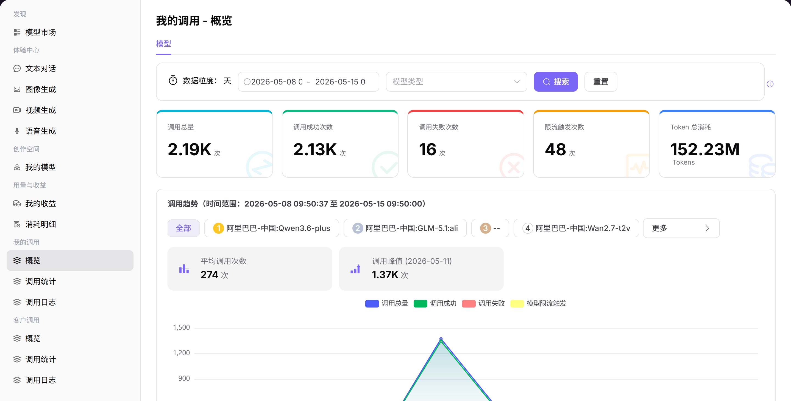

# 概览

## 前言

| 项目 | 内容 |
|------|------|
| 适用角色 | User（普通用户） |
| 导航路径 | 我的调用 > 概览 |
| 功能定位 | 查看模型调用的整体情况，了解调用量、成功率和 Token 消耗趋势 |

## 页面结构

### 搜索区域

页面顶部支持选择数据粒度（如「天」）、时间范围、模型类型筛选。

### 操作按钮区

无特定操作按钮。

### 数据列表说明

页面展示核心指标卡片和多维度趋势图表。

### 页面截图

## 操作步骤

### 查看调用概览

1. 进入平台首页，点击左侧导航栏的 **"我的调用 > 概览"** 菜单，进入调用概览页面。
2. 在页面顶部设置查询参数：
   - 选择数据粒度（如「天」）；
   - 选择时间范围（如 2026-05-07 至 2026-05-14）；
   - 可选筛选模型类型；
   - 点击 **「搜索」** 按钮，加载指定周期的数据。
3. 查看核心指标卡片：
   - 调用总量：统计周期内的总调用次数（示例：2.19K 次）；
   - 调用成功次数：统计周期内成功的调用次数（示例：2.13K 次）；
   - 其他关键指标：调用失败次数、限流触发次数、总消耗 Token 数等。
4. 查看多维度趋势图表：
   - **整体调用趋势**：折线图展示了按日期分布的调用总量、成功量、失败量和限流触发量。可点击图表上的点，查看当天的详细数据（如调用总量、成功 / 失败次数、限流数）；
   - **分模型调用趋势**：可通过标签切换查看单个模型的调用数据，如 阿里巴巴-中国:Qwen3.6-plus。查看平均调用次数和调用峰值（示例：峰值 1.37K 次，出现在 2026-05-11）；
   - **Token 消耗趋势**：折线图展示了按日期分布的输入 Token 和输出 Token 消耗量。可点击图表上的点，查看当天的 Token 消耗详情（如输入 94.5M、输出 490.5K）。

#### 参数说明

| 字段名称 | 字段类型 | 示例 | 说明 |
|----------|----------|------|------|
| 调用总量 | 数值 | `2.19K` | 所选时间范围内，发起的所有模型调用请求总数 |
| 调用成功次数 | 数值 | `2.13K` | 所选时间范围内，成功完成的调用请求数 |
| 调用失败次数 | 数值 | `15` | 所选时间范围内，因各种原因失败的调用请求数 |
| 模型限流触发 | 数值 | `3` | 所选时间范围内，因触发模型调用频率限制而被拦截的请求数 |
| 总消耗 Token | 数值 | `95M` | 所选时间范围内，所有调用消耗的输入和输出 Token 总数 |
| 平均调用次数 | 数值 | `313` | 所选时间范围内，每天的平均调用次数 |
| 调用峰值 | 数值 | `1.37K（2026-05-11）` | 所选时间范围内，调用量最高的日期及其调用次数 |

## 注意事项

* 筛选单个模型时，在「调用趋势」区域点击模型标签即可查看该模型的独立数据。
* 点击趋势图上的峰值点可查看该日期的具体调用数据。
* 点击「查看更多」可跳转至调用日志页面查看详细记录。
