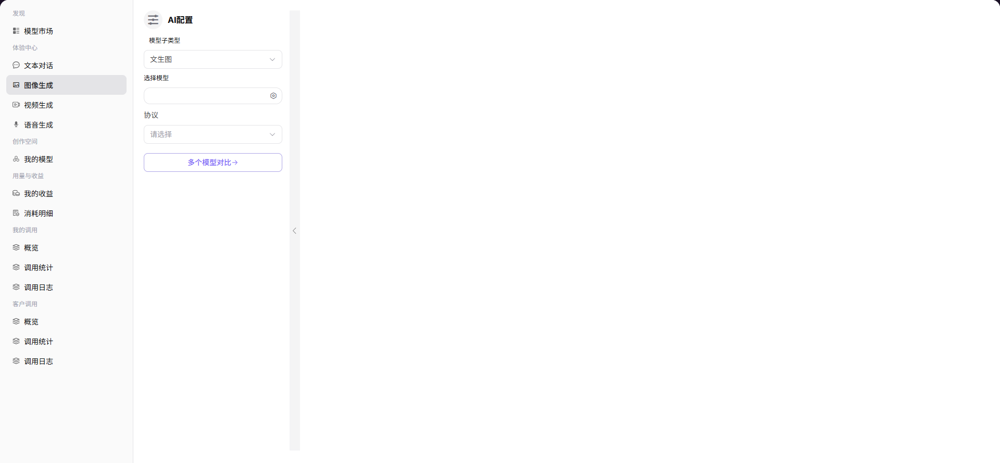

# 图像生成

## 前言

| 项目 | 内容 |
|------|------|
| 适用角色 | User（普通用户） |
| 导航路径 | 体验中心 > 图像生成 |
| 功能定位 | 通过文本描述或参考图片生成 AI 图像，体验模型的图像生成能力 |

## 页面结构

### 搜索区域

无搜索区域。

### 操作按钮区

* 左侧「AI 配置」面板提供模型选择、参数配置等操作
* 底部输入框提供发送按钮

### 数据列表说明

页面中央展示生成的图像结果。

### 页面截图

## 操作步骤

### 模型生成图像

1. 进入平台首页，点击左侧导航栏的 **"体验中心 > 图像生成"** 菜单，进入图像生成体验页面。
2. 在左侧「AI 配置」面板设置生成参数：
   - 选择 **模型子类型**（如 图生图 / 文生图）；
   - 点击「选择模型」，在弹窗中选择模型与供应方（如 qwen-image-2.0）；
   - 选择 **协议**（如 openai/images）；
   - 填写必填的 **Prompt**（图像生成提示词）；
   - 填写 **Image**（参考图片，用于图生图场景）；
   - 设置生成图片数量 **N**；
   - 设置输出图片尺寸 **Size**；
   - 配置 **Response Format**（响应格式，如 url）；
   - 填写 **User**（用户标识，可选）。
3. 点击底部输入框右侧的发送按钮，即可生成图像。

#### 参数说明（AI 配置面板）

| 字段名称 | 字段类型 | 示例 | 说明 |
|----------|----------|------|------|
| 模型子类型 | 下拉选择 | `图生图 / 文生图` | 图像生成的模式 |
| 选择模型 | 弹窗选择 | `阿里巴巴-中国 qwen-image-2.0` | 生成图像使用的模型，可切换不同供应方实例 |
| 协议 | 下拉选择 | `openai/images` | 模型调用的 API 协议 |
| Prompt | 文本输入 | `please input` | 必填，图像生成的提示词，描述你想要生成的内容 |
| Image | 文本输入 | `please input` | 图生图模式必填，用于参考的图片信息 |
| N | 数值滑块 | `1` | 单次调用生成的图片数量 |
| Size | 文本输入 | `1024×1024` | 输出图片的分辨率 |
| Response Format | 文本输入 | `url` | 生成结果的返回格式 |
| User | 文本输入 | `please input` | 可选，用户标识，用于请求追踪 |

#### 参数说明（模型选择弹窗）

| 字段名称 | 字段类型 | 示例 | 说明 |
|----------|----------|------|------|
| 模型名称 / 标识 | 文本 | `qwen-image-2.0 / qwen/qwen-image-2.0` | 模型的名称与唯一标识 |
| 发布日期 | 日期 | `2026-03-03` | 模型的发布时间 |
| 上下文长度 | 文本 | `-` | 图像模型通常不设上下文长度 |
| 输入 / 输出 Credit | 数值 | `0 Credit` | 调用该模型的费用标准 |
| 供应方 | 文本 | `DuShuangYan` | 模型的供应方 / 服务商 |
| 价格 / 张 | 数值 | `0 Credit` | 生成单张图片的费用 |
| 周调用量 / Token 量 | 数值 | `0 / 0 张` | 该供应方实例的使用情况 |

## 其他操作

| 操作名称 | 操作步骤 |
|----------|----------|
| 切换模型 | 点击「选择模型」右侧的图标 → 在弹窗中选择不同模型或供应方 → 点击「确定」 |
| 多个模型对比 | 点击「多个模型对比」按钮，进入多模型并行图像生成体验页面 |
| 生成图像 | 配置好所有参数后，点击底部输入框右侧的发送按钮，生成图像 |

## 注意事项

* 文生图模式需填写详细的 Prompt 描述，以获得更准确的生成结果。
* 图生图模式需提供参考图片，生成的图片将参考其风格和内容。
* 可点击「多个模型对比」按钮进入多模型并行图像生成体验页面。
