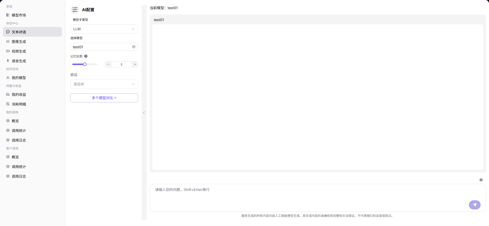

# 文本对话

## 前言

| 项目 | 内容 |
|------|------|
| 适用角色 | User（普通用户） |
| 导航路径 | 体验中心 > 文本对话 |
| 功能定位 | 通过对话方式与 AI 模型交互，体验模型的文本生成和对话能力 |

## 页面结构

### 搜索区域

无搜索区域。

### 操作按钮区

* 左侧「AI 配置」面板提供模型选择、参数配置等操作
* 右侧对话输入框提供发送按钮

### 数据列表说明

右侧对话窗口展示历史对话记录和当前对话内容。

### 页面截图

## 操作步骤

### 模型生成文本

1. 进入平台首页，点击左侧导航栏的 **"体验中心 > 文本对话"** 菜单，进入对话体验页面。
2. 在左侧「AI 配置」面板设置对话参数：
   - 选择 **模型子类型**（如 LLM）；
   - 点击「选择模型」，在弹窗中选择模型与供应方；
   - 调整 **记忆轮数**（设置对话上下文记忆的消息条数）；
   - 选择 **协议**（如需）。
3. 在右侧对话输入框中输入问题，点击发送即可与模型对话，支持使用 Shift+Enter 换行输入。

#### 参数说明（AI 配置面板）

| 字段名称 | 字段类型 | 示例 | 说明 |
|----------|----------|------|------|
| 模型子类型 | 下拉选择 | `LLM` | 对话模型的类型，当前为大语言模型 |
| 选择模型 | 弹窗选择 | `Creator-test Qwen3-max-2026-01-23 test01` | 对话使用的模型，可切换不同供应方实例 |
| 记忆轮数 | 数值滑块 | `3` | 对话中模型会记忆的历史消息条数，影响上下文连贯性 |
| 协议 | 下拉选择 | `（未选）` | 模型调用的 API 协议 |

#### 参数说明（模型选择弹窗）

| 字段名称 | 字段类型 | 示例 | 说明 |
|----------|----------|------|------|
| 模型名称 / 标识 | 文本 | `Qwen3-max-2026-01-23 / qwen/qwen3-max-2026-01-23` | 模型的名称与唯一标识 |
| 发布日期 | 日期 | `2026-01-23` | 模型的发布时间 |
| 上下文长度 | 数值 | `256K` | 模型支持的最大上下文窗口 |
| 输入 / 输出 Credit | 数值 | `0 Credit` | 调用该模型的费用标准 |
| 供应方 | 文本 | `Creator-test / DuShuangYan` | 模型的供应方 / 服务商 |
| 周调用量 / Token 量 | 数值 | `0 / 0 M Tokens` | 该供应方实例的使用情况 |
| 能力标签 | 标签 | `深度思考 / 工具调用` | 模型支持的扩展能力 |

## 其他操作

| 操作名称 | 操作步骤 |
|----------|----------|
| 切换模型 | 点击「选择模型」右侧的图标 → 在弹窗中选择不同模型或供应方 → 点击「确定」 |
| 调整记忆轮数 | 拖动滑块或直接输入数字，设置对话上下文的记忆条数 |
| 多个模型对比 | 点击「多个模型对比」按钮，进入多模型并行对话体验页面 |
| 对话输入 | 在底部输入框输入问题，按发送按钮或 Enter 发送；使用 Shift+Enter 换行 |
| 查看对话历史 | 在对话窗口中查看历史对话记录 |

## 注意事项

* 记忆轮数越高，对话上下文越长，但消耗的 Token 也越多。
* 使用 Shift+Enter 可以换行输入，避免发送不完整的句子。
* 可点击「多个模型对比」按钮进入多模型并行对话体验页面。
