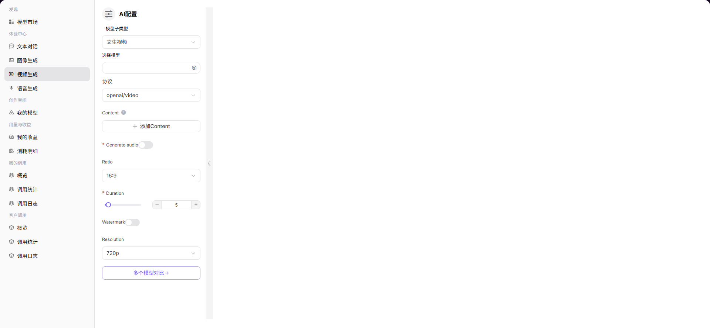

# 视频生成

## 前言

| 项目 | 内容 |
|------|------|
| 适用角色 | User（普通用户） |
| 导航路径 | 体验中心 > 视频生成 |
| 功能定位 | 通过文本描述生成 AI 视频，体验模型的视频生成能力 |

## 页面结构

### 搜索区域

无搜索区域。

### 操作按钮区

* 左侧「AI 配置」面板提供模型选择、参数配置等操作
* 底部输入框提供发送按钮

### 数据列表说明

页面中央展示生成的视频结果。

### 页面截图

## 操作步骤

### 模型生成视频

1. 进入平台首页，点击左侧导航栏的 **"体验中心 > 视频生成"** 菜单，进入视频生成体验页面。
2. 在左侧「AI 配置」面板设置生成参数：
   - 选择 **模型子类型**（如 文生视频）；
   - 点击「选择模型」，在弹窗中选择模型与供应方（如 Doubao-Seedance-2.0-fast）；
   - 选择 **协议**（如 openai/video）；
   - 点击「添加 Content」配置视频生成的内容描述；
   - 开启 / 关闭 **Generate audio**（是否生成视频音频）；
   - 设置视频宽高比 **Ratio**（如 16:9）；
   - 设置视频时长 **Duration**；
   - 开启 / 关闭 **Watermark**（是否添加水印）；
   - 设置视频分辨率 **Resolution**（如 720p）。
3. 在底部输入框中输入视频生成的提示词，点击发送按钮，即可生成视频。

#### 参数说明（AI 配置面板）

| 字段名称 | 字段类型 | 示例 | 说明 |
|----------|----------|------|------|
| 模型子类型 | 下拉选择 | `文生视频` | 视频生成的模式 |
| 选择模型 | 弹窗选择 | `llm-guohe Doubao-Seedance-2.0-fast` | 生成视频使用的模型，可切换不同供应方实例 |
| 协议 | 下拉选择 | `openai/video` | 模型调用的 API 协议 |
| Content | 配置项 | `可添加多条` | 视频生成的核心内容描述，可添加多条 |
| Generate audio | 开关 | `开启 / 关闭` | 是否为生成的视频自动添加音频 |
| Ratio | 下拉选择 | `16:9` | 输出视频的宽高比 |
| Duration | 数值滑块 | `5` | 生成视频的时长（秒） |
| Watermark | 开关 | `开启 / 关闭` | 是否在视频中添加水印 |
| Resolution | 下拉选择 | `720p` | 输出视频的分辨率 |

#### 参数说明（模型选择弹窗）

| 字段名称 | 字段类型 | 示例 | 说明 |
|----------|----------|------|------|
| 模型名称 / 标识 | 文本 | `Doubao-Seedance-2.0-fast / bytedance/Doubao-Seedance-2.0-fast` | 模型的名称与唯一标识 |
| 发布日期 | 日期 | `2026-01-28` | 模型的发布时间 |
| 上下文长度 | 数值 | `256K` | 模型支持的最大上下文窗口 |
| 输入 / 输出 Credit | 数值 | `输入Credit/ 输出66 Credit` | 调用该模型的费用标准 |
| 供应方 | 文本 | `AGIOneSystem` | 模型的供应方 / 服务商 |
| 输出价格 | 数值 | `20 Credit/M` | 视频生成的计费标准 |
| 周调用量 / Token 量 | 数值 | `0 / 0 Tokens` | 该供应方实例的使用情况 |

## 其他操作

| 操作名称 | 操作步骤 |
|----------|----------|
| 切换模型 | 点击「选择模型」右侧的图标 → 在弹窗中选择不同模型或供应方 → 点击「确定」 |
| 多个模型对比 | 点击「多个模型对比」按钮，进入多模型并行视频生成体验页面 |
| 生成视频 | 配置好所有参数后，在底部输入框输入提示词，点击发送按钮，生成视频 |
| 配置 Content | 点击「添加 Content」按钮，添加多条视频内容描述 |

## 注意事项

* 视频生成耗时较长，请耐心等待。
* 添加多条 Content 可以生成更丰富的视频内容。
* 可点击「多个模型对比」按钮进入多模型并行视频生成体验页面。
