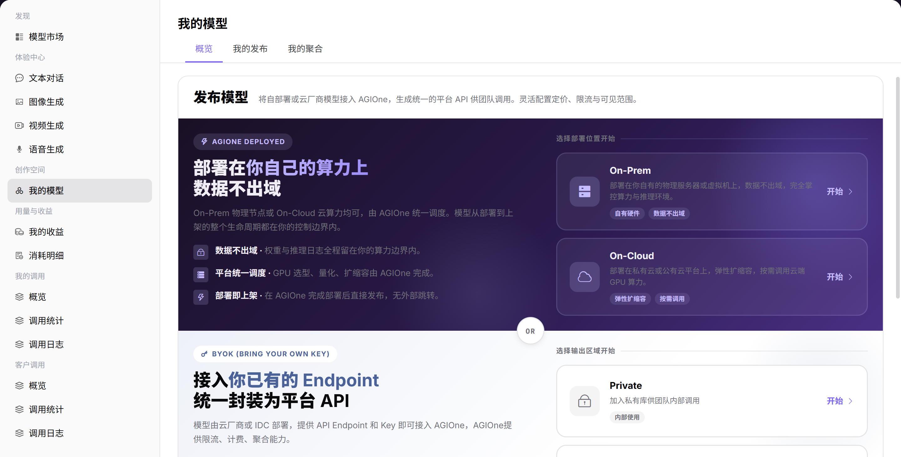

# 我的模型

## 前言

| 项目 | 内容 |
|------|------|
| 适用角色 | User（普通用户） |
| 导航路径 | 创作空间 > 我的模型 |
| 功能定位 | 管理和发布自有模型，支持 AGIOne 托管部署、第三方 BYOK 接入及多模型聚合 |

## 页面结构

### 搜索区域

页面顶部支持按公共 / 私有模型、模型名称、模型类型进行多维度筛选。

### 操作按钮区

* 页面右上角提供 **"发布模型"** 按钮
* 「我的聚合」标签页提供 **"创建聚合模型"** 按钮
* 每个模型提供详情、编辑、上架 / 下架、删除操作

### 数据列表说明

页面分为「我的发布」和「我的聚合」两个标签页，分别展示单实例发布模型和聚合模型。

### 页面截图

## 操作步骤

### 发布模型（对话模型）

1. 进入平台首页，点击左侧导航栏的 **"我的模型"** 菜单，进入模型管理页面。
2. 点击页面右上角的 **"发布模型"** 按钮，进入发布流程。
3. 选择发布模式与区域：
   - 选择部署方式（On-Prem / On-Cloud 私有部署，或 BYOK 接入已有 Endpoint）；
   - 选择输出区域（Private・私有区 或 Public・公有区）；
   - 点击「开始」进入配置流程。
4. 配置模型基本信息：
   - 选择 **模型类型**（对话 / 多模态 / 图片 / 视频 / 语音 / 嵌入 / 重排）；
   - 配置模型源信息（模型源、地域、请求 URL、API 密钥、元模型、模型源 ID）；
   - 配置请求头信息；
   - 设置输入 / 输出模态、高级能力（工具调用 / 思考模式）、Token 限制；
   - 选择支持的协议并进行连通性测试；
   - 填写个性化标识、模型描述；
   - 设置发布方式（立即发布 / 定时发布）；
   - 点击「下一步」。
5. 配置计费规则：
   - 选择计费方式（免费 / 收费）；
   - 选择计费模式（输入 / 输出计费 / 统一计费）；
   - 设置输入 / 输出 Token 数量，原价 / 售价；
   - 配置免费配额（开启 / 关闭，设置可领取额度，人数、总量）；
   - 填写活动描述；
   - 点击「下一步」。
6. 配置限流规则：
   - 选择是否启用限流；
   - 设置默认限流（RPM 每分钟请求数、TPM 每分钟 Token 数）；
   - 点击「仅保存」或「提交审核」完成发布。

#### 参数说明 - 模型列表页

| 字段名称 | 字段类型 | 示例 | 说明 |
|----------|----------|------|------|
| 模型 | 文本 | `阿里巴巴-中国:Qwen3.6-plus` | 模型的名称与标识 |
| 模型源 ID | 文本 | `qwen/qwen3.6-plus/9b059` | 模型在对应源平台的唯一标识 |
| 模型类型 | 标签 | `多模态 / 对话模型 / 视频模型` | 模型的功能类型 |
| 计费模式 | 文本 | `输入/输出计费 / 统一计费` | 模型的收费方式 |
| 免费配额 | 文本 | `限额模式 / 无` | 模型的免费调用配额配置 |
| 描述 | 文本 | `Qwen3.6原生视觉...` | 模型的说明描述 |
| 生效版本 | 文本 | `1.0.1` | 当前生效的模型版本 |
| 待生效版本 | 文本 | `--` | 待发布的版本 |
| 状态 | 标签 | `已上架 / 已下架` | 模型的发布状态 |

#### 参数说明 - 发布流程配置项

| 字段名称           | 字段类型 | 示例                               | 说明                 |
| -------------- | ---- | -------------------------------- | ------------------ |
| 模型类型           | 单选   | `对话模型 / 多模态`                     | 必填，模型的功能类型         |
| 模型源            | 下拉选择 | `阿里巴巴-中国`                        | 必填，模型的来源渠道         |
| 请求 URL         | URL  | `https://dashscope.aliyuncs.com` | 必填，模型服务的 API 地址    |
| API 密钥         | 文本   | `sk-e1f985...`                   | 必填，调用模型的密钥         |
| 元模型            | 文本   | `Qwen3-235b-a22b-instruct-2507`  | 必填，对应的元模型名称        |
| 模型源 ID         | 文本   | `qwen3-235b-a22b-instruct-2507`  | 必填，模型在源平台的唯一标识     |
| 输入 / 输出模态      | 多选   | `输入 / 输出均为文本`                    | 必填，模型支持的输入输出数据类型   |
| 高级能力           | 开关   | `函数/工具支持 / 思考模式`                 | 选填，模型的扩展能力         |
| Token 限制       | 数值   | `最大上下文128K`                      | 必填，设置 Token 长度上限   |
| 支持协议           | 多选   | `OpenAI-ChatCompletions`         | 必填，模型兼容的 API 协议    |
| 计费方式           | 单选   | `免费 / 收费`                        | 必填，模型的收费方式         |
| 计费模式           | 单选   | `输入/输出计费 / 统一计费`                 | 必填，收费时的计价方式        |
| 输入 / 输出原价 / 售价 | 数值   | `输入原价4.00/ 售价2.00`               | 必填，Token 的参考价与实际售价 |
| 免费配额           | 开关   | `开启 / 未开启`                       | 选填，配置模型的免费调用额度     |
| 限流             | 开关   | `启用 / 不启用`                       | 选填，配置模型的调用频率限制     |
| RPM/TPM        | 数值   | `RPM2/TPM100`                    | 每分钟请求数 / Token 数上限 |

### 添加聚合模型

1. 进入平台首页，点击左侧导航栏的 **"我的模型"** 菜单，切换到 **"我的聚合"** 标签页。
2. 点击页面右上角的 **"创建聚合模型"** 按钮，进入发布流程。
3. 选择发布区域：
   - 在弹窗中选择 Private・私有区 或 Public・公有区；
   - 点击「发布到私有区 / 发布到公有区」，进入配置流程。
4. 配置聚合模型基本信息：
   - 选择 **模型类型**（对话 / 多模态 / 图片 / 视频 / 语音 / 嵌入 / 重排）；
   - 配置聚合模型下的多个成员模型：点击「添加模型」，从列表中选择已发布的模型（如 GLM 4.7 的多个供应方实例）；
   - 为每个成员模型设置参数：是否启用、最低成功率、最高并发、上下文最大长度，成本（输入 / 输出 Token 上限）；
   - 设置匹配策略（成功率优先 / 成本优先 / 成本 & 体验均衡 / 随机 / 轮询）；
   - 填写个性化标识、标签、模型描述；
   - 设置发布方式（立即发布 / 定时发布）；
   - 点击「下一步」。
5. 配置计费规则：
   - 选择计费方式（免费 / 收费）；
   - 选择计费模式（统一计费 / 输入 / 输出计费）；
   - 设置 Tokens 数量，原价（划线价）、售价；
   - 点击「下一步」。
6. 核对所有配置信息无误后，点击「仅保存」或「提交审核」完成发布。

#### 参数说明 - 聚合模型列表页

| 字段名称 | 字段类型 | 示例 | 说明 |
|----------|----------|------|------|
| 模型 | 文本 | `AGIOneSystem:Kolors:agg` | 聚合模型的名称与标识 |
| 模型源 ID | 文本 | `kolors/kolors/645cb` | 聚合模型的唯一标识 |
| 模型类型 | 标签 | `图片模型 / 对话模型` | 聚合模型的功能类型 |
| 计费模式 | 文本 | `统一计费 / 免费 / 输入/输出计费` | 聚合模型的收费方式 |
| 免费配额 | 文本 | `无` | 聚合模型的免费调用配额配置 |
| 描述 | 文本 | `聚合模型的状态21` | 聚合模型的说明描述 |
| 生效版本 | 文本 | `1.0.0 / 4.0.0` | 当前生效的模型版本 |
| 待生效版本 | 文本 | `-- / 5.0.0` | 待发布的版本 |
| 状态 | 标签 | `已上架 / 待审核` | 聚合模型的发布状态 |

#### 参数说明 - 聚合模型配置项

| 字段名称 | 字段类型 | 示例 | 说明 |
|----------|----------|------|------|
| 模型类型 | 单选 | `对话模型 / 图片模型` | 必填，聚合模型的功能类型 |
| 成员模型 | 列表选择 | `GLM 4.7 的多个供应方实例` | 必填，选择 2 个及以上已发布的模型 |
| 成员模型参数 | 数值 / 开关 | `最低成功率80%、上下文最大长度200K` | 必填，每个成员模型的可用性与成本控制参数 |
| 匹配策略 | 单选 | `成功率优先 / 成本优先` | 必填，模型调用时的路由策略 |
| 计费方式 | 单选 | `免费 / 收费` | 必填，聚合模型的收费方式 |
| 计费模式 | 单选 | `统一计费 / 输入/输出计费` | 必填，收费时的计价方式 |
| 原价 / 售价 | 数值 | `原价10.00/ 售价5.00` | 必填，Token 的参考价与实际售价 |

## 其他操作

| 操作名称 | 操作步骤 |
|----------|----------|
| 查看详情 | 点击目标模型的「详情」按钮 → 查看完整配置信息 → 点击左上角返回箭头退出 |
| 编辑模型 | 点击目标模型的「编辑」按钮 → 修改配置信息 → 提交审核 |
| 上下架模型 | 点击目标模型的「上架」/「下架」按钮 → 确认状态变更 |
| 删除模型 | 点击目标模型的「删除」按钮 → 删除操作不可逆，请谨慎操作 |

## 注意事项

* **删除操作不可逆**，请谨慎操作。
* 聚合模型需要选择至少 2 个已发布的模型作为成员模型。
* 上架模型前请确保配置信息准确，避免影响服务质量。
