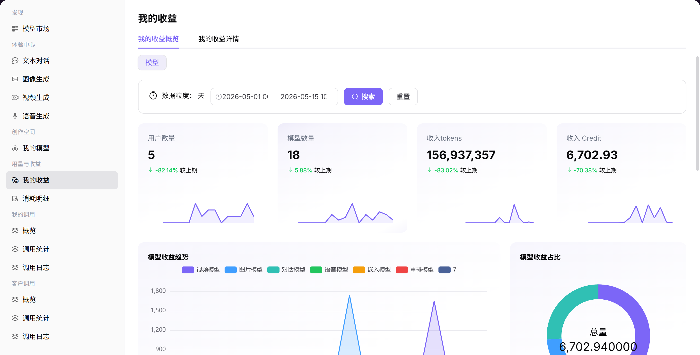

# 我的收益

## 前言

| 项目 | 内容 |
|------|------|
| 适用角色 | User（普通用户） |
| 导航路径 | 用量与收益 > 我的收益 |
| 功能定位 | 查看收益概览和结算明细，了解模型调用带来的收入情况 |

## 页面结构

### 搜索区域

页面顶部支持选择账期（YYYY-MM 格式）、时间范围、维度（模型 / 用户）等筛选条件。

### 操作按钮区

无特定操作按钮。

### 数据列表说明

页面分为「我的收益概览」和「我的收益详情」两个标签页。

### 页面截图

## 操作步骤

### 查看收益概览

1. 进入平台首页，点击 **"模型及AI服务 > 用量与收益 > 我的收益"** 菜单，默认显示"我的收益概览"Tab。
2. 切换 **维度**（如"模型"）。
3. 选择 **时间范围**。
4. 查看核心指标（用户数量 / 模型数量 / 收入Tokens / 收入积分）。
5. 查看图表（模型收益趋势 / 收益占比 / 用户活跃度 / 调用次数）。

### 查看收益详情

1. 点击 **"我的收益详情"** Tab。
2. 选择 **账期**（YYYY-MM 格式）。
3. 切换 **维度**（模型）。
4. 筛选：**使用时间**、**用户名称**、**模型类型**。
5. 查看结算数据指标（应结算 / 已结算 / 待结算积分）。
6. 查看列表明细。

#### 参数说明（收益概览页）

| 字段名称 | 字段类型 | 示例 | 说明 |
|----------|----------|------|------|
| 用户数量 | 数值 | `10` | 统计周期内调用模型的用户总数 |
| 模型数量 | 数值 | `5` | 统计周期内被调用的模型总数 |
| 收入 Tokens | 数值 | `1,234,567` | 统计周期内的收入 Token 总数 |
| 收入积分 | 数值 | `1,500.00` | 统计周期内的收入积分 |

#### 参数说明（收益详情页）

| 字段名称 | 字段类型 | 示例 | 说明 |
|----------|----------|------|------|
| 使用时间 | 时间戳 | `2026-05-14 19:XX:XX` | 调用发生的时间 |
| 用户名称 | 文本 | `user_xxx` | 发起调用的用户名称 |
| 模型类型 | 标签 | `对话模型 / 视频模型` | 被调用的模型类型 |
| 应结算积分 | 数值 | `100.00` | 应结算的总积分 |
| 已结算积分 | 数值 | `90.00` | 已完成结算的积分 |
| 待结算积分 | 数值 | `10.00` | 暂未结算的积分 |

## 注意事项

* 收益数据可能有延迟，请以实际结算数据为准。
* 如对收益数据有疑问，请联系平台客服。
