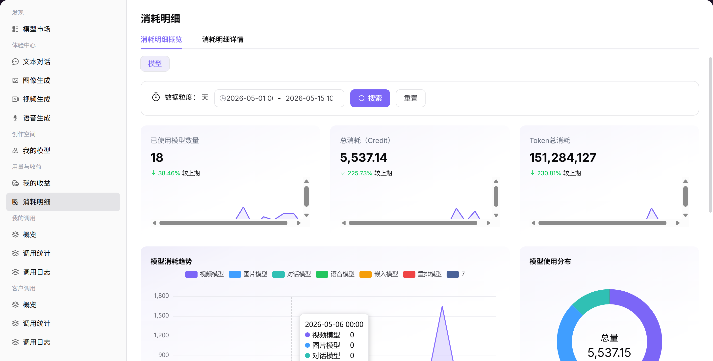

# 消耗明细

## 前言

| 项目 | 内容 |
|------|------|
| 适用角色 | User（普通用户） |
| 导航路径 | 用量与收益 > 消耗明细 |
| 功能定位 | 查看消耗概览和明细，了解模型调用的 Token 消耗和费用情况 |

## 页面结构

### 搜索区域

页面顶部支持选择数据粒度（天）和时间范围。

### 操作按钮区

无特定操作按钮。

### 数据列表说明

页面分为「消耗明细概览」和「消耗明细详情」两个标签页。

### 页面截图

## 操作步骤

### 查看消耗明细概览

1. 进入平台首页，点击左侧导航栏的 **"用量与收益 > 消耗明细"** 菜单，进入消耗管理页面。
2. 页面分为 **"消耗明细概览"** 和 **"消耗明细详情"** 两个标签页，可分别查看消耗趋势和结算明细。
3. 在页面顶部设置查询条件：选择数据粒度（天）和时间范围，点击 **「搜索」** 查看指定周期的数据。
4. 查看核心指标卡片：已使用模型数量、总消耗（Credit）、Token 总消耗，并查看各指标的环比变化。
5. 查看多维度趋势图表：
   - 模型消耗趋势：按模型类型（视频 / 对话 / 图片等）统计的消耗变化折线图；
   - 模型使用分布：不同模型类型的消耗占比环形图；
   - 模型调用次数趋势：不同模型的调用量变化折线图；
   - 模型调用次数分布：模型调用占比饼图。

#### 参数说明（概览页）

| 字段名称 | 字段类型 | 示例 | 说明 |
|----------|----------|------|------|
| 已使用模型数量 | 数值 | `18` | 统计周期内被调用的模型总数 |
| 总消耗（Credit） | 数值 | `5,537.14` | 统计周期内的总消耗 Credit 数 |
| Token 总消耗 | 数值 | `151,284,127` | 统计周期内的总消耗 Token 数 |

### 查看消耗明细详情

1. 点击 **"消耗明细详情"** 标签页，切换到结算明细视图。
2. 在页面顶部选择账期（如 2026-05），查看对应月份的结算数据。
3. 查看结算数据卡片：应结算 Credit、已结算 Credit、待结算 Credit。
4. 在下方的明细列表中，可按模型名称、模型类型搜索筛选，查看单条调用记录的明细：
   - 使用时间、耗时（MS）；
   - 关联模型、模型类型；
   - 使用情况（输入 / 输出 Tokens）；
   - 抵扣情况、实际使用情况；
   - 计费规则、本次消耗 Credit。

#### 参数说明（详情页）

| 字段名称 | 字段类型 | 示例 | 说明 |
|----------|----------|------|------|
| 应结算 Credit | 数值 | `5,537.14` | 该账期应结算的总消耗 |
| 已结算 Credit | 数值 | `5,526.66` | 该账期已完成结算的消耗 |
| 待结算 Credit | 数值 | `10.48` | 该账期暂未结算的消耗 |
| 使用时间 | 时间戳 | `2026-05-14 19:XX:XX` | 调用发生的时间 |
| 耗时（MS） | 数值 | `1417` | 本次调用的耗时 |
| 关联模型 | 文本 | `Creator-test:Qwe...` | 本次调用的模型 |
| 使用情况 | 文本 | `输入:22 Tokens` | 本次调用消耗的 Token 数 |
| 本次消耗 Credit | 数值 | `0 / 0.34` | 本次调用消耗的 Credit 数 |

## 注意事项

* 消耗数据可能有延迟，请以实际结算数据为准。
* 可阅读页面顶部的结算说明，了解小额费用的结算逻辑。
