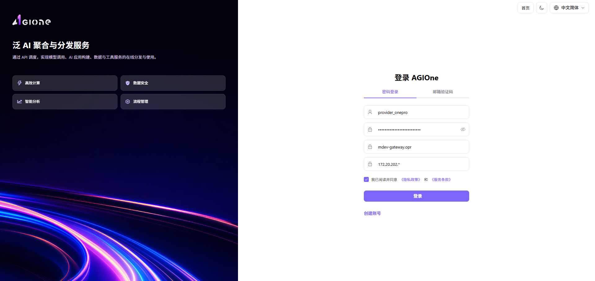
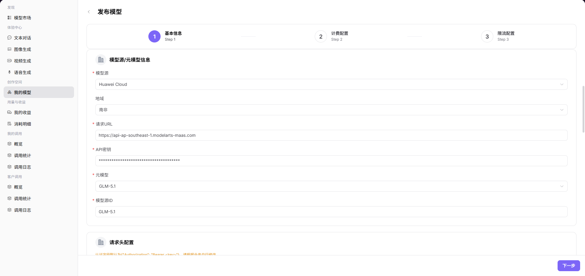
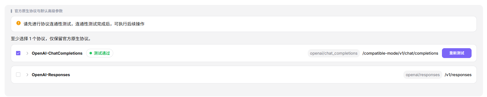
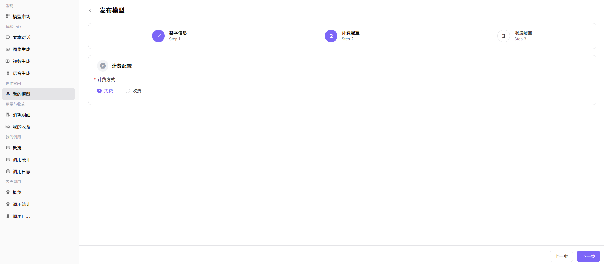
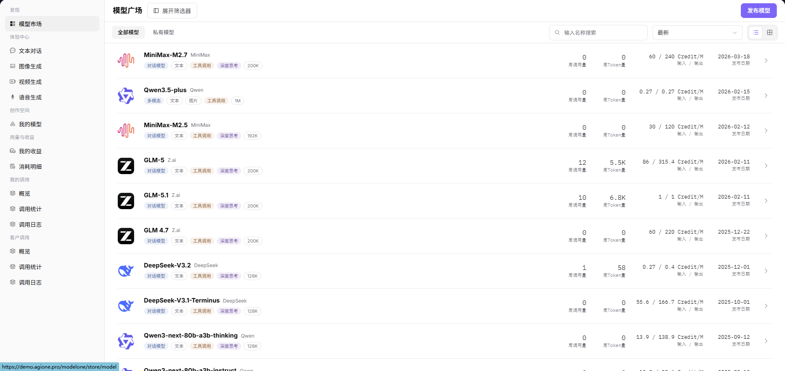

# AGIOne 新手指南：发布模型

本指南仅包含实操步骤：登录、发布模型、在模型市场上查看已发布的模型。

## 1. 登录 AGIOne

1. 打开 AGIOne 登录页面（http://agione.pro/user/login）。
2. 选择 **"密码"** 登录方式。
3. 输入您的 **"用户名或邮箱"** 和 **"密码"**。
4. 勾选 **"我同意隐私政策和服务条款"**。
5. 点击 **"登录"**。

## 2. 打开发布模型页面

1. 登录后，打开 **"模型及AI服务"**。
2. 在左侧菜单中，进入 **"创作空间" > "我的模型"**。
3. 点击右上角的 **"发布模型"** 按钮。
4. 在弹窗中选择部署方式：
   - **On-Prem / On-Cloud**：AGIOne 托管部署（适用于私有云或本地部署）
   - **BYOK（Bring Your Own Key）**：接入已有的第三方 API Endpoint
5. 选择输出区域：
   - **Private・私有区**：仅供内部团队使用
   - **Public・公有区**：在公共市场展示
6. 点击 **"开始"** 进入配置流程。

## 3. 填写基本信息

1. 在 **"选择模型类型"** 中，选择模型类型。
2. 对于对话/文本模型，选择 **"对话模型"**。
3. 设置 **"模型子类型"** 为 **"LLM"**。
4. 在 **"模型来源/元模型信息"** 中，填写连接信息。
5. 在 **"模型来源"** 中选择实际供应商，如 **"华为云"**。
6. 选择实际的 **"地域"**，如 **"中国"**。
7. 在 **"请求 URL"** 中输入模型服务地址。
8. 在 **"API 密钥"** 中输入供应商密钥。
9. 选择目标 **"元模型"**，如 **"GLM-5.1"**。
10. 在 **"模型来源 ID"** 中输入供应商标识符，如 `GLM-5.1`。

## 4. 测试协议

1. 找到 **"官方原生协议及默认高级参数"**。
2. 选择您要使用的协议，如 **"OpenAI-ChatCompletions"**。
3. 点击卡片左侧的箭头展开详情。
4. 展开后，找到 **"Endpoint"** 字段。
5. 编辑 **"Endpoint"** 为所需路径，例如 `/v2/chat/completions`。
6. 点击 **"开始测试"**。
7. 等待测试显示 **"测试通过"**。
8. 在 **"自定义标签"** 中输入易识别的名称，如 `highspeed`。
9. 确认 **"最终展示"** 正确，如 **"GLM-5.1 highspeed"**。
10. 点击 **"下一步"**。

## 5. 配置计费

1. 进入 **"计费配置"**。
2. 如果模型免费使用，选择 **"免费"**。
3. 如果模型收费，选择 **"收费"** 并填写页面显示的价格字段。
4. 点击 **"下一步"**。

## 6. 配置限流并提交

1. 进入 **"限流配置"**。
2. 选择是否启用限流。
3. 如果启用限流，填写：
   - **"RPM"**：每分钟最大请求数
   - **"TPM"**：每分钟最大 Token 数
4. 如果不想立即提交，点击 **"仅保存"**。
5. 如果准备就绪，点击 **"提交审核"**。
6. 等待审批。模型必须通过审批后才能正式发布。

## 7. 在模型市场中查看模型

1. 在左侧菜单中，进入 **"发现" > "模型市场"**。
2. 如果发布了公共模型，使用 **"全部模型"**。
3. 如果发布了私有模型，使用 **"私有模型"**。
4. 按最终展示名称搜索，如 **"Qwen3.5-27b highspeed"**。
5. 在列表中找到您的模型。
6. 点击 **"查看"** 打开详情页面，确认模型信息。

## 牢记这 2 点

- **不要分享您的 API Key 或将其放入公共文档。**
- **必须通过协议测试后才能继续。**
