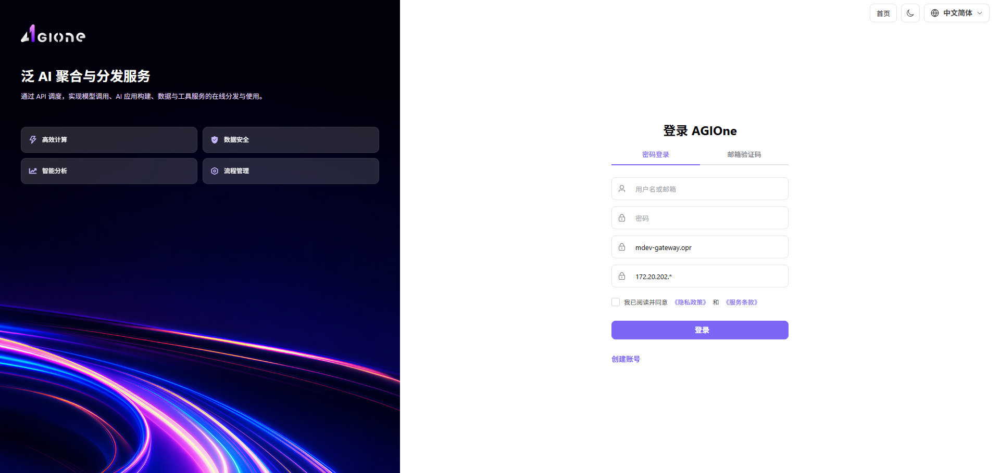
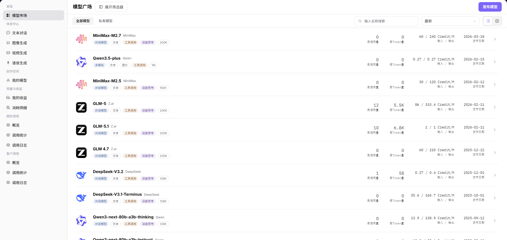
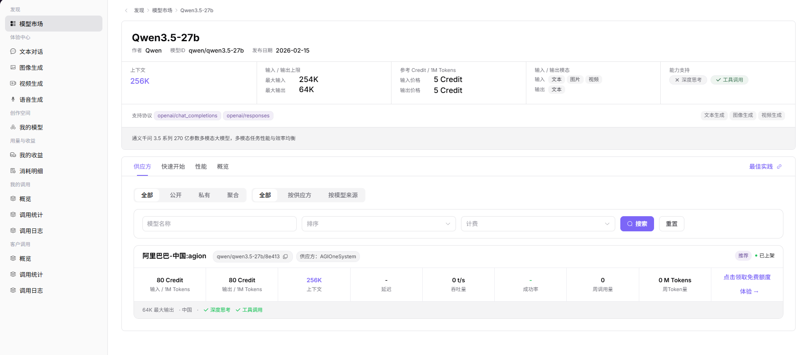
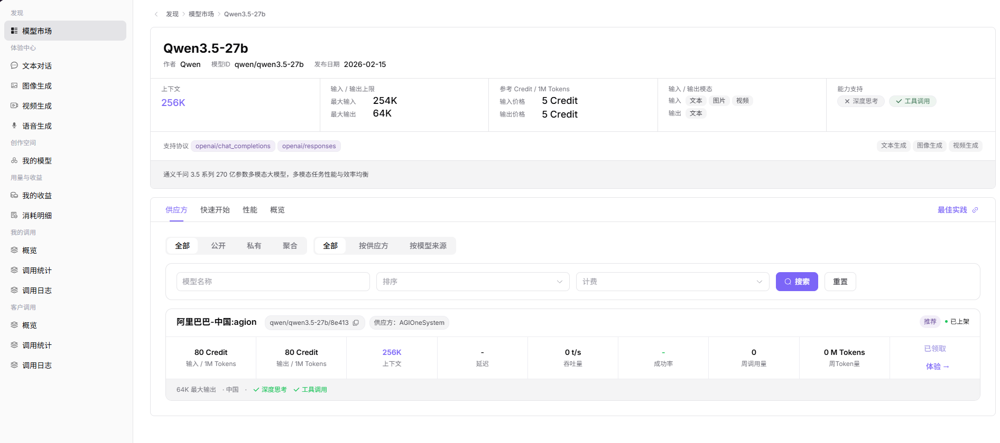
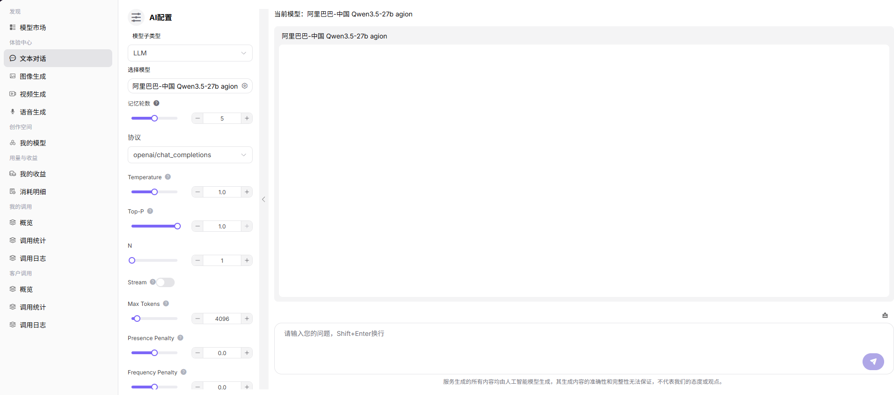
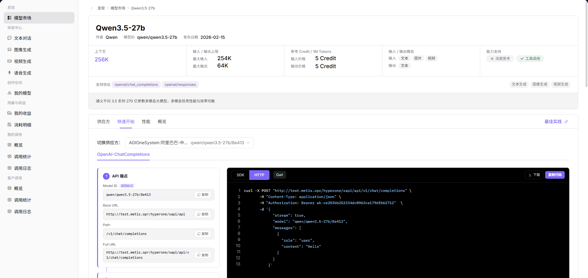

# AGIOne 普通用户指南

本指南面向首次使用 AGIOne 的用户编写。指南将带您完成以下基本工作流程：登录、领取免费配额、在 Web 体验中心试用模型，以及使用 curl 调用模型。用户名、密码和 API 密钥仅作为占位符展示。

## 1. 准备工作

使用 AGIOne 前，请准备以下信息。

| 项目 | 示例或说明 |
| --- | --- |
| 平台 URL | `https://agione.cc/` |
| 用户名 | `{USERNAME}` |
| 密码 | `{PASSWORD}` |
| API 密钥 | `{API_KEY}`，从快速入门页面复制 |

本指南使用以下模型。

| 项目 | 值 |
| --- | --- |
| 模型名称 | Qwen3.5-27b |
| 模型标识符 | `qwen/qwen3.5-27b/8e413` |
| 协议 | `openai/chat_completions` |
| API 端点 | `https://agione.cc/hyperone/xapi/api/v1/chat/completions` |

## 2. 登录 AGIOne

### 2.1 打开登录页面

在浏览器中输入以下地址：

```
https://agione.cc/user/login
```

将看到 AGIOne 登录页面。



### 2.2 填写登录表单

按以下顺序填写表单。

| 步骤 | 操作 | 值 |
| --- | --- | --- |
| 1 | 在"用户名或邮箱"中输入用户名 | `{USERNAME}` |
| 2 | 在"密码"中输入密码 | `{PASSWORD}` |
| 3 | 勾选用户协议复选框 | 勾选 |
| 4 | 点击"登录" | 等待平台打开 |

如果弹出隐私政策或服务条款对话框，请点击"同意"。

### 2.3 确认登录成功

登录成功后，页面右上角应显示用户头像或首字母。左侧菜单应显示"发现"、"体验中心"、"用量与收益"和"我的调用"等条目。

## 3. 打开模型列表

### 3.1 进入模型服务

登录后，打开：

```
https://agione.cc/modelone/store/model
```

也可以通过页面菜单导航：

```
模型服务 > 发现 > 模型
```

### 3.2 找到 Qwen3.5-27b

在模型列表中找到`Qwen3.5-27b`。它通常位于当前列表的下方。找到后，点击该模型行右侧的"查看"。



## 4. 领取免费配额

免费配额入口位于模型详情页的供应商卡片上，紧邻"体验中心"按钮。

### 4.1 打开模型详情页

打开`Qwen3.5-27b`详情页后，确认可以看到以下信息。

| 检查项        | 预期值                      |
| ---------- | ------------------------ |
| 模型名称       | `Qwen3.5-27b`            |
| 模型 ID      | `qwen/qwen3.5-27b`       |
| 供应商卡片调用标识符 | `qwen/qwen3.5-27b/8e413` |
| 配额按钮       | `领取免费配额`                 |
| 试用入口       | `体验中心`                   |



### 4.2 点击领取

在供应商卡片上点击：

```
领取免费配额
```

配额领取成功后，页面显示成功提示，按钮变为：

```
已领取
```



### 4.3 确认配额已领取

以下任一迹象表示配额已成功领取：

| 成功标志 | 说明 |
| --- | --- |
| 页面显示"领取成功" | 平台已完成领取 |
| 按钮变为"已领取" | 当前账户已领取该模型的免费配额 |
| 重新打开模型详情页仍显示"已领取" | 领取状态已保存 |

## 5. 在 Web 体验中心试用模型

Web 体验中心是试用模型最简单的方式，无需编写代码。

### 5.1 从详情页打开体验中心

在`Qwen3.5-27b`模型详情页上，点击供应商卡片上的以下按钮：

```
体验中心
```

也可以从左侧菜单打开：

```
体验中心 > 文本对话
```

如果从左侧菜单打开，需手动选择目标模型。如果从模型详情页打开，当前模型通常已预选。



### 5.2 发送测试消息

进入文本体验中心页面后，按以下步骤操作。

| 步骤  | 操作         | 推荐值                       |
| --- | ---------- | ------------------------- |
| 1   | 确认"模型子类型"  | `LLM`                     |
| 2   | 确认或选择模型    | Qwen3.5-27b 的供应商模型        |
| 3   | 确认"协议"     | `openai/chat_completions` |
| 4   | 按需调整参数     | 初学者可保持默认值                 |
| 5   | 在底部输入框输入问题 | `请用一句话介绍 AGIOne。`         |
| 6   | 点击发送按钮     | 等待模型响应                    |

如果对话区域出现生成的响应，说明体验中心调用成功。

## 6. 使用 curl 调用模型

当需要从命令行、脚本或后端服务调用模型时，可使用 curl。

### 6.1 打开快速入门页面

返回模型详情页，点击：

```
快速入门
```

在快速入门页面上可以找到以下信息。

| 信息 | 用途 |
| --- | --- |
| 调用标识符 | 用于 `model` 字段的值 |
| 完整 URL | curl 请求 URL |
| API 密钥 | 认证密钥 |
| curl 示例 | 可直接使用的参考命令 |

截图中的 API 密钥已脱敏。实际使用时，请从页面复制您自己的 API 密钥。



### 6.2 复制 API 密钥

在"AUTHENTICATION"部分找到`API Key`，然后点击"复制"。

请注意：

| 注意 | 说明 |
| --- | --- |
| 不要与他人共享 API 密钥 | API 密钥可用于调用您账户下的模型 |
| 不要将其提交到公共文档或代码仓库 | 尽可能将其存储为环境变量 |
| 本指南使用 `{API_KEY}` | 调用 API 时请替换为您的真实密钥 |

### 6.3 curl 示例

将 `{API_KEY}` 替换为复制的 API 密钥，然后在终端中运行命令。

```bash
curl -X POST "https://agione.cc/hyperone/xapi/api/v1/chat/completions" \
  -H "Content-Type: application/json" \
  -H "Authorization: Bearer {API_KEY}" \
  -d '{
    "stream": true,
    "model": "qwen/qwen3.5-27b/8e413",
    "messages": [
      {
        "role": "user",
        "content": "Hello"
      }
    ]
  }'
```

### 6.4 确认 API 调用成功

调用成功时，终端会返回生成的模型输出。成功的常见标志包括：

| 检查项 | 成功标志 |
| --- | --- |
| 响应内容 | 响应包含生成的文本 |
| 模型字段 | 响应包含 `qwen/qwen3.5-27b/8e413` |
| 无认证错误 | 未出现 `Unauthorized` 或 `Invalid API key` 错误 |
| 无配额错误 | 未出现配额不足消息 |

## 6.5 快速实践

访问 [AGIOne 最佳实践](https://agione.cc/docs/best-practice/integration/OpenCode.html)。

## 7. 查看调用记录

如需确认模型是否实际被调用，可查看调用日志。

### 7.1 打开调用日志

从左侧打开以下菜单：

```
我的调用 > 调用日志
```

### 7.2 筛选调用记录

| 步骤 | 操作 |
| --- | --- |
| 1 | 选择调用时间范围 |
| 2 | 输入模型名称或模型 ID |
| 3 | 选择调用状态（如成功或失败） |
| 4 | 点击"搜索" |
| 5 | 在列表中查看调用时间、模型、状态、Token 使用量和延迟 |
| 6 | 如需查看更多信息，点击目标行的"详情" |

## 8. 常见问题

### 8.1 登录失败怎么办？

| 可能原因 | 解决方法 |
| --- | --- |
| 用户名或密码错误 | 确认 `{USERNAME}` 和 `{PASSWORD}` |
| 用户协议复选框未勾选 | 勾选复选框后重新登录 |
| 服务协议弹窗未确认 | 点击"同意" |

### 8.2 找不到 Qwen3.5-27b 怎么办？

| 解决方法 | 说明 |
| --- | --- |
| 在模型列表中搜索"Qwen3.5-27b" | 使用搜索框快速定位 |
| 确保查看"全部模型" | 避免仅筛选私人模型 |
| 更改排序或翻页浏览 | 模型可能不在第一屏可见范围内 |

### 8.3 领取按钮无法点击怎么办？

| 页面状态 | 说明 |
| --- | --- |
| 按钮显示"已领取" | 当前账户已领取 |
| 没有"领取免费配额"按钮 | 模型可能不支持免费配额，或账户没有权限 |
| 点击后无反应 | 刷新页面后重试，或确认是否仍保持登录 |

### 8.4 curl 调用失败怎么办？

| 错误现象 | 检查项 |
| --- | --- |
| 认证失败 | 检查 API 密钥是否完整，Header 是否为 `Authorization: Bearer {API_KEY}` |
| 模型未找到 | 检查 `model` 是否为 `qwen/qwen3.5-27b/8e413` |
| 请求 URL 错误 | 检查 URL 是否为 `https://agione.cc/hyperone/xapi/api/v1/chat/completions` |
| JSON 格式错误 | 检查引号、逗号和花括号 |
| 配额不足 | 确认是否已领取免费配额，或检查账户配额 |

## 9. 快速参考

| 功能 | 入口 |
| --- | --- |
| 登录 | `https://agione.cc/user/login` |
| 模型列表 | `https://agione.cc/modelone/store/model` |
| Qwen3.5-27b 详情页 | `模型服务 > 发现 > 模型 > Qwen3.5-27b > 查看` |
| 领取免费配额 | Qwen3.5-27b 详情页供应商卡片 > `领取免费配额` |
| Web 体验中心 | Qwen3.5-27b 详情页供应商卡片 > `体验中心` |
| API 接入说明 | Qwen3.5-27b 详情页 > `快速入门` |
| 调用日志 | `我的调用 > 调用日志` |
